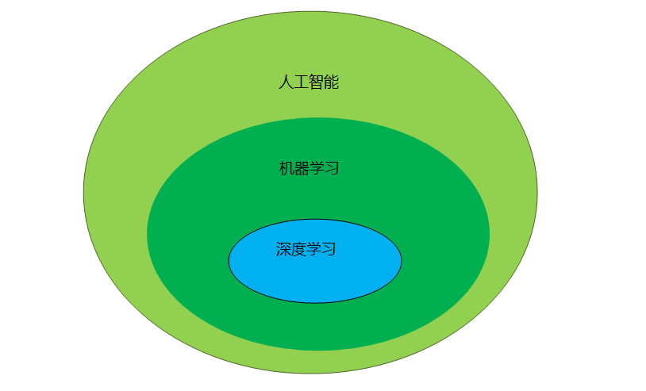
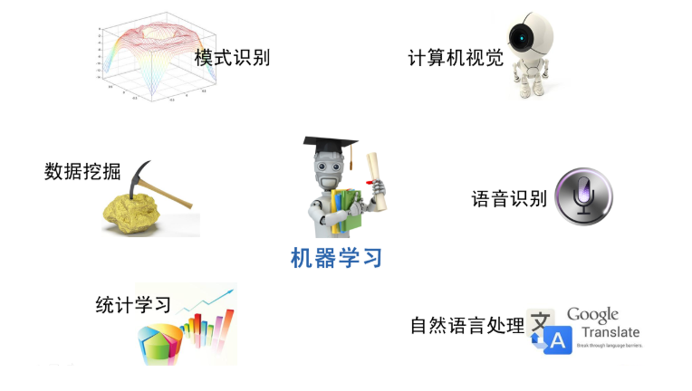

## 人工智能(Artificial Intelligence)

人工智能（Artificial Intelligence），英文缩写为 AI。是计算机科学的一个分支

人工智能是对人的意识、思维的信息过程的模拟。人工智能不是人的智能，但能像人那样思考、也可能超过人的智能。数学常被认为是多种学科的基础科学，数学也进入语言、思维领域，人工智能学科也必须借用数学工具

人工智能实际应用：机器视觉，指纹识别，人脸识别，视网膜识别，虹膜识别，掌纹识别，专家系统，自动规划，智能搜索，定理证明，博弈等学科

研究范畴包括自然语言处理，知识表现，智能搜索，推理，规划，机器学习，知识获取，组合调度问题，感知问题，模式识别，逻辑程序设计软计算，不精确和不确定的管理，人工生命，神经网络，复杂系统，遗传算法等

人工智能目前也分为：

- 强人工智能(BOTTOM-UP AI)
- 弱人工智能(TOP-DOWN AI)

## 机器学习(Machine Learning, ML)

机器学习(Machine Learning, ML)，是人工智能的核心，属于人工智能的一个分支，是一个大的领域，是让计算机拥有像人一样的学习能力，模拟和实现人的学习行为和能力，可以像人一样具有识别和判断的能力，可以看作是仿生学

机器学习应用领域十分广泛，例如：数据挖掘、数据分类、计算机视觉、自然语言处理（NLP）、生物特征识别、搜索引擎、医学诊断、检测信用卡欺诈、证券市场分析、DNA序列测序、语音和手写识别、战略游戏和机器人运用等

机器学习的工作方式：

1）选择数据：将你的数据分成三组：训练数据、验证数据和测试数据。

2）模型数据：使用训练数据来构建使用相关特征的模型。

3）验证模型：使用你的验证数据接入你的模型。

4）测试模型：使用你的测试数据检查被验证的模型的表现。

5）使用模型：使用完全训练好的模型在新数据上做预测。

6）调优模型：使用更多数据、不同的特征或调整过的参数来提升算法的性能表现。

机器学习的分类：

基于学习策略的分类

1）机械学习 (Rote learning)

2）示教学习 (Learning from instruction或Learning by being told)

3）演绎学习 (Learning by deduction)

4）类比学习 (Learning by analogy)

5）基于解释的学习 (Explanation-based learning, EBL)

6）归纳学习 (Learning from induction)

基于所获取知识的表示形式分类

1）代数表达式参数

2）决策树

3）形式文法

4）产生式规则

5）形式逻辑表达式

6）图和网络

7）框架和模式（schema）

8）计算机程序和其它的过程编码

9）神经网络

10）多种表示形式的组合

综合分类

1）经验性归纳学习 (empirical inductive learning)

2）分析学习（analytic learning）

3）类比学习

4）遗传算法（genetic algorithm）

5）联接学习

6）增强学习（reinforcement learning）

学习形式分类

1）监督学习(supervised learning)

2）非监督学习(unsupervised learning)

## 深度学习（Deep Learning）

深度学习（Deep Learning）是机器学习的一种，是它的一个大的分支，深度学习的概念源于人工神经网络的研究。既然叫做学习，那么自然与我们人类的学习过程有相似之处，其实就是仿生学，仿照我们人类大脑的思维方式以及神经网络的接收和反馈方式进行计算机模拟深度学习的。我们的大脑就是一个深度学习的超级计算机。

深度学习实际上指的的深度神经网络学习，普通神经网络由于训练代价较高，一般只有3-4层，而深度神经网络由于采用了特殊的训练方法加上一些技术算法，可以达到8-10层。深度神经网络能够捕捉到数据中的深层联系，从而能够得到更精准的模型，而这些联系不容易被普通的机器学习方法所发觉。

用官方的含义就是：含多隐层的多层感知器就是一种深度学习结构。深度学习通过组合低层特征形成更加抽象的高层表示属性类别或特征，以发现数据的分布式特征表示。同机器学习方法一样，深度机器学习方法也有监督学习与无监督学习之分．不同的学习框架下建立的学习模型很是不同．例如，卷积神经网络（Convolutional neural networks，简称 CNNs）就是一种深度的监督学习下的机器学习模型，而深度置信网（Deep Belief Nets，简称 DBNs）就是一种无监督学习下的机器学习模型。

深度学习整个过程就是数据收集、数据清洗处理、传入数据进行训练模型和学习优化、经过不断优化调节后形成高准确率的识别分类模型，供相应的领域进行传入相关数据进行应用分类。举个例子，我们人类在刚出生时看到一个手机，那么他是不知道这个是什么的，并且有各种各样形状和样式的手机，此时我们的深度学习系统初始状态就是这样的。但是经过父母和周围的分类和指导，我们渐渐的知道了这种样子和形状、功能的物体是手机，那么我们通过大量的数据就具有了学习和分辨手机的能力模型，那么这就是我们的深度学习系统在经过数据和算法训练后所具备的功能和学习能力。就是这么简单，可以说就是仿生学。

## 参考资料

- <https://mmdeeplearning.readthedocs.io/zh/latest/overview/concept.html>