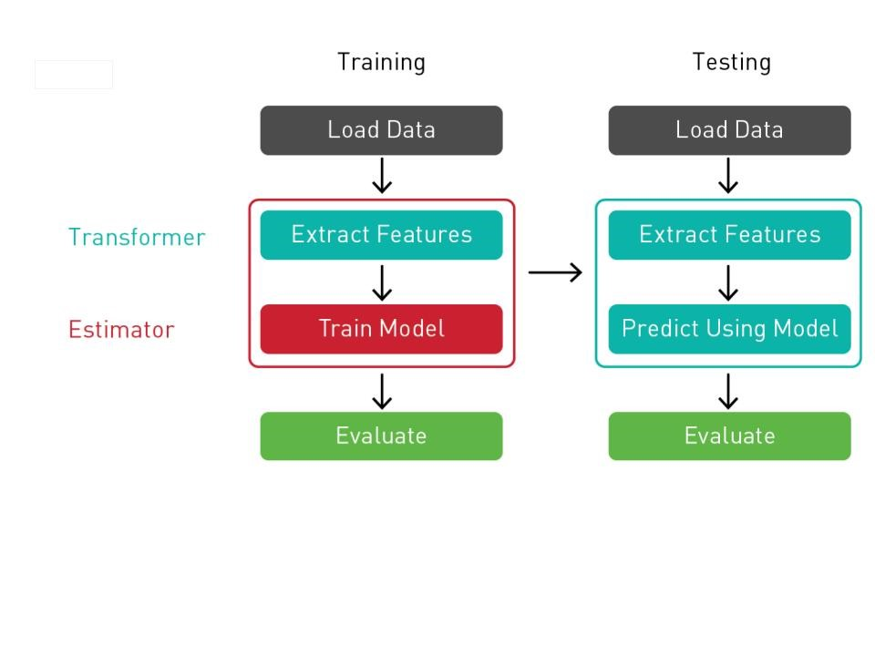

## Scikit-learn 简介

- Scikit-learn 基于 NumPy、SciPy 和 matplotlib 构建，并具有大量用于分类、回归和集群的高效算法。其中包括支持向量机、随机森林、梯度提升、k-means 和 DBSCAN

- Scikit-learn 主要采用 Python 编写，并使用 NumPy 进行高性能线性代数以及数组运算。一些核心 Scikit-learn 算法则采用 Cython 编写，以提升整体性能

作为更高级别的库，它包含各种机器学习算法的几种实施，Scikit-learn 让用户仅使用几行代码即可构建、训练和评估模型

## 参考资料

- <https://www.nvidia.cn/glossary/data-science/scikit-learn/>