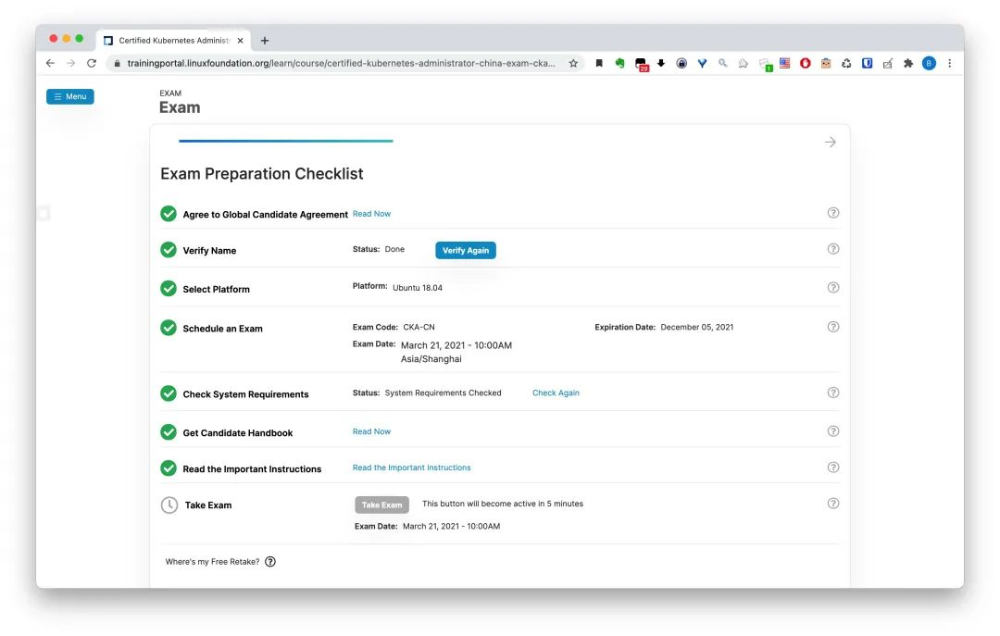
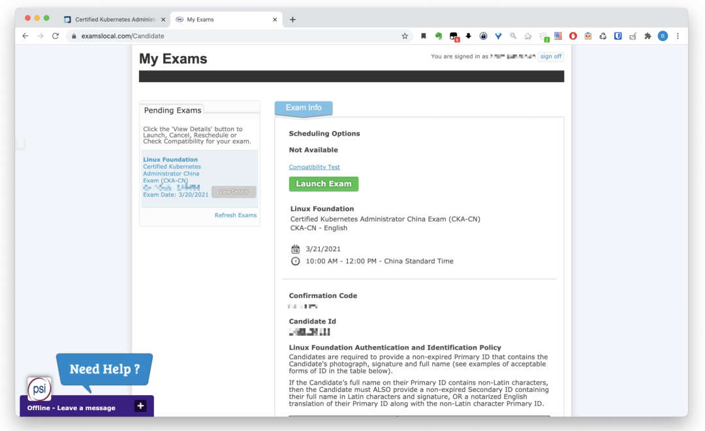
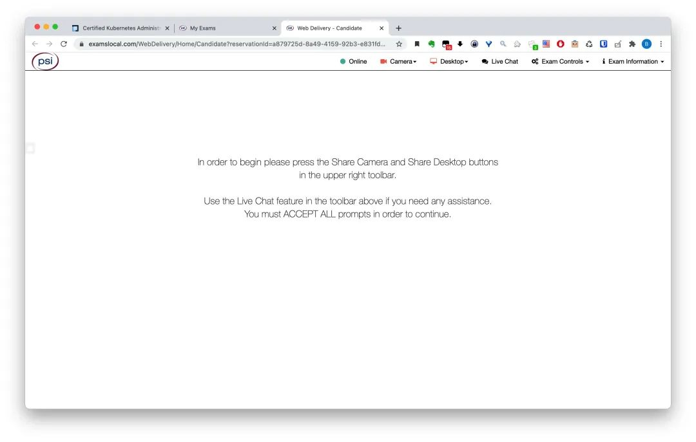
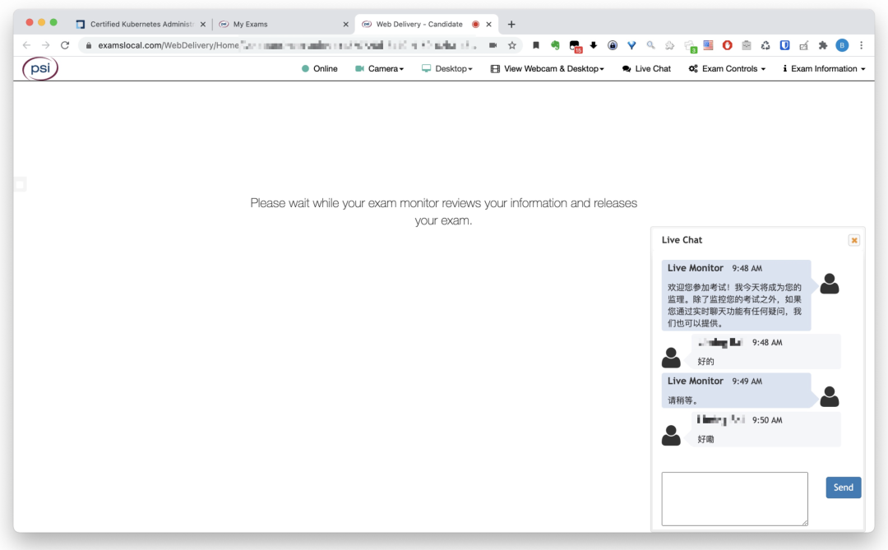
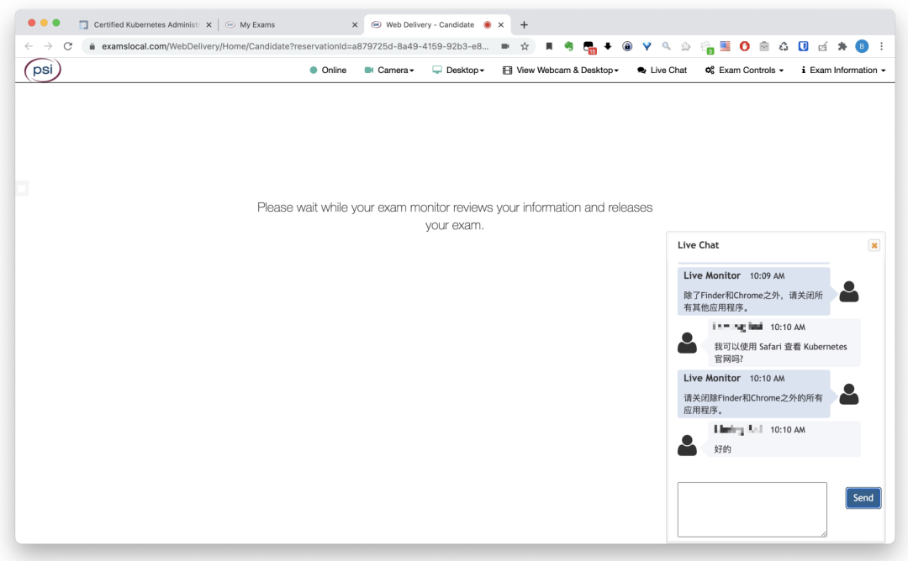

## 考试大纲

CKA认证考试包括这些一般领域及其在考试中的权重：

- 集群架构，安装和配置：25%
- 工作负载和调度：15%
- 服务和网络：20%
- 存储：10% 
- 故障排除：30%

## 考试模拟

可以有两次 `https://killer.sh/dashboard` 的模拟考试


## 考试准备

设置自动补全

```bash
alias k=kubectl
complete -F __start_kubectl k
```

如果中途断线也没有关系，重新打开浏览器就好，会自动连上。如果中途出现卡顿，不要马上刷新，系统会认为你掉线。而且掉线之后，如果考官问，记得说是机器重启，不要说网络问题！！！因为说明里面写了，保证网络是我们的责任，但是没说机器不可以死机

## 学习资料

- <https://github.com/stretchcloud/cka-lab-practice>
- <https://github.com/David-VTUK/CKA-StudyGuide>

需要熟悉使用 [kubeadm](https://kubernetes.io/docs/setup/production-environment/tools/kubeadm/create-cluster-kubeadm/) 创建集群、升级集群

在线练习环境：

- [katacoda](https://www.katacoda.com/courses/kubernetes/kubectl-run-containers)
- [play-with-k8s](https://labs.play-with-k8s.com/)

一些有用的文档链接：

- kubectl 命令参考：https://kubernetes.io/docs/reference/kubectl/cheatsheet/
- 使用 kubeadm 安装 K8s 集群 Kubernetes API：https://kubernetes.io/docs/setup/production-environment/tools/kubeadm/
- 设置 Docker：https://kubernetes.io/docs/setup/production-environment/container-runtimes/#docker
- 安装 K8s CNI addon：https://kubernetes.io/docs/setup/production-environment/tools/kubeadm/high-availability/#steps-for-the-first-control-plane-node
- 升级 K8s Cluster: https://kubernetes.io/docs/tasks/administer-cluster/kubeadm/kubeadm-upgrade/
- 备份 etcd ：https://kubernetes.io/docs/tasks/administer-cluster/configure-upgrade-etcd/#snapshot-using-etcdctl-options
- K8s Cluster 排错：https://kubernetes.io/docs/tasks/debug-application-cluster/debug-cluster/
- Nginx ingress controller 安装：https://github.com/kubernetes/ingress-nginx/blob/main/docs/deploy/index.md

## 预约考试及系统环境检查

因为预约考试、考试环境检测中的带宽测试及实际考试的时候都需要连接到国外的服务器, 大部分同学都会遇到掉线的问题, 经过我们测试发现可以将 `examslocal.com` 及 `psionline.com` 这两个地址添加到科学上网的规则中, 可以极大的增加考试时的稳定性, 当然, 前提是科学上网的速度也要足够好

预约考试流程如下:

1. 登录 Linux 基金会英文官网: https://trainingportal.linuxfoundation.org/learn/dashboard, 如果已经使用过考试码首页会显示我们要认证的考试, 点击 `Start Certification`, 然后会自动进入考试检查界面

   

2. 在 Agree to Global Candidate Agreement 后面点击 `Read Now`

   

3. 在 Verify Name 后面点击 `Verify Now,` 输入护照或者信用卡的拼音名字. 注意! 不要用中文，预约考试时如果写了中文名字，发的证书名字有可能是乱码，切记！

   

4. 默认考试的系统只能选择 Ubuntu 18.04

   

5. 验证完名字后等待 `Schedule an Exam` 按钮变为可用状态, 大约 30 分钟左右, 可以先进行后面的选项

   

6. 在 Check System Requirements 后面点击 `Check Now` ,

   在新界面中选择页面上方的 `Run Compatibility Check Again` ,

   

7. 在 Get Candidate Handbook 后面点击 `Read Now` , 然后会跳转一个页面, 关闭页面后即可变绿

   

8. 在 Read the Important Instructions 后面点击 `Read the Important Instructions` , 然后会跳转一个页面, 关闭页面后即可变绿

   

9. 最后回到 Schedule an Exam, 选择北京时区, 选择考试时间, 再次确认时间后即可完成考试预约.

   

预约完成的界面如下:



## 考试流程说明

1. 到考试时间后点击 `Take Exam` 进入考试界面, 点击 `Launch Exam` 开始考试

   

2. 根据提示开启相关监控权限

   

   

3. 等待监考老师

   老师来之后会让我们拿起电脑把考试桌子的上下左右使用摄像头检查一圈, 桌子上和桌子下都不允许放任何东西, 如果要放水杯必须使用透明的

   

   

4. 执行系统环境检查

   如果是苹果电脑, 监考老师会要求我们打开强制退出应用界面, 强制杀死除 Finder 和 Chrome 之外所有的进程(Windows 系统应该也会要求有对应的操作)

   

