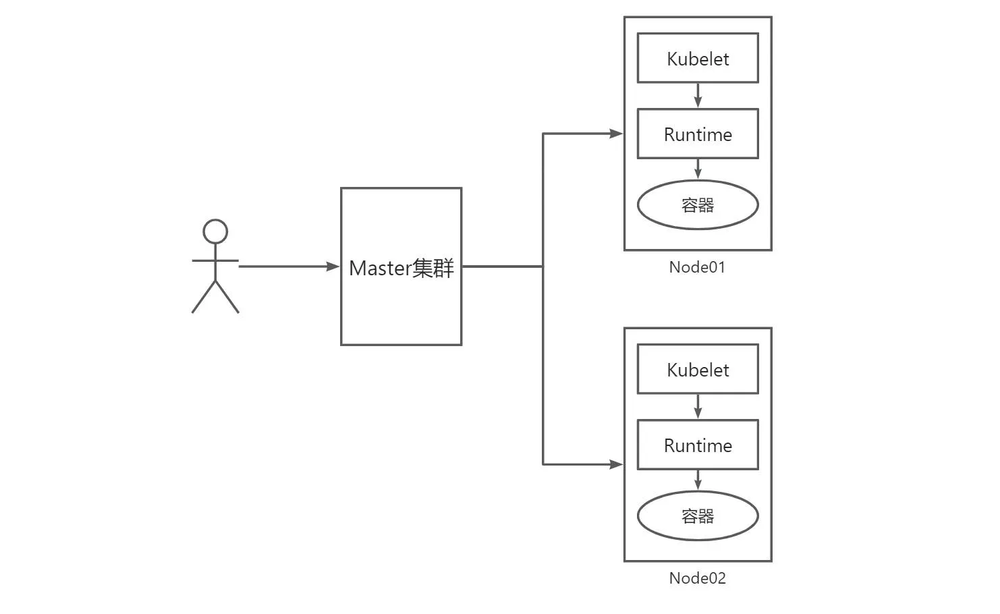

## 考试大纲

**微服务漏洞最小化：20%**

- 设置适当的 OS 级安全域，例如使用 PSP, OPA，安全上下文
- 管理 Kubernetes 机密
- 在多租户环境中使用容器运行时（例如 gvisor, kata 容器）
- 使用 mTLS 实现 Pod 对 Pod 加密

## 创建 Sercrets

题目描述：

- 


官方文档：

- 


参考解答：

## 沙箱运行容器 gVisor(RuntimeClass)

题目描述：

- 该集群使用 containerd 作为 CRI 运行时。containerd 的默认运行时处理程序是 runc。containerd 已准备好支持额外的运行时处理程序 runsc（gVisor）

- 使用名为 `runsc` 的现有运行时处理程序，创建一个名为 `untrusted` 的 RuntimeClass

- 更新 namespace `server` 中的所有 Pod 以在 gVisor 上运行。您可以在 `/cks/gVisor/rc.yaml` 中找到一个模版清单

  ```yaml
  # /cks/gVisor/rc.yaml
  apiVersion: node.k8s.io/v1
  kind: RuntimeClass
  metadata:
  ```

官方文档：

- <https://kubernetes.io/zh-cn/docs/concepts/containers/runtime-class/>

RuntimeClass：是一个让 Pod 选择容器运行时的一个特性，用于多运行时环境

可以在不同的 Pod 设置不同的 RuntimeClass，以提供性能与安全性之间的平衡。 例如，如果你的部分工作负载需要高级别的信息安全保证，你可以决定在调度这些 Pod 时尽量使它们在使用硬件虚拟化的容器运行时中运行。 这样，你将从这些不同运行时所提供的额外隔离中获益，代价是一些额外的开销

用户发布创建 Pod 请求 ——>Master 集群将请求分配到 Node 节点 ——>Node 节点通过 kubelet，来分析采用哪个 Runtime 进行 Pod 创建




参考解答：

配置 RuntimeClass

创建 `gvisorRuntimeClass.yaml`文件

```yaml
# RuntimeClass 定义于 node.k8s.io API 组
apiVersion: node.k8s.io/v1
kind: RuntimeClass
metadata:
  # 用来引用 RuntimeClass 的名字
  # RuntimeClass 是一个集群层面的资源
  name: untrusted
# 对应的 CRI 配置的名称
handler: runsc
```

创建 `RuntimeClass.yaml`

```lua
kubectl create -f gvisorRuntimeClass.yaml
```

修改 Pod 的 `RuntimeClass`

```yaml
apiVersion: v1
kind: Pod
metadata:
  namespace: client
spec:
  runtimeClassName: untrusted
  containers:
    - name: foo
      image: janedoe/awesomeapp:v1
```

这一设置会告诉 kubelet 使用所指的 RuntimeClass 来运行该 Pod。 如果所指的 RuntimeClass 不存在或者 CRI 无法运行相应的 handler， 那么 Pod 将会进入 Failed 终止阶段