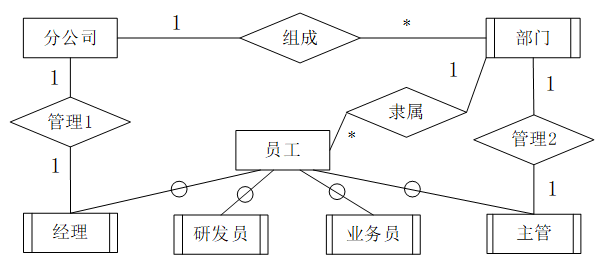
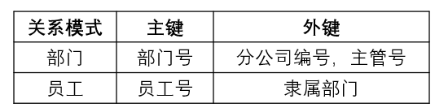
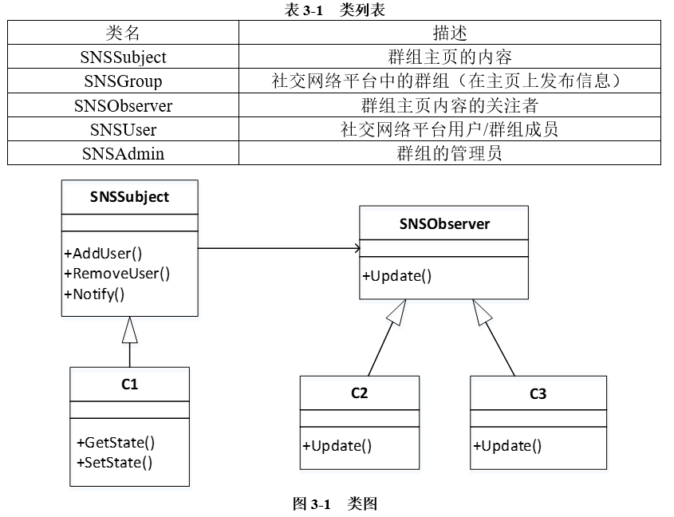
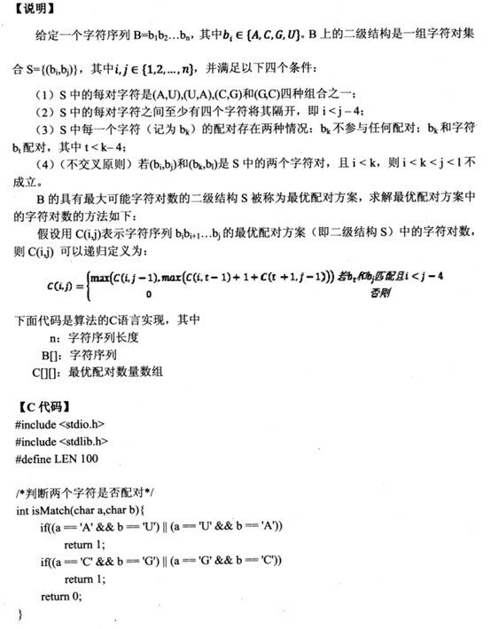

## 第 1 题 数据流图

### 问题

阅读下列说明和图，回答问题 1 至问题 4，将解答填入答题纸的对应栏内。

【说明】

某房产中介连锁企业欲开发一个基于 Web 的房屋中介信息系统，以有效管理房源和客户，提高成交率。该系统的主要功能是：

1. 房源采集与管理。系统自动采集外部网站的潜在房源信息，保存为潜在房源。由经纪人联系确认的潜在房源变为房源，并添加出售 / 出租房源的客户。由经纪人或客户登记的出售 / 出租房源，系统将其保存为房源。房源信息包括基本情况、配套设施、交易类型、委托方式、业主等。经纪人可以对房源进行更新等管理操作。
2. 客户管理。求租 / 求购客户进行注册、更新，推送客户需求给经纪人，或由经纪人对求租 / 求购客户进行登记、更新。客户信息包括身份证号、姓名、手机号、需求情况、委托方式等。
3. 房源推荐。根据客户的需求情况（求购 / 求租需求情况以及出售 / 出租房源信息），向已登录的客户推荐房源。
4. 交易管理。经纪人对租售客户双方进行交易信息管理，包括订单提交和取消，设置收取中介费比例。财务人员收取中介费之后，表示该订单已完成，系统更新订单状态和房源状态，向客户和经纪人发送交易反馈。
5. 信息查询。客户根据自身查询需求查询房屋供需信息。

现采用结构化方法对房屋中介信息系统进行分析与设计，获得如图 1-1 所示的上下文数据流图和图 1-2 所示的 0 层数据流图。

【问题 1】（4 分）

使用说明中的词语，给出图 1-1 中的实体 E1-E4 的名称。

【问题 2】（4 分）

使用说明中的词语，给出图 1-2 中的数据存储 D1-D4 的名称。

【问题 3】（3 分）

根据说明和图中术语，补充图 1-2 中缺失的数据流及其起点和终点。

【问题 4】 （4 分）

根据说明中术语，给出图 1-1 中数据流 “客户信息”、“房源信息” 的组成。

### 答案与解析

##  第 2 题 数据库设计

### 问题

阅读下列说明，回答问题 1 至问题 4，将解答填入答题纸的对应栏内。

【说明】

某集团公司拥有多个分公司，为了方便集团公司对分公司各项业务活动进行有效管理，集团公司决定构建一个信息系统以满足公司的业务管理需求。

【需求分析】

1. 分公司关系需要记录的信息包括分公司编号、名称、经理、联系地址和电话。分公司编号唯一标识分公司信息中的每一个元组。每个分公司只有一名经理，负责该分公司的管理工作。每个分公司设立仅为本分公司服务的多个业务部门，如研发部、财务部、采购部、销售部等。

2. 部门关系需要记录的信息包括部门号、部门名称、主管号、电话和分公司编号。部门号唯一标识部门信息中的每一个元组。每个部门只有一名主管，负责部门的管理工作。每个部门有多名员工，每名员工只能隶属于一个部门。

3. 员工关系需要记录的信息包括员工号、姓名、隶属部门、岗位、电话和基本工资。其中，员工号唯一标识员工信息中的每一个元组。岗位包括：经理、主管、研发员、业务员等。

【概念模型设计】

根据需求阶段收集的信息，设计的实体联系图和关系模式 (不完整) 如图 2-1 所示:

【关系模式设计】

分公司（分公司编号，名称，（a），联系地址，电话）

部门（部门号，部门名称，（b），电话）

员工（员工号，姓名（c），电话，基本工资）

【问题 1】 （4 分）

根据问题描述，补充 4 个联系，完善图 2-1 的实体联系图。联系名可用联系 1、联系 2、联系 3 和联系 4 代替，联系的类型为 `1:1`、`1:n` 和 `m:n` （或 `1:1`、`1:*` 和 `*:*`）。

【问题 2】（5 分）

根据题意，将关系模式中的空 (a)-(c) 补充完整。

【问题 3】（4 分）

给出 “部门” 和 “员工” 关系模式的主键和外键。

【问题 4】（2 分）

假设集团公司要求系统能记录部门历任主管的任职时间和任职年限，那么是否需要在数据库设计时增设一个实体？为什么？

### 答案与解析

- 知识点：数据库设计
- 试题答案：

【问题 1】

联系 1：分公司：经理，`1:1`

联系 2：分公司：部门，`1:*`

联系 3：部门：主管，`1:1`

联系 4：部门：员工，`1:*`

【问题 2】

（a）经理工号

（b）分公司编号，主管号

（c）隶属部门，岗位

【问题 3】

部门

主键：部门号；外键：分公司编号，主管号

员工

主键：员工号；外键：隶属部门

【问题 4】

不需要增加新的实体，对于任职情况，可以将任职时间和任职年限放入联系的属性即可，将部门与主管的联系单独形成关系模式，任职（部门号，主管工号，任职时间，任职年限）。

## 第 3 题 UML 建模

### 问题

阅读下列说明，回答问题 1 至问题 3，将解答填入答题纸的对应栏内。

【说明】

社交网络平台 （SNS） 的主要功能之一是建立在线群组，群组中的成员之间可以互相分享或挖掘兴趣和活动。每个群组包含标题、管理员以及成员列表等信息。

社交网络平台的用户可以自行选择加入某个群组。每个群组拥有一个主页，群组内的所有成员都可以查看主页上的内容。如果在群组的主页上发布或更新了信息，群组中的成员会自动接收到发布或更新后的信息。

用户可以加入一个群组也可以退出这个群组。用户退出群组后，不会再接收到该群组发布或更新的任何信息。

现采用面向对象方法对上述需求进行分析与设计，得到如表 3-1 所示的类列表和如图 3-1 所示的类图。 

【问题 1】（6 分）

根据说明中的描述，给出图 3-1 中 C1~ C3 所对应的类名。

【问题 2】 (6 分)

图 3-1 中采用了哪一种设计模式？说明该模式的意图及其适用场合。

【问题 3】 (3 分)

现在对上述社交网络平台提出了新的需求：一个群体可以作为另外一个群体中的成员，例如群体 A 加入群体 B 。那么，群体 A 中的所有成员就自动成为群体 B 中的成员。

若要实现这个新需求，需要对图 3-1 进行哪些修改？（以文字方式描述）

### 答案与解析

- 知识点：UML 建模 -> 类图
- 试题答案：

【问题 1】

C1：SNSGroup；C2：SNSUser；C3：SNSAdmin。

【问题 2】

采用的设计模式：观察者模式

意图：定义对象间的 一种一对多的依赖关系，当一个对象的状态发生改变时，所有依赖于它的对象都得到通知并自动更新。

适用场合：

（1）当一个抽象模型有两个方面，其中一个方面依赖于另一个方面，将这两者封装在独立的对象中以使它们可以各自独立地改变和复用。

（2）当对一个对象的改变需要同时改变其他对象，而不知道具体有多少对象有待改变时。

（3）当一个对象必须通知其他对象，而它又不能假定其他对象是谁，即不希望这些对象是紧耦合的。

【问题 3】

（1）在 SNSSubject 和 SNSObserver 之间增加继承关系，SNSObserver 为基类，SNSSubject 为派生类。

（2）为类 SNSGroup 增加自关联（自己到自己的关联关系）。

- 试题解析：

【问题 1】

本题补充类名，来源是表 3-1 所给出的类名。

在图 3-1 所示的类图中，有两个个继承结构：SNSObserver、C2 和 C3；SNSSubject 和 C1

根据图示，对于 SNSSubje 是抽象的被观察者，具体被观察的对象应该是在主页发布消息的群组，即 C1 是 SNSGroup；SNSObserver 是抽象的观察者，具体的观察者应该是关注主页的群组成员或群组管理员，即 C2 是 SNSUser；C3 是 SNSAdmin，且二者可以互换。

【问题 2】

根据图示可知本题所用的是观察者模式。观察者模式是行为型设计模式。

意图：定义对象间的 一种一对多的依赖关系，当一个对象的状态发生改变时，所有依赖于它的对象都得到通知并自动更新。

适用场合：

（1）当一个抽象模型有两个方面，其中一个方面依赖于另一个方面，将这两者封装在独立的对象中以使它们可以各自独立地改变和复用。

（2）当对一个对象的改变需要同时改变其他对象，而不知道具体有多少对象有待改变时。

（3）当一个对象必须通知其他对象，而它又不能假定其他对象是谁，即不希望这些对象是紧耦合的。

【问题 3】

对于新需求： 一个群体可以作为另外一个群体中的成员，例如群体 A 加入群体 B 。那么，群体 A 中的所有成员就自动成为群体 B 中的成员。即群组是可以嵌套的，针对这个需求：

（1）在 SNSSubject 和 SNSObserver 之间增加继承关系，SNSObserver 为基类，SNSSubject 为派生类。

（2）为类 SNSGroup 增加自关联（自己到自己的关联关系）。

## 第 4 题 C 语言算法

### 问题

阅读下列说明和 C 代码，回答问题 1 至问题 3，将解答写在答题纸的对应栏内。

【问题 1】（8 分）

根据题干说明，填充 C 代码中的空（1）-（4）。

【问题 2】 （4 分）

根据题干说明和 C 代码，算法采用的设计策略为（5）。

算法的时间复杂度为（6）,（用 O 表示）。

【问题 3】 (3 分〉

给定字符序列 ACCGGUAGU  ，根据上述算法求得最大字符对数为（7）。

### 答案与解析

- 知识点：数据结构与算法应用 -> 动态规划法
- 试题答案：

【问题 1】

（1）`max=C[i][j-1] `

（2）`t=I`

（3）`isMatch(B[t],B[j])`，或 `isMatch(B[t],B[j])==1`，或与其等价的形式

（4）`C[1][n]`

【问题2】

采用的算法策略：动态规划法

时间复杂度：O(n^3^)

【问题 3】

最大字符对数：2

- 试题解析：

本题考查的是用动态规划法，以非递归方式实现。

根据题干，配对要求：

（1）满足四种组合之一；

（2）配对的 2 个字符间距至少有 4 个字符；

（3）若字符已配对，则其他配对不再考虑，也就是说 1 个字符不能配对 2 次，比如 ACCCCUCCCCA，只有 1 组配对 AU，U 不能再与后面的 A 形成第 2 组配对；

（4）不交叉，2 组配对字符位置能交叉，比如 ACCCCCUUUUG，只有 1 组配对 AU，CG 与 AU 有交叉不能形成配对。

【问题 1】

对于问题 1 代码填空，主要根据题干描述和代码上下文进行推导。

根据代码上下文可知，在整段代码中，缺少对变量 max 和 t  赋初值，这两个初值的赋值，应该填在空（1）和空（2）中，一般 t 作为循环变量，在 for 中进行赋值。

代码中有三层嵌套 for 循环。

其中第一层 for 循环，变量为 k，取值范围从 5 到 n-1，从题干描述，我们可以看到对于整个比较过程，要求字符对的位置相差大于 4，因此此处的 k 值是字符对下标的差值；

第二层 for 循环，变量为 i，取值范围从 1 到 n-k，从题干描述，我们可以得出 i 是字符对较小的下标；

第三层 for 循环，变量为 t，取值范围需要赋初值，并且 t<=j-4（此处有异议，与题干描述中的> 4 有不符，但不影响本题解题过程），从题干描述和递归式可以看到，t 是中间字符下标，用来划分子问题的，并且从递归式我们可以得出，t 的最小值应该从 i 开始，因此空（2）为 t=i；
在第二层 for 循环内部，有 j=i+k，根据代码和题干描述，可以得出 j 是字符对较大的下标，根据 i 和 k 的取值，可以看到 j 的取值范围为从 6 到 n-1，对于空

（1）作为 max 的初始赋值，又根据递归式，可以看到 max 应该在 C [i][j-1] 和 C [i][t-1]+1+C [t+1][j-1] 之间取最大值，在代码中可以看到 if 会判断 max 与 C [i][t-1]+1+C [t+1][j-1] 之间的大小，因此，max 之前的赋值应该为 C [i][j-1]，才能对二者进行比较，也就是说空（1）应该为 max=C [i][j-1]。
空（3）在 if 判断中作为判断条件，根据递归式的条件和代码上下文，此处缺少字符匹配的判断，题干描述字符下标从 1 开始，因此，在比较过程中，实际比较的应该为 B [t] 和 B [j] 位置的字符，空（3）应该填写 isMatch (B [t],B [j)，或 isMatch (B [t],B [j])==1，或与其等价的形式。
空（4）作为整个函数的返回值，因此空（4）应该为 C [1][n] 为最终结果。

【问题 2】

本题采取的是动态规划的策略，代码为三层嵌套循环时间复杂度为 `k*i*t`，由于 k 的取值范围是 6~n^-1^，i 的取值范围是 1~n^-5^，t 的取值范围是 1~n^-5^，都是与 n 的取值相关，因此本题的时间复杂度为 O (n3)。

【问题 3】
对于本题最大字符匹配对数，根据题干描述或代码推导，可以看到，字符序列 ACCGGUAGU 的最大匹配情况为，(b1,b6)，(b1,b9) 或 (b2,b8)，(b3,b8)，这两种情况的最大匹配对数都为 2，因此本题答案（7）空为 2。

## 第 5 题 C++ 语言程序设计

### 问题

### 答案与解析

## 第 6 题 Java 语言程序设计

### 问题

阅读下列说明和 Java 代码，将应填入（n）处的字句写在答题纸的对应栏内。

【说明】

某航空公司的会员积分系统将其会员划分为：普卡 (Basic) 、银卡 (Silver) 和金卡 (Gold) 三个等级。非会员 (Non Member) 可以申请成为普卡会员。会员的等级根据其 一年内累积的里程数进行调整。描述会员等级调整的状态图如图 6-1 所示 。现采用状态 (State) 模式

实现上述场景，得到如图 6-2 所示的类图。

### 答案与解析

- 试题难度：较难
- 知识点：面向对象程序设计 > Java 程序设计 > 状态模式

- 试题答案：

（1）`abstract double travel(int miles,FrequentFlyer context)`

（2）`context.setState(new CSilver())`

（3）`context.setState(new CGold ())`

（4）`context.setState(new CSilver())`

（5）`context.setState(new CBasic()`

- 试题解析：

由代码可知，（1）空缺少一个抽象方法，根据下面的子类可以发现，子类都有 double travel (int miles, FrequentFlyer context) 方法，是从该抽象类中继承而来，因此（1）空应该补充这个方法，并加上 abstract 修饰。

  （2）（3）（4）（5）可以从状态图中根据相关状态推断出来。

首先，（2）（3）属于普卡会员 CBasic，从状态图和代码可以看到，当里程 >=25000 且 < 5000 时，会员等级应该从普卡会员 CBasic 升级到银卡会员 CSilver，根据后面已有的代码，可以推断表示升级到银卡会员 CSilver 的表示方式为` context.setState (new CSilver ())`；

同理对于（3）空，在普卡会员 CBasic 状态，里程 >=50000 时，应该升级为金卡会员 CGold，此时升级金卡 CGold 的表示方式为 `context.setState (new CGold ())`

以此类推，（4）（5）分别对应金卡会员 CGold 状态下，不同条件，降低的不同等级。因此（4）为降级为银卡会员 CSilver，（5）为降级为普卡会员 CBasic，对应的表示方式分别为 `context.setState (new CSilver ())` 和 `context.setState (new CBasic ())`。
