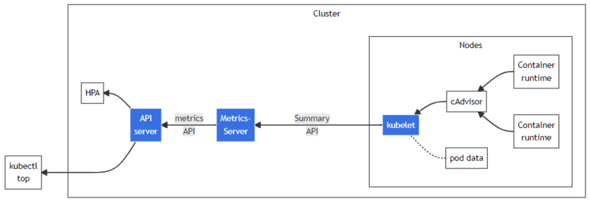

Metrics-Server 是集群核心监控数据的聚合器。通俗地说，它存储了集群中各节点的监控数据，并且提供了 API 以供分析和使用。

metric-server 主要用来通过 aggregate api 向其它组件（kube-scheduler、HorizontalPodAutoscaler、Kubernetes 集群客户端等）提供集群中的 pod 和 node 的 cpu 和 memory 的监控指标，弹性伸缩中的 podautoscaler 就是通过调用这个接口来查看 pod 的当前资源使用量来进行 pod 的扩缩容的。



从 Kubelet、cAdvisor 等获取度量数据，再由 metrics-server 提供给 Dashboard、HPA 控制器等使用。本质上 metrics-server 相当于做了一次数据的转换，把 cadvisor 格式的数据转换成了 kubernetes 的 api 的 json 格式。由此不难猜测，metrics-server 的代码中必然存在这种先从 metric 中获取接口中的所有信息，再解析出其中的数据的过程。给 metric-server 发送请求时，metrics-server 中已经定期从中 cadvisor 获取好数据了，当请求发过来时直接返回缓存中的数据。

需要注意的是：

- metric-server 提供的是实时的指标（实际是最近一次采集的数据，保存在内存中），并没有数据库来存储
- 这些数据指标并非由 metric-server 本身采集，而是由每个节点上的 cadvisor 采集，metric-server 只是发请求给 cadvisor 并将 metric 格式的数据转换成 aggregate api
- 由于需要通过 aggregate api 来提供接口，需要集群中的 kube-apiserver 开启该功能

Metrics Server 不适用于以下场景：

- 资源使用情况指标的准确来源
- 基于 CPU/内存之外的其他资源进行水平自动缩放

查看原生 APIServer 是否有 `metrics.k8s.io/v1beta1`

```bash
kubectl api-versions|grep metrics
```

