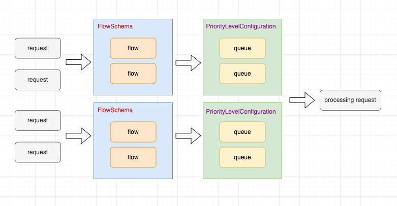
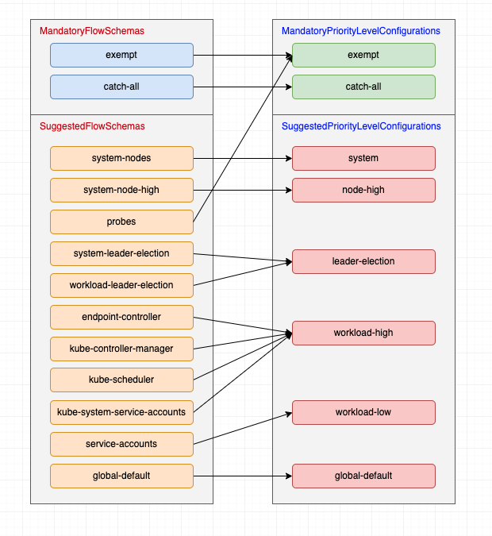

## APF 简介

API Priority and Fairness（简称 APF）是 Kubernetes 集群中用于控制 API Server 流量请求的一种原生机制

`APF` 在 v1.29 版本成为稳定的特性，为 `kube-apiserver` 的流量控制提供了更细粒度的处理机制。（流量治理）

在 Kubernetes 集群中，`kube-apiserver` 是一个至关重要的组件，它不仅要对外响应客户端的 HTTPS 请求，还要对内与 `controller-manager`、`scheduler`、`kubelet` …… 等等其它组件交互。

为了保障 `kube-apiserver` 的稳定性，其提供了以下配置用于限流：

- `--max-requests-inflight`：查询类请求的最大并发数，默认 400。
- `--max-mutating-requests-inflight`：变更类请求的最大并发数，默认 200。

虽然上述两项配置保障了总体的并发限制，但缺乏对请求的优先级划分，在某些情况下，集群管理员可能失去对 `kube-apiserver` 的掌控，比如某些失控的应用频繁请求 `kube-apiserver` 导致其过载而无法正常响应其它请求（2024 年 12 月 11 号 OpenAI 的 kubernetes 集群故障就是这种情况）。

而 `APF`（API Priority and Fairness）机制则可以避免这种问题。

`--max-requests-inflight` 和 `--max-mutating-requests-inflight` 相加的值决定了 `kube-apiserver` 的总并发数，总并发数和优先级的配额决定了每个优先级的并发能力。开启 `APF` 后，不再区分查询类请求和变更类请求，只根据 `FlowSchema` 进行分流。

### 核心作用

- 提升并发限制：它替代了旧版简单的最大并发数限制（max-in-flight），能更聪明地管理请求。
- 分类与隔离：它把不同的 API 请求按照更细的粒度进行分类和隔离。
- 排队机制：当请求过多时，它会引入有限大小的队列，防止请求直接被粗暴拒绝

## 主要核心对象

`APF`（API 优先级和公平调度）机制引入了以下两个新的对象：

- `FlowSchema`：用于对请求进行分类，关联一个 `PriorityLevelConfiguration` 优先级。
- `PriorityLevelConfiguration`：定义具体的优先级、该级别的并发数、队列行为。

请求通过 `APF` 的处理流程如下图所示：

请求首先匹配一个 `FlowSchema`，然后被分流到关联的 `PriorityLevelConfiguration`，进入该优先级配置的队列中，最后被从队列中取出处理

### FlowSchema

`FlowSchema` 的 `.spec` 配置有四个部分：

- `distinguisherMethod`：可以设置 type 为 ByUser 或者 ByNamespace 将请求进一步分流，也可以不设置此配置。
- `matchingPrecedence`：设置匹配的顺序，每个请求都先从 `matchingPrecedence` 数值最低的 `FlowSchema` 开始匹配，建议确保每个 `FlowSchema` 的 `matchingPrecedence` 不相同。
- `priorityLevelConfiguration`：关联的优先级，每个 `FlowSchema` 只能关联一个优先级设置。
- `rules`：匹配的规则，如果某个请求匹配其中一条规则，则该请求会被这个 `FlowSchema` 分流到关联的优先级。

### PriorityLevelConfiguration

`PriorityLevelConfiguration` 的 `.spec` 配置有三个部分：

- `type`：可以是 `Exempt` 或者 `Limited`，`Exempt` 表示豁免请求，即该请求不会进入队列排队，而是被立即处理。
- `exempt`：当 `type` 是 `Exempt` 时可以配置豁免的更多细节。
- `limited`：优先级队列相关配置，包括以下子属性：
  - `borrowingLimitPercent`：此优先级可以借入的额度。
  - `lendablePercent`：此优先级可以借出的额度。
  - `nominalConcurrencyShares`：名义并发额度。借入和借出额度设置提供了更多的弹性。
  - `limitResponse`：当 `type`

### 内置对象

为了降低用户的操作成本，kubernetes 内置了多种 `FlowSchema` 和 `PriorityLevelConfiguration`，这些对象被划分为强制和建议两类。对于强制的配置对象，k8s 会确保该对象存在，且不受用户控制；对于建议的配置对象，同样会确保该对象存在，但是用户可以控制。

从这些 `FlowSchema` 和 `PriorityLevelConfiguration` 的名字就能看出来它们分流和优先级的意图，集群内部组件的请求，如：节点的监控状态更新、kubelet 其它请求、内置控制器选主、内置控制器的其它请求 … 等等都已经被囊括其中，另外还有 `catch-all` 和 `global-default` 进行兜底，确保所有请求都被分流到具体的优先级队列。

## 监控指标

K8s FlowControl 提供了三个有用监控指标：

- `apiserver_flowcontrol_rejected_requests_total`：被拒绝的请求总数
- `apiserver_current_inqueue_requests`：当前缓冲在队列中未被处理的请求数
- `apiserver_flowcontrol_request_execution_seconds_bucket`：请求执行时长