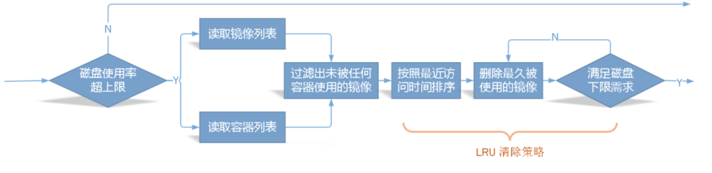
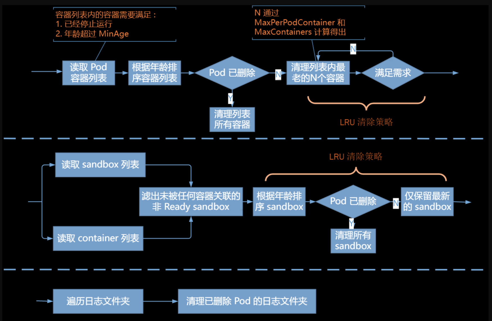

在 Kubernetes 中，kubelet 负责镜像和容器的垃圾回收工作。Kubernetes 没有提供一个直接的 “定期垃圾回收” 设置。

在 Kubernetes 集群中，应避免使用外部的垃圾回收工具来清理镜像和容器。这些工具可能会干扰 kubelet 的垃圾回收过程，导致不一致的状态。

## 镜像回收

Kubernetes 对节点上的所有镜像提供生命周期管理服务，这里的所有镜像是真正意义上的所有镜像，不仅仅是通过 Kubelet 拉取的镜像。当磁盘使用率超过设定上限 HighThresholdPercent 时，Kubelet 就会按照 LRU （最近最少使用）清除策略逐个清理掉那些没有被任何容器（包括已经死亡的容器）所使用的镜像，直到磁盘使用率降到设定下限 LowThresholdPercent 或没有空闲镜像可以清理。此外，在进行镜像清理时，会考虑镜像的生存年龄，对于年龄没有达到最短生存年龄 MinAge 要求的镜像，暂不予以清理。



相关参数

- `--image-gc-high-threshold`：设置触发镜像垃圾回收的磁盘使用率上限（百分比）。当磁盘使用率超过此阈值时，kubelet 将开始删除未使用的镜像。
- `--image-gc-low-threshold`：设置镜像垃圾回收后的磁盘使用率下限（百分比）。kubelet 将尝试删除未使用的镜像，直到磁盘使用率降至此阈值以下。
- `--minimum-image-ttl-duration`：设置镜像的最短存活时间。在此时间内，即使镜像未被使用，kubelet 也不会删除它。

示例配置

```bash
# 磁盘使用率上限，有效范围 [0-100]，默认 85
--image-gc-high-threshold

# 磁盘使用率下限，有效范围 [0-100]，默认 80
--image-gc-low-threshold

# 镜像最短应该生存的年龄，默认 2 分钟
--minimum-image-ttl-duration
```

## 容器回收

容器在停止运行（比如出错退出或者正常结束）后会残留一系列的垃圾文件，一方面会占据磁盘空间，另一方面也会影响系统运行速度。此时，就需要 Kubelet 容器回收了。要特别注意的是，Kubelet 回收的容器是指那些由其管理的的容器（也就是 Pod 容器），用户手动运行的容器不会被 Kubelet 进行垃圾回收。

容器回收主要针对三个目标资源：普通容器（Pod 中普通容器）、sandbox 容器（Pod 中的 pause 容器，也称沙箱容器）以及容器日志目录。

对于普通容器，主要根据 MaxPerPodContainer 与 MaxContainers 的设置，按照 LRU 策略，从 Pod 的死亡容器列表删除一定数量的容器，直到满足配置需求；对于 sandbox 容器，按照每个 Pod 保留一个的原则清理多余的死亡 sandbox；对于日志目录，只要没有 Pod 与之关联了就将其删除。Kubelet 的容器垃圾回收只针对 Pod 容器，非 Kubelet Pod 容器（比如通过 docker run 启动的容器）不会被主动清理。



到达 GC 时间点时，具体的 GC 过程如下：

1. 遍历所有 pod，使其满足 --maximum-dead-containers-per-container；
2. 经过上一步后如果不满足 --maximum-dead-containers，计算值 X=（--maximum-dead-containers）/（pod 总数），再遍历所有 pod，使其满足已停止运行的容器集个数不大于 X 且至少为 1；
3. 经过以上两步后如果还不满足 --maximum-dead-containers，则对所有已停止的容器（普通容器 + sandbox 容器 ）排序，优先删除创建时间最早的容器直到满足 --maximum-dead-containers 为止。

相关参数

```bash
# 从容器停止运行时起经过设置时间后，该容器标记为已过期将来可以被回收（只是标记，不是回收），默认值为 1m0s
--minimum-container-ttl-duration

# 每个 pod 上可以留下运行结束之后的容器的个数，默认值为 2
--maximum-dead-containers-per-container

# 节点可保留的死亡容器的最大数量，默认值是 -1，这意味着节点没有限制死亡容器数量
--maximum-dead-containers

# 如果需要关闭容器的垃圾回收策略
# 设为0（表示无限制）
--minimum-container-ttl-duration
# --maximum-dead-containers-per-container 和 --maximum-dead-containers 设为负数。
```

