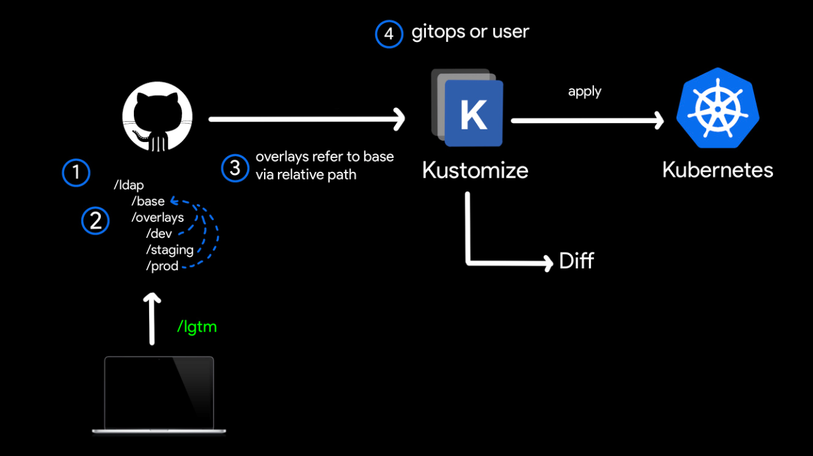

## 简介

kustomize 是一个通过 kustomization 文件定制 kubernetes 对象的工具，它可以通过一些资源生成一些新的资源，也可以定制不同的资源的集合

- GitHub 仓库地址：<https://github.com/kubernetes-sigs/kustomize>
- 文档：<https://kustomize.io/>

`ldap` 的应用，在不同的环境例如生产环境和测试环境，它的 yaml 配置绝大部分都是相同的，只有个别的字段不同，这时候就可以利用 Kustomize 来解决

- `/base`目录保存的是基本的配置
- `/overlays`里放置的不同环境的配置，例如 `/dev`、`/staging`，`/prod`这些就是不同环境的配置
- `/base`等文件夹下都有一个 `kustomization .yml` 文件，用于配置

Bespoke configuration，在这个工作流方式中，所有的配置文件（ YAML 资源）都为用户所有，存储在用户的私有 repo



Off-the-shelf configuration，在这个工作流程中，所有文件都由用户拥有，并维护在存储库中，但它们是基于一个现成的（off-the-shelf）配置，定期查询更新


## 使用

### overlays

```bash
├── base
│   ├── deployment.yaml
│   ├── kustomization.yaml
│   └── service.yaml
└── overlays
    ├── dev
    │   ├── kustomization.yaml
    │   └── patch.yaml
    ├── prod
    │   ├── kustomization.yaml
    │   └── patch.yaml
    └── staging
        ├── kustomization.yaml
        └── patch.yaml
```

一个常见的项目 kustomize 项目布局如上所示

可以看到每个环境文件夹里面都有一个 `kustomization.yaml` 文件，这个文件里面就类似配置文件，里面指定源文件以及对应的一些转换文件，例如 patch 等

### kustomization.yaml

API 参考文档地址：<https://kubectl.docs.kubernetes.io/zh/api-reference/kustomization/>

常用的字段

- `resources` 表示 k8s 资源的位置，这个可以是一个文件，也可以指向一个文件夹，读取的时候会按照顺序读取，路径可以是相对路径也可以是绝对路径，如果是相对路径那么就是相对于 `kustomization.yml`的路径
- `crds` 和 `resources` 类似，只是 `crds` 是自定义资源
- `namespace` 为所有资源添加 namespace
- `images` 修改镜像的名称、tag 或 image digest ，而无需使用 patches
- `replicas` 修改资源副本数
- `namePrefix` 为所有资源和引用的名称添加前缀
- `nameSuffix` 为所有资源和引用的名称添加后缀
- `patches` 在资源上添加或覆盖字段，Kustomization 使用 `patches` 字段来提供该功能
- `patchesJson6902` 列表中的每个条目都应可以解析为 kubernetes 对象和将应用于该对象的 [JSON patch](https://tools.ietf.org/html/rfc6902)
- `patchesStrategicMerge` 使用 strategic merge patch 标准 Patch resources
- `vars` 类似指定变量
- `commonAnnotations` 为所有资源加上 `annotations` 如果对应的 key 已经存在值，这个值将会被覆盖
- `commonLabels` 为所有资源的加上 label 和 label selector
- `configMapGenerator` 可以生成 config map，列表中的每一条都会生成一个 configmap
- `secretGenerator` 用于生成 secret 资源
- `generatorOptions` 用于控制 `configMapGenerator` 和 `secretGenerator` 的行为

### 插件

kustomize 提供了比较丰富的字段选择，除此之外还可以自定义插件

## 对比 helm

看到 Kustomize 的第一反应是这个东西和 helm 有什么区别

- Kustomize 没有模板语法，只需要一个二进制命令就可以生成对应的 yaml 文件非常的轻量
- helm 支持 GoTemplate，组件上也要多一些，并且 helm 通过 chart 包来进行发布相对来说还是要重量级一些

Kustomize 更适合做 GitOPS 而 helm 更合适做应用包的分发
