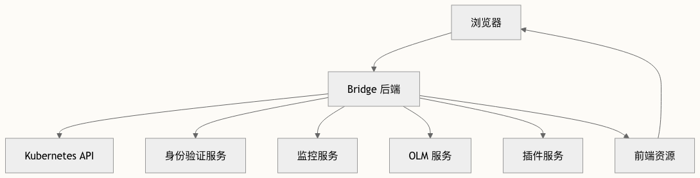

## OKD 简介

红帽 OpenShift 的开源社区版本称为 OKD（The Origin Community Distribution of Kubernetes，或 OpenShift Kubernetes Distribution 的缩写，原名 OpenShift Origin），是 Red Hat OpenShift Container Platform (OCP) 的上游和社区支持版本

- <https://github.com/okd-project/okd>

OpenShift 控制台（代号"Bridge"）是一款功能强大的基于 Web 的用户界面，是管理 OpenShift 和 Kubernetes 集群的友好替代方案，相较于 `kubectl` 命令行工具更加易用。OpenShift 控制台的核心目标是通过直观的图形界面简化集群管理，同时保留对 Kubernetes API 全部功能的访问能力。控制台充当用户与复杂底层系统之间的 bridge。

## 二次开发

### 源码获取

源码地址：

- <https://github.com/openshift/console>
- <https://github.com/okd-project/okd>
- Canonical location of the OpenShift API definition <https://github.com/openshift/api>

Release 分支：<https://github.com/openshift/origin/tree/release-4.20>

### 开发环境

CodeReady Containers(CRC): <https://github.com/crc-org/crc>

准备环境

- 4C
- 10.5GB 内存
- 35GB 存储

安装虚拟化工具

```bash
dnf install -y libvirt NetworkManager
```

CRC 下载地址：<https://console.redhat.com/openshift/create/local>

```bash
wget https://developers.redhat.com/content-gateway/rest/mirror/pub/openshift-v4/clients/crc/latest/crc-linux-amd64.tar.xz
```

注意还需要 `Download pull secret`，下载后解压 crc 到 PATH 路径中，并将 pull secret 放置到机器上

部署文档：<https://crc.dev/docs/installing/>

创建一个名为 crc 的卷组

```bash
vgcreate crc /dev/sdx
```

`crc setup`命令会安装和检测集群启动的所有依赖，如果失败，可以`crc setup --log-level debug`来输出更详细的日志

```bash
# 按需配置
crc config set consent-telemetry no
crc config set cpus 12
crc config set developer-password openshift
crc config set disable-update-check true
crc config set disk-size 120
crc config set enable-cluster-monitoring true
crc config set memory 32768
crc config set nameserver 8.8.8.8
crc config set persistent-volume-size 60
crc config set pull-secret-file /root/crc/pull-secret

crc config set skip-check-root-user true

# 开始设置
crc setup
```

启动服务

```bash\
crc start
```

安装完成后会提示

```bash
The server is accessible via web console at:
  https://console-openshift-console.apps-crc.testing

Log in as administrator:
  Username: kubeadmin
  Password: openshift

Log in as user:
  Username: developer
  Password: openshift

Use the 'oc' command line interface:
  $ eval $(crc oc-env)
  $ oc login -u developer https://api.crc.testing:6443
```

查看 OpenShift 的控制台访问地址

```bash
crc console --url
```

## 架构总览

### 组件

控制台架构包含两个主要组件：

1. 后端：基于 Go 语言的服务器，负责处理身份验证、API 代理和提供前端资源
2. 前端：基于 TypeScript 构建的 React 单页应用，提供用户界面

前端和后端组件分离明确



### 后端架构

后端使用 Go 语言构建，在 `pkg/` 目录下组织为多个关键包：<https://github.com/openshift/console/tree/release-4.20/pkg>

- `auth/`：处理身份验证和会话管理
- `proxy/`：管理到 Kubernetes 和其他服务的 API 代理
- `server/`：核心服务器功能和中间件
- `plugins/`：插件系统实现
- `graphql/`：GraphQL API 实现
- `serverconfig/`：配置管理

## 参考资料

- <https://blog.crazytaxii.com/posts/openshift_cluster_console_access_k8s/>
- <https://www.cnblogs.com/zard/p/7767112.html>
- <https://juejin.cn/post/7155520640726859813>
