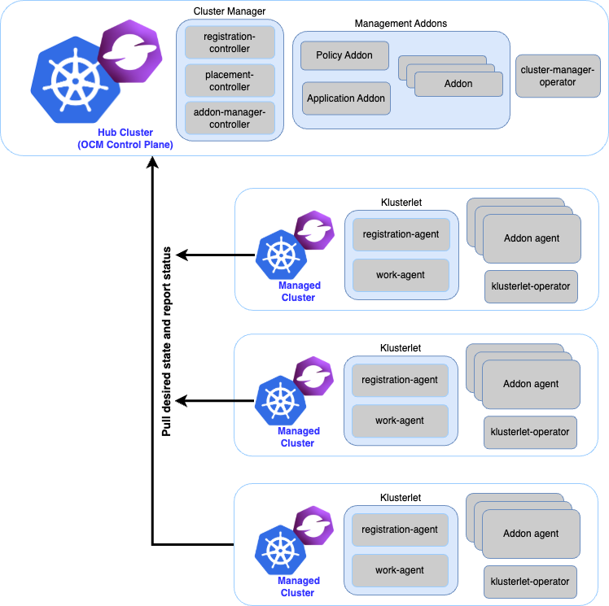
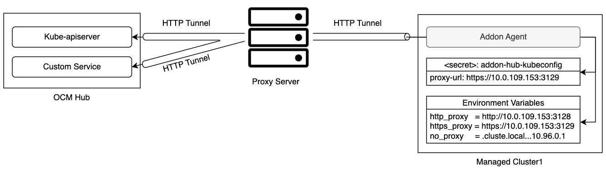

## OCM 简介

Open Cluster Management（Kubernetes 多集群管理平台）

- 文档：<https://open-cluster-management.io/>

- OCM: <https://github.com/open-cluster-management-io/ocm>

多集群架构：Hub-Spoke（中心 - 被管）架构

## OCM 组件

### cluster-manager

必需，装在 Hub 集群

Hub 端的核心控制面，包含：

- registration：负责托管集群的注册、CSR 审批
- placement：多集群调度 / 选择器（决定工作负载分发到哪些集群）
- work webhook：ManifestWork 的校验

### klusterlet

必需，装在每个被纳管的集群

托管集群上的 agent，包含：

- registration agent：向 Hub 注册自己、维持心跳
- work agent：接收并执行 Hub 下发的 ManifestWork

每个要纳入管理的集群都要装一个，且需要 Hub 签发的 bootstrap kubeconfig。

### managed-serviceaccount

可选 addon

让 Hub 能在托管集群上创建 / 管理 ServiceAccount，并把 token 同步回 Hub，方便从 Hub 直接调用各集群的 API（多集群编排场景常用）。

### cluster-proxy

通过代理服务注册到 Hub 集群：<https://open-cluster-management.io/docs/scenarios/register-cluster-through-proxy/>

