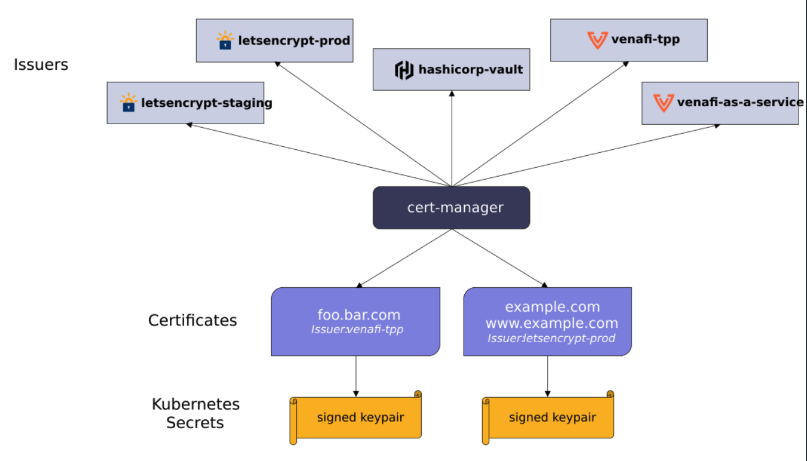

## cert-manager

Cert-manager 是一个Kubernetes addon 插件，用于从不同的证书颁发者自动化管理和签发 TLS 证书。Cert-manager 会保证证书的合法性，并试图在到期前轮转更新证书

主要作用：给 k8s 集群中的应用生成证书，让应用可以通过 https 访问

### 使用场景

Cert-Manager 的使用场景非常广泛，包括以下几个方面：

1. HTTPS 访问：通过 Cert-Manager 可以方便地为 Kubernetes 集群中的 Service 和 Ingress 创建 TLS 证书，以便实现 HTTPS 访问
2. 部署安全：Cert-Manager 可以为 Kubernetes 集群中的 Pod 创建 TLS 证书，以确保 Pod 之间的通信是加密的
3. 服务间认证：Cert-Manager 可以为 Kubernetes 集群中的 Service 创建 TLS 证书，以确保 Service 之间的通信是加密的
4. 其他应用场景：Cert-Manager 还可以用于为其他应用程序创建 TLS 证书，以确保通信是加密的

### 实际解决的问题

主要解决的几个痛点如下：

1. 自动化管理证书：Cert-Manager 可以自动化地管理 TLS 证书，无需人工干预，自动签发证书以及过期前 renew 证书等问题，避免了证书管理的复杂性和错误
2. 安全性：Cert-Manager 可以帮助确保证书的颁发机构是可信的，并确保证书的私钥不会泄露，从而提高了通信的安全性
3. 管理成本：Cert-Manager 可以通过标准化证书的管理方式，简化证书管理的成本和流程

cert-manager 则可以解决上面的那些问题，实现证书的自动生成和更新

## 相关

- 官方文档：<https://cert-manager.io/docs/>
- 代码仓库：<https://github.com/cert-manager/cert-manager>

## 架构

### 分层架构

Cert-Manager 的架构分为两层：控制层和数据层

- 控制层: 负责证书的管理，包括证书的创建、更新和删除等

- 数据层: 负责存储证书相关的数据，包括证书的私钥、证书请求、证书颁发机构等

Cert-Manager 支持多种证书颁发机构，包括自签名证书 selfSigned、Let's Encrypt、HashiCorp Vault、Venafi 等。它还支持多种验证方式，包括 HTTP 验证、DNS 验证和 TLS-SNI 验证等。这些验证方式可以帮助确保证书的颁发机构是可信的，并且确保证书的私钥不会泄露

### 监听资源

cert-manager 也是一个 controller，部署起来后，会像其它 controller 一样，监听着资源的变化，然后执行相应的逻辑。

cert-manager 将证书和证书颁发者作为资源类型添加到 Kubernetes 集群中，并简化了获取、更新和使用这些证书的过程。它可以从各种受支持的来源颁发证书，包括 Let’s Encrypt、HashiCorp Vault 和 Venafi 以及私有 PKI。它将确保证书有效且是最新的，并在到期前的配置时间尝试更新证书。

它会监听的资源有如下三种，它们都属于分组 `certmanager.k8s.io`：

- certificates
- clusterissuers
- issuers



查看所有的 crd：

```bash
kubectl get crd | grep cert-manager
```

目前有：

```text
certificaterequests.cert-manager.io                   2022-07-30T14:46:33Z
certificates.cert-manager.io                          2022-07-30T14:46:32Z
challenges.acme.cert-manager.io                       2022-07-30T14:46:33Z
clusterissuers.cert-manager.io                        2022-07-30T14:46:32Z
issuers.cert-manager.io                               2022-07-30T14:46:33Z
orders.acme.cert-manager.io                           2022-07-30T14:46:32Z

```

Cert-manager 定义了几个 CRD 资源，用于证书的管理。如下：

- issuers.cert-manager.io：命名空间级别的证书签发者，它只能为同命名空间的证书请求签发证书。更多参考： <https://cert-manager.io/docs/configuration/>
- clusterissuers.cert-manager.io：集群级别的证书签发者，它可以为多个命名空间的证书请求签发证书，配置与 issuers 完全一致。
- certificates.cert-manager.io： 一个人类可读的证书请求的定义，其需要指定一个 issuer，Cert-manager 使用相应 issuer 为 Certificate 签发证书。签发的证书存储在指定的 secret 中。

certificates 是自定义证书资源，其中存储了证书的类型，以及证书信息存到哪个 secret 等信息。

clusterissuers 和 issuers 是生产者，负责生成 certificates，然后 certificates 负责生成 tls 类型的 secret，secret 最终被 ingress 引用，实现 https 访问。

### cert-manager 创建证书的过程

cert-manager 在 k8s 中创建证书的整个过程可以通过以下流程图来描述：

```plain
              +-------------+
              |             |
              |   Ingress/  |
              | annotations |
              |             |
              +------+------+
                     |
                     | watch ingress change
                     |
                     v
              +-------------+
              |             |
              |   Issuer/   |
              | ClusterIssuer |
              |             |
              +------+------+
                     |
                     | Create CertificateRequest
                     |
                     v
              +------+------+
              |             |
              |CertificateRequest|
              |             |
              +------+------+
                     |
                     | Create Order
                     |
                     v
              +------+------+
              |             |
              |      Order  |
              |             |
              +------+------+
                     |
                     | Create Challenges
                     |
                     v
              +------+------+
              |             |
              |  Challenge  |
              |             |
              +------+------+
                     |
                     | Respond to Challenge
                     |
                     v
              +------+------+
              |             |
              |ChallengeResponse|
              |             |
              +------+------+
                     |
                     | Issue Certificate
                     |
                     v
              +------+------+
              |             |
              |     Secret  |
              |             |
              +------+------+
```

在 Kubernetes 中，cert-manager 通过以下流程创建资源对象以签发证书：

1. 创建一个 `CertificateRequest` 对象，包含证书的相关信息，例如证书名称、域名等。该对象指定了使用的 `Issuer` 或 `ClusterIssuer`，以及证书签发完成后，需要存储的 `Secret` 的名称
2. `Issuer` 或 `ClusterIssuer` 会根据证书请求的相关信息，创建一个 `Order` 对象，表示需要签发一个证书。该对象包含了签发证书所需的域名列表、证书签发机构的名称等信息
3. 证书签发机构根据 `Order` 对象中的信息创建一个或多个 `Challenge` 对象，用于验证证书申请者对该域名的控制权。`Challenge` 对象包含一个 DNS 记录或 HTTP 服务，证明域名的所有权
4. cert-manager 接收到 `Challenge` 对象的回应`ChallengeResponse`后，会将其更新为已解决状态。证书签发机构会检查所有的 `Challenge` 对象，如果全部通过验证，则会签发证书
5. 签发证书完成后，证书签发机构会将证书信息写入 `Secret` 对象，同时将 `Order` 对象标记为已完成。证书信息现在可以被其他部署对象使用

可以通过以下命令查看各个过程的信息：

```
kubectl get CertificateRequests,Orders,Challenges
```

## 参考资料

- <https://cloud.tencent.com/developer/article/1326543>
- <https://jeremyxu2010.github.io/2018/08/k8s%E4%B8%AD%E4%BD%BF%E7%94%A8cert-manager%E7%8E%A9%E8%BD%AC%E8%AF%81%E4%B9%A6/>
- <https://blog.51cto.com/liuzhengwei521/2120535?utm_source=oschina-app>
