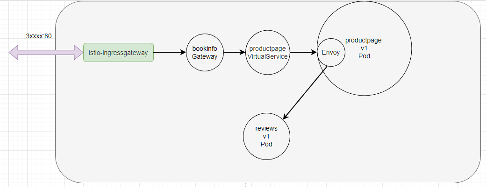

官方文档：<https://istio.io/latest/zh/docs/tasks/traffic-management/request-routing/>

## 基于版本的路由配置

bookinfo 的应用中每次刷新得到的结果都不一样。因为 Kubenetes Service 通过标签中的 `app: reviews` 来绑定对应的 Pod，正常情况下，Kubernetes 会将客户端的请求以轮询的方式转发到 Deployment 中的 Pod，VirtualService 也是如此


```yaml
  selector:
    app: reviews
```

三个不同的 Reviews Deployment 都带有相同的 `app: reviews` 标签，所以 Service 会把它们的 Pod 放到一起，VirtualService 会将流量以轮询的方式分发到每个版本中

```yaml
  labels:
    app: reviews
    version: v1

  labels:
    app: reviews
    version: v2

  labels:
    app: reviews
    version: v3
```

所以，流量进入 Reviews VirtualService 之后，会被 Kubernetes 均衡地分配到各个 Pod 中。接下来我们将会使用按照版本的形式将流量划分到不同的版本服务中。

Istio 通过 DestinationRule 定义了应用的版本，使用 Istio DestinationRule 设置 reviews v1/v2/v3 版本的定义如下所示：

```yaml
apiVersion: networking.istio.io/v1alpha3
kind: DestinationRule
metadata:
  name: reviews
spec:
  host: reviews
  subsets:
  - name: v1
    labels:
      version: v1
  - name: v2
    labels:
      version: v2
  - name: v3
    labels:
      version: v3

```

通过 `name: v1` 定义版本，通过 `labels` 指定哪些符合条件的 Pod 划分到这个版本中

接下来我给书店微服务的应用都创建一个 DestinationRule 

```yaml
---
apiVersion: networking.istio.io/v1alpha3
kind: DestinationRule
metadata:
  name: productpage
spec:
  host: productpage
  subsets:
  - name: v1
    labels:
      version: v1

---
apiVersion: networking.istio.io/v1alpha3
kind: DestinationRule
metadata:
  name: ratings
spec:
  host: ratings
  subsets:
  - name: v1
    labels:
      version: v1

---
apiVersion: networking.istio.io/v1alpha3
kind: DestinationRule
metadata:
  name: details
spec:
  host: details
  subsets:
  - name: v1
    labels:
      version: v1

```

为三个微服务 productpage、ratings、details 定义 Istio VirtualService，因为它们都只有 v1 版本，所以在 VirtualService 中直接将流量转发的 v1 版本即可

```yaml
apiVersion: networking.istio.io/v1alpha3
kind: VirtualService
metadata:
  name: productpage
spec:
  hosts:
  - productpage
  http:
  - route:
    - destination:
        host: productpage
        subset: v1

---
apiVersion: networking.istio.io/v1alpha3
kind: VirtualService
metadata:
  name: ratings
spec:
  hosts:
  - ratings
  http:
  - route:
    - destination:
        host: ratings
        subset: v1

---
apiVersion: networking.istio.io/v1alpha3
kind: VirtualService
metadata:
  name: details
spec:
  hosts:
  - details
  http:
  - route:
    - destination:
        host: details
        subset: v1

```

`host: reviews` 使用 Service 的名称。如果这样填写，该规则只能应用于当前命名空间的 Service，如果需要将流量引导到其它命名空间的 Service，则需要使用完整的 DNS 路径，如：`reviews.bookinfo.svc.cluster.local`。

而对于 reviews 服务，我们在 VirtualService 只将流量转发到 v1 版本，忽略 v2、v3

```yaml
apiVersion: networking.istio.io/v1alpha3
kind: VirtualService
metadata:
  name: reviews
spec:
  hosts:
  - reviews
  http:
  - route:
    - destination:
        host: reviews
        subset: v1
```

之后，无论怎么刷新 `http://<host>/productpage`，右侧的 Book Reviews 都不会显示星星，因为流量都转发到 v1 版本中，而 v1 版本是不会有星星的

```bash
> kubectl get vs

bookinfo      ["bookinfo-gateway"]   ["*"]             6d16h
details                              ["details"]       40s
productpage                          ["productpage"]   40s
ratings                              ["ratings"]       40s
reviews                              ["reviews"]       40s
```

Istio 原理：首先是 istio-ingressgateway 将流量转发到 bookinfo 网关中，然后 productpage VirtualService 根据对应的路由规则，判断是否放通流量，最后转发到对应的 productpage 应用中。接着 productpage 需要访问其它服务例如 reviews，发出的请求会经过 Envoy，Envoy 根据配置的 VirtualService 规则，直接将流量转发到对应的 Pod 中



## 基于 Http header 的路由配置

基于 Http header 的转发，是通过 HTTP 请求中的 header 值，将流量转发到对应的 Pod 中。

将会通过配置 DestinationRule ，将 header 带有 `end-user: admin` 的流量转发到 v2 中，其它情况依然转发到 v1 版本

将 reviews 的 DestinationRule 描述文件的内容改成：

```yaml
  http:
  - match:
    - headers:
        end-user:
          exact: jason
    route:
    - destination:
        host: reviews
        subset: v2
  - route:
    - destination:
        host: reviews
        subset: v1
```

完整的 YAML 如下：

```yaml
apiVersion: networking.istio.io/v1alpha3
kind: VirtualService
metadata:
  name: reviews
spec:
  hosts:
  - reviews
  http:
  - match:
    - headers:
        end-user:
          exact: admin
    route:
    - destination:
        host: reviews
        subset: v2
  - route:
    - destination:
        host: reviews
        subset: v1
```

然后在页面中的右上角点击 `Sign in` 进行登录，账号密码都是 `admin`，此时 Book Reviews 一直显示星星

productpage 将这个 header 头转发给 `http://reviews:9080/` ，然后流量经过 Envoy 时，Envoy 检测到 Http header 中带有 end-user ，通过规则决定将流量转发到 reviews v2。在这个过程中并不需要 Service 参与

- 经过上面的配置，下面是请求的流程：
  - `productpage` → `reviews:v2` → `ratings` (针对 `admin` 用户)
  - `productpage` → `reviews:v1` (其他用户)

也可以通过 URL 的方式划分流量，例如 `/v1/productpage` 、`/v2/productpage` 