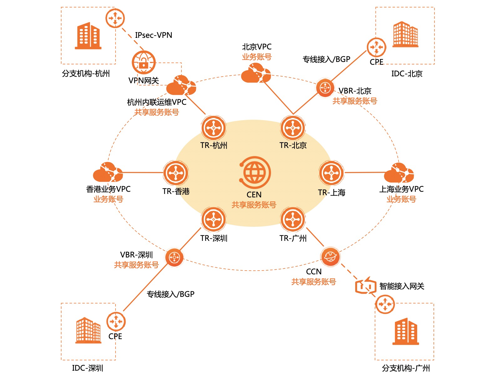
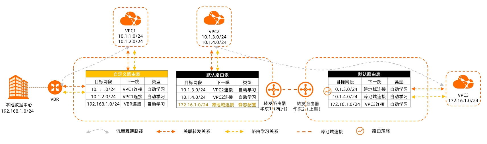
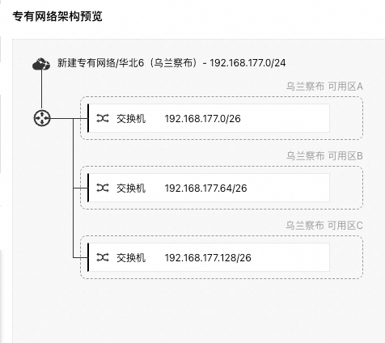
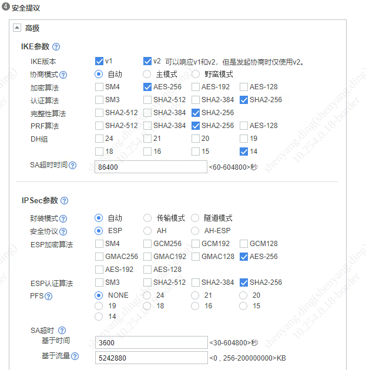

## 阿里云网络接入方案

文档：<https://help.aliyun.com/zh/landing-zone/solution-23>

浮动计算部分上云，部分业务系统仍放在云下，需要有大带宽、稳定、安全的网络通道，混合云状态会长期存在。



自带解决方案，转发路由器 <https://help.aliyun.com/zh/cen/product-overview/how-transit-routers-work>



## IPSec

由于单隧道 VPN 实例不具备 AZ 级高可靠能力，不建议在生产中使用

测试时使用 VPN 网关（便宜），以阿里云为例

规划好各个可用区的网段，例如网段：

| 网段               | 可用区     |
| ------------------ | ---------- |
| 192.168.177.0/26   | 乌兰察布-A |
| 192.168.177.64/26  | 乌兰察布-B |
| 192.168.177.128/26 | 乌兰察布-C |



安装 libreswan

```bash
dnf install -y libreswan lsof
```

配置如下 `/etc/ipsec.d/alpha-quant.conf`：



```conf
conn alpha-quant-248
        ### phase 1 ###
        # 指定认证类型预共享秘钥
        authby=secret
        # 指定ike算法
        ike=aes256-sha256;dh14
        # 指定ike
        keyexchange=ike

        ### phase 2 ###
        phase2=esp
        phase2alg=aes256-sha256
        # 指定是否压缩
        compress=no
        # 指定是否加密
        pfs=no
        # 指定连接添加类型。start 为开机自启，add为添加 不主动连接
        auto=start
        # 指定模式类型为隧道模式|传输模式
        type=tunnel

        # 阿里云机器 IP 及内网段
        left=192.168.176.2
        leftsubnet=192.168.176.0/24
        leftid=192.168.176.129
        leftnexthop=%defaultroute

        # 本地机房 IP 及内网段
        right=218.98.x.x
        rightsubnet=192.168.248.0/24
        rightid=218.98.x.x
        rightnexthop=%defaultroute

# 设置另外一个本地网段
conn alpha-quant-242
        also=alpha-quant-248
        rightsubnet=192.168.242.0/24

```

添加预共享密钥文件 `/etc/ipsec.d/alpha-quant.secrets`

```
%any %any : PSK "pass"
```

配置内核参数

```bash
echo "## 开启路由转发功能" >> /etc/sysctl.d/50-libreswan.conf
echo "net.ipv4.ip_forward = 1" >> /etc/sysctl.d/50-libreswan.conf

echo "## 关闭源路由验证" >> /etc/sysctl.d/50-libreswan.conf
echo "net.ipv4.conf.all.rp_filter = 0" >> /etc/sysctl.d/50-libreswan.conf
echo "net.ipv4.conf.default.rp_filter = 0" >> /etc/sysctl.d/50-libreswan.conf
echo "net.ipv4.conf.eth0.rp_filter = 0" >> /etc/sysctl.d/50-libreswan.conf

echo "## 关闭icmp重定向" >> /etc/sysctl.d/50-libreswan.conf
sysctl -a | egrep "ipv4.*(accept|send)_redirects" | awk -F "=" '{print$1"= 0"}' >> /etc/sysctl.d/50-libreswan.conf

```

VPC 上增加返回到本地机房的路由

打开专有网络—路由表—实例名称—添加路由条目


## 网络保护

网络安全组控制

- 出方向

  - 仅允许机房 IP

  - ```
    10.0.0.0/8
    172.16.0.0/12
    192.168.0.0/16
    ```

  - 阿里云 DNS

    ```
    100.100.2.136/32
    100.100.2.138/32
    ```

  - 增加一条优先级最低的拒绝全部规则

- 入方向

  - 同出方向设置的白名单，无需添加默认的拒绝规则