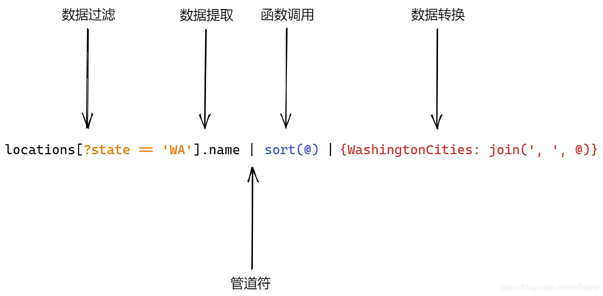
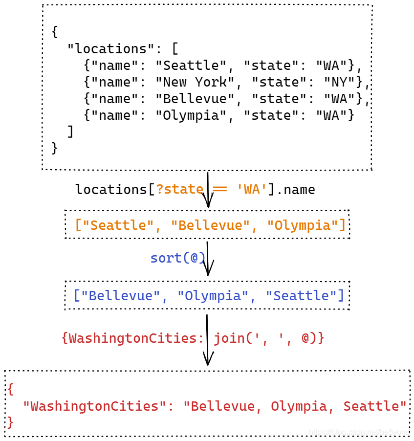
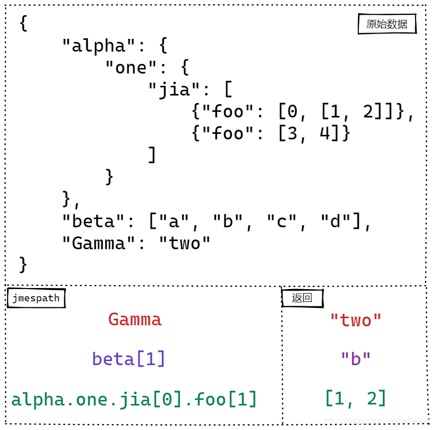
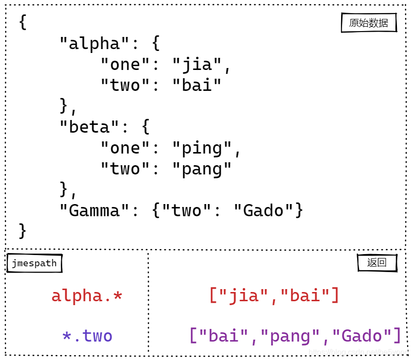

## JMESPath

JMESPath 是查询 JSON 数据的查询语言，可以快速解析复杂的 JSON 数据

通过定义 JMESPath, 可以将数据提取，数据筛选，数据格式转换动作只需一步即可完成，大大加快对于复杂的 JSON 数据的处理速度.



（1）找到 locations 字段下的数据，过滤 `state == 'WA'` 的数据，提取 name 字段

（2）将结果数据传递给 sort 函数进行排序

（3）将排序后的数据，传递给 join 函数，转换格式，填到新的字典中，返回新的数据

各步骤数据转化如下图



等价的 python 代码实现

```python
data = {
   "locations": [
      { "name": "Seattle", "state": "WA" },
      { "name": "New York", "state": "NY" },
      { "name": "Bellevue", "state": "WA" },
      { "name": "Olympia", "state": "WA" },
   ]
}
names = [loc['name'] for loc in data['locations'] if loc['state'] == 'WA']
cities = ', '.join(sorted(names))
output = { 'WashingtonCities': cities }
```

## 数据提取

### 基本表达式

JMESPath 使用 `.` 来获取 JSON 数据中下一层级别的数据，使用 `[index]` 坐标来获取数组中对应位置的数据



search 方法

```python
search(jmespath: str, data: JSON) -> value: Union[str, list, dict]
```

对应代码

```python
from jmespath import search


data = {
   "alpha": {
      "one": {
         "jia": [
            { "foo": [0, [1, 2]] },
            { "foo": [3, 4] },
         ]
      }
   },
   "beta": ["a", "b", "c", "d"],
   "Gamma": "two",
}

search('Gamma', data)
search('beta[1]', data)
search('alpha.one.jia[0].foo[1]', data)

```

### 切片

对于数组类型的数据，支持类似 python 一样格式的切片方式 `[start:end:step]`

| JMESPath   | 返回                             |
| ---------- | -------------------------------- |
| 原始数据   | `[0, 1, 2, 3, 4, 5, 6, 7, 8, 9]` |
| `[*] `     | `[0, 1, 2, 3, 4, 5, 6, 7, 8, 9]` |
| `[]`       | `[0, 1, 2, 3, 4, 5, 6, 7, 8, 9]` |
| `[::]`     | `[0, 1, 2, 3, 4, 5, 6, 7, 8, 9]` |
| `[5:10]`   | `[5, 6, 7, 8, 9]`                |
| `[::-1]`   | `[9, 8, 7, 6, 5, 4, 3, 2, 1, 0]` |
| `[8:1:-2]` | `[8, 6, 4, 2]`                   |

### 通配符

支持将 `*` 作为通配符匹配所有元素



### 管道符 `|`

管道符作用和 shell 命令中的作用一样：将前一个表达式返回的结果作为后一个表达式的输入进行计算

### 多字段提取 `[]{}`

通过 `.` 和 `[index]` 从 JSON 数据中抽取需要的元素.

通过使用 多选列表`[]` 和多选 hash `{}`，可以创建原始 JSON 数据不存在的元素

假设有数据

```python
from jmespath import search


data = {
   "people": [
      {"name": "a", "state": {"name": "up"} },
      {"name": "b", "state": {"name": "down"} },
      {"name": "c", "state": {"name": "up"} },
   ]
}

```

多选列表：创建一个包含两个元素的列表，第一个元素是 name 表达式的结果，第二个元素是 `state.name` 的结果

```python
search('people[].[name, state.name]', data)
# [['a', 'up'], ['b', 'down'], ['c', 'up']]
```

多选字典：创建一个包含两个元素的字典，第一个元素 key 是 'new_name',  value 是 name 表达式的结果，第二个元素 key 是 'state_name',  value 是 `state.name` 的结果

```python
search('people[].{new_name: name, state_name: state.name}', data)
# [{'new_name': 'a', 'state_name': 'up'},
#  {'new_name': 'b', 'state_name': 'down'},
#  {'new_name': 'c', 'state_name': 'up'}]
```

## 数据过滤

对于列表数据过滤数据元素的方法：`[?expression]`，表达式中支持运算符

```plain
1.   ==  !=  <  <=  >  >=   比较运算符
2.   ||  &&  ( )  逻辑运算符
3.   ` `  ' '  转义运算符
```

`?(state=='WA' && name=='Olympia') || state=='NY'` 表达式组合了判断和逻辑运算，抓取 `state==WA` 且 name 是 Olympia 的数据，或者 state 是 NY 的数据

筛选的表达式中，没有引号的数据，标识的是目标数据中对应字段的值，所以表达式 `?name == state` 筛选的的是 locations 中 name 和 state 相等的数据。包括之前想要筛选 `state == 'WA'` 的数据，需要用 `' '` 对 WA 进行转义。如果比较运算需要对数字进行操作，需要用到另一个转义符 \`\

` 筛选的 size 大于 40 的数据.

```plain
?size>`40`
```

支持应用内置函数对数据进行筛选

- `?contains(name, 'New')`

## 内置函数

通用函数

- `type`：返回对应数据的数据类型
- `not_null`：返回解析为非 null 的第一个参数
- `length`：返回数据的长度
- `to_array`：将数据类型转换成数组类型
- `to_string`：转换成数组
- `to_number`：转换成数字

断言类函数

- `contains`：判断目标数据是否包含特定字符
- `starts_with` / `ends_with`：

求值类函数

- 对数字求值 abs, ceil, floor
- 列表求值 avg, min, max, sum, sort, reverse, map, join
- 字典求值 min_by, max_by, sort_by, mege, keys, values

## 自定义处理函数

```python
import json
import jmespath
from jmespath import Options
from jmespath.functions import Functions


# 定义自定义函数
class CustomFunctions(Functions):
   @jmespath.functions.signature({'types': ['number']})
   def _func_decimal_to_hex(self, value):
      """十进制转16进制, 返回固定4位长度"""
      return '0x'+hex(value)[2:].upper().zfill(4)

   @jmespath.functions.signature({'types': ['string']})
   def _func_json_loads(self, value):
      """json字符串转对象"""
      item = json.loads(value)
      return item

# 实例化 option 对象
custom_options = Options(custom_functions=CustomFunctions())

# jmespath中使用自定义的custom_options 处理数据
pattern = 'nested_json_str'
jmespath.search(pattern, data, options=custom_options)

pattern = 'nested_json_str | json_loads(@).key2.code'
jmespath.search(pattern, data, options=custom_options)

pattern = 'nested_json_str | json_loads(@).key2.code | decimal_to_hex(@)'
jmespath.search(pattern, data, options=custom_options)

```

