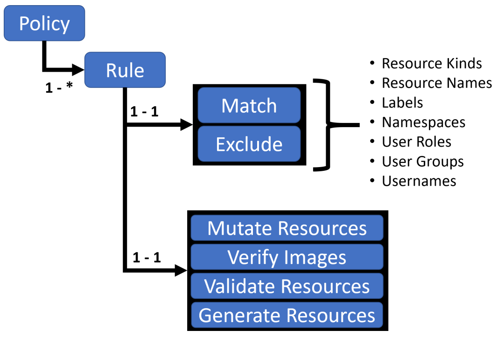

## Kyverno 简介

## 策略与规则

使用 Kyverno 其实就是对策略和规则的应用，Kyverno 策略是规则的集合，每个规则都包含一个 `match` 声明、一个可选的 `exclude` 声明以及 `validate`、`mutate`、`generate` 或 `verifyImages` 声明之一组成，每个规则只能包含一个 `validate`、`mutate`、`generate` 或 `verifyImages` 子声明



Kyverno 策略

策略可以定义为集群范围的资源（`ClusterPolicy`）或命名空间级别资源（`Policy`）。

- Policy 将仅适用于定义它们的 namespace 内的资源
- ClusterPolicy 应用于匹配跨所有 namespace 的资源

通过策略即代码（Policy-as-Code）方式，实现安全、合规、自动化和治理能力。

核心能力包括：

- 验证（Validate）：检查资源是否符合策略要求
- 变更（Mutate）：自动修改资源配置
- 生成（Generate）：根据策略创建新资源
- 清理（Cleanup）：自动删除过期资源

## 策略定义

### 验证资源

验证规则基本上是使用最常见和最实用的规则类型，当用户或进程创建新资源时，Kyverno  将根据验证规则检查该资源的属性，如果验证通过，则允许创建资源。如果验证失败，则创建被阻止。比如现在添加一个策略，要求所有的 pod  都包含一个 kyverno 的标签：

```yaml
apiVersion: kyverno.io/v1
kind: ClusterPolicy
metadata:
  name: require-label
spec:
  validationFailureAction: enforce
  rules:
    - name: check-for-labels
      match:
        resources:
          kinds:
            - Pod
      validate:
        message: "label 'kyverno' is required"
        pattern:
          metadata:
            labels:
              kyverno: "?*"

```

上面策略文件中添加了一个 `validationFailureAction=[audit, enforce]` 属性：

- 当处于 `audit` 模式下 ，每当创建违反规则集的一个或多个规则的资源时，会允许 admission review 请求，并将结果添加到报告中。
- 当处于 `enforce` 模式下 ，资源在创建时立即被阻止，报告中不会有。

然后就是使用 `rules` 属性定义的规则集合，`match` 用于表示匹配的资源资源，`validate` 表示验证方式，这里定义 `kyverno: "?*"` 这样的标签表示必须有这样的一个标签 key

### 变更规则

变更规则可以用于修改匹配到规则的资源（比如规则设置了 metadata 字段可以和资源的 metadata 进行合并），就是根据设置的规则来修改对应的资源。

比如现在添加如下所示一个策略，给所有包含 nginx 镜像 的 pod 都加上一个标签（kyverno=nginx）：

```yaml
apiVersion: kyverno.io/v1
kind: ClusterPolicy
metadata:
  name: nginx-label
spec:
  rules:
    - name: nginx-label
      match:
        resources:
          kinds:
            - Pod
      mutate:
        patchStrategicMerge:
          metadata:
            labels:
              kyverno: nginx
          spec:
            (containers):
              - (image): "*nginx*" # 容器镜像包含 nginx 即可

```

### 生成资源

生成规则可用于在创建新资源或更新源时创建其他资源，例如为命名空间创建新 RoleBindings 或 Secret 等。

比如现在一个需求是将某个 Secret 同步到其他命名空间中去（比如 TLS 密钥、镜像仓库认证信息），手动复制这些 Secret 比较麻烦，则可以使用 Kyverno 来创建一个策略帮助同步这些 Secret。比如在 default 命名空间中有一个名为 regcred 的 Secret 对象，需要复制到另外的命名空间，如果源 Secret 发生更改，它还将向复制的 Secret 同步更新。

```yaml
apiVersion: kyverno.io/v1
kind: ClusterPolicy
metadata:
  name: sync-secrets
spec:
  rules:
    - name: sync-image-pull-secret
      match:
        resources:
          kinds:
            - Namespace
      generate: # 生成的资源对象
        kind: Secret
        name: regcred
        namespace: "{{request.object.metadata.name}}" # 获取目标命名空间
        synchronize: true
        clone:
          namespace: default
          name: regcred

```

## 示例

- 关闭默认的 LB 自动分配 NodePort

```yaml
apiVersion: kyverno.io/v1
kind: ClusterPolicy
metadata:
  name: disable-lb-node-port
spec:
  mutateExistingOnPolicyUpdate: false
  rules:
    - match:
        resources:
          kinds:
            - Service
      preconditions:
        all:
          - key: "{{ request.object.spec.type }}"
            operator: Equals
            value: LoadBalancer
      mutate:
        patchStrategicMerge:
          spec:
            allocateLoadBalancerNodePorts: false
      name: mutate-loadbalancer-service
  validationFailureAction: Enforce

```

- 关闭 Pod ServiceLinks

```yaml
apiVersion: kyverno.io/v1
kind: ClusterPolicy
metadata:
  name: disable-service-links
spec:
  rules:
  - name: enableServiceLinks_false_globally
    match:
      resources:
        kinds:
        - Pod
    mutate:
      patchStrategicMerge:
        spec:
          enableServiceLinks: false

```


## 参考资料

- <https://www.qikqiak.com/k3s/security/kyverno/>
- <https://cloud.tencent.com/developer/article/2410697>
- <https://kyverno.io/docs/installation/>
- <https://moelove.info/2022/03/02/%E4%BA%91%E5%8E%9F%E7%94%9F%E7%AD%96%E7%95%A5%E5%BC%95%E6%93%8E-Kyverno-%E4%B8%8A/#kubernetes-%E7%9A%84%E7%AD%96%E7%95%A5>
