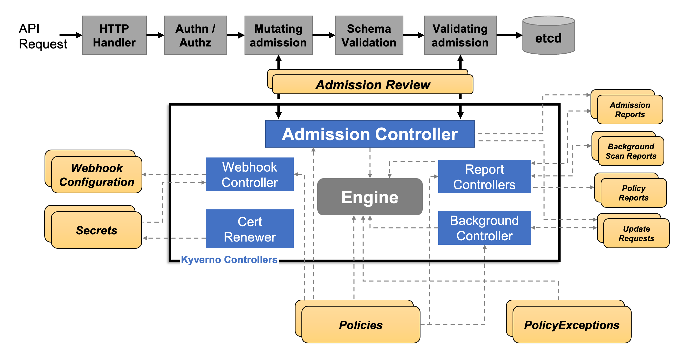

## Kyverno 简介

策略执行是通过 Kubernetes events 来捕获的，Kyverno 还报告现有资源的策略违规行为。下图为 Kyverno 的整体架构：



Kyverno 在 Kubernetes 集群中也是作为动态准入控制器运行的。Kyverno 从 kube-apiserver  接收验证和修改准入 webhook HTTP 回调，并应用匹配策略返回执行准入策略或拒绝请求的结果。Kyverno 策略可以使用资源  Kind、name 和标签选择器匹配资源，而且名称中支持通配符。

## 策略与规则

使用 Kyverno 其实就是对策略和规则的应用，Kyverno 策略是规则的集合，每个规则都包含一个 `match` 声明、一个可选的 `exclude` 声明以及 `validate`、`mutate`、`generate` 或 `verifyImages` 声明之一组成，每个规则只能包含一个 `validate`、`mutate`、`generate` 或 `verifyImages` 子声明


Kyverno 策略

策略可以定义为集群范围的资源（`ClusterPolicy`）或命名空间级别资源（`Policy`）。

- Policy 将仅适用于定义它们的 namespace 内的资源
- ClusterPolicy 应用于匹配跨所有 namespace 的资源

通过策略即代码（Policy-as-Code）方式，实现安全、合规、自动化和治理能力。

核心能力包括：

- 验证（Validate）：检查资源是否符合策略要求
- 变更（Mutate）：自动修改资源配置
- 生成（Generate）：根据策略创建新资源
- 清理（Cleanup）：自动删除过期资源

## 策略定义

### 验证规则

验证规则基本上是使用最常见和最实用的规则类型，当用户或进程创建新资源时，Kyverno  将根据验证规则检查该资源的属性，如果验证通过，则允许创建资源。如果验证失败，则创建被阻止。比如现在添加一个策略，要求所有的 pod  都包含一个 kyverno 的标签：

```yaml
apiVersion: kyverno.io/v1
kind: ClusterPolicy
metadata:
  name: require-label
spec:
  validationFailureAction: enforce
  rules:
    - name: check-for-labels
      match:
        resources:
          kinds:
            - Pod
      validate:
        message: "label 'kyverno' is required"
        pattern:
          metadata:
            labels:
              kyverno: "?*"

```

上面策略文件中添加了一个 `validationFailureAction=[audit, enforce]` 属性：

- 当处于 `audit` 模式下 ，每当创建违反规则集的一个或多个规则的资源时，会允许 admission review 请求，并将结果添加到报告中。
- 当处于 `enforce` 模式下 ，资源在创建时立即被阻止，报告中不会有。

然后就是使用 `rules` 属性定义的规则集合，`match` 用于表示匹配的资源资源，`validate` 表示验证方式，这里定义 `kyverno: "?*"` 这样的标签表示必须有这样的一个标签 key

### 变更规则

变更规则可以用于修改匹配到规则的资源（比如规则设置了 metadata 字段可以和资源的 metadata 进行合并），就是根据设置的规则来修改对应的资源。

比如现在添加如下所示一个策略，给所有包含 nginx 镜像 的 pod 都加上一个标签（kyverno=nginx）：

```yaml
apiVersion: kyverno.io/v1
kind: ClusterPolicy
metadata:
  name: nginx-label
spec:
  rules:
    - name: nginx-label
      match:
        resources:
          kinds:
            - Pod
      mutate:
        patchStrategicMerge:
          metadata:
            labels:
              kyverno: nginx
          spec:
            (containers):
              - (image): "*nginx*" # 容器镜像包含 nginx 即可

```

### 生成资源

生成规则可用于在创建新资源或更新源时创建其他资源，例如为命名空间创建新 RoleBindings 或 Secret 等。

比如现在一个需求是将某个 Secret 同步到其他命名空间中去（比如 TLS 密钥、镜像仓库认证信息），手动复制这些 Secret 比较麻烦，则可以使用 Kyverno 来创建一个策略帮助同步这些 Secret。比如在 default 命名空间中有一个名为 regcred 的 Secret 对象，需要复制到另外的命名空间，如果源 Secret 发生更改，它还将向复制的 Secret 同步更新。

```yaml
apiVersion: kyverno.io/v1
kind: ClusterPolicy
metadata:
  name: sync-secrets
spec:
  rules:
    - name: sync-image-pull-secret
      match:
        resources:
          kinds:
            - Namespace
      generate: # 生成的资源对象
        kind: Secret
        name: regcred
        namespace: "{{ request.object.metadata.name }}" # 获取目标命名空间
        synchronize: true
        clone:
          namespace: default
          name: regcred

```

又比如默认情况下，Kubernetes 允许集群内所有 Pod 之间进行通信。必须使用 `NetworkPolicy` 资源和支持 `NetworkPolicy` 的 CNI 插件来限制通信。可以为每个命名空间配置默认 `NetworkPolicy`，以默认拒绝命名空间中 Pod 的所有入口和出口流量。然后再配置额外的 `NetworkPolicy` 资源，以允许从选定来源到应用程序 Pod 的所需流量。这个时候也可以创建一个 Kyverno 策略来帮助自动创建这个默认的 NetworkPolicy

```yaml
# kyverno-add-networkpolicy.yaml
apiVersion: kyverno.io/v1
kind: ClusterPolicy
metadata:
  name: add-networkpolicy
spec:
  rules:
    - name: default-deny
      match:
        any:
          - resources:
              kinds:
                - Namespace
      generate:
        apiVersion: networking.k8s.io/v1
        kind: NetworkPolicy
        name: default-deny
        namespace: "{{ request.object.metadata.name }}"
        synchronize: true
        data:
          spec:
            # select all pods in the namespace
            podSelector: {}
            # deny all traffic
            policyTypes:
              - Ingress
              - Egress

```

上面的这个策略文件中定义了一个 `default-deny` 的 NetworkPolicy，这个 NetworkPolicy 将在创建新命名空间时拒绝所有流量。

### 清理资源

Kyverno 能够以两种不同的方式清理（即删除）集群中的现有资源。第一种方法是通过 `CleanupPolicy` 或 `ClusterCleanupPolicy` 中的声明性策略定义。第二种方法是通过添加到资源的保留生存时间 (TTL) 标签。

与验证、变异、生成或验证资源中的镜像的其他策略类似，Kyverno 可以通过定义称为 `CleanupPolicy` 的新策略类型来清理资源。清理策略有集群范围和命名空间两种类型。清理策略使用熟悉的 `match/exclude` 属性来选择和排除要进行清理过程的资源。 `Conditions{}` 属性（可选）使用类似于前提条件和拒绝规则中的通用表达式来查询所选资源的内容，以优化选择过程。上下文变量（可选）可用于从其他资源获取数据以纳入清理过程。最后，`schedule` 字段以 `cron` 格式定义规则应运行的时间。

比如如果每 5 分钟的定时任务中发现副本数量少于两个，则此清理策略将删除具有标签 `canremove:true`的 Deployment。

```yaml
apiVersion: kyverno.io/v2beta1
kind: ClusterCleanupPolicy
metadata:
  name: cleandeploy
spec:
  match:
    any:
      - resources:
          kinds:
            - Deployment
          selector:
            matchLabels:
              canremove: "true"
  conditions:
    any:
      - key: "{{ target.spec.replicas }}"
        operator: LessThan
        value: 2
  schedule: "*/5 * * * *"

```

由于 Kyverno 遵循最小权限原则，因此根据希望删除的资源，可能需要向清理控制器授予额外的权限。 Kyverno  将在安装新的清理策略时通过验证这些权限来协助通知您是否需要额外的权限。比如下面的 ClusterRole 表示允许 Kyverno 清理 Pod 的权限声明：

```yaml
apiVersion: rbac.authorization.k8s.io/v1
kind: ClusterRole
metadata:
  labels:
    app.kubernetes.io/component: cleanup-controller
    app.kubernetes.io/instance: kyverno
    app.kubernetes.io/part-of: kyverno
  name: kyverno:cleanup-pods
rules:
  - apiGroups:
      - ""
    resources:
      - pods
    verbs:
      - get
      - watch
      - list
      - delete

```

除了可以声明性定义要删除哪些资源以及何时删除它们的策略之外，还有一种清理方式就是使用一个名为 `cleanup.kyverno.io/ttl` 的标签来明确标记需要删除的资源，该标签可以分配给任何资源，只要 Kyverno 具有删除该资源所需的权限，它将在指定时间删除。例如，创建下面的 Pod 将导致 Kyverno 在两分钟后清理它，并且不存在清理策略。

```yaml
apiVersion: v1
kind: Pod
metadata:
  labels:
    cleanup.kyverno.io/ttl: 2m
  name: foo
spec:
  containers:
    - args:
        - sleep
        - 1d
      image: busybox:1.35
      name: foo

```

## 策略变量

变量通过启用对策略定义中的数据、准入审核请求以及 ConfigMap、Kubernetes API Server、OCI 镜像仓库甚至外部服务调用等外部数据源的引用，使策略变得更加智能和可重用。

变量存储为 JSON，Kyverno 支持使用 `JMESPath` 来选择和转换 JSON 数据。使用 `JMESPath`，来自数据源的值以 `{{key1.key2.key3}}` 的格式引用。例如，要在 `kubectl apply` 操作期间引用新/传入资源的名称，可以将其编写为变量引用：`{{request.object.metadata.name}}`。在处理规则之前，策略引擎将用变量值替换任何格式为 `{{ <JMESPath> }}` 的值。变量可用于 Kyverno 规则或策略中的大多数位置，但匹配或排除语句中除外。

### 预定义变量

Kyverno 会自动创建一些有用的变量并使其在规则中可用：

- `serviceAccountName：userName`：例如当处理来自 `system:serviceaccount:nirmata:user1` 的请求时，Kyverno 会将值 `user1` 存储在变量 `serviceAccountName` 中。
- `serviceAccountNamespace：ServiceAccount` 的 `namespace` 部分。例如，当处理来自 `system:serviceaccount:nirmata:user1` 的请求时，Kyverno 会将 `nirmata` 存储在变量 `serviceAccountNamespace` 中。
- `request.roles`：存储在给定帐户可能拥有的数组中的角色列表。例如，`["foo:dave"]`。
- `request.clusterRoles`：存储在数组中的集群角色列表。例如，`["dave-admin"，"system：basic-user"，"system：discovery"，"system：public-info-viewer"]`。
- `images`：容器镜像信息的映射（如果有）。

### 策略定义中的变量

Kyverno 策略定义可以以`快捷方式`的形式引用策略定义中的其他字段。这是一种分析和比较值的有用方法，而无需显式定义它们。 为了让 Kyverno 在清单中引用这些现有值，它使用符号 `$(./../key_1/key_2)`。这可能看起来很熟悉，因为它本质上与 Linux/Unix 系统引用相对路径的方式相同。

例如下面的策略清单片段：

```yaml
validationFailureAction: Enforce
rules:
  - name: check-tcpSocket
    match:
      any:
        - resources:
            kinds:
              - Pod
    validate:
      message: "Port number for the livenessProbe must be less than that of the readinessProbe."
      pattern:
        spec:
          ^(containers):
            - livenessProbe:
                tcpSocket:
                  port: "$(./../../../readinessProbe/tcpSocket/port)"
              readinessProbe:
                tcpSocket:
                  port: "3000"

```

在上面的示例中，对于 Pod 规范中找到的任何容器字段 `readinessProbe.tcpSocket.port` 必须为 3000，并且字段 `livenessProbe.tcpSocket.port` 必须为相同的值。

### 转义变量

在某些情况下，可能希望编写一个包含变量的规则，供另一个程序或流程执行操作，而不是供 Kyverno 使用。例如，对于 `$()` 表示法中的变量，可以使用前导反斜杠 `(\)` 进行转义，并且 Kyverno 不会尝试替换值。以 `JMESPath` 表示法编写的变量也可以使用相同的语法进行转义，例如 `\{{ request.object.metadata.name }}`。

在下面的策略中，`OTEL_RESOURCE_ATTRIBUTES` 的值包含对其他环境变量的引用，这些变量将按字面引用，例如 `$(POD_NAMESPACE)`。

```yaml
apiVersion: kyverno.io/v1
kind: Policy
metadata:
  name: add-otel-resource-env
  namespace: foobar
spec:
  background: false
  rules:
    - name: imbue-pod-spec
      match:
        any:
          - resources:
              kinds:
                - v1/Pod
      mutate:
        patchStrategicMerge:
          spec:
            containers:
              - (name): "?*"
                env:
                  - name: NODE_NAME
                    value: "mutated_name"
                  - name: POD_IP_ADDRESS
                    valueFrom:
                      fieldRef:
                        fieldPath: status.podIP
                  - name: POD_NAME
                    valueFrom:
                      fieldRef:
                        fieldPath: metadata.name
                  - name: POD_NAMESPACE
                    valueFrom:
                      fieldRef:
                        fieldPath: metadata.namespace
                  - name: POD_SERVICE_ACCOUNT
                    valueFrom:
                      fieldRef:
                        fieldPath: spec.serviceAccountName
                  - name: OTEL_RESOURCE_ATTRIBUTES
                    value: >-
                      k8s.namespace.name=\$(POD_NAMESPACE),
                      k8s.node.name=\$(NODE_NAME),
                      k8s.pod.name=\$(POD_NAME),
                      k8s.pod.primary_ip_address=\$(POD_IP_ADDRESS),
                      k8s.pod.service_account.name=\$(POD_SERVICE_ACCOUNT),
                      rule_applied=$(./../../../../../../../../name)

```

比如现在创建一个如下所示的 Pod：

```yaml
apiVersion: v1
kind: Pod
metadata:
  name: test-env-vars
spec:
  containers:
    - name: test-container
      image: busybox
      command: ["sh", "-c"]
      args:
        - while true; do
          echo -en '\n';
          printenv OTEL_RESOURCE_ATTRIBUTES;
          sleep 10;
          done;
      env:
        - name: NODE_NAME
          value: "node_name"
        - name: POD_NAME
          valueFrom:
            fieldRef:
              fieldPath: metadata.name
        - name: POD_NAMESPACE
          valueFrom:
            fieldRef:
              fieldPath: metadata.namespace
        - name: POD_IP_ADDRESS
          valueFrom:
            fieldRef:
              fieldPath: status.podIP
  restartPolicy: Never

```

该 Pod 相对于 `OTEL_RESOURCE_ATTRIBUTES` 环境变量的结果如下所示：

```yaml
- name: OTEL_RESOURCE_ATTRIBUTES
  value: k8s.namespace.name=$(POD_NAMESPACE), k8s.node.name=$(NODE_NAME), k8s.pod.name=$(POD_NAME),
k8s.pod.primary_ip_address=$(POD_IP_ADDRESS), k8s.pod.service_account.name=$(POD_SERVICE_ACCOUNT),
rule_applied=imbue-pod-spec
```


## 示例

- 关闭默认的 LB 自动分配 NodePort

```yaml
apiVersion: kyverno.io/v1
kind: ClusterPolicy
metadata:
  name: disable-lb-node-port
spec:
  mutateExistingOnPolicyUpdate: false
  rules:
    - match:
        resources:
          kinds:
            - Service
      preconditions:
        all:
          - key: "{{ request.object.spec.type }}"
            operator: Equals
            value: LoadBalancer
      mutate:
        patchStrategicMerge:
          spec:
            allocateLoadBalancerNodePorts: false
      name: mutate-loadbalancer-service
  validationFailureAction: Enforce

```

- 关闭 Pod ServiceLinks

```yaml
apiVersion: kyverno.io/v1
kind: ClusterPolicy
metadata:
  name: disable-service-links
spec:
  rules:
  - name: enableServiceLinks_false_globally
    match:
      resources:
        kinds:
        - Pod
    mutate:
      patchStrategicMerge:
        spec:
          enableServiceLinks: false

```


## 参考资料

- <https://www.qikqiak.com/k3s/security/kyverno/>
- <https://cloud.tencent.com/developer/article/2410697>
- <https://kyverno.io/docs/installation/>
- <https://moelove.info/2022/03/02/%E4%BA%91%E5%8E%9F%E7%94%9F%E7%AD%96%E7%95%A5%E5%BC%95%E6%93%8E-Kyverno-%E4%B8%8A/#kubernetes-%E7%9A%84%E7%AD%96%E7%95%A5>
