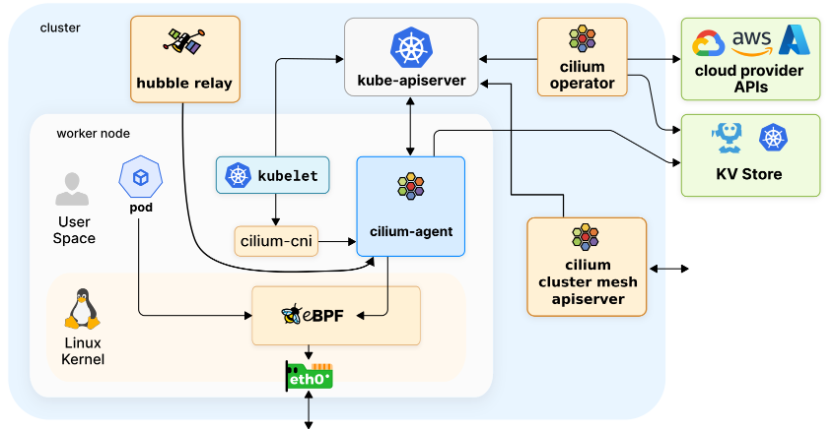

## Cilium 组件

### Cilium Operator

Cilium Operator 可以理解为 Cilium 的管理平面或操作运维平面

Cilium Operator 不处于任何转发或网络策略决策的关键路径上；如果 Operator 暂时不可用，集群一般也能继续运行

### Cilium Agent

Cilium Agent 以 daemonset 的形式运行，因此 Kubernetes 集群的每个节点上都有一个 Cilium agent pod 在运行

该 agent 执行与 Cilium 相关的大部分工作：

- 与 Kubernetes API 服务器交互，同步集群状态
- 与 Linux kernel 交互--加载 eBPF 程序并更新 eBPF map
- 通过文件系统 socket 与 Cilium CNI 插件可执行文件交互，以获得新调度工作负载的通知
- 根据要求的网络策略，按需创建 DNS 和 Envoy Proxy 服务器
- 启用 Hubble 时创建 Hubble gRPC 服务

#### Cilium Client

Cilium Agent 守护进程中的每个 pod 都带有一个 Cilium Client 可执行文件，可用于检查该节点上安装的 Cilium Agent 和 eBPF map 资源的状态。Client 通过守护进程 pod 与 Cilium Agent 的 REST API 通信

Cilium Client 可执行文件包含在每个 Cilium Agent pod 中，必要时可用作诊断工具，帮助排除 Cilium Agent 运行故障

### Cilium CNI Plugin

Cilium Agent 守护进程还会将 Cilium CNI 插件可执行文件安装到 Kubernetes 主机文件系统中，并重新配置节点的 CNI 以使用该插件。CNI 插件可执行文件与 Cilium Agent 分开，作为 Agent 守护程序初始化的一部分进行安装（即 `install-cni-binaries` init container)。需要时，Cilium CNI 插件将使用主机文件系统 socket 与运行中的 Cilium Agent 通信

### Hubble Relay

当 Hubble（哈勃望远镜） 作为 Cilium 管理集群的一部分启用时，每个节点上运行的 Cilium Agent 将重新启动，以启用 Hubble gRPC 服务，提供节点本地可观测性（会损耗一部分性能，但这是值得的）。为了实现集群范围内的可观测性，集群中将添加 hubble relay deploy 以及两个附加服务：Hubble Observer 服务和 the Hubble Peer 服务

Hubble Relay Deploy 通过充当整个集群的 Hubble Observer 服务和每个 Cilium Agent 提供的 Hubble gRPC 服务之间的中介，提供集群范围内的可观测性。Hubble Peer 服务可让 Hubble Relay 在集群中启用新的 Hubble Cilium 代理时进行检测

作为用户，通常会使用 Hubble CLI 工具或 Hubble UI 与 Hubble Observer 服务交互，以便深入了解 Hubble 提供的群集网络流量

### Cluster Mesh API Server

Cluster Mesh API 服务器是一种可选部署，只有在启用 Cilium Cluster Mesh 功能时才会安装。Cilium Cluster Mesh 允许多个群集共享 Kubernetes 服务

Cilium Cluster Mesh 会在每个群集中部署一个 etcd 键值存储，以保存有关 Cilium 身份的信息。它还为每个 etcd 存储提供代理服务。在同一集群网中的任何成员中运行的 Cilium 代理都可以使用该服务在整个集群网中读取有关 Cilium 身份状态的全局信息。这样就可以创建和访问跨越群集网格的全局服务。一旦 Cilium Cluster Mesh API 服务可用，在作为 Cluster Mesh 成员的任何 Kubernetes 集群中运行的 Cilium 代理就能安全地从每个集群的 etcd 代理中读取信息，从而了解整个集群的 Cilium 身份状态。这样就有可能创建跨越集群网状结构的全局服务