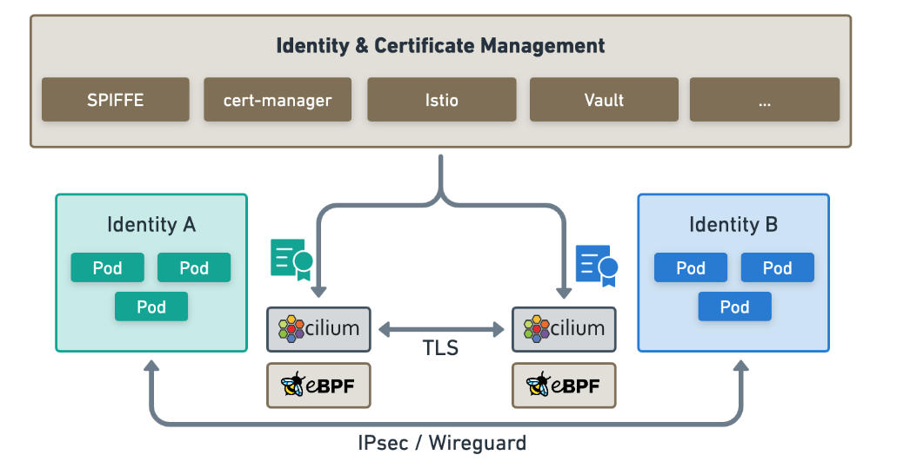

## Cilium Endpoints

简单理解就是一个 Pod, 以及 pod 被分配的 ip. 简单理解为基本等价于 Kubernetes 的 endpoints, 但是包含的信息更多

示例

```bash
> kubectl get ciliumendpoints.cilium.io -A

NAMESPACE            NAME                                      ENDPOINT ID   IDENTITY ID   INGRESS ENFORCEMENT   EGRESS ENFORCEMENT   VISIBILITY POLICY   ENDPOINT STATE   IPV4         IPV6
default              nettool-1                                 1426          41222         <status disabled>     <status disabled>    <status disabled>   ready            10.1.2.112
default              nettool-2                                 4073          42100         <status disabled>     <status disabled>    <status disabled>   ready            10.1.1.178
kube-system          coredns-5d78c9869d-62zlb                  1648          27084         <status disabled>     <status disabled>    <status disabled>   ready            10.1.2.194
kube-system          coredns-5d78c9869d-tmvt4                  474           27084         <status disabled>     <status disabled>    <status disabled>   ready            10.1.2.178
local-path-storage   local-path-provisioner-6bc4bddd6b-x7gpb   2895          6323          <status disabled>     <status disabled>    <status disabled>   ready            10.1.2.169
```

两个 coredns pod 的 endpoint id 不同，但是身份是同一个，都是 `27084`

## Cilium Identity（身份）

官方文档：<https://docs.cilium.io/en/v1.14/internals/security-identities/#security-identities>



使 Cilium 能够高效工作的一个关键概念是 Cilium 的 身份概念。所有 Cilium Endpoints 都有一个基于标签的标识

Cilium 身份由标签决定，在整个集群中是唯一的。端点会被分配与端点安全相关标签相匹配的身份，也就是说，共享同一组安全相关标签的所有端点将共享相同的身份。与每个身份相关的唯一数字标识符会被 eBPF 程序用于网络数据路径中的快速查找，这也是 Hubble 能够提供 Kubernetes 感知网络可观察性的基础

当网络数据包进入或离开节点时，Cilium 的 eBPF 程序会将源地址和目标 IP 地址映射到相应的数字身份标识符，然后根据引用这些数字身份标识符的策略配置来决定应采取哪些数据路径行动。每个 Cilium Agent 负责通过观察相关 Kubernetes 资源的更新，用与节点上本地运行的端点相关的数字标识符更新与身份相关的 eBPF 映射

```bash
> kubectl get ciliumidentities.cilium.io -A

NAME    NAMESPACE            AGE
16737   kube-system          58m
27084   kube-system          60m
40316   kube-system          58m
41222   default              58m
42100   default              58m
6323    local-path-storage   60m
```

