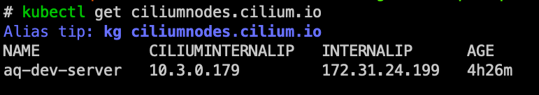
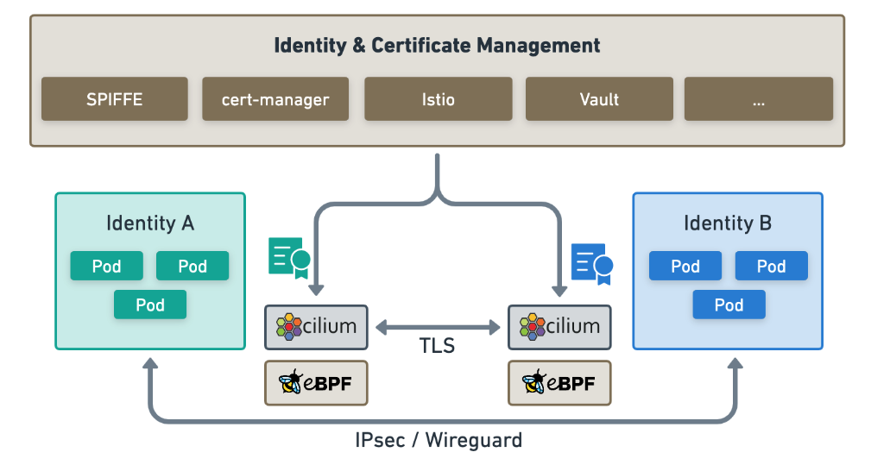

## Cilium Endpoints

简单理解就是一个 Pod, 以及 pod 被分配的 ip. 简单理解为基本等价于 Kubernetes 的 endpoints, 但是包含的信息更多

Endpoint = Pod 在 Cilium 的抽象实体

- 一个 Pod（可能包含多个 Container）会对应到一个 Endpoint
- Endpoint 会被分配到 IP
- Endpoint 有独立的 Endpoint ID 与 Metadata ，Cilium 就靠这些来做流量控制

## CiliumNode

每个 Node 都会有一个 `CiliumNode`

cilium-agent 是 DaemonSet ，所以每个 Node 身上都会有 cilium-agent，cilium-agent 会为他所处的 Node 建立 `CiliumNode`

可以通过以下指令找到 `CiliumNode` :

## Cilium 标签

Cilium 取得 Label 的来源包括：

- `k8s` → Kubernetes `metadata.labels`
- `container` → 容器运行时标签（例如 Docker run + `l app=foo` ）
- `reserved` → Cilium 保留的特殊标签(world, host, kube-apiserver…)
- `unspec` → 其他不明确来源

Cilium Label 其实是「抽象化的超集合(superset)」，能包进去多种来源，而不是单纯的 k8s Label

## Cilium Identity（身份）

官方文档：<https://docs.cilium.io/en/v1.14/internals/security-identities/#security-identities>

每个 Endpoint 都会被分配一个 Identity (是数字)

使 Cilium 能够高效工作的一个关键概念是 Cilium 的 身份概念。所有 Cilium Endpoints 都有一个基于标签的标识

Cilium 身份由标签决定，在整个集群中是唯一的。端点会被分配与端点安全相关标签相匹配的身份，也就是说，共享同一组安全相关标签的所有端点将共享相同的身份。与每个身份相关的唯一数字标识符会被 eBPF 程序用于网络数据路径中的快速查找，这也是 Hubble 能够提供 Kubernetes 感知网络可观察性的基础

当网络数据包进入或离开节点时，Cilium 的 eBPF 程序会将源地址和目标 IP 地址映射到相应的数字身份标识符，然后根据引用这些数字身份标识符的策略配置来决定应采取哪些数据路径行动。每个 Cilium Agent 负责通过观察相关 Kubernetes 资源的更新，用与节点上本地运行的端点相关的数字标识符更新与身份相关的 eBPF 映射

## CiliumNetworkPolicy

Cilium 实现的 Policy 本质上就是用 Label+Identity 选择哪些 Endpoint 可以通

CNP 比 K8s 原生 NetworkPolicy 更强是强在哪里呢？

- K8s 原生的 NetworkPolicy
  - 只能做到 L3/L4 （IP + Port），不支持 L7
  - 无法指定 DNS-based rule （例如允许 `api.alpha-quant.tech`）
- 所以 Cilium 才自己定了 CRD，来弥补原生的 NetworkPolicy 不足之处
