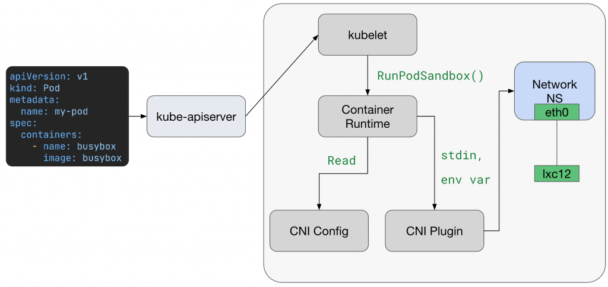
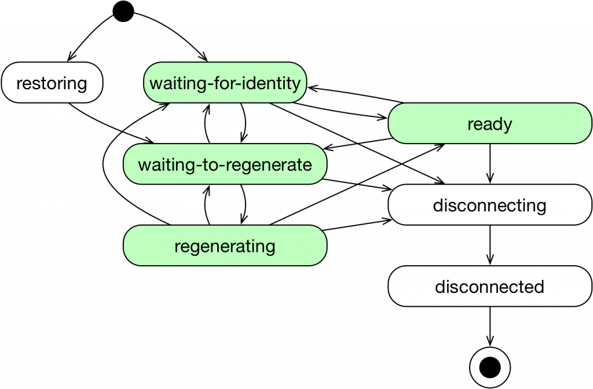

## 概述

kubelet → Container runtime → cilium-cni → veth/netns → 委派给 cilium-agent

## Kubernetes 前置工作

Kubernetes 的前置工作

使用者发送一个创建 Pod 的指令后，K8s Control Plane 会执行一系列标准的生命周期事件。 API Server 会验证并将 Pod  的定义持久化到 etcd 中，接着，Scheduler 会根据资源需求和 Affinity 规则为这个 Pod 挑选一个最合适的 Worker  Node，一旦 Node 被选定，Scheduler 会更新 etcd 中的 Pod 物件，将其绑定到该 Node。

Node 上的 kubelet，会持续监控 API Server。当 kubelet 侦测到一个新的 Pod 被指派给自己时，便会触发本地的容器创建流程：

- kubelet 会与节点上的 Container Runtime (例如 containerd) 进行通讯(透过 CRI 呼叫 runtime 的 `RunPodSandbox` API)，指示其下载 Image 并创建 Container。
- 在 Sandbox container 准备就绪，但应用程式启动之前， Container runtime 会呼叫 CNI Plugin 来为这个新的 Pod 设定网络。 这正是 Cilium 工作流程的起点 。

到这里，才轮到 CNI Plugin 出场，对 Cilium 而言，就是 `/opt/cni/bin/cilium-cni` 这个 Binary。（<https://www.cni.dev/>）



而 Container runtime 会通过环境变量和 stdin json 来传递配置

环境变量

- `CNI_COMMAND=ADD`
- `CNI_CONTAINERID=<container/sandbox id>`
- `CNI_NETNS=/proc/<pid>/ns/net` （指向 sandbox 的 netns 路径）
- `CNI_IFNAME=eth0` （Pod 内看到的介面名）
- `CNI_PATH=/opt/cni/bin` （plugins 搜寻路径）
- `CNI_ARGS=K8S_POD_NAMESPACE=...,K8S_POD_NAME=...,K8S_POD_INFRA_CONTAINER_ID=...` (K8s 相关上下文)

stdin JSON (这会由 `/etc/cni/net.d/*.conf` 或 `.conflist` 提供)

```json
# cat /etc/cni/net.d/05-cilium.conflist

{
  "cniVersion": "0.3.1",
  "name": "cilium",
  "plugins": [
    {
       "type": "cilium-cni",
       "enable-debug": false,
       "log-file": "/var/run/cilium/cilium-cni.log"
    }
  ]
}
```

runtime 会把这段 JSON 丢到 cilium-cni 的 stdin， 这是 CNI 唯一可信的设定来源 。 CNI 的 stdout 则必须回传 JSON 结果(成功与否、IP、routes 等)

## Cilium CNI 内部流程

cilium-cni 的原始码可以在 Cilium Repo 的 `/cilium/plugins/cilium-cni` 目录下找到

其中 `ADD` Function 的完整原始码在这：<https://github.com/cilium/cilium/blob/v1.18.4/plugins/cilium-cni/cmd/cmd.go#L505-L831>

解析 NetConf 与 CNI Args

```go
n, err := types.LoadNetConf(args.StdinData) // 从 stdin Load NetConf (包含 ipamMode, chainingMode 等)
if err != nil {
	return fmt.Errorf("unable to parse CNI configuration %q: %w", string(args.StdinData), err)
}

cniArgs := &types.ArgsSpec{}
if err = cniTypes.LoadArgs(args.Args, cniArgs); err != nil { // 解析 K8S_POD_NAMESPACE / K8S_POD_NAME 等參數
	return fmt.Errorf("unable to extract CNI arguments: %w", err)
}
```

这里完成两件事：

1. 把 Kubelet 传入的 JSON 配置( `stdinData` ) 解析成 NetConf。
2. 解析 `CNI_ARGS` ，例如 Pod namespace、Pod name

```go
c, err := client.NewDefaultClientWithTimeout(defaults.ClientConnectTimeout)
if err != nil {
	return fmt.Errorf("unable to connect to Cilium agent: %w", client.Hint(err))
}

conf, err := getConfigFromCiliumAgent(c)
if err != nil {
	return err
}
```

cilium-cni 会通过 Unix socket 连线到本机的 cilium-agent，取得 cluster 配置（例如 datapath mode, device MTU 等）

处理 Chaining 模式

```go
// If CNI ADD gives us a PrevResult, we're a chained plugin and *must* detect a
// valid chained mode. If no chained mode we understand is specified, error out.
// Otherwise, continue with normal plugin execution.
if len(n.NetConf.RawPrevResult) != 0 {
	if chainAction, err := getChainedAction(n, scopedLogger); chainAction != nil {
		// ...
		res, err = chainAction.Add(context.TODO(), ctx, c)
		if err != nil {
			scopedLogger.Warn("Chained ADD failed", logfields.Error, err)
			return err
		}
		scopedLogger.Debug("Returning result", logfields.Result, res)
		return cniTypes.PrintResult(res, n.CNIVersion)
	// ....
}

```

如果有 `PrevResult` ，代表这是 chained CNI ，Cilium 会尝试接手 chaining 流程

分配 Pod IP

```go
if conf.IpamMode == ipamOption.IPAMDelegatedPlugin {
	ipam, releaseIPsFunc, err = allocateIPsWithDelegatedPlugin(context.TODO(), conf, n, args.StdinData)
} else {
	ipam, releaseIPsFunc, err = allocateIPsWithCiliumAgent(scopedLogger, c, cniArgs, epConf.IPAMPool())
}
```

这里决定 IPAM 方式：

- 如果是 delegated plugin（例如 host-local），就交给外部 IPAM。
- 否则直接通过 `cilium-agent` 分配 Pod IP。

文档见：<https://docs.cilium.io/en/stable/network/concepts/ipam/index.html>

建立 Host ↔ Pod 的连接

```go
switch conf.DatapathMode {
case datapathOption.DatapathModeVeth:
	l2Mode = true
	hostLink, epLink, tmpIfName, err = connector.SetupVeth(scopedLogger, cniID, linkConfig, sysctl)
case datapathOption.DatapathModeNetkit, datapathOption.DatapathModeNetkitL2:
	l2Mode = conf.DatapathMode == datapathOption.DatapathModeNetkitL2
	hostLink, epLink, tmpIfName, err = connector.SetupNetkit(scopedLogger, cniID, linkConfig, l2Mode, sysctl)
}
```

这里会建立 veth pair：

- Host 端保留一个 interface
- Container 端移到 Pod Network Namespace，并 rename 成 `eth0`

把分配好的 IP attach 到 Pod (eth0) 并设置 routes

```go
f ipv6IsEnabled(ipam) && conf.Addressing.IPV6 != nil {
	// ...
}

if ipv4IsEnabled(ipam) && conf.Addressing.IPV4 != nil {
	ep.Addressing.IPV4 = ipam.Address.IPV4
	ep.Addressing.IPV4PoolName = ipam.Address.IPV4PoolName
	ep.Addressing.IPV4ExpirationUUID = ipam.IPV4.ExpirationUUID

	ipConfig, routes, err = prepareIP(ep.Addressing.IPV4, state, int(conf.RouteMTU))
	if err != nil {
		return fmt.Errorf("unable to prepare IP addressing for %s: %w", ep.Addressing.IPV4, err)
	}
	// set the addresses interface index to that of the container-side interface
	ipConfig.Interface = cniTypesV1.Int(len(res.Interfaces))
	res.IPs = append(res.IPs, ipConfig)
	res.Routes = append(res.Routes, routes...)
}
```

这里会把分配好的 Pod IP 和对应 Route 加到 Pod Network Namespace 的 interface (通常是 `eth0` )

调用 `EndpointCreate`

```go
// Specify that endpoint must be regenerated synchronously. See GH-4409.
ep.SyncBuildEndpoint = true
var newEp *models.Endpoint
if newEp, err = c.EndpointCreate(ep); err != nil {
	scopedLogger.Warn(
		"Unable to create endpoint",
		logfields.Error, err,
		logfields.ContainerID, ep.ContainerID,
	)
	return fmt.Errorf("unable to create endpoint: %w", err)
}
```

cilium-cni 其实会透过 REST API 向 cilium-agent `PUT /endpoint/{id}` 请求来建立 Endpoint

以下是一个简化后的架构图（实际是 container runtime 呼叫 cilium-cni）


 关键步骤：cilium-cni 将组装好的 Endpoint model 交给 cilium-agent。因为 `SyncBuildEndpoint = true` ，代表 cilium-agent 会在接收到请求后立即执行一次完整的 regeneration 流程（这里是指 identity  解析、policy 计算、BPF 编译与 attach）。换句话说，这个 flag 的作用就是强制 cilium-cni →  cilium-agent 的 EndpointCreate API 采用同步模式：只有在 datapath 完全配置完成后，CNI  才会返回成功给 Container runtime。如果这是一个非同步请求，导致 agent 接到 API 请求后立即回应 `202 Accpeted` 会让 CNI plugin 很快就回 contaienr tuntime「成功」，结果实际上 BPF 程式还没 attach，Pod 就可能会出现「起来了，但没网络」的状况

整个流程最后一步是根据 CNI 规定的标准，以 stdout 回传 Result 给 Container runtime

```go
return cniTypes.PrintResult(res, n.CNIVersion)
```

## Cilium Agent 的工作与 Endpoint

在 Cilium 中， Regeneration 就是将期望的网络状态同步到实际的 BPF Datapath 的过程

而 Regeneration 并非随时发生，而是由特定事件触发，这些事件通常意味着 Endpoint 的期望状态发生了改变 ，触发点包括：

- Endpoint 首次建立 ：当一个新的 Pod 被建立，其对应的 Endpoint 在成功获取 Identity 后，会立即触发第一次 Regeneration，这是将其纳入网络管理的关键一步
- Identity 变更 ：当 Pod 的 Labels 发生变化，可能导致其 Identity 改变。因为 Cilium 的 Policy 是基于 Identity  的，所以 Identity 变更必须触发 Regeneration 来重新计算并应用新的 Network Policy。这个逻辑主要在 `pkg/endpoint/endpoint.go` 的 `runIdentityResolver()` 中处理
- Network Policy 更新 ：建立、删除或修改 CiliumNetworkPolicy 或 CiliumClusterwideNetworkPolicy   时，cilium-agent 会识别所有受影响的 Endpoints，并为它们触发 Regeneration
- Endpoint 设定变更 ：透过 API 或 cilium CLI 修改 Endpoint 的特定设定（例如，启用/停用某个功能）时，也会触发 Regeneration 以使新设定生效


当 Endpoint 被建立并开始被管理后，它会经历一个完整的生命周期， 每个 Cilium Endpoint 都会处于以下其中一种状态 ：

- restoring ：这个 Endpoint 在 Cilium 启动之前就已经存在，Cilium 正在恢复它的网络配置
- waiting-for-identity ：Cilium 正在为这个 Endpoint 分配唯一的 identity
- waiting-to-regenerate ：Endpoint 已经拿到 identity，正在等待它的网络配置被 regenerate
- regenerating ：Endpoint 的网络配置正在被生成，这包含 eBPF 的程式化
- ready ：Endpoint 的网络配置已经成功完成生成，处于可用状态
- disconnecting ：Endpoint 正在被删除
- disconnected ：Endpoint 已经被删除

可以通过 CLI 指令来查询 Endpoint 的状态

```bash
cilium-dbg endpoint list

cilium-dbg endpoint get
```

`cilium-agent` 会把 `PUT /endpoint/{id}` 路由绑定到 `PutEndpointIDHandler` ，再交由 handler 处理

源码位置：<https://github.com/cilium/cilium/blob/v1.18.4/api/v1/server/server.go#L120-L186>

```go
// api/v1/server/server.go

func newAPI(p apiParams) *restapi.CiliumAPIAPI {
    api := restapi.NewCiliumAPIAPI(p.Spec.Document)

    // ...
    // 将 PUT /endpoint/{id} path 绑定到 PutEndpointIDHandler
    api.EndpointPutEndpointIDHandler = p.EndpointPutEndpointIDHandler
    // ...

    return api
}

```

 真正的处理逻辑在 `pkg/endpoint/api/endpoint_api_handler.go` 

源码：<https://github.com/cilium/cilium/blob/v1.18.4/pkg/endpoint/api/endpoint_api_handler.go#L195-L224>

```go
// pkg/endpoint/api/endpoint_api_handler.go

type EndpointPutEndpointIDHandler struct {
	logger             *slog.Logger
	apiLimiterSet      *rate.APILimiterSet
	endpointAPIManager EndpointAPIManager // <--- 核心依赖
	waitReadyFn        hive.WaitFunc
}

// ...

func (h *EndpointPutEndpointIDHandler) Handle(params endpointapi.PutEndpointIDParams) (resp middleware.Responder) {
	// ...

	// 将请求转发给 endpointAPIManager 进行实际处理
	ep, code, err := h.endpointAPIManager.CreateEndpoint(params.HTTPRequest.Context(), epTemplate)
	if err != nil {
		r.Error(err, code)
		return api.Error(code, err)
	}

	ep.Logger(endpointAPIModuleID).Info("Successful endpoint creation")

	return endpointapi.NewPutEndpointIDCreated().WithPayload(ep.GetModel())
}
```

Handler 几乎不做事，重点在统一入口、验证、速率限制 ，然后转交 Manager

endpointAPIManager 建立过程，源码位于：<https://github.com/cilium/cilium/blob/v1.18.4/pkg/endpoint/api/endpoint_api_manager.go#L85-L350>

```go
// pkg/endpoint/api/endpoint_api_manager.go

type endpointAPIManager struct {
	// ...
	endpointManager   endpointmanager.EndpointManager
	endpointCreator   endpointcreator.EndpointCreator
	// ...
}

// createEndpoint attempts to create the endpoint corresponding to the change
// request that was specified.
func (m *endpointAPIManager) CreateEndpoint(ctx context.Context, epTemplate *models.EndpointChangeRequest) (*endpoint.Endpoint, int, error) {
	// ...

	// 通过 EndpointCreator 从请求模型建立一个初步的 Endpoint
	ep, err := m.endpointCreator.NewEndpointFromChangeModel(ctx, epTemplate)
	// ...

	// 检查 ID 和 IP 是否已存在，防止重复创建
	oldEp := m.endpointManager.LookupCiliumID(ep.ID)
	// ...

	oldEp = m.endpointManager.LookupCNIAttachmentID(ep.GetCNIAttachmentID())
	// ...

	// 获取 Kubernetes labels 并合并
	infoLabels := labels.NewLabelsFromModel([]string{})
	// ...

	// 将 Endpoint 加入 EndpointManager 进行管理
	err = m.endpointManager.AddEndpoint(ep)
	// ...

	// 触发 Regeneration
	if epTemplate.SyncBuildEndpoint {
		if err := ep.WaitForFirstRegeneration(ctx); err != nil {
			return m.errorDuringCreation(ep, err)
		}
	}

	// ...
}

```

一开始它不会自己 new 一个 Endpoint，而是把这件事丢给 `EndpointCreator` 。接着马上会做一些 check，像是看这个 ID 或 IP 有没有跟现有的 Endpoint 冲突，如果撞到了就直接中断。

检查都过了之后，它会把这个 Endpoint 交给 `EndpointManager` ，让它进入后续的管理流程。

后还有一个关键细节：因为 CNI 那边在送 request 的时候有带 `SyncBuildEndpoint=true`，所以这里不会马上回成功，而是会去等第一次 Regeneration 跑完，包含 identity 配发、policy 计算、BPF 编译跟载入，至少要把这些基础的 datapath 东西弄好才会放行。

EndpointManager - 生命周期的管理者

最后，来到了 `pkg/endpointmanager/manager.go` 。 `AddEndpoint` 标志着 `Endpoint` 正式被 `cilium-agent` 接管。

源码：<https://github.com/cilium/cilium/blob/v1.18.4/pkg/endpointmanager/manager.go#L734-L767>

```go
// AddEndpoint takes the prepared endpoint object and starts managing it.
func (mgr *endpointManager) AddEndpoint(ep *endpoint.Endpoint) (err error) {
	if ep.ID != 0 {
		return fmt.Errorf("Endpoint ID is already set to %d", ep.ID)
	}

	// ...

	// 将 Endpoint 暴露给系统
	err = mgr.expose(ep)
	if err != nil {
		return err
	}

	// ...

	// 通知所有 subscribers，新的 Endpoint 已经创建
	mgr.mutex.RLock()
	for s := range mgr.subscribers {
		s.EndpointCreated(ep)
	}
	mgr.mutex.RUnlock()

	return nil
}

func (mgr *endpointManager) expose(ep *endpoint.Endpoint) error {
	// 分配唯一的 Endpoint ID
	newID, err := mgr.allocateID(ep.ID)
	if err != nil {
		return err
	}

	// ...

	// 启动 Endpoint 的主 goroutine
	ep.Start(newID)
	// 将 Endpoint 加入到各个索引 map 中，以便快速查找
	mgr.mcastManager.AddAddress(ep.IPv6)
	mgr.updateIDReferenceLocked(ep)
	mgr.updateReferencesLocked(ep, identifiers)
	mgr.mutex.Unlock()

	// ...

	return nil
}
```

`AddEndpoint` 这里是个关键分界点，因为它会调用 `expose()` ，才算是把 Endpoint 正式纳入 `cilium-agent` 的管理。

在 `expose()` 里，首先会通过 `allocateID` 分配一个 Node 范围内唯一的 ID。接着呼叫 `ep.Start(newID)` ，启动一个专门管理这个 Endpoint 状态的 goroutine。然后再把这个 Endpoint 放进各种查询用的 map（例如 `id -> endpoint` 、 `ip -> endpoint` ），让 agent 之后能快速找到它。最后， `EndpointManager` 还会广播一个事件通知其他模组，宣告「一个新的 Endpoint 已经建立」。

换句话说，这一步开始，Endpoint 真正变成 `cilium-agent` 内部可见、可管理的实体。

## Identity

源码：<https://github.com/cilium/cilium/blob/v1.18.4/pkg/endpoint/api/endpoint_api_manager.go#L283-L292>

```go
var regenTriggered bool
if ep.K8sNamespaceAndPodNameIsSet() && m.clientset.IsEnabled() {
	regenTriggered = ep.RunMetadataResolver(false, true, apiLabels, m.endpointMetadata.FetchK8sMetadataForEndpoint)
} else {
	regenTriggered = ep.UpdateLabels(ctx, labels.LabelSourceAny, identityLbls, infoLabels, true)
}
```

总结：

1.  刚创建一个 Endpoint 的时候
   - 这时候它还没被「注册」进 Cilium 的管理名单(endpoint manager)
   - 如果这段期间 Kubernetes 有通知「这个 Pod 的 labels 改了」，Cilium(event handler) 会想更新，但却找不到这个 Endpoint → 只好放弃
2.  Endpoint 终于被注册进名单之后
   - 为了避免这中间还没被注册到 Endpoint Manager 的时间差内有更新 Pod ( 特别是 Pod Labels )，Cilium 会再主动去「问一次」 K8s，把 Pod 最新的 labels 拿回来，更新到 endpoint
     - 所以调用 `RunMetadataResolver(false, true, …) `就是主动去「问一次」K8s
     - 因为这里设 blocking=true ，所以流程会阻塞，直到 Endpoint 确定拿到正确的 labels → 生成 identity → 做完第一次 regeneration，才会继续往下

源码：<https://github.com/cilium/cilium/blob/v1.18.4/pkg/endpoint/endpoint.go#L1873-L1922>

```go
// RunMetadataResolver 会帮 Endpoint 尝试解析 metadata (labels)，
// 拿到 Identity 之后触发第一次 Regeneration。
// blocking = true 的话，调用端会 block 等结果。
func (e *Endpoint) RunMetadataResolver(restoredEndpoint, blocking bool, baseLabels labels.Labels, resolveMetadata MetadataResolverCB) (regenTriggered bool) {
	var regenTriggeredCh chan bool
	callerBlocked := false
	if blocking {
		regenTriggeredCh = make(chan bool)
		callerBlocked = true
	}
	controllerName := resolveLabels + "-" + e.GetK8sNamespaceAndPodName()

	// 启动一个 controller，执行 metadata 解析逻辑
	e.controllers.UpdateController(controllerName,
		controller.ControllerParams{
			RunInterval: 0, // 只运行一次
			Group:       resolveLabelsControllerGroup,
			DoFunc: func(ctx context.Context) error {
				// 调用 metadataResolver → resolve labels → identity → regeneration
				regenTriggered, err := e.metadataResolver(ctx, restoredEndpoint, blocking, baseLabels, resolveMetadata)

				if callerBlocked {
					select {
					case <-e.aliveCtx.Done():
					case regenTriggeredCh <- regenTriggered:
						close(regenTriggeredCh)
						callerBlocked = false
					}
				}

				return err
			},
			Context: e.aliveCtx,
		},
	)

	// 如果 blocking = true，就等 metadataResolver 第一次跑完再回传
	if blocking {
		select {
		case regenTriggered, ok := <-regenTriggeredCh:
			return regenTriggered && ok
		case <-e.aliveCtx.Done():
			return false
		}
	}
	return false
}
```

`RunMetadataResolver` 会替这个 Endpoint 启动一个 controller，去解析 metadata ( 主要是 Pod Labels )，并把它更新回 Endpoint，它会「定期尝试」，但一旦成功解析一次，就会停止 。

为什么成功解析一次就停止？原因如下：

- 回到最初调用 `RunMetadataResolver` 的目的，就是确保刚注册时 endpoint 不会带旧 labels，能正确拿最新的 labels，然后确保跑完第一次 regeneration
- 避免两套机制重叠，后续持续变更交给 `watcher ****`就好

 到这边为止，大概是这样：

```bash
CreateEndpoint -> RunMetadataResolver -> (controller) -> metadataResolver -> UpdateLabels
```

回到 `pkg/endpoint/api/endpoint_api_manager.go` 继续往下，接着会遇到「 同步等待」 ：在触发完 Label 更新和 Regeneration 流程后， `CreateEndpoint` 函式会检查 CNI 传来的 `SyncBuildEndpoint` Flag。因为 cilium-cni 设定了此 Flag 为 `true` ，cilium-agent 会在这里执行一个阻塞操作

源码：<https://github.com/cilium/cilium/blob/v1.18.4/pkg/endpoint/api/endpoint_api_manager.go#L318-L322>

```go
if epTemplate.SyncBuildEndpoint {
	if err := ep.WaitForFirstRegeneration(ctx); err != nil {
		return m.errorDuringCreation(ep, err)
	}
}
```

`ep.WaitForFirstRegeneration()` 函式会彻底阻塞 `CreateEndpoint` 的执行，直到这个新 Endpoint 的 BPF 被成功编译、加载并应用到 datapath（即 `policyRevision > 0` ）。只有在 Identity 分配、BPF Regeneration、datapath 配置全部完成后，这个函数才会返回， `CreateEndpoint` API 调用也才会向 CNI Plugin 返回成功

这个同步设计保证了： 当 kubelet 说 Pod 网络 ready 的时候，对应的 NetworkPolicy 已经在 datapath 层生效 。换句话说，Pod 一出生就马上受到 Policy 保护，不会有「启动初期还没套上规则」的空窗期。

Identity 的分配是在 `pkg/endpoint/endpoint.go` 中完成的。 `UpdateLabels` 方法是这一切的起点：

UpdateLabels 的设计定位：

- 在 Cilium 里， Endpoint 的 identity 完全取决于 labels
- 不管是第一次建立 Endpoint （一开始没有 labels，要设定第一组），还是后续 Pod labels 改变 （旧的换成新的）

→ 本质上都是「 把最新的 labels 状态，同步到 Endpoint 上 」

源码：<https://github.com/cilium/cilium/blob/v1.18.4/pkg/endpoint/endpoint.go#L2050-L2092>

```go
func (e *Endpoint) UpdateLabels(ctx context.Context, sourceFilter string, identityLabels, infoLabels labels.Labels, blocking bool) (regenTriggered bool) {
	// ...

	e.replaceInformationLabels(sourceFilter, infoLabels)
	// 替换 Identity 相关 Label，如果发生变更，rev 将不为 0
	rev := e.replaceIdentityLabels(sourceFilter, identityLabels)

	// ... 处理 reserved:init Label ...
	if len(identityLabels) != 0 // ...

	e.unlock()
	if rev != 0 {
		// Label 已变更，启动 Identity 解析流程
		return e.runIdentityResolver(ctx, blocking, 0)
	}

	return false
}
```

UpdateLabels 的核心职责

- 接收新的 labels
- 跟旧的比对 → 看有没有差异
-  如果 labels 有改变：
  -  重新计算 identity
  - 触发 regeneration （因为 identity 变了，BPF policy 要重编）

所以上面 `UpdateLabels` 的核心在于 `replaceIdentityLabels` ，它会比较新旧 Labels，若有不同，则增加 `identityRevision`

`UpdateLabels` 检测到 `identityRevision` 变化后，便会调用 `runIdentityResolver` ：

- `runIdentityResolver` 会启动一个 controller，其核心任务是执行 `identityLabelsChanged` 函数
- `identityLabelsChanged` 负责实际的 Identity 分配

源码：<https://github.com/cilium/cilium/blob/v1.18.4/pkg/endpoint/endpoint.go#L2184-L2351>

```go
func (e *Endpoint) identityLabelsChanged(ctx context.Context) (regenTriggered bool, err error) {
	// 如果 Label 与当前 Identity 的 Label 相同，则无需分配
	if e.SecurityIdentity != nil && e.SecurityIdentity.Labels.Equals(newLabels) {
		// ...
	}

	// 调用 allocator 重新分配
	allocatedIdentity, _, err := e.allocator.AllocateIdentity(ctx, newLabels, notifySelectorCache, identity.InvalidIdentity)
	if err != nil {
		err = fmt.Errorf("unable to resolve identity: %w", err)
		e.LogStatus(Other, Warning, err.Error()+" (will retry)")
		return false, err
	}

	// ...

	// 将新分配的 Identity 设置到 Endpoint 上
	e.SetIdentity(allocatedIdentity, false)

	// ...

	// 触发 Endpoint 的 Regeneration
	if e.ID != 0 {
		readyToRegenerate = e.setRegenerateStateLocked(regenMetadata)
	}

	// ...
	if readyToRegenerate {
		e.Regenerate(regenMetadata)
	}

	return readyToRegenerate, nil
}
```

最关键的一行就是  `e.allocator.AllocateIdentity()`

这里的 `allocator` 是 `cache.IdentityAllocator` 的 instance，它负责跟 backend storage（KVStore 或 CRD）打交道。整个流程可以拆成几个步骤：

1.  查询/ 分配 Identity，`AllocateIdentity` 会拿着 Endpoint 的 labels 去查后端。
   -  如果已经有对应的 Identity，就直接回传
   - 如果没有，就会 atomic 地宣告一个新的、全 cluster 唯一的 Numeric Identity，并把对应关系存起来
2.  更新 SelectorCache
   - 在 `identityLabelsChanged` 这个 function 里，呼叫 `AllocateIdentity` 时会带 `notifySelectorCache = true`
   - 这代表它在拿到 Identity 的同时，会同步更新本地的 `SelectorCache`
   - `SelectorCache` 是 Cilium policy engine 的核心元件，维护着「Label Selector → Identity 列表」的映射。
   - 有了这个即时更新，Cilium 的 Network Policy 才能立刻感知新 Pod 的存在，并把它纳入 policy 计算
3. 更新 Endpoint
   - 一旦拿到 `allocatedIdentity` ，会直接设定到 Endpoint object 上
4.  触发 Regeneration
   - 最后呼叫 `e.Regenerate()` ，这会重新生成 Endpoint 的 BPF 程式与 Policy Map。新的 Security Identity 就会被写进 BPF map，真正生效在 datapath 层

## Datapath

Regeneration 被触发

- 只有在 Endpoint ID 已被分配后，才会触发 Regeneration

  - Endpoint 在被创建时，先有一个基本的配置(带着 Pod 的 IP、metadata) 等

  - 但是 Cilium 不会立刻去生成 Datapath (BPF Program、maps)，因为还缺一个关键： Endpoint ID

  - Endpoint ID 是本地节点内唯一的识别码，它会被用来决定 state 目录的路径 （像 `/var/run/cilium/state/123/` ）以及部分 map key

- Identity 提前完成≠ 立刻 Regeneration
  - 假设 Identity 已经先分配好（透过 K8s Label → Identity Allocator），但 Endpoint ID 还没出来，在这种情况下，Cilium 会暂时延迟，不去立刻 Regenerate，而是等到 `endpointmanager.AddEndpoint()` 时才触发

- Identity 还没分配→ 等 controller 来补
  - 如果 Endpoint ID 已经有了，但 Identity 还没分配（可能还在通过 kvstore 或 CRD 解析），那么 `IdentityLabelsChanged()` 这个 controller 就会在 Identity 确定后触发 Regeneration

源码：<https://github.com/cilium/cilium/blob/v1.18.4/pkg/endpoint/endpoint.go#L2332-L2348>

```go
if e.ID != 0 {
	readyToRegenerate = e.setRegenerateStateLocked(regenMetadata)
}

// Unconditionally force policy recomputation after a new identity has been
// assigned.
e.forcePolicyComputation()

// Trigger the sync-to-k8s-ciliumendpoint controller to sync the new
// endpoint's identity.
e.controllers.TriggerController(EndpointSyncControllerName(e.ID))

e.unlock()

if readyToRegenerate {
	e.Regenerate(regenMetadata)
}
```

这边 `setRegenerateStateLocked` 会想把 Endpoint 状态切换成 `StateWaitingToRegenerate`。如果一切条件允许然后状态被切换成功，Cilium 就会 release endpoint lock 然后立刻调用 `Regenerate()`

`Regnerate()` 不会直接操作 BPF，而是把事件丢到 `eventQueue` ，源码：<https://github.com/cilium/cilium/blob/v1.18.4/pkg/endpoint/policy.go#L762-L846>

```go
func (e *Endpoint) Regenerate(regenMetadata *regeneration.ExternalRegenerationMetadata) <-chan bool {
	// ...

	// 封装成一个 EndpointRegenerationEvent
	epEvent := eventqueue.NewEvent(&EndpointRegenerationEvent{
		regenContext: regenContext,
		ep:           e,
	})

	// 将事件丢进 Endpoint 的 eventQueue
	resChan, err := e.eventQueue.Enqueue(epEvent)
	if err != nil {
		cFunc()
		e.getLogger().Error(
			"Enqueue of EndpointRegenerationEvent failed",
			logfields.Error, err,
		)
		close(done)
		return done
	}

	// 启动 goroutine 等待结果
	go func() {
		// ...
		done <- buildSuccess
		close(done)
	}()

	return done
}

```

Event 被拿出来消费后，后面最关键的是还会去调用 `regenerate()` ，源码：<https://github.com/cilium/cilium/blob/v1.18.4/pkg/endpoint/policy.go#L393-L538>

```go
// regenerate 执行 Endpoint 的 Regeneration 流程
func (e *Endpoint) regenerate(ctx *regenerationContext) (retErr error) {
	// ...

	// 尝试取得 build lock，避免多个 build 同时进行
	e.buildMutex.Lock()
	defer e.buildMutex.Unlock()

	stats.waitingForLock.Start()
	// Check if endpoints is still alive before doing any build
	err = e.lockAlive()
	stats.waitingForLock.End(err == nil)
	if err != nil {
		return err
	}

	// 设定状态为 Regenerating
	if e.getState() != StateWaitingForIdentity &&
		!e.BuilderSetStateLocked(StateRegenerating, "Regenerating endpoint: "+ctx.Reason) {
		e.getLogger().Debug(
			"Skipping build due to invalid state",
			logfields.EndpointState, e.state,
		)
		e.unlock()

		return fmt.Errorf("Skipping build due to invalid state: %s", e.state)
	}

	// ...

	// 准备 temporary directory
	stats.prepareBuild.Start()
	origDir := e.StateDirectoryPath()
	ctx.datapathRegenerationContext.currentDir = origDir

	tmpDir := e.NextDirectoryPath()
	ctx.datapathRegenerationContext.nextDir = tmpDir

	// ...

	// 确保最后一定清掉 tmpDir（不论成功或失败）
	defer func() {
		if err := e.lockAlive(); err != nil {
			if retErr == nil {
				retErr = err
			} else {
				e.logDisconnectedMutexAction(err, "after regenerate")
			}
			return
		}

		e.removeDirectory(tmpDir)

		e.BuilderSetStateLocked(StateReady, "Completed endpoint regeneration with no pending regeneration requests")
		e.unlock()
	}()

	// 调用 regenerateBPF: 核心 → 产生 & attach BPF 程式
	revision, err = e.regenerateBPF(ctx)

	// 如果失败，把 tmpDir 改成 failDir 保存
	if err != nil {
		failDir := e.FailedDirectoryPath()
		if !errors.Is(err, context.Canceled) {
			e.getLogger().Info(
				"generating BPF for endpoint failed, keeping stale directory",
				logfields.Error, err,
				logfields.Path, failDir,
			)
		}

		// Remove an eventual existing previous failure directory
		e.removeDirectory(failDir)
		os.Rename(tmpDir, failDir)
		return err
	}

	// 成功的话，更新为新的 realized state
	return e.updateRealizedState(stats, origDir, revision)
}
```

业务逻辑大致上是：

1. 状态转换 ：
   - 将 Endpoint 设成 `StateRegenerating` ，避免和其他流程冲突
2. 暂存目录 tmpDir ：
   -  先准备一个干净的 tmpDir
   -  成功编译完成后才替换成正式的 state 目录
   - 失败则把 tmpDir 移去 failDir，方便后续 debug
3. 很重要的步骤，调用 regenerateBPF

`regenerateBPF()` 的功能：在「重新安装/ 更新 Endpoint 对应的 BPF 程式与 maps，确保它的 policy、Conntrack state、DNS、proxy 全部都正确同步」

源码：<https://github.com/cilium/cilium/blob/v1.18.4/pkg/endpoint/bpf.go#L383-L554>

```go
func (e *Endpoint) regenerateBPF(regenContext *regenerationContext) (revnum uint64, reterr error) {
	// ...

	//  datapath 初始化 & wait compilation lock
	<-e.orchestrator.DatapathInitialized()

	e.compilationLock.RLock()
	stats.waitingForLock.End(true)
	defer e.compilationLock.RUnlock()

	// ...

	// Policy 计算 (pre-compilation steps)
	//    - regeneratePolicy() 计算 SelectorPolicy → DistillPolicy → EndpointPolicy
	err = e.runPreCompilationSteps(regenContext)

	// ...

	// 判断是否需要 Regeneration (hash endpoint config)
	datapathRegenCtxt.bpfHeaderfilesHash, err = e.orchestrator.EndpointHash(e)
	if err != nil {
		return 0, fmt.Errorf("hash endpoint configuration: %w", err)
	}

	if datapathRegenCtxt.bpfHeaderfilesHash != e.bpfHeaderfileHash {
		datapathRegenCtxt.regenerationLevel = regeneration.RegenerateWithDatapath
	}

	// 如果需要，写 header file
	dir := datapathRegenCtxt.currentDir
	if datapathRegenCtxt.regenerationLevel >= regeneration.RegenerateWithDatapath {
		if err := e.writeHeaderfile(datapathRegenCtxt.nextDir); err != nil {
			return 0, fmt.Errorf("write endpoint header file: %w", err)
		}
		dir = datapathRegenCtxt.nextDir
	}
	datapathRegenCtxt.epInfoCache = e.createEpInfoCache(dir)
	e.unlock()

	// ...

	// 真正执行 datapath reload
	//    - 呼叫 realizeBPFState() → ReloadDatapath() attach BPF
	err = e.realizeBPFState(regenContext)
	if err != nil {
		return datapathRegenCtxt.epInfoCache.revision, err
	}

	// ...

	// 更新 PolicyMap、EndpointMap (确保 BPF maps 同步)
	if !datapathRegenCtxt.policyMapSyncDone {
		err = e.policyMapSync(datapathRegenCtxt.policyMapDump, stats)
		if err != nil {
			return 0, fmt.Errorf("unable to regenerate policy because PolicyMap synchronization failed: %w", err)
		}
		datapathRegenCtxt.policyMapSyncDone = true
	}

	// ...

	return datapathRegenCtxt.epInfoCache.revision, err
}
```

`regenerateBPF()` 在做什么事情：

- 先算 policy、写 Endpoint header file
-  判断要不要重新编译
  - 如果要→ clang 编译 BPF → `.o` → load 进 kernel
- 更新 maps / proxy
- 确保 DNS & Conntrack 状态一致

`regenerateBPF()` 的角色就是判断是否需要重新安装或更新 BPF program 与相关的 Maps。而在这个流程中，最终会调用到一个关键函数 `ReloadDatapath()`

在刚刚的 `regenerateBPF()` 中：

```go
func (e *Endpoint) regenerateBPF(regenContext *regenerationContext) (revnum uint64, reterr error) {
	// ...

	// 如果需要，写 header file
	dir := datapathRegenCtxt.currentDir
	if datapathRegenCtxt.regenerationLevel >= regeneration.RegenerateWithDatapath {
		if err := e.writeHeaderfile(datapathRegenCtxt.nextDir); err != nil {
			return 0, fmt.Errorf("write endpoint header file: %w", err)
		}
		dir = datapathRegenCtxt.nextDir
	}

	// ...
}
```

Cilium 的 BPF 不是「一次编好，大家共用」，而是每个 Endpoint 都量身打造的。这种订制是通过在编译前动态生成一个 C 语言 Header File 来实现的

而这动态产生的 header file 会命名为 `ep_config.h` ，实际 `ep_config.h` 里面的内容大概会长这样：

```c
#define ENDPOINT_ID 123
#define SECLABEL 16345
#define ....

```

在目前的 Cilium 架构中，这部分由 `pkg/datapath/loader` 来完成

<https://github.com/cilium/cilium/blob/v1.18.4/pkg/datapath/loader/loader.go#L824-L856>

下面是 `ReloadDatapath`：帮指定的 Endpoint 把对应的 BPF program 装进 kernel

```go
func (l *loader) ReloadDatapath(ctx context.Context, ep datapath.Endpoint, lnc *datapath.LocalNodeConfiguration, stats *metrics.SpanStat) (string, error) {
	// ...

	spec, hash, err := l.templateCache.fetchOrCompile(ctx, lnc, ep, &dirs, stats)
	if err != nil {
		return "", err
	}

	// ...
}
```

接着在 `fetchOrCompile()` 里呼叫 clang/LLVM 把这个 header 与通用的 BPF source code (例如 `bpf_lxc.c`) 一起编译，产生新的 BPF object (`.o`)

`bpf/bpf_lxc.c` 就是这个范本，它定义了 attach 到 Pod veth 上的 BPF Program 的通用逻辑

<https://github.com/cilium/cilium/blob/v1.18.4/bpf/bpf_lxc.c>

```c
// bpf/bpf_lxc.c

// 引入动态生成的 header file
#include <bpf/config/endpoint.h>
#include <bpf/config/lxc.h>

// ... 引入其他函数库 ...

// 使用 marco
static __always_inline int handle_ipv4_from_lxc(struct __ctx_buff *ctx, __u32 *dst_sec_identity,
                                                __s8 *ext_err)
{
    // ...
    
    // 进行 Policy 检查时，传入本地 Endpoint 的 Security Identity (SECLABEL)
    verdict = policy_can_egress4(ctx, &cilium_policy_v2, tuple, l4_off, SECLABEL_IPV4,
                                 *dst_sec_identity, &policy_match_type, &audited,
                                 ext_err, &proxy_port);
    
    // ...
}

__section_entry
int cil_from_container(struct __ctx_buff *ctx)
{
    __u16 proto = 0;
	  __u32 sec_label = SECLABEL;
	  __s8 ext_err = 0;
	  
    // ...
    
}

```

`bpf_lxc.c` 透过 `#include` 将 `ep_config.h` 的内容合并进来

当 C 预处理器执行时， `SECLABEL` 就会被直接替换成 `cilium-agent` 写入的具体数字（例如 `16345` ）。

cilium-agent 会调用 clang/LLVM 来执行编译

```bash
clang -O2 -target bpf -c bpf_lxc.c -I/path/to/headers -o /var/run/cilium/state/123/bpf_lxc.o
```

- `target bpf` ：告诉 `clang` 将程式码编译成 BPF bytecode
- `c bpf_lxc.c` ：指定要编译的档案
- `I/path/to/headers` ：包含动态生成的 `ep_config.h` 所在的目录以及 Cilium BPF 函式库的 header file 路径
- `o .../bpf_lxc.o` ：指定输出的 ELF 档要放在哪

接着就是进行 Load 和 Attach 的动作

- Load ：cilium-agent 解析 ELF 档，透过 ebpf-go 函式库将 BPF 程式和 Maps 载入 Kernel

- Attach ： `tc` 命令(或 TCX) 将 BPF 程式 attach 到 Pod 的 host-side veth 介面上的 TC hook point，使其正式生效

最终 Endpoint 会被切换成 `Ready` 状态，具体切换成 `Ready` 状态的代码其实写在 `regenerate()` function 里面



```go
stats.prepareBuild.End(true)

defer func() {
	if err := e.lockAlive(); err != nil {
		if retErr == nil {
			retErr = err
		} else {
			e.logDisconnectedMutexAction(err, "after regenerate")
		}
		return
	}

	e.removeDirectory(tmpDir)

	e.BuilderSetStateLocked(StateReady, "Completed endpoint regeneration with no pending regeneration requests")
	e.unlock()
}()
```

- `regenerate()` 本体会先去呼叫 `regenerateBPF()` 、做 tmpDir → origDir 的切换等等

- 等到 `regenerate()` 即将 return 结果（成功 or 失败）时，Go runtime 会自动触发所有 `defer` 区块

- 那个时候才会清理 tmpDir，并把 Endpoint 状态切回 Ready