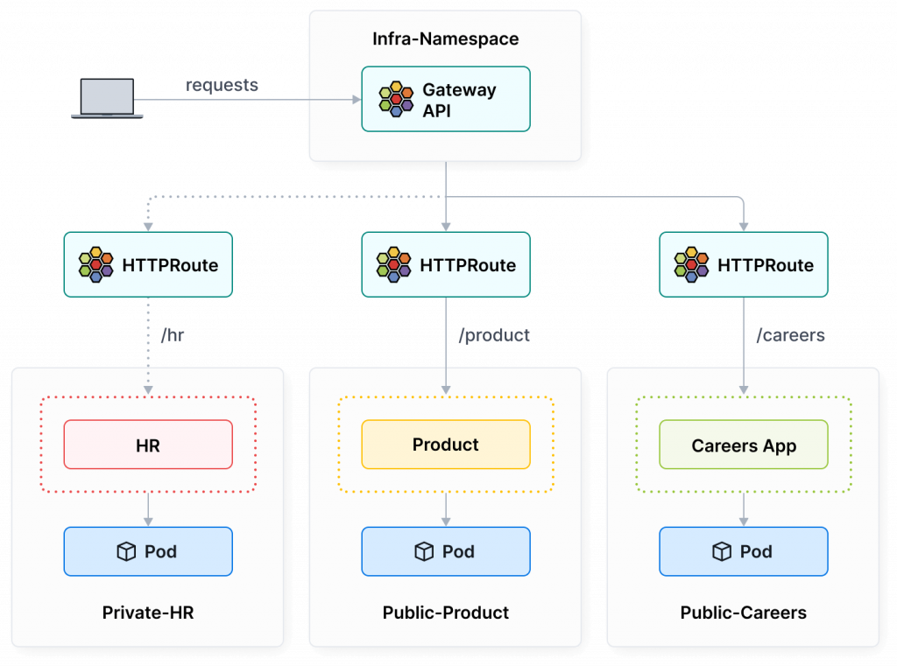

## Cilium Envoy 简介

Cilium Envoy 其实是一个简化版的 Envoy (去掉不必要的 extension)，并且加上 Cilium 专用的 policy filter ，用来支援 Cilium 的 L7 Policy

Cilium Envoy 的 GitHub Repo： <http://github.com/cilium/proxy>

Cilium 有两种使用 Envoy 的模式 ：

- 内嵌在 cilium-agent ：Envoy 是直接跑在 Cilium Agent 里面，由 Cilium 自行管理
- 独立 DaemonSet ：Envoy 会被独立部署成一个 DaemonSet，每个 Node 上跑一个 Envoy Pod，和 Cilium Agent 分开

查看配置

```bash
kubectl get cm -n kube-system cilium-config -o yaml | grep external-envoy-proxy

kubectl get ds cilium-envoy -n kube-system
```

独立 DaemonSet 有以下优点：

- Cilium Agent 重启不会断流：Cilium 升级或 Agent 重启的时候，Envoy 还是继续跑，不会影响现有的 L7 流量
- Envoy 可以独立升级：要打 Envoy 的 patch 或版本更新，不需要动到 Cilium Agent，两个分开维护比较干净
- 资源隔离更好：Envoy 跟 Cilium Agent 各自有 CPU/Memory 的 limit，互不干扰，不会抢资源导致流量变卡
- Log 分流：Envoy 的 application log 不会跟 Cilium Agent 混在一起，debug 超方便
- 独立健康检查：Envoy 有自己的 health probe，可以单独监控，出问题也比较好定位
- 部署行为更明确：DaemonSet 模式就是一开始就直接 deploy 出 Envoy，不像 embedded 模式要等到有 L7 Policy 才动态起来，行为比较 predictable

还支持以下功能：

- GatewayAPI
- L7 可观测
- ServiceMesh

### 流量走向

client Pod@worker-1 向 server Pod@worker-2 发出 HTTP 请求

Egress Policy 检查点（Client Pod 发送端）

- 代码： `bpf/bpf_lxc.c:handle_ipv4_from_lxc()` 
- 调用链： `policy_can_egress4()` → `__policy_can_access()`
- 检查逻辑 ：
  - 先去 `cilium_policy_v2` BPF map 找 policy
  - 如果有 L3+L4 的精准规则，就比 L4-only 还要优先
  - Deny 规则会先跑，中了就直接挡掉；没中才会去看 Allow
  - 如果需要跑 L7，这里会回传一个 `proxy_port`

L7 Redirect 执行点（Client Pod 发送端）

- 代码：同样在 `handle_ipv4_from_lxc()`
- 条件： `!from_l7lb && proxy_port > 0`
- 动作：调用 `ctx_redirect_to_proxy4()`
- 结果：把封包丢去 userspace 的 Envoy Proxy 做 L7 判断

Ingress 策略决策点 (Server Pod 接收端)

- 代码： `bpf/bpf_lxc.c:ipv4_policy()`
- 调用链： `policy_can_ingress4()` -> `__policy_can_access()`
- 逻辑：与 Egress 相同，但方向为 `CT_INGRESS`

## 实践：ServiceMesh

文档：<https://docs.cilium.io/en/stable/network/servicemesh/#what-is-service-mesh>

Service Mesh 通常会包含：

- Resilient Connectivity ：跨 Cluster、跨云、甚至跨地端的服务通讯，需具备容错与韧性
- L7 Traffic Management ：具备 L7 感知能力的 Load Balancing、Rate Limit、Retry 机制
- Identity-based Security ：不再依赖 IP 等网路识别，而是基于 Service Identity 进行双向验证
- Observability & Tracing ：完整的追踪与度量能力，用来分析服务稳定度与延迟
- Transparency ：所有这些功能对应用程序来说是透明的，不需要修改程序

### 启用 EnovyConfig

```bash
envoyConfig.enabled=true
```

配置后需要重启 Operator 和 Agent

```bash
kubectl -n kube-system rollout restart deployment/cilium-operator
kubectl -n kube-system rollout restart ds/cilium
```

检查看看有没有 `CiliumEnvoyConfig` CRD

```bash
kubectl explain CiliumEnvoyConfig
```

### 流量分流

先准备一个 bookstore 示例，包含两个版本：v1 与 v2

```yaml
---
apiVersion: v1
kind: Service
metadata:
  name: bookstore
  namespace: default
spec:
  selector: # 注意：Service 同时选择 v1 和 v2
    app: bookstore
  ports:
    - protocol: TCP
      port: 8080
      targetPort: 8080
---
apiVersion: apps/v1
kind: Deployment
metadata:
  name: bookstore-v1
  namespace: default
spec:
  replicas: 1
  selector:
    matchLabels:
      app: bookstore
      version: v1
  template:
    metadata:
      labels:
        app: bookstore
        version: v1
    spec:
      containers:
        - name: bookstore
          image: harbor.alpha-quant.tech/3rd_party/docker.io/library/busybox:1.37.0-glibc
          ports:
            - containerPort: 8080
          command: # 使用 command 启动一个 web server
            - /bin/sh
            - -c
            - "while true; do { echo -e 'HTTP/1.1 200 OK\\n\\nResponse from v1'; } | nc -l -p 8080; done"
---
apiVersion: apps/v1
kind: Deployment
metadata:
  name: bookstore-v2
  namespace: default
spec:
  replicas: 1
  selector:
    matchLabels:
      app: bookstore
      version: v2
  template:
    metadata:
      labels:
        app: bookstore
        version: v2
    spec:
      containers:
        - name: bookstore
          image: harbor.alpha-quant.tech/3rd_party/docker.io/library/busybox:1.37.0-glibc
          ports:
            - containerPort: 8080
          command:
            - /bin/sh
            - -c
            - "while true; do { echo -e 'HTTP/1.1 200 OK\\n\\nResponse from v2'; } | nc -l -p 8080; done"

```

这里会建立：

- 2 个 bookstore Deployments，分别是 v1 和 v2
- 1 个 `bookstore` service，一定要注意这个 Service 直接同时选择了 v1 和 v2

接着启动一个 `netshoot` pod，并执行以下指令，这会连续调用 bookstore service：

```bash
kubectl run netshoot \
    --image=harbor.alpha-quant.tech/3rd_party/docker.io/nicolaka/netshoot:v0.9 \
    -n default -- sleep infinity

for i in {1..20}; do kubectl exec -n default netshoot -- curl -s http://bookstore:8080; done
```

正常来说执行上面指令后会看到 v1 和 v2 的 Response 是 `50:50`

实施 `90:10` 流量分流

新增服务，拆分 v1 和 v2

```yaml
---
apiVersion: v1
kind: Service
metadata:
  name: bookstore-v1
  namespace: default
spec:
  selector:
    app: bookstore
    version: v1
  ports:
    - port: 8080
      targetPort: 8080
---
apiVersion: v1
kind: Service
metadata:
  name: bookstore-v2
  namespace: default
spec:
  selector:
    app: bookstore
    version: v2
  ports:
    - port: 8080
      targetPort: 8080

```

创建好 `bookstore-v1` 和 `bookstore-v2` Services 后，接着需要建立对应的 Envoy 设定，让流量以 90:10 的比例分配给 v1 / v2，这里就是会创建 `CiliumEnvoyConfig` 资源：

```yaml
apiVersion: cilium.io/v2
kind: CiliumEnvoyConfig
metadata:
  name: bookstore-canary
  namespace: default
spec:
  services:
    - name: bookstore
      namespace: default # 绑定到 Kubernetes Service (bookstore.default)
  backendServices:
    - name: bookstore-v1
      namespace: default # 后端版本 v1
    - name: bookstore-v2
      namespace: default # 后端版本 v2
  resources: # 定义 Envoy 的完整配置（Listener、Route、Cluster）
    # (1) Listener 层：监听进入 bookstore Service 的 HTTP 流量
    - "@type": type.googleapis.com/envoy.config.listener.v3.Listener
      name: bookstore-listener
      filter_chains:
        - filters:
            - name: envoy.filters.network.http_connection_manager
              typed_config:
                "@type": type.googleapis.com/envoy.extensions.filters.network.http_connection_manager.v3.HttpConnectionManager
                stat_prefix: bookstore-listener
                rds:
                  route_config_name: bookstore-route # 使用下方定义的 route
                http_filters:
                  - name: envoy.filters.http.router # 启用 HTTP Router 过滤器
                    typed_config:
                      "@type": type.googleapis.com/envoy.extensions.filters.http.router.v3.Router
    # (2) Route 层：定义流量在 v1 / v2 之间的分配
    - "@type": type.googleapis.com/envoy.config.route.v3.RouteConfiguration
      name: bookstore-route
      virtual_hosts:
        - name: bookstore-vh
          domains: ["*"] # 匹配所有 domain
          routes:
            - match:
                prefix: "/" # 匹配所有路径
              route:
                weighted_clusters: # 加权分流 (Canary Routing)
                  total_weight: 100
                  clusters:
                    - name: "default/bookstore-v1"
                      weight: 90 # 目前 90% 流量导向 v1
                    - name: "default/bookstore-v2"
                      weight: 10 # 10% 比例流量导向 v2，可逐步调整进行 canary rollout
                retry_policy: # L7 层级的重试策略
                  retry_on: 5xx
                  num_retries: 2
                  per_try_timeout: 1s
    # (3) Cluster 层：定义后端服务连线与健康检测行
    - "@type": type.googleapis.com/envoy.config.cluster.v3.Cluster
      name: "default/bookstore-v1"
      connect_timeout: 5s
      lb_policy: ROUND_ROBIN
      type: EDS # Endpoints Discovery Service，由 Cilium 自动提供 backend endpoints
      outlier_detection:
        split_external_local_origin_errors: true
        consecutive_local_origin_failure: 2 # 若连续 2 次失败，暂时移除该 endpoint

    - "@type": type.googleapis.com/envoy.config.cluster.v3.Cluster
      name: "default/bookstore-v2"
      connect_timeout: 5s
      lb_policy: ROUND_ROBIN
      type: EDS
      outlier_detection:
        split_external_local_origin_errors: true
        consecutive_local_origin_failure: 2

```

再次测试分流结果

```bash
for i in {1..20}; do kubectl exec -n default netshoot -- curl -s http://bookstore:8080; done
```

会看到 v1 和 v2 交错出现，大部分流量仍打到 v1，但偶尔会有 v2 的回应，这代表 Mesh 层的流量控制生效

## 实践：GatewayAPI

Gateway API 引入了 Role-oriented 的概念，让 Infra 团队和开发团队能清楚分工，相当于 Ingress 现在被拆解成多个 YAML 去写

在 Cilium 环境中启用 Gateway API，并体验它在 North-South 流量（进出 Cluster 的流量）上的行为

文档：<https://cilium.io/use-cases/gateway-api/>



### 开启 Gateway API

安装 Gateway API CRD

```bash
kubectl apply -f https://github.com/kubernetes-sigs/gateway-api/releases/download/v1.4.1/standard-install.yaml
```

Cilium 有几个设定要配置好，分别是：

- `kubeProxyReplacement=true`
- `l7Proxy=true`（默认开启）

启用 Cilium Gateway API：

```bash
gatewayAPI.enabled=true
```

安装后查看 GatewayClass

```bash
# kubectl get gatewayclasses.gateway.networking.k8s.io

NAME     CONTROLLER                     ACCEPTED   AGE
cilium   io.cilium/gateway-controller   Unknown    9m52s
```

### Gateway

创建一个简单的 Gateway 看看

```yaml
apiVersion: gateway.networking.k8s.io/v1
kind: Gateway
metadata:
  name: cilium-gw
  namespace: default
spec:
  gatewayClassName: cilium
  listeners:
    - name: http
      protocol: HTTP
      port: 80

```

apply 后，现在来看看 K8s Cluster 里面的 Gateway：

```bash
# kubectl get gtw -n default

NAME        CLASS    ADDRESS   PROGRAMMED   AGE
cilium-gw   cilium             Unknown      55s
```

当 Gateway 被创建后，背后的具体实例是需要一个真实存在的 LoadBalancer，现在来看一下 Service 有哪些: