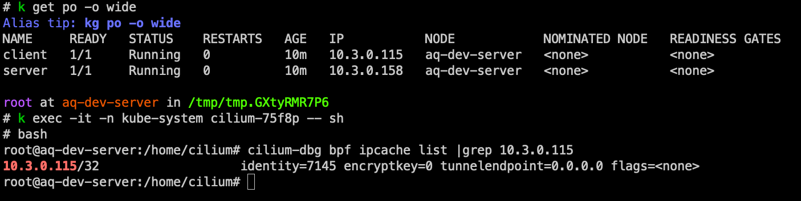
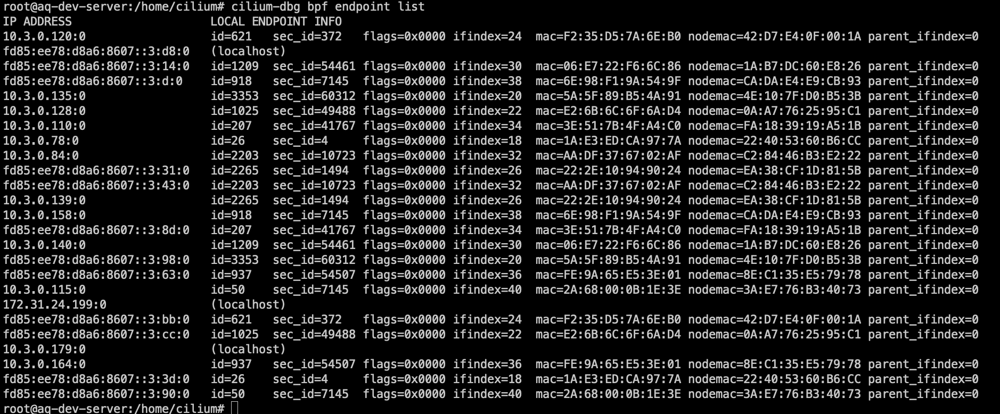
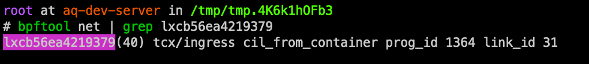

## 探索 Datapath

部署同节点的测试容器

```yaml
---
apiVersion: v1
kind: Pod
metadata:
  name: client
  namespace: default
spec:
  nodeName: aq-dev-server # 指定 Schedule 到 aq-dev-server
  containers:
    - name: client
      image: harbor.alpha-quant.tech/3rd_party/docker.io/nicolaka/netshoot:v0.9
      command: ["sleep", "infinity"]
---
apiVersion: v1
kind: Pod
metadata:
  name: server
  namespace: default
spec:
  nodeName: aq-dev-server # 指定 Schedule 到 aq-dev-server
  containers:
    - name: server
      image: harbor.alpha-quant.tech/3rd_party/docker.io/openresty/openresty:1.27.1.2-3-bullseye-fat

```

### Pod 的 veth pair

登录到节点

```bash
crictl ps | grep default | grep client | awk '{print $1}'
```

找出 PID

```bash
crictl inspect <CONTAINER_ID> | grep -i pid
```

利用 `nsenter` 找到 Pod 对端的 veth (host-side veth)

```bash
nsenter -t <PID> -n ethtool -S eth0 | grep peer_ifindex
```

从上面的指令会看到 ifindex，就可以知道 client Pod 的 host-side veth 的 index

```bash
ip link | grep <peer_ifindex>
```

### Bpftool

```bash
bpftool version
```

观察一下有绑定哪些 BPF Program

```bash
bpftool net
```


看一下有哪些 maps

```bash
bpftool map show
```


### tc 与 tcx

传统是使用 tc，但是现在新版本的 Cilium 会检查如果 Kernel 够新就会使用 tcx，不够新 fallback 使用 tc

tc：

- Kernel 的 ingress/egress hook point 就是插座
- tc 就是一个多功能转接头，这转接头上面有孔给挂 BPF Prog
- tc 会插在插座上，BPF Prog 插在 tc 上

tcx 就好理解了，就是不透过 tc 间接插上去 ingress/egress hook point，而是可以「 直接 」插上去

可以执行指令，查看 tc

```bash
# client 容器的 host side veth
tc filter show dev lxcb56ea4219379 ingress
```

### cilium agent

进入节点的 Cilium Pod

先来看 IP 对应到 Identity 的 BPF Map `ipcache`

```bash
cilium-dbg bpf ipcache list |grep 10.3.0.115
```



在 Cilium Agent Pod 里面可以直接查看 `endpoint` BPF Map

```bash
cilium-dbg bpf endpoint list
```



查看 metrics

```bash
cilium-dbg bpf metrics list
```


### pwru

安装 pwru

```bash
cd $(mktemp -d)
curl -sL https://github.com/cilium/pwru/releases/download/v1.0.10/pwru-linux-amd64.tar.gz | tar zx
mv pwru /usr/local/bin/pwru
chmod +x /usr/local/bin/pwru
```

使用 `--filter-netns` 选项：

```bash
pwru --filter-netns "/proc/303160/ns/net"
```

执行请求

```bash
k exec -it -n default client -- curl www.baidu.com
```


## Pod 到 Pod（同节点）

### client Pod 路由+ neighbor


- client pod (10.3.0.115) 的 default gateway 是 10.3.0.179（主机内部 IP）→ 在这个/32 或/24 Pod 网段里，Cilium 帮 Pod 安排一个「gateway IP」
- 所有不是自己 IP 的封包（包含送往 server: 10.3.0.158）都会先丢给这个 gateway (10.3.0.179)。


这行表示：

- 下一跳(gateway) 的 IP = `10.3.0.179`
- 对应的 MAC = `3a:e7:76:b3:40:73`

### client Pod 的 veth 对端

可以看到刚刚 neighbor 中的 IP 为主机 cilium_host 的 IP，但是 Mac 地址是 client Pod 的 veth 对端


### BFP Program

接着用 bpftool 来看网卡上绑了哪些 BPF Program:

```bash
bpftool net | grep lxcb56ea4219379
```



- hook ： `tcx/ingress`
- 程序 ： `cil_from_container`

也就是说：client Pod 发出去的封包，第一站就是 hit 这个 `cil_from_container`

- client Pod eth0 丢封包→ gateway

- 到达 Node veth 对端

- 在 ingress 立刻被 Cilium 挂的 BPF prog **`cil_from_container`** 接住

  - 读取封包 metadata → identity → policy 判断

  - 如果目标是同 Node 的 server Pod → 查 `endpoint_map` → 找到对应 veth，然后 Local Deliver

  - 如果目标是跨 Node → 会转交 `cilium_vxlan` / `ens5` path

### tcpdump 抓封包验证

在主机抓取 client Pod 的 host-side veth:

```bash
tcpdump -n -i lxcb56ea4219379 arp or icmp -vv -c 30
```

接着在 client pod 去 ping server pod

```bash
k exec -it -n default client -- ping -c 4 10.3.0.158
```


注意：

- `cilium_host` interface 前面观察是真的有绑 `10.3.0.179/32`
- 但 ARP 回覆的 MAC 并不是 cilium_host ( `ea:66:3a:6e:0c:b2` )，而是client Pod 对端 veth (lxcb56ea4219379) 的 MAC ( `3a:e7:76:b3:40:73` )

分析：

- 10.3.0.179 的逻辑身份 = Pod 的「gateway IP」，挂在 cilium_host 上，这是 route 层面的概念
- 10.3.0.179 的实际行为 = 当 Pod 发 ARP request，并不是 cilium_host （kernel）回应，而是 veth 对端 ingress 的 Cilium BPF Program

### `cil_from_container`

简单一句话来解释就是：「 cil_from_container 是容器网路的出口警卫，专门检查所有从容器送出的封包，并决定它们的下一步该怎么走 。」当一个容器送出一个封包时，这个 BPF Program 会被第一个触发，而里面有用到 eBPF Tail call 的机制根据不同封包类型来转给不同的 BPF Program 接力处理。

```c
// bpf/bpf_lxc.c

__section_entry
int cil_from_container(struct __ctx_buff *ctx)
{
	__u16 proto = 0; // 暂存 L3 protocol
	int ret;

	// 先确认封包的 EtherType，顺便把结果存到 proto（像 ETH_P_IP 这种）
	validate_ethertype(ctx, &proto);

	// 再来依照不同 L3 protocol 分流
	switch (proto) {

#ifdef ENABLE_IPV4
	// 如果是 IPv4 封包就会进来这里
	// 例如 tcpdump 看到 "proto ICMP"，因为 ICMP 算是 IP 的一部分
	case bpf_htons(ETH_P_IP):
		// 把封包丢给专门处理 IPv4 policy 的 BPF 程式做进一步检查
		ret = tail_call_internal(ctx, CILIUM_CALL_IPV4_FROM_LXC, &ext_err);
		break;

	// 如果是 ARP 封包就会进到这里
#ifdef ENABLE_ARP_PASSTHROUGH
	case bpf_htons(ETH_P_ARP):
		// pass-through 模式：ARP 直接放行
		ret = CTX_ACT_OK;
		break;
#elif defined(ENABLE_ARP_RESPONDER)
	case bpf_htons(ETH_P_ARP):
		// responder 模式：交给专门的 ARP BPF 程式处理
		ret = tail_call_internal(ctx, CILIUM_CALL_ARP, &ext_err);
		break;
#endif // ENABLE_ARP_RESPONDER
#endif // ENABLE_IPV4

	default:
		// 其他不支持的 L3 protocol 全部丟掉
		ret = DROP_UNKNOWN_L3;
	}

	return ret;
}

```

tail_handle_arp

```c
// bpf/bpf_lxc.c

__declare_tail(CILIUM_CALL_ARP)
int tail_handle_arp(struct __ctx_buff *ctx)
{
	union macaddr mac = THIS_INTERFACE_MAC;   // veth 对端的 MAC 位址
	union macaddr smac;
	__be32 sip;   // Sender IP
	__be32 tip;   // Target IP

	/* 若 ARP 封包不合法，交回 Linux stack 处理 */
	if (!arp_validate(ctx, &mac, &smac, &sip, &tip))
		return CTX_ACT_OK;

	/*
	 * 预期 Pod 会对它的 gateway IP 发 ARP Request
	 * 大部分情況下是 IPV4_GATEWAY (例如 10.3.0.179)
	 * 若 target IP 刚好是 Pod 自己的 IP，则不要答复
	 * （避免误判成 IP 重复检查）
	 */
	if (tip == CONFIG(endpoint_ipv4).be32)
		return CTX_ACT_OK;

	/* 伪造一个 ARP Reply：
	 * 答复「tip 这个 IP 的拥有者，就是 THIS_INTERFACE_MAC」
	 */
	return arp_respond(ctx, &mac, tip, &smac, sip, 0);
}
```

