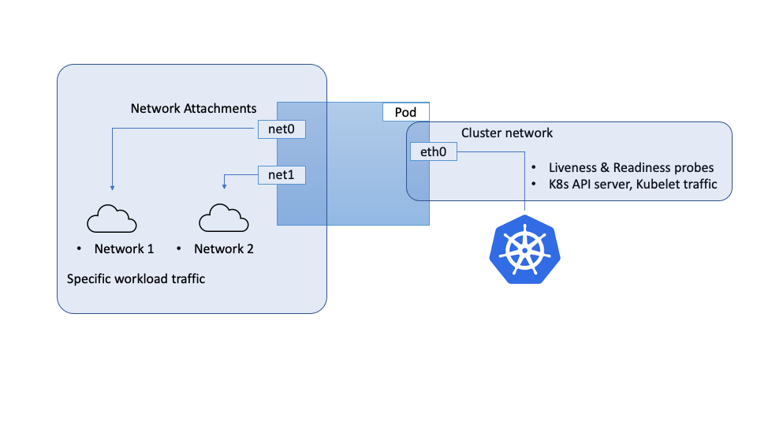
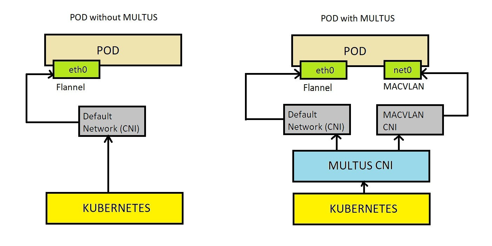

## Multus

Multus 是由英特尔开源并由 Kubernetes 社区托管的多网络平面管理工具。它扩展了 Kubernetes 的 CNI，允许 Pod 配置多块网卡和多个 IP 地址，尽管 K8s 最初设计时只支持单网卡。

- Github 地址：<https://github.com/k8snetworkplumbingwg/multus-cni>
- 文档地址：<https://github.com/k8snetworkplumbingwg/multus-cni/blob/master/docs/how-to-use.md>

Multus 的两种模式

- 多网卡模式：Pod 可以配置多个 CNI 插件，实现多网卡。主网卡（如 eth0）提供主要网络连接，而附属网卡（如 net0, net1）通过 CRD 添加，支持额外的网络连接需求。
- 单网卡模式：Pod 只有一块网卡，但可以选择使用不同的 CNI 插件来管理其网络连接，尽管只有一个物理网卡，但可以利用不同的网络策略和配置。

## 其他多网卡相关

目前已知的多网卡方案：

- k8s 多网卡规范：[K8sNetworkPlumbingWG/multi-net-spec](https://github.com/K8sNetworkPlumbingWG/multi-net-spec)

- 华为开发的多网络 CNI 插件：[Huawei-PaaS/CNI-Genie](https://github.com/huawei-cloudnative/CNI-Genie)

- Intel 开发的多网络 CNI 插件： [Multus-CNI](https://github.com/k8snetworkplumbingwg/multus-cni)