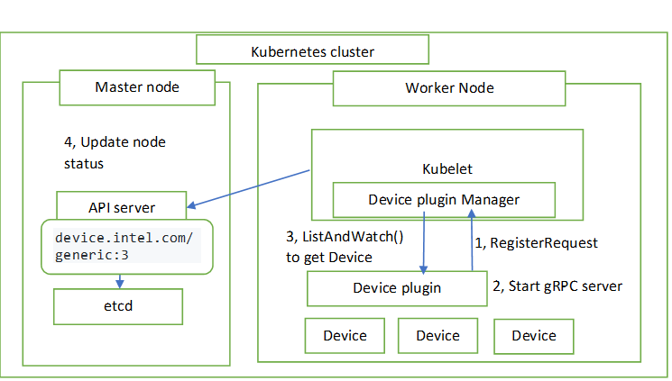
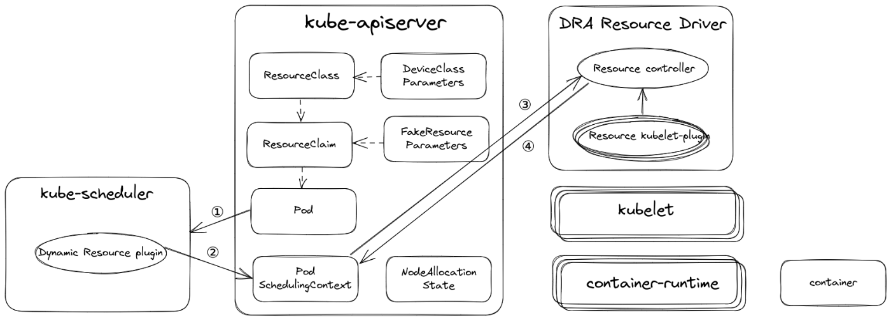

## Device Plugin

Kubernetes 的 Device Plugin 机制（源于 KEP-3573）是一项早期就引入 Kubernetes 的重要功能，旨在扩展 Kubernetes 的资源管理能力，使其能够支持除 CPU 和内存之外的各种硬件资源，例如图形处理器（GPU）、数据处理单元（DPU）、现场可编程门阵列（FPGA）以及非统一内存访问（NUMA）节点等。

Device Plugin 机制通过提供一个简单而强大的接口 ——Device Plugin Interface，实现了对这些硬件资源的抽象和管理。通过实现这个接口，第三方供应商或用户可以开发自己的 Device Plugin，从而将特定的硬件资源集成到 Kubernetes 集群中。

从某种意义上而言，Device Plugin （设备插件）的引入极大扩展了 Kubernetes 的能力，使其不仅局限于管理传统的 CPU 和内存资源，还能支持各种类型的特殊硬件资源。这对于依赖硬件加速的任务（如 AI 模型训练、数据科学计算和高性能网络处理）具有重要意义。通过设备插件，用户可以更高效地利用集群中的硬件资源，同时通过标准化的接口降低管理和集成的复杂性。

Kubernetes 平台本身并不原生支持诸如 GPU  这类特殊硬件资源。设备插件的关键作用就在于发现并向应用程序暴露这些资源。其工作机制是：设备插件通过设备插件 API  接收可分配资源列表，并将其传递给 kubelet，从而对外呈现节点上的 GPU 数量。kubelet  负责持续跟踪这些资源，并将节点上各种资源类型的数量汇报给 API Server，以便 kube-scheduler 在进行 Pod  调度决策时能够充分利用这些信息。

然而，这种基于设备插件的方案存在一些固有的局限性：

1. K8s 只允许通过 kubelet  来分配设备，这样就导致无法获得全局最优的资源编排，也就是从根本上无法发挥资源效能。比如一个集群内有两台节点，都有相同的设备，剩余的可分配设备数量相等，但是实际上两个节点上的设备所在的硬件拓扑会导致 Pod 的运行时效果差异较大，没有调度器介入的情况下，是可能无法抵消这种差异的。
2. 不支持类似 GPU 和 RDMA 联合分配的能力。大模型训练依赖高性能网络，而高性能网络的节点间通信需要用到 RDMA 协议和支持 RDMA 协议的网络设备，而这些设备又和 GPU 在节点上的系统拓扑层面是紧密协作的，这就要求在分配 GPU 和 RDMA 时需要感知硬件拓扑，尽可能就近分配这种设备。尝试按照同 PCIe，同 NUMA Node，同 NUMA Socket 和 跨 NUMA 的顺序分配，延迟依次升高。
3. kubelet 不支持设备的初始化和清理功能，更不支持设备的共享机制，后者在训练场景一般用不到，但在线推理服务会用到。在线推理服务本身也有很明显的峰谷特征，很多时刻并不需要占用完整的 GPU 资源。

## 动态资源分配

动态资源分配（DRA - Dynamic Resource Allocation）

DRA 的核心目标是通过灵活且统一的方式管理复杂的异构资源，使 Kubernetes 能够适配现代云原生场景中日益多样化的需求。在本质上，DRA 是对通用资源持久卷（Generic Resource Persistent Volume，PV）API  的泛化，其设计理念在于提供更强的灵活性，特别是在涉及 GPU 等特殊硬件设备时，DRA 的优势尤为明显。

通常而言，DRA 核心特性与工作机制主要体现在如下几点，具体可参考：

（1）对通用资源持久卷 API 的泛化

传统的资源分配方式通常只涵盖 CPU 和内存等通用资源，而 DRA 的出现则使 Kubernetes 能够支持更广泛的资源类型。这种泛化的实现，使得 DRA 不仅限于硬件设备的管理，还能够扩展到其他复杂资源类型，从而满足不同场景下的动态需求。例如，在深度学习场景中，用户不仅可以请求 GPU 资源，还可以指定具体的显存大小或计算核心数，以便更精确地满足任务需求。

（2）第三方资源驱动程序的关键作用

DRA 的高效运行离不开第三方资源驱动程序的支持。这些驱动程序主要负责以下任务：

资源发现：检测和报告节点上的可用资源状态，例如 GPU 的数量、型号和当前负载情况。

资源分配：根据用户的具体需求分配资源，并将资源绑定到目标 Pod。

资源监控：在资源生命周期内持续跟踪资源的使用状态，以确保任务的顺利完成并避免资源冲突。

通过第三方驱动程序，DRA 能够实现对资源的细粒度控制。例如，在 AI 模型训练任务中，用户可以通过自定义驱动程序参数指定 GPU 显存分配的上限，以适应特定模型对显存的需求，从而最大化计算性能和资源利用率。

（3）参数化与结构化的资源管理

DRA 在 Kubernetes 1.30 中引入了一种基于结构化参数的机制。这一机制允许用户为不同类型的资源定义灵活的需求和初始化参数。例如：

GPU 配置：可以指定显存大小、计算核心数、CUDA 支持版本等。

FPGA 配置：可以定义板卡型号、逻辑单元使用量或频率等。

网络设备：支持指定带宽、吞吐量或 RDMA 能力。

基于这种参数化设计为用户提供了高度灵活的资源定制能力，同时也为复杂资源的动态管理奠定了基础。