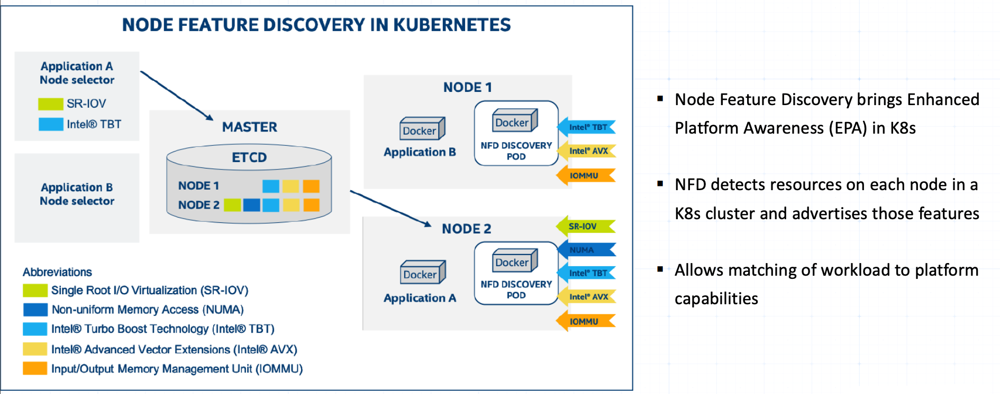

发现节点信息和 GPU 信息并以 Label 形式添加到 k8s 中的 node 对象上。

- NFD：Node Feature Discovery

NFD 添加的 label 以  `feature.node.kubernetes.io` 作为前缀，比如:

```bash
feature.node.kubernetes.io/cpu-cpuid.ADX=true
feature.node.kubernetes.io/system-os_release.ID=ubuntu
feature.node.kubernetes.io/system-os_release.VERSION_ID.major=22
feature.node.kubernetes.io/system-os_release.VERSION_ID.minor=04
feature.node.kubernetes.io/system-os_release.VERSION_ID=22.04
```

Node Feature Discovery（NFD）是由 Intel 创建的项目，能够帮助 Kubernetes 集群更智能地管理节点资源。它通过检测每个节点的特性能力（例如 CPU 型号、GPU 型号、内存大小等）并将这些能力以标签的形式发送到 Kubernetes 集群的 API 服务器（kube-apiserver）。然后，通过 kube-apiserver 修改节点的标签。这些标签可以帮助调度器（kube-scheduler）更智能地选择最适合特定工作负载的节点来运行 Pod。

- Github：<https://github.com/kubernetes-sigs/node-feature-discovery>
- Docs：<https://kubernetes-sigs.github.io/node-feature-discovery/master/get-started/index.html>



NFD 细分为 NFD-Master 和 NFD-Worker 两个组件：

- NFD-Master：是一个负责与 kubernetes API Server 通信的 Deployment Pod，它从 NFD-Worker 接收节点特性并相应地修改 Node 资源对象（标签、注解）。

- NFD-Worker：是一个负责对 Node 的特性能力进行检测的 Daemon Pod，然后它将信息传递给 NFD-Master，NFD-Worker 应该在每个 Node 上运行。

可以检测发现的硬件特征源（feature sources）清单包括：

- CPU
- IOMMU
- Kernel
- Memory
- Network
- PCI
- Storage
- System
- USB
- Custom (rule-based custom features)
- Local (hooks for user-specific features)

查看组件日志

- nfd-worker 组件默认每隔一分钟检测一次节点特性。
- nfd-master 组件启动后默认第一分钟相应地修改 Node 资源对象（标签、注解），之后是每隔一个小时修改一次 Node 资源对象（标签、注解），也就是说如果一个小时以内用户手动误修改 node 资源特性信息（标签、注解），最多需要一个小时 nfd-master 组件才自动更正 node 资源特性信息。
