## 简介

动态资源分配（Dynamic Resource Allocation，DRA）可实现在 Pod 之间请求和共享 GPU 资源，它是持久卷 API 针对通用资源的扩展。相比传统的设备插件模式，DRA 提供了更灵活、更细粒度的资源请求方式

NVIDIA 动态资源分配 GPU 驱动程序（NVIDIA DRA Driver for GPUs）通过实现 DRA API，为 Kubernetes 工作负载提供现代化的 GPU 分配方式，支持受控共享和动态重新配置 GPU

- DRA：<https://kubernetes.io/docs/concepts/scheduling-eviction/dynamic-resource-allocation/>

- NVIDIA DRA：<https://github.com/NVIDIA/k8s-dra-driver-gpu>

Kubernetes 工作负载可以分配并消耗以下两种资源：

- GPU 分配：用于受控共享和动态重配置 GPU。这一功能取代了 NVIDIA Kubernetes 设备插件所采用的传统 GPU 分配方法。
- ComputeDomains：为 NVIDIA GB200 及类似系统提供稳健且安全的多节点 NVLink（MNNVL）的抽象。



## 部署

添加`NVIDIA Helm`仓库并更新

```bash
helm repo add nvidia https://helm.ngc.nvidia.com/nvidia
```

安装版本为`25.12.0`的`NVIDIA DRA GPU`驱动程序。

```bash
helm install \
    nvidia-dra-driver-gpu nvidia/nvidia-dra-driver-gpu \
    --version="25.12.0" \
    --create-namespace --namespace nvidia-dra-driver-gpu \
    --set gpuResourcesEnabledOverride=true
```

验证`NVIDIA DRA`驱动是否正常运行，并确认GPU资源已成功上报到Kubernetes集群。

```bash
kubectl get deviceclass,resourceslice
```

示例输出

```bash
# kubectl get deviceclass,resourceslice

NAME                                              AGE
deviceclass.resource.k8s.io/gpu.nvidia.com        71m
deviceclass.resource.k8s.io/mig.nvidia.com        71m
deviceclass.resource.k8s.io/vfio.gpu.nvidia.com   71m

NAME                                                                 NODE              DRIVER           POOL              AGE
resourceslice.resource.k8s.io/kube-wk-gpu.nvidia.com-8zzk2   kube-wk   gpu.nvidia.com   kube-wk   60m

```

## 使用

### 分配单个 GPU

部署使用 DRA GPU 的工作负载

```yaml
apiVersion: resource.k8s.io/v1beta2
kind: ResourceClaimTemplate
metadata:
  name: single-gpu
  namespace: srliao
spec:
  spec:
    devices:
      requests:
        - name: gpu
          exactly:
            allocationMode: ExactCount
            deviceClassName: gpu.nvidia.com
            count: 1
```

调用单个 GPU

```yaml
apiVersion: apps/v1
kind: Deployment
metadata:
  name: single-gpu
  namespace: srliao
spec:
  replicas: 2
  selector:
    matchLabels:
      app: single-gpu
  template:
    metadata:
      labels:
        app: single-gpu
    spec:
      # runtimeClassName: nvidia
      # nodeSelector:
      #   node-role.kubernetes.io/nvidia-gpu: ""
      resourceClaims:
        - name: gpu
          resourceClaimTemplateName: single-gpu
      containers:
        - name: single-gpu
          image: nvcr.io/nvidia/k8s-device-plugin:v0.19.0
          command:
            - busybox
            - sleep
            - infinity
          env:
            - name: NVIDIA_VISIBLE_DEVICES
              value: void
          resources:
            requests:
              cpu: "2"
              memory: "4Gi"
            limits:
              cpu: "2"
              memory: "4Gi"
            claims:
              - name: gpu

```

### vector-add 测试

使用如下的 YAML 文件

```yaml
---
apiVersion: resource.k8s.io/v1beta2
kind: ResourceClaimTemplate
metadata:
  name: cuda-vectoradd-gpu
  namespace: srliao
spec:
  spec:
    devices:
      requests:
        - name: gpu
          exactly:
            allocationMode: ExactCount
            deviceClassName: gpu.nvidia.com
            count: 1

---
kind: Job
apiVersion: batch/v1
metadata:
  name: cuda-vectoradd
  namespace: srliao
  labels:
    app: cuda-vectoradd
spec:
  backoffLimit: 0
  completions: 1
  ttlSecondsAfterFinished: 3600
  template:
    metadata:
      labels:
        app: cuda-vectoradd
    spec:
      restartPolicy: Never
      # runtimeClassName: nvidia
      # nodeSelector:
      #   node-role.kubernetes.io/nvidia-gpu: ""
      resourceClaims:
        - name: gpu
          resourceClaimTemplateName: cuda-vectoradd-gpu
      containers:
        - name: cuda-vectoradd
          image: nvcr.io/nvidia/k8s/cuda-sample:vectoradd-cuda12.5.0
          resources:
            requests:
              cpu: "2"
              memory: "4Gi"
            limits:
              cpu: "2"
              memory: "4Gi"
            claims:
              - name: gpu

```

## DRA 关键概念

### DeviceClass（设备类）

定位：设备类型与选择规则（集群侧）

DeviceClass 定义特定资源的选择标准和配置，为资源分配提供标准化的方法。

`DeviceClass` 描述一类可分配设备的 “抽象入口”，包含如下要素：

- 由哪个 driver 管理（`spec.driverName`）
- 选择规则（selectors，可用 CEL 表达式过滤驱动发布的设备属性）
- 可选参数（parameters，用于将配置传递给 driver）

它更像 “设备池 / 设备类” 的入口，而非具体某块设备

```yaml
apiVersion: resource.k8s.io/v1beta2
kind: DeviceClass
metadata:
  name: gpu.nvidia.com
spec:
  selectors:
    - cel:
        expression:
          device.driver == 'gpu.nvidia.com' && device.attributes['gpu.nvidia.com'].type
          == 'gpu'
```

### ResourceSlice（资源切片）

定位：设备可用性发布（driver 侧）

ResourceSlice 发布可供分配的资源信息，为调度器提供资源可用性的实时视图。

DRA driver 通过 `ResourceSlice` 向集群发布其管理的设备清单与属性（如型号、拓扑、容量、可切分能力等）。调度与分配阶段会基于这些信息做决策。

ResourceSlice 由 DRA 驱动创建 ——GPU 则由 NVIDIA DRA 驱动创建。它描述了每个节点上实际可用的真实结构化属性：

```yaml
apiVersion: resource.k8s.io/v1beta2
kind: ResourceSlice
metadata:
  name: kube-wk-6-013-gpu.nvidia.com-8z6mn
spec:
  devices:
    - attributes:
        addressingMode:
          string: HMM
        architecture:
          string: Blackwell
        brand:
          string: Nvidia
        cudaComputeCapability:
          version: 12.0.0
        cudaDriverVersion:
          version: 13.1.0
        driverVersion:
          version: 590.48.1
        productName:
          string: NVIDIA RTX PRO 6000 Blackwell Server Edition
        resource.kubernetes.io/pciBusID:
          string: "0000:21:00.0"
        resource.kubernetes.io/pcieRoot:
          string: pci0000:20
        type:
          string: gpu
        uuid:
          string: GPU-5ce98795-4dd0-0717-6608-516b7b2c9f02
      capacity:
        memory:
          value: 97887Mi
      name: gpu-0

```

不再是 “此节点有 1 个 GPU”，而是 “此节点采用 NVIDIA RXT PRO 6000、Blackwell 架构、96 Gi 内存、CUDA 13.1.0”。

DeviceClass 将设备按类别进行分组。NVIDIA DRA 驱动创建了标准类，如 `gpu.nvidia.com` 和 `mig.nvidia.com`。平台团队可以自行添加 ——` 高内存显存 `、` 预算推理显卡 `。

### ResourceClaim（资源声明）

定位：一次具体的设备请求（命名空间内）

ResourceClaim 表示工作负载所需的特定资源请求。它类似于持久卷声明（PVC），但适用于更广泛的资源类型。

`ResourceClaim` 是工作负载侧实际 “申请设备” 的对象，表达如下内容：

- 需要哪类设备（通过 `DeviceClass`）
- 需要什么约束 / 容量（由 driver 理解）
- 分配结果（写入 `status`，由 driver / 控制面完成）

一个 `ResourceClaim` 可被一个或多个 Pod 引用（取决于 driver 支持与 claim 设计目标）。

```yaml
apiVersion: resource.k8s.io/v1beta2
kind: ResourceClaim
metadata:
  name: single-gpu
  namespace: srliao
spec:
  devices:
    requests:
      - name: gpu
        exactly:
          allocationMode: ExactCount
          deviceClassName: gpu.nvidia.com
          count: 1
```

### ResourceClaimTemplate（资源声明模板）

定位：声明式模板（按需创建 Claim）

ResourceClaimTemplate 自动为每个 Pod 创建和管理 ResourceClaim，简化了大规模部署的资源管理。

如不希望手动创建 `ResourceClaim`，可用 `ResourceClaimTemplate` 作为模板，让 Kubernetes 在创建 Pod / Job 时自动生成对应 claim，实现 “随 Pod 生命周期按需申请”。

```yaml
apiVersion: resource.k8s.io/v1beta2
kind: ResourceClaimTemplate
metadata:
  name: single-gpu
  namespace: srliao
spec:
  spec:
    devices:
      requests:
        - name: gpu
          exactly:
            allocationMode: ExactCount
            deviceClassName: gpu.nvidia.com
            count: 1
```

- `requests[]` 可表达多个请求片段（如需 1 块 GPU + 1 张 RDMA NIC）。
- `selectors` 用于按设备属性筛选（示例用 CEL 表达 NUMA 亲和）。
- `allocationMode/count` 表达 “数量” 是最基础的方式；更复杂的 “容量/切分” 通常由 driver 的 parameters/attributes 实现。

## 场景：Sharing the GPU

Time-slicing: multiple replicas, processes taking turns

```yaml
apiVersion: resource.k8s.io/v1
kind: ResourceClaim
metadata:
  name: gpu-demo-app
  namespace: gpu-demo
spec:
  devices:
    requests:
      - name: ts-gpu
        exactly:
          deviceClassName: gpu.nvidia.com
          selectors:
            - cel:
                expression: |
                  device.attributes["gpu.nvidia.com"].architecture == "Blackwell" &&
                  device.capacity["gpu.nvidia.com"].memory.isGreaterThan(quantity("20000Mi"))
    config:
      - requests: ["ts-gpu"]
        opaque:
          driver: gpu.nvidia.com
          parameters:
            apiVersion: resource.nvidia.com/v1beta1
            kind: GpuConfig
            sharing:
              strategy: TimeSlicing
              timeSlicingConfig:
                interval: Long

```

## 场景：MPS 多个进程同时访问 GPU

```yaml
apiVersion: resource.k8s.io/v1
kind: ResourceClaim
metadata:
  name: gpu-demo-app
  namespace: gpu-demo
spec:
  devices:
    requests:
      - name: mps-gpu
        exactly:
          deviceClassName: gpu.nvidia.com
          selectors:
            - cel:
                expression: |
                  device.attributes["gpu.nvidia.com"].architecture == "Blackwell" &&
                  device.capacity["gpu.nvidia.com"].memory.isGreaterThan(quantity("20000Mi"))
    config:
      - requests: ["mps-gpu"]
        opaque:
          driver: gpu.nvidia.com
          parameters:
            apiVersion: resource.nvidia.com/v1beta1
            kind: GpuConfig
            sharing:
              strategy: MPS
              mpsConfig:
                defaultActiveThreadPercentage: 33
                defaultPinnedDeviceMemoryLimit: 5Gi

```

## 场景：MIG 硬件隔离

```yaml
apiVersion: resource.k8s.io/v1
kind: ResourceClaimTemplate
metadata:
  name: gpu-demo-mig
  namespace: gpu-demo-1
spec:
  spec:
    devices:
      requests:
        - name: mig-1g-5gb
          exactly:
            deviceClassName: mig.nvidia.com
            selectors:
              - cel:
                  expression: |
                    device.attributes["gpu.nvidia.com"].profile == "1g.5gb"

```

示例应用

```yaml
apiVersion: apps/v1
kind: Deployment
metadata:
  name: gpu-demo-mig
  namespace: gpu-demo
spec:
  replicas: 7
  selector:
    matchLabels:
      app: gpu-demo-mig
  template:
    metadata:
      labels:
        app: gpu-demo-mig
    spec:
      resourceClaims:
        - name: mig-1g-5gb
          resourceClaimTemplateName: gpu-demo-mig
      containers:
        - name: gpu-demo-app
          image: nvcr.io/nvidia/k8s/cuda-sample:vectoradd-cuda12.5.0
          ports:
            - containerPort: 5000
          resources:
            requests:
              memory: "512Mi"
              cpu: "250m"
            limits:
              memory: "1Gi"
              cpu: "500m"
            claims:
              - name: mig-1g-5gb
      tolerations:
        - key: nvidia.com/gpu
          operator: Exists
          effect: NoSchedule
```

## 场景：金融机构的机器学习模型

假设某金融机构运行一个机器学习模型来预测股市趋势。该模型需要多个具有至少 16GB 内存的 GPU 来执行密集计算。

传统方法的问题

```yaml
# 传统方法 - 使用 nodeSelector 和资源限制
apiVersion: v1
kind: Pod
spec:
  nodeSelector:
    nvidia.com/gpu: "true"
  containers:
  - name: ml-model
    resources:
      limits:
        nvidia.com/gpu: 2
```

这种方法的问题：

- 无法指定具体的 GPU 要求
- 调度器无法优化资源分配
- 资源利用率低

使用 DRA 的解决方案

```yaml
# 1. 定义 DeviceClass
apiVersion: resource.k8s.io/v1alpha2
kind: DeviceClass
metadata:
  name: nvidia-gpu-16gb
spec:
  driverName: nvidia.com/gpu
  parameters:
    memory: "16Gi"
    compute-capability: "8.0"

---
# 2. 创建 ResourceClaimTemplate
apiVersion: resource.k8s.io/v1alpha2
kind: ResourceClaimTemplate
metadata:
  name: gpu-template
spec:
  spec:
    resourceClassName: nvidia-gpu-16gb
    parameters:
      memory: "16Gi"

---
# 3. 在 Pod 中使用
apiVersion: v1
kind: Pod
spec:
  resourceClaims:
  - name: gpu-claim
    source:
      resourceClaimTemplateName: gpu-template
  containers:
  - name: ml-model
    resources:
      claims:
      - name: gpu-claim

```

DRA 带来的好处

- 精确匹配：调度器可以找到完全符合要求的 GPU
- 动态分配：资源可以根据需求动态分配和释放
- 优化利用：提高整体资源利用率
- 简化管理：减少手动配置和运维工作

## 场景：多个容器使用同一个 GPU

```yaml
# One pod, two containers
# Each asking for shared access to a single GPU

---
apiVersion: v1
kind: Namespace
metadata:
  name: gpu-test2

---
apiVersion: resource.k8s.io/v1alpha2
kind: ResourceClaimTemplate
metadata:
  namespace: gpu-test2
  name: gpu.nvidia.com
spec:
  spec:
    resourceClassName: gpu.nvidia.com

---
apiVersion: v1
kind: Pod
metadata:
  namespace: gpu-test2
  name: pod
spec:
  containers:
  - name: ctr0
    image: ubuntu:22.04
    command: ["bash", "-c"]
    args: ["nvidia-smi -L; sleep 9999"]
    resources:
      claims:
      - name: shared-gpu
  - name: ctr1
    image: ubuntu:22.04
    command: ["bash", "-c"]
    args: ["nvidia-smi -L; sleep 9999"]
    resources:
      claims:
      - name: shared-gpu
  resourceClaims:
  - name: shared-gpu
    source:
      resourceClaimTemplateName: gpu.nvidia.com
```


## 参考资料

- <https://docs.nvidia.com/datacenter/cloud-native/gpu-operator/latest/dra-intro-install.html>

- <https://cast.ai/blog/deploying-gpu-workload-with-dynamic-resource-allocation/>
