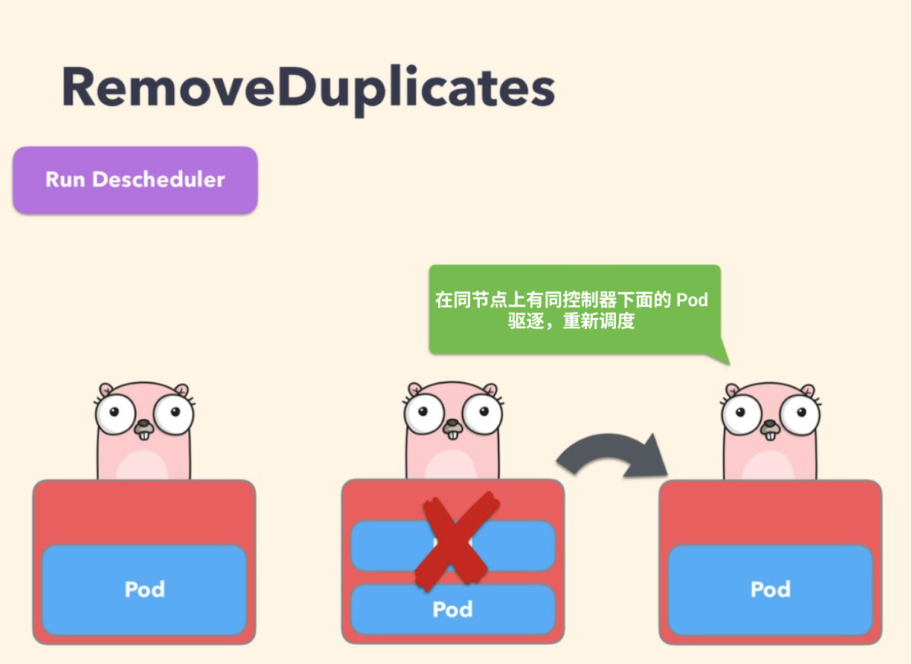

## 官方的默认策略配置

查看官方仓库推荐的默认策略配置：

```bash
cat kubernetes/base/configmap.yaml
```

配置文件内容

```yaml
---
apiVersion: v1
kind: ConfigMap
metadata:
  name: descheduler-policy-configmap
  namespace: kube-system
data:
  policy.yaml: |
    apiVersion: "descheduler/v1alpha1"
    kind: "DeschedulerPolicy"
    strategies:
      "RemoveDuplicates":
        enabled: true
      "RemovePodsViolatingInterPodAntiAffinity":
        enabled: true
      "LowNodeUtilization":
        enabled: true
        params:
          nodeResourceUtilizationThresholds:
            thresholds:
              "cpu" : 20
              "memory": 20
              "pods": 20
            targetThresholds:
              "cpu" : 50
              "memory": 50
              "pods": 50

```

## 调度策略分类

descheduler 目前提供了如下几种调度策略:

- [RemoveDuplicates](https://github.com/kubernetes-sigs/descheduler#removeduplicates) 驱逐同一个节点上的多 Pod
- [LowNodeUtilization](https://github.com/kubernetes-sigs/descheduler#lownodeutilization) 查找低负载节点，从其他节点上驱逐 Pod
- [HighNodeUtilization](https://github.com/kubernetes-sigs/descheduler#highnodeutilization) 查找高负载节点，驱逐上面的 Pod
- [RemovePodsViolatingInterPodAntiAffinity](https://github.com/kubernetes-sigs/descheduler#removepodsviolatinginterpodantiaffinity) 驱逐违反 Pod 反亲和性的 Pod
- [RemovePodsViolatingNodeAffinity](https://github.com/kubernetes-sigs/descheduler#removepodsviolatingnodeaffinity) 驱逐违反 Node 反亲和性的 Pod
- [RemovePodsViolatingNodeTaints](https://github.com/kubernetes-sigs/descheduler#removepodsviolatingnodetaints) 违反 NoSchedule 污点的 Pod
- [RemovePodsViolatingTopologySpreadConstraint](https://github.com/kubernetes-sigs/descheduler#removepodsviolatingtopologyspreadconstraint) 驱逐违反拓扑域的 Pod
- [RemovePodsHavingTooManyRestarts](https://github.com/kubernetes-sigs/descheduler#removepodshavingtoomanyrestarts) 驱逐重启次数太多的 Pod
- [PodLifeTime](https://github.com/kubernetes-sigs/descheduler#podlifetime) 驱逐运行时间超过指定时间的 Pod
- [RemoveFailedPods](https://github.com/kubernetes-sigs/descheduler#removefailedpods) 驱逐失败状态的 Pod

### RemoveDuplicates

该策略确保只有一个和 Pod 关联的 RS、Deployment 或者 Job 资源对象运行在同一节点上

如果还有更多的 Pod 则将这些重复的 Pod 进行驱逐，以便更好地在集群中分散 Pod

如果某些节点由于某些原因崩溃了，这些节点上的 Pod 漂移到了其他节点，导致多个与 RS 关联的 Pod 在同一个节点上运行，就有可能发生这种情况，一旦出现故障的节点再次准备就绪，就可以启用该策略来驱逐这些重复的 Pod



配置策略的时候，可以指定参数 `excludeOwnerKinds` 用于排除类型，这些类型下的 Pod 不会被驱逐：

```yaml
apiVersion: "descheduler/v1alpha1"
kind: "DeschedulerPolicy"
strategies:
  "RemoveDuplicates":
     enabled: true
     params:
       removeDuplicates:
         excludeOwnerKinds:
         - "ReplicaSet"

```

### LowNodeUtilization

该策略主要用于查找未充分利用的节点，并从其他节点驱逐 Pod，以便 kube-scheudler 重新将它们调度到未充分利用的节点上

该策略的参数可以通过字段 `nodeResourceUtilizationThresholds` 进行配置

节点的利用率不足可以通过配置 `thresholds` 阈值参数来确定，可以通过 CPU、内存和 Pods 数量的百分比进行配置。如果节点的使用率均低于所有阈值，则认为该节点未充分利用


此外，还有一个可配置的阈值 `targetThresholds`，用于计算可能驱逐 Pods 的潜在节点，该参数也可以配置 CPU、内存以及 Pods 数量的百分比进行配置

`thresholds` 和 `targetThresholds` 可以根据你的集群需求进行动态调整，如下所示示例：

```yaml
apiVersion: "descheduler/v1alpha1"
kind: "DeschedulerPolicy"
strategies:
  "LowNodeUtilization":
     enabled: true
     params:
       nodeResourceUtilizationThresholds:
         thresholds:
           "cpu" : 20
           "memory": 20
           "pods": 20
         targetThresholds:
           "cpu" : 50
           "memory": 50
           "pods": 50

```

需要注意的是：

- 仅支持以下三种资源类型：cpu、memory、pods
- `thresholds` 和 `targetThresholds` 必须配置相同的类型
- 参数值的访问是 0-100（百分制）
- 相同的资源类型，`thresholds` 的配置不能高于 `targetThresholds` 的配置

如果未指定任何资源类型，则默认是 100%，以避免节点从未充分利用变为过度利用

和 `LowNodeUtilization` 策略关联的另一个参数是 `numberOfNodes`，只有当未充分利用的节点数大于该配置值的时候，才可以配置该参数来激活该策略，该参数对于大型集群非常有用，其中有一些节点可能会频繁使用或短期使用不足，默认情况下，numberOfNodes 为 0

### HighNodeUtilization

### RemovePodsViolatingInterPodAntiAffinity

该策略可以确保从节点中删除违反 Pod 反亲和性的 Pod，比如某个节点上有 podA 这个 Pod，并且 podB 和 podC（在同一个节点上运行）具有禁止它们在同一个节点上运行的反亲和性规则，则 podA 将被从该节点上驱逐，以便 podB 和 podC 运行正常运行

当 podB 和 podC 已经运行在节点上后，反亲和性规则被创建就会发送这样的问题


要禁用该策略，直接配置成 false 即可：

```yaml
apiVersion: "descheduler/v1alpha1"
kind: "DeschedulerPolicy"
strategies:
  "RemovePodsViolatingInterPodAntiAffinity":
     enabled: false

```

### RemovePodsViolatingNodeAffinity

该策略确保从节点中删除违反节点亲和性的 Pod

比如名为 podA 的 Pod 被调度到了节点 nodeA，podA 在调度的时候满足了节点亲和性规则 `requiredDuringSchedulingIgnoredDuringExecution`，但是随着时间的推移，节点 nodeA 不再满足该规则了，那么如果另一个满足节点亲和性规则的节点 nodeB 可用，则 podA 将被从节点 nodeA 驱逐

如下所示的策略配置示例：

```yaml
apiVersion: "descheduler/v1alpha1"
kind: "DeschedulerPolicy"
strategies:
  "RemovePodsViolatingNodeAffinity":
    enabled: true
    params:
      nodeAffinityType:
      - "requiredDuringSchedulingIgnoredDuringExecution"

```

### RemovePodsViolatingNodeTaints

该策略可以确保从节点中删除违反 `NoSchedule` 污点的 Pod，比如有一个名为 podA 的 Pod，通过配置容忍 `key=value:NoSchedule` 允许被调度到有该污点配置的节点上

如果节点的污点随后被更新或者删除了，则污点将不再被 Pods 的容忍满足，然后将被驱逐：

```yaml
apiVersion: "descheduler/v1alpha1"
kind: "DeschedulerPolicy"
strategies:
  "RemovePodsViolatingNodeTaints":
    enabled: true

```

### RemovePodsViolatingTopologySpreadConstraint

该策略确保从节点驱逐违反拓扑分布约束的 Pods，具体来说，它试图驱逐将拓扑域平衡到每个约束的 `maxSkew` 内所需的最小 Pod 数，不过该策略需要 k8s 版本高于 1.18 才能使用。

默认情况下，此策略仅处理硬约束，如果将参数 `includeSoftConstraints` 设置为 True，也将支持软约束。

```yaml
apiVersion: "descheduler/v1alpha1"
kind: "DeschedulerPolicy"
strategies:
  "RemovePodsViolatingTopologySpreadConstraint":
     enabled: true
     params:
       includeSoftConstraints: false

```

### RemovePodsHavingTooManyRestarts

该策略确保从节点中删除重启次数过多的 Pods，它的参数包括 `podRestartThreshold`（这是应将 Pod 逐出的重新启动次数），以及包括`InitContainers`，它确定在计算中是否应考虑初始化容器的重新启动，策略配置如下所示：

```yaml
apiVersion: "descheduler/v1alpha1"
kind: "DeschedulerPolicy"
strategies:
  "RemovePodsHavingTooManyRestarts":
     enabled: true
     params:
       podsHavingTooManyRestarts:
         podRestartThreshold: 100
         includingInitContainers: true

```

### PodLifeTime

该策略用于驱逐比 `maxPodLifeTimeSeconds` 更旧的 Pods，可以通过 `podStatusPhases` 来配置哪类状态的 Pods 会被驱逐

建议为每个应用程序创建一个 PDB，以确保应用程序的可用性

比如我们可以配置如下所示的策略来驱逐运行超过7天的 Pod：

```yaml
apiVersion: "descheduler/v1alpha1"
kind: "DeschedulerPolicy"
strategies:
  "PodLifeTime":
    enabled: true
    params:
      maxPodLifeTimeSeconds: 604800  # Pods 运行最多7天

```

### RemoveFailedPods

