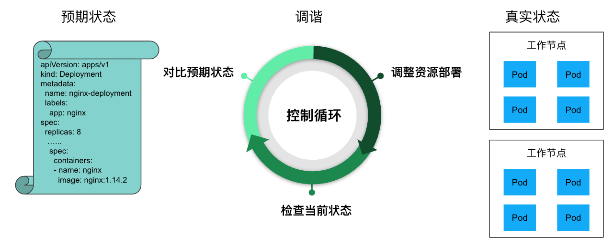

## Controller 和 Operator

在 K8s 中，Controller 是一个重要的组件，它可以根据我们的期望状态和实际状态来进行调谐，以确保我们的应用程序始终处于所需的状态。

在 K8s 中，用户通过声明式 API 定义资源的 “预期状态”，Controller 则负责监视资源的实际状态，当资源的实际状态和 “预期状态” 不一致时，Controller 则对系统进行必要的更改，以确保两者一致，这个过程被称之为调谐（Reconcile）。

例如下图中，用户定义了一个 Deployment 资源，其中指定了运行的容器镜像，副本数等信息。Deployment Controller 会根据该定义在 K8s 节点上创建对应的 Pod，并对这些 Pod 进行持续监控。如果某个 Pod 异常退出了，Deployment Controller 会重新创建一个 Pod，以保证系统的实际状态和用户定义的 “预期状态”（8 个副本）一致。

K8s Controller 的控制循环：

K8s 中有多种类型的 Controller，例如 Deployment Controller、ReplicaSet Controller 和 StatefulSet Controller 等。每个控制器都有不同的工作原理和适用场景，但它们的基本原理都是相同的。也可以根据需要编写 Controller 来实现自定义的业务逻辑。

有时候 Controller 也被叫做 Operator。Controller 是一个通用的术语，凡是遵循 “Watch K8s 资源并根据资源变化进行调谐” 模式的控制程序都可以叫做 Controller。而 Operator 是一种专用的 Controller，用于在 Kubernetes 中管理一些复杂的，有状态的应用程序。例如在 Kubernetes 中管理 MySQL 数据库的 MySQL Operator。

- Controller 负责 “怎么让状态一致”（通用机制）。
- Operator 负责 “怎么像人类运维专家一样去管理某个具体应用”（业务专属的高级 Controller）。

## 开发工具

以下是一些库和工具，可以用于编写自己的 Controller / Operator

- kubebuilder：<https://github.com/kubernetes-sigs/kubebuilder>
- Operator Framework：<https://github.com/operator-framework/operator-sdk>
- shell-operator：<https://github.com/flant/shell-operator>
- Charmed Operator Framework：<https://juju.is/>
- Java Operator SDK：<https://github.com/operator-framework/java-operator-sdk>
- Kopf（kubernetes Operator Pythonic Framework）：<https://github.com/nolar/kopf>
- kube-rs（Rust）：<https://kube.rs/>
- KubeOps （.NET operator SDK）：<https://buehler.github.io/dotnet-operator-sdk/>
- KUDO（Kubernetes 通用声明式Operator）：<https://kudo.dev/>
- Mast：<https://docs.ansi.services/mast/user_guide/operator/>
- Metacontroller：<https://metacontroller.github.io/metacontroller/intro.html>

## 开发对比

采用 Informer，Controller runtime 和 Kubebuilder 来编写 Controller 的区别：

- 直接使用 Informer：直接使用 Informer 编写 Controller 需要编写更多的代码，因为需要在代码处理更多的底层细节，例如如何在集群中监视资源，以及如何处理资源变化的通知。但是，使用 Informer 也可以更加自定义和灵活，因为可以更细粒度地控制 Controller 的行为。
- Controller runtime：Controller runtime 是基于 Informer 实现的，在 Informer 之上为 Controller 编写提供了高级别的抽象和帮助类，包括 Leader Election、Event Handling 和 Reconcile Loop 等等。使用 Controller runtime，可以更容易地编写和测试 Controller，因为它已经处理了许多底层的细节。
- Kubebuilder：和 Informer 及 Controller runtime 不同，Kubebuilder 并不是一个代码库，而是一个开发框架。Kubebuilder 底层使用了 controller-runtime。Kubebuilder 提供了 CRD 生成器和代码生成器等工具，可以帮助开发者自动生成一些重复性的代码和资源定义，提高开发效率。同时，Kubebuilder 还可以生成 Webhooks，以用于验证自定义资源。