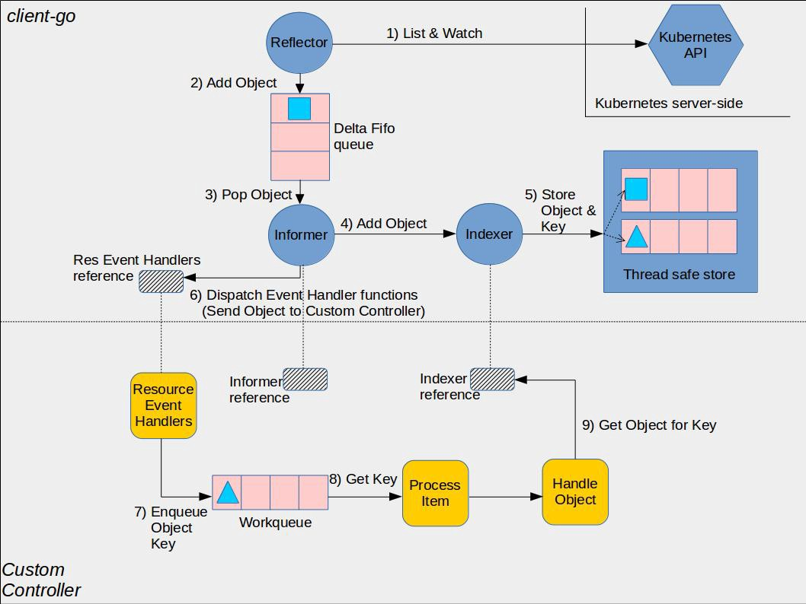

## Informer 机制

### Informer 工作流程

采用 k8s HTTP API 可以查询 K8s API 资源对象并 Watch 其变化，但大量的 HTTP 调用会对 API Server 造成较大的负荷，而且网络调用可能存在较大的延迟。除此之外，开发者还需要在程序中处理资源的缓存，HTTP 链接出问题后的重连等。为了解决这些问题并简化 Controller 的开发工作，K8s 在 client go 中提供了一个 informer 客户端库。

在 Kubernetes 中，Informer 是一个客户端库，用于监视 Kubernetes API 服务器中的资源并将它们的当前状态缓存到本地。Informer 提供了一种方法，让客户端应用程序可以高效地监视资源的更改，而无需不断地向 API 服务器发出请求。

相比直接采用 HTTP Watch，使用 Kubernetes Informer 有以下优势：

- 减少 API 服务器的负载：通过在本地缓存资源信息，Informer 减少了需要向 API 服务器发出的请求数量。这可以防止由于 API 服务器过载而影响整个集群的性能。
- 提高应用程序性能：使用缓存的数据，客户端应用程序可以快速访问资源信息，而无需等待 API 服务器响应。这可以提高应用程序性能并减少延迟。
- 简化代码：Informer 提供了一种更简单、更流畅的方式来监视 Kubernetes 中的资源更改。客户端应用程序可以使用现有的 Informer 库来处理这些任务，而无需编写复杂的代码来管理与 API 服务器的连接并处理更新。
- 更高的可靠性：由于 Informer 在本地缓存数据，因此即使 API 服务器不可用或存在问题，它们也可以继续工作。这可以确保客户端应用程序即使在底层 Kubernetes 基础结构出现问题时也能保持功能。

采用 Informer 库编写的 Controller 的架构如下图所示：



图中间的虚线将图分为上下两部分，其中上半部分是 Informer 库中的组件，下半部分则是使用 Informer 库编写的自定义 Controller 中的组件，这两部分一起组成了一个完整的 Controller。

采用 Informer 机制编写的 Controller 中的主要流程如下：

（1）Reflector 采用 K8s HTTP API List/Watch API Server 中指定的资源。

Reflector 会先 List 资源，然后使用 List 接口返回的 resourceVersion 来 watch 后续的资源变化。

对应的源码：<https://github.com/kubernetes/client-go/blob/v0.37.0/tools/cache/reflector.go#L463>

（2）Reflector 将 List 得到的资源列表和后续的资源变化放到一个 FIFO（先进先出）队列中。

对应的源码：

- 使用 List 的结果刷新 FIFO 队列 <https://github.com/kubernetes/client-go/blob/v0.37.0/tools/cache/reflector.go#L776>
- 将 Watch 收到的事件加入到 FIFO 队列 <https://github.com/kubernetes/client-go/blob/v0.37.0/tools/cache/reflector.go#L1037>

（3）Informer 在一个循环中从 FIFO 队列中拿出资源对象进行处理。

对应的源码：<https://github.com/kubernetes/client-go/blob/v0.37.0/tools/cache/controller.go#L244>

（4）Informer 将从 FIFO 队列中拿出的资源对象放到 Indexer 中。

对应的源码：<https://github.com/kubernetes/client-go/blob/v0.37.0/tools/cache/controller.go#L833>

Indexer 是 Informer 中的一个本地缓存，该缓存提供了索引功能（这是该组件取名为 Indexer 的原因），允许基于特定条件（如标签、注释或字段选择器）快速有效地查找资源。此处代码中的 clientState 就是 Indexer，来自于 NewIndexerInformer 方法中构建的 Indexer，该 Indexer 作为 clientState 参数传递给了 newInformer 方法。

对应的源码：<https://github.com/kubernetes/client-go/blob/v0.37.0/tools/cache/controller.go#L749>

（5）Indexer 将收到的资源对象放入其内部的缓存 ThreadSafeStore 中。

对应的源码：<https://github.com/kubernetes/client-go/blob/v0.37.0/tools/cache/thread_safe_store.go#L46>

（6）回调 Controller 的 ResourceEventHandler，将资源对象变化通知到应用逻辑。

对应的源码：<https://github.com/kubernetes/client-go/blob/v0.37.0/tools/cache/controller.go#L860>

（7）在 ResourceEventHandler 对资源对象的变化进行处理。

ResourceEventHandler 处于用户的 Controller 代码中，k8s 推荐的编程范式是将收到的消息放入到一个队列中，然后在一个循环中处理该队列中的消息，执行调谐逻辑。推荐该模式的原因是采用队列可以解耦消息生产者（Informer）和消费者（Controller 调谐逻辑），避免消费者阻塞生产者。在用户代码中需要注意几点：

- Reflector 会使用 List 的结果刷新 FIFO 队列，因此 ResourceEventHandler 收到的资源变化消息其实包含了 Informer 启动时获取的完整资源列表，Informer 会采用 ADDED 事件将列表的资源通知到用户 Controller。该机制屏蔽了 List 和 Watch 的细节，保证用户的 ResourceEventHandler 代码中会接收到 Controller 监控的资源的完整数据，包括启动 Controller 前已有的资源数据，以及之后的资源变化。
- ResourceEventHandler 中收到的消息中只有资源对象的 key，用户在 Controller 中可以使用该 key 为关键字，通过 Indexer 查询本地缓存中的完整资源对象。

### 示例

下面是采用 Informer 机制来创建 Controller 的例子，源码在：<https://github.com/kubernetes/client-go/blob/master/examples/workqueue/main.go>

该示例 Controller 监控了 default namespace 中的 Pod 资源，在 syncToStdout 方法中打印了 pod 名称。

- 在启动 Controller 时需要调用 `c.informer.RunWithContext(ctx)` 方法。该方法会调用 Reflector 的 ListAndWatch 方法。ListAndWatch 首先采用 HTTP List API 从 K8s API Server 获取当前的资源列表，然后调用 HTTP Watch API 对资源变化进行监控，并把 List 和 Watch 的收到的资源通过 ResourceEventHandlerFuncs 的 AddFunc UpdateFunc DeleteFunc 三个回调接口分发给 Controller。
- 在开始对队列中的资源事件进行处理之前，先调用 `cache.WaitForNamedCacheSyncWithContext(ctx, c.informer.HasSynced)` 。正如其方法名所示，该方法确保 Informer 的本地缓存已经和 K8s API Server 的资源数据进行了同步。当 Reflector 成功调用 ListAndWatch 方法从 K8s API Server 获取到需要监控的资源数据并保存到本地缓存后，会将 `c.informer.HasSynced` 设置为 true。在开始业务处理前调用该方法可以确保在本地缓存中的资源数据是和 K8s API Server 中的数据一致的。
- 在对事件进行处理之后，需要调用 `c.queue.Done(key)` 方法将事件从队列中删除，以避免重复处理。
- 如果处理时发生异常，可以通过 `c.queue.AddRateLimited(key)` 将出错事件的 key 重新加入到队列中。该方法会对重新加入队列的错误消息进行限流，缺省的限流规则是 10 qps。这意味着当 1 秒内出错的消息大于 10 条时，10 条后的错误消息就会在等待一段时间后才会被重新加入到队列中。

```go
package main

import (
	"context"
	"errors"
	"flag"
	"fmt"
	"time"

	"k8s.io/klog/v2"

	v1 "k8s.io/api/core/v1"
	meta_v1 "k8s.io/apimachinery/pkg/apis/meta/v1"
	"k8s.io/apimachinery/pkg/fields"
	"k8s.io/apimachinery/pkg/util/runtime"
	"k8s.io/apimachinery/pkg/util/wait"
	"k8s.io/client-go/kubernetes"
	"k8s.io/client-go/tools/cache"
	"k8s.io/client-go/tools/clientcmd"
	"k8s.io/client-go/util/workqueue"
)

// Controller demonstrates how to implement a controller with client-go.
type Controller struct {
	indexer  cache.Indexer
	queue    workqueue.TypedRateLimitingInterface[string]
	informer cache.Controller
}

// NewController creates a new Controller.
func NewController(queue workqueue.TypedRateLimitingInterface[string], indexer cache.Indexer, informer cache.Controller) *Controller {
	return &Controller{
		informer: informer,
		indexer:  indexer,
		queue:    queue,
	}
}

func (c *Controller) processNextItem(logger klog.Logger) bool {
	// Wait until there is a new item in the working queue
	key, quit := c.queue.Get()
	if quit {
		return false
	}
	// Tell the queue that we are done with processing this key. This unblocks the key for other workers
	// This allows safe parallel processing because two pods with the same key are never processed in
	// parallel.
	defer c.queue.Done(key)

	// Invoke the method containing the business logic
	err := c.syncToStdout(key)
	// Handle the error if something went wrong during the execution of the business logic
	c.handleErr(logger, err, key)
	return true
}

// syncToStdout is the business logic of the controller. In this controller it simply prints
// information about the pod to stdout. In case an error happened, it has to simply return the error.
// The retry logic should not be part of the business logic.
func (c *Controller) syncToStdout(key string) error {
	obj, exists, err := c.indexer.GetByKey(key)
	if err != nil {
		return fmt.Errorf("fetching object with key %s from store failed: %w", key, err)
	}

	if !exists {
		// Below we will warm up our cache with a Pod, so that we will see a delete for one pod
		fmt.Printf("Pod %s does not exist anymore\n", key)
	} else {
		// Note that you also have to check the uid if you have a local controlled resource, which
		// is dependent on the actual instance, to detect that a Pod was recreated with the same name
		fmt.Printf("Sync/Add/Update for Pod %s\n", obj.(*v1.Pod).GetName())
	}
	return nil
}

// handleErr checks if an error happened and makes sure we will retry later.
func (c *Controller) handleErr(logger klog.Logger, err error, key string) {
	if err == nil {
		// Forget about the #AddRateLimited history of the key on every successful synchronization.
		// This ensures that future processing of updates for this key is not delayed because of
		// an outdated error history.
		c.queue.Forget(key)
		return
	}

	// This controller retries 5 times if something goes wrong. After that, it stops trying.
	if c.queue.NumRequeues(key) < 5 {
		logger.Info("Syncing failed, will retry", "pod", key, "err", err)

		// Re-enqueue the key rate limited. Based on the rate limiter on the
		// queue and the re-enqueue history, the key will be processed later again.
		c.queue.AddRateLimited(key)
		return
	}

	c.queue.Forget(key)
	// Report to an external entity that, even after several retries, we could not successfully process this key
	runtime.HandleErrorWithLogger(logger, err, "Dropping pod out of the queue", "pod", key)
}

// Run begins watching and syncing.
func (c *Controller) Run(ctx context.Context, workers int) {
	defer runtime.HandleCrashWithContext(ctx)
	logger := klog.FromContext(ctx)

	// Let the workers stop when we are done
	defer c.queue.ShutDown()
	logger.Info("Starting Pod controller")
	defer logger.Info("Stopping Pod controller")

	go c.informer.RunWithContext(ctx)

	// Wait for all involved caches to be synced, before processing items from the queue is started
	if !cache.WaitForNamedCacheSyncWithContext(ctx, c.informer.HasSynced) {
		runtime.HandleError(fmt.Errorf("Timed out waiting for caches to sync"))
		return
	}

	for i := 0; i < workers; i++ {
		go wait.UntilWithContext(ctx, c.runWorker, time.Second)
	}

	<-ctx.Done()
}

func (c *Controller) runWorker(ctx context.Context) {
	logger := klog.FromContext(ctx)
	for c.processNextItem(logger) {
	}
}

func main() {
	var kubeconfig string
	var master string

	flag.StringVar(&kubeconfig, "kubeconfig", "", "absolute path to the kubeconfig file")
	flag.StringVar(&master, "master", "", "master url")
	flag.Parse()

	// Some more complete example could also allow configuring different logging backends.
	// In this one we use the klog default.
	logger := klog.Background()

	// creates the connection
	config, err := clientcmd.BuildConfigFromFlags(master, kubeconfig)
	if err != nil {
		logger.Error(err, "Building Kubernetes client config failed")
		klog.FlushAndExit(klog.ExitFlushTimeout, 1)
	}

	// creates the clientset
	clientset, err := kubernetes.NewForConfig(config)
	if err != nil {
		logger.Error(err, "Building Kubernetes client failed")
		klog.FlushAndExit(klog.ExitFlushTimeout, 1)
	}

	ctx := context.Background()

	// create the pod watcher
	podListWatcher := cache.NewListWatchFromClient(clientset.CoreV1().RESTClient(), "pods", v1.NamespaceDefault, fields.Everything())

	// create the workqueue
	queue := workqueue.NewTypedRateLimitingQueue(workqueue.DefaultTypedControllerRateLimiter[string]())

	// Bind the workqueue to a cache with the help of an informer. This way we make sure that
	// whenever the cache is updated, the pod key is added to the workqueue.
	// Note that when we finally process the item from the workqueue, we might see a newer version
	// of the Pod than the version which was responsible for triggering the update.
	indexer, informer := cache.NewIndexerInformer(podListWatcher, &v1.Pod{}, 0, cache.ResourceEventHandlerFuncs{
		AddFunc: func(obj interface{}) {
			key, err := cache.MetaNamespaceKeyFunc(obj)
			if err == nil {
				queue.Add(key)
			}
		},
		UpdateFunc: func(old interface{}, new interface{}) {
			key, err := cache.MetaNamespaceKeyFunc(new)
			if err == nil {
				queue.Add(key)
			}
		},
		DeleteFunc: func(obj interface{}) {
			// IndexerInformer uses a delta queue, therefore for deletes we have to use this
			// key function.
			key, err := cache.DeletionHandlingMetaNamespaceKeyFunc(obj)
			if err == nil {
				queue.Add(key)
			}
		},
	}, cache.Indexers{})

	controller := NewController(queue, indexer, informer)

	// We can now warm up the cache for initial synchronization.
	// Let's suppose that we knew about a pod "mypod" on our last run, therefore add it to the cache.
	// If this pod is not there anymore, the controller will be notified about the removal after the
	// cache has synchronized.
	indexer.Add(&v1.Pod{
		ObjectMeta: meta_v1.ObjectMeta{
			Name:      "mypod",
			Namespace: v1.NamespaceDefault,
		},
	})

	// Now let's start the controller
	cancelCtx, cancel := context.WithCancelCause(ctx)
	defer cancel(errors.New("time to stop because main has completed"))
	go controller.Run(cancelCtx, 1)

	// Wait forever
	select {}
}

```

## SharedInformer

如果在一个应用中有多处相互独立的业务逻辑都需要监控同一种资源对象，用户会编写多个 Informer 来进行处理。这会导致应用中发起对 K8s API Server 同一资源的多次 ListAndWatch 调用，并且每一个 Informer 中都有一份单独的本地缓存，增加了内存占用。

K8s 在 client go 中基于 Informer 之上再做了一层封装，提供了 SharedInformer 机制。采用 SharedInformer 后，客户端对同一种资源对象只会有一个对 API Server 的 ListAndWatch 调用，多个 Informer 也会共用同一份缓存，减少了对 API Server 的请求，提高了性能。

SharedInformerFactory 中有一个 Informer Map。当应用代码调用 InformerFactory 获取某一资源类型的 Informer 时， SharedInformer 会判断该类型的 Informer 是否存在，如果不存在就新建一个 Informer 并保存到该 Map 中，如果已存在则直接返回该 Informer。因此应用中所有从 InformerFactory 中取出的同一类型的 Informer 都是同一个实例。


