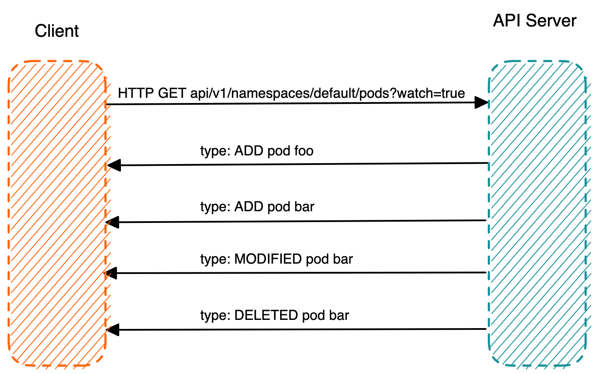

K8s API Server 提供了获取某类资源集合的 HTTP API，此类 API 被称为 List 接口。例如下面的 URL 可以列出 default namespace 下面的 pod。

```bash
HTTP GET api/v1/namespaces/default/pods
```

在该 URL 后面加上参数 `?watch=true`，则 API Server 会对 default namespace 下面的 pod 的状态进行持续监控，并在 pod 状态发生变化时通过 chunked Response (HTTP 1.1) 或者 Server Push（HTTP2）通知到客户端。K8s 称此机制为 watch。

```bash
HTTP GET api/v1/namespaces/default/pods?watch=true
```



通过使用 `curl` 命令向 K8s API Server 发起 HTTP GET 请求，可以很直观地查看 K8s 的 List 和 Watch 接口的返回数据。

首先通过 `kubectl proxy` 启动 API Server 的代理服务器。

```bash
kubectl proxy --port 8080
```

通过 `curl` 来 List pod 资源。

```bash
curl http://localhost:8080/api/v1/namespaces/default/pods
```

在该命令的输出中，可以看到 HTTP Response 是一个 json 格式的数据结构，里面列出来目前 default namespace 中的所有 pod。在返回数据结构中有一个 `resourceVersion` 字段，该字段的值是此次 List 操作得到的资源的版本号。在 watch 请求中可以带上该版本号作为参数，API Server 会 watch 将该版本之后的资源变化并通知客户端。

```json
{
  "kind": "PodList",
  "apiVersion": "v1",
  "metadata": {
    "resourceVersion": "770715" //资源版本号
  },
  "items": [
    {
      "metadata": {
        "name": "foo",
        "namespace": "default",
        "uid": "d6adfe72-4e90-4b6e-bf14-b6192acb5d07",
        "resourceVersion": "762448",
        "creationTimestamp": "2023-03-10T16:16:02Z",
        "annotations": {…},
        "managedFields": […]
      },
      "spec": {…},
      "status": {…}
    },
	{
      "metadata": {
        "name": "bar",
        "namespace": "default",
        "uid": "bac55478-ad8d-49a6-bab2-23bfdc788736",
        "resourceVersion": "762904",
        "creationTimestamp": "2023-03-10T16:19:17Z",
        "annotations": {…},
        "managedFields": […]
      },
      "spec": {…},
      "status": {…}
    }
  ]
}
```

在请求中加上 watch 参数，并带上前面 List 返回的版本号，以 watch pod 资源的变化。

```bash
curl http://localhost:8080/api/v1/namespaces/default/pods?watch=true&resourceVersion=770715
```

在另一个终端中创建一个名为 test 的 pod，然后将其删除，可以看到下面的输出：

```bash
{"type":"ADDED","object":{"kind":"Pod","apiVersion":"v1","metadata":...
{"type":"ADDED","object":{"kind":"Pod","apiVersion":"v1","metadata":...
{"type":"MODIFIED","object":{"kind":"Pod","apiVersion":"v1","metadata":...
{"type":"MODIFIED","object":{"kind":"Pod","apiVersion":"v1","metadata":..
{"type":"MODIFIED","object":{"kind":"Pod","apiVersion":"v1","metadata":...
{"type":"DELETED","object":{"kind":"Pod","apiVersion":"v1","metadata":...
```

从上面 HTTP Watch 返回的 Response 中，可以看到有三种类型的事件：ADDED，MODIFIED 和 DELETED。ADDED 表示创建了新的 Pod，Pod 的状态变化会产生 MODIFIED 类型的事件，DELETED 则表示 Pod 被删除。

利用 K8s 的 HTTP API，可以编写一个最简化版本的 “Controller”。例如下面的程序，该程序的实现逻辑和前面的 curl 请求是相同的，也是通过 HTTP GET 请求来 watch pod 资源。这个 “Controller” 只是用于展示 HTTP API 的 Watch 机制，其中并没有调谐的业务逻辑，只是将 HTTP Response 中收到的事件打印出来。

```go
package main

import (
	"crypto/tls"
	"encoding/json"
	"fmt"
	"net/http"
	"time"
)

const token = "TOKEN_HERE"
const apiServer = "https://127.0.0.1:6443"

type Pod struct {
	Metadata struct {
		Name              string    `json:"name"`
		Namespace         string    `json:"namespace"`
		CreationTimestamp time.Time `json:"creationTimestamp"`
	} `json:"metadata"`
}

type Event struct {
	EventType string `json:"type"`
	Object    Pod    `json:"object"`
}

func main() {
	// create an HTTP client with authorization token or certificate
	client := &http.Client{
		Transport: &http.Transport{
			TLSClientConfig: &tls.Config{
				InsecureSkipVerify: true, // only use this for testing purposes
			},
		},
	}
	req, err := http.NewRequest("GET", apiServer+"/api/v1/namespaces/default/pods?watch=true",
		nil)
	if err != nil {
		panic(err)
	}
	req.Header.Set("Authorization", "Bearer "+token)

	// send the initial request to list all pods
	resp, err := client.Do(req)
	if err != nil {
		panic(err)
	}
	defer resp.Body.Close()

	var event Event
	decoder := json.NewDecoder(resp.Body)

	// read the response and parse event
	for {
		if err := decoder.Decode(&event); err != nil {
			panic(err)
		}
		fmt.Printf("%s Pod %s \n", event.EventType, event.Object.Metadata.Name)
	}
}

```

为了方便开发者使用，k8s 提供了对封装了 HTTP watch 机制的 go client。如果使用 k8s go client，几十行代码就可以实现一个简单的 Controller，如下所示：

```go
// Example Kubernetes controller using Go and the Kubernetes API client libraries

package main

import (
	"context"
	"fmt"

	corev1 "k8s.io/api/core/v1"
	metav1 "k8s.io/apimachinery/pkg/apis/meta/v1"
	"k8s.io/apimachinery/pkg/watch"
	"k8s.io/client-go/kubernetes"
	"k8s.io/client-go/rest"
)

func main() {
	// create a Kubernetes API client
	config, err := rest.InClusterConfig()
	if err != nil {
		panic(err.Error())
	}
	clientSet, err := kubernetes.NewForConfig(config)
	if err != nil {
		panic(err.Error())
	}

	// watch for changes to pods
	watcher, err := clientSet.CoreV1().Pods("").Watch(context.Background(), metav1.ListOptions{})
	if err != nil {
		panic(err.Error())
	}

	// loop through events from the watcher
	for event := range watcher.ResultChan() {
		pod := event.Object.(*corev1.Pod)
		switch event.Type {
		case watch.Added:
			fmt.Printf("Pod %s added\n", pod.Name)
			// todo: reconcile logic goes here
		case watch.Modified:
			fmt.Printf("Pod %s modified\n", pod.Name)
			// todo: reconcile logic goes here
		case watch.Deleted:
			fmt.Printf("Pod %s deleted\n", pod.Name)
			// todo: reconcile logic goes here
		}
	}
}

```

