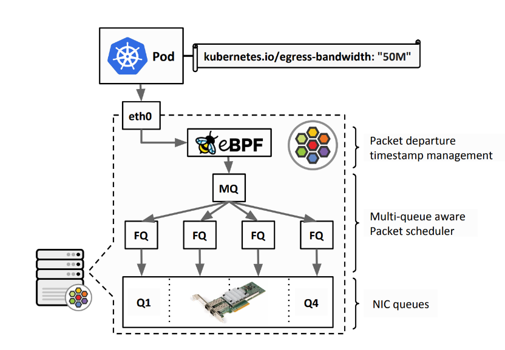

Cilium 的带宽管理器（Bandwidth Manager）负责更有效地管理网络流量，目的是改善整体应用的延迟和吞吐量。

除了原生支持 Kubernetes Pod bandwidth annotations 外，带宽管理器（首次在 Cilium 1.9 中引入）还在所有面向外部的网络设备上设置公平队列（FQ）队列规则，以支持 TCP 堆栈步调（例如 EDT/BBR），并为网络堆栈设置最佳的服务器级 sysctl 设置。

带宽管理器的功能主要集中在两个方面，即从上层协议和从队列规范的角度。

带宽管理器启用后，默认情况下会将 TCP 拥塞控制算法切换为 BBR，从而实现更高的带宽和更低的延迟，尤其是面向互联网的流量。它将内核网络堆栈配置为更面向服务器的 sysctl 设置，这些设置已在生产环境中证明是有益的。它还重新配置了流量控制队列规则（Qdisc）层，以便在 Cilium  使用的所有面向外部的网络设备上使用多队列 Qdiscs 和公平队列（FQ）。切换到公平队列后，带宽管理器还在 eBPF  的帮助下实现了对最早出发时间 Earliest Departure Time（EDT）速率限制的支持，并且现在原生支持 `kubernetes.io/egress-bandwidth` Pod 注释。

这也消除了对带宽 CNI 插件链的需求，因为该插件使用了 TBF（Token Bucket Filter,  令牌桶过滤器），在可扩展性方面受到限制。通过基于 EDT 的模型，可以避免 Qdisc 层的全局锁定，尤其是在多队列网卡的情况下。Cilium 的 eBPF 数据路径会将网络流量分类到每个节点的聚合中，然后在将数据包传递到 FQ leaf Qdiscs  前不久，通过在出口的网络数据包上设置最早离开时间戳，执行用户定义的  `kubernetes.io/egress-bandwidth` 速率。Qdiscs 维护每个流的状态，并根据数据包的时间戳来安排数据包的离开时间，确保数据包不会在时间戳规定的时间之前被发送出去。通过 eBPF 的灵活性，对 Pod 聚合体的分类不仅适用于直接路由，也适用于隧道或使用 L7 代理的情况。



与 eBPF 和 FQ 相比，在使用 HTB（Hierarchical Token Bucket, 分层令牌桶）进行速率限制的情况下，对应用延迟进行的评估表明，在改善传输延迟的同时，CPU 利用率也能显著降低。当 eBPF 和 FQ 结合使用时，第 95 百分位的延迟降低了约 20 倍，第 99 百分位的延迟降低了约 10 倍。

启用方式（Helm）

```yaml
bandwidthManager:
  enabled: true
  bbr: true
```

查看配置是否生效

```bash
# kubectl -n kube-system exec ds/cilium -- cilium status | grep BandwidthManager
BandwidthManager:       EDT with BPF [BBR] [nm-bond]
```

测试 Pod，使用了 `kubernetes.io/egress-bandwidth` 注释，其出口带宽被限制为 50 Mbit/s：

```yaml
apiVersion: apps/v1
kind: DaemonSet
metadata:
  name: iperf3
  namespace: default
  labels:
    app: iperf3
spec:
  selector:
    matchLabels:
      app: iperf3
  template:
    metadata:
      labels:
        app: iperf3
      annotations:
        kubernetes.io/egress-bandwidth: "50M"
    spec:
      containers:
        - name: iperf3
          image: clearlinux/iperf:3
          command: ["/bin/sh", "-c", "sleep 1d"]
          ports:
            - containerPort: 5201

```

