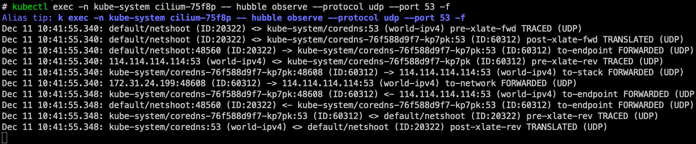

## LRP 简介


## 实践：NodeLocalDNSCache

由于启用 kubeProxyReplacement 功能，请依照 Cilium 官方文件提供的 `node-local-dns.yaml` 安装

<https://docs.cilium.io/en/stable/network/kubernetes/local-redirect-policy/#node-local-dns-cache>

```bash
wget https://raw.githubusercontent.com/cilium/cilium/1.18.4/examples/kubernetes-local-redirect/node-local-dns-lrp.yaml

wget https://raw.githubusercontent.com/cilium/cilium/1.18.4/examples/kubernetes-local-redirect/node-local-dns.yaml

```

替换 `__PILLAR__DNS__SERVER__`

```bash
kubectl get svc coredns -n kube-system -o jsonpath={.spec.clusterIP}
```

替换后启动 `node-local-dns.yaml`，启动后查看状态

```bash
kubectl get ds -n kube-system node-local-dns
```

运行一个测试容器

```bash
kubectl run netshoot \
  --image=harbor.alpha-quant.tech/3rd_party/docker.io/nicolaka/netshoot:v0.9 \
  -n default -- sleep infinity
```

先查看 netshoot Pod 里面的 `/etc/resolv.conf` 内容

```bash
kubectl exec -n default netshoot -- cat /etc/resolv.conf
```

可以看到仍指向集群地址

```bash
search default.svc.cluster.local svc.cluster.local cluster.local
nameserver 10.4.0.10
options ndots:
```

先简单验证一下 netshoot 现在 DNS 解析是正常的：

```bash
kubectl exec -n default netshoot -- dig google.com
```

接着来使用 `hubble observe` 来观察封包：

```bash
kubectl exec -n kube-system cilium-75f8p -- hubble observe --protocol udp --port 53 -f
```

执行 `hubble observe` 后，使用 netshoot Pod 发出 DNS 查询封包



注意 cilium 还需要开启 `localRedirectPolicies.enabled=true`，设置后重启

```bash
kubectl rollout restart deploy cilium-operator -n kube-system
kubectl rollout restart ds cilium -n kube-system
```

部署 `node-local-dns-lrp.yaml`

当节点上的任何 Pod 查询 `kube-dns` service 时，eBPF datapath 会拦截该封包，并将其直接重新导向到同一节点上的 node-local-dns

LRP 配置下去之后，他会把 Service Type 从 `Cluster IP` 改成 `LocalRedirect`

查看一下 Service BPF Map 以及 LRP List：

```bash
kubectl exec -n kube-system cilium-5g95m -- cilium-dbg service list

kubectl exec -n kube-system cilium-5g95m -- cilium-dbg lrp list
```


配置 Cilium Local Redirect Policy (LRP) 成功让封包在 eBPF 层被拦截，并重新导向至同一节点的 node-local-dns Pod，使得 DNS 查询真正命中本地 cache，大幅降低跨节点的 DNS 延迟与负载


