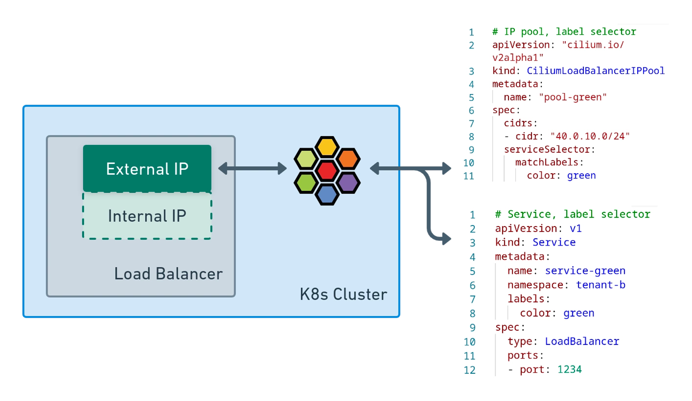
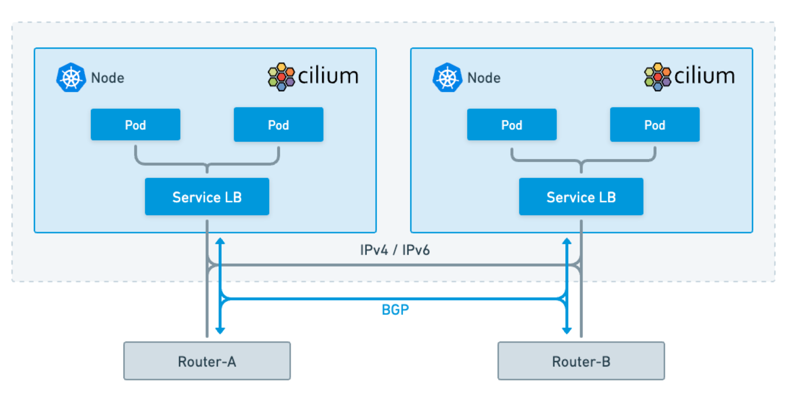

## Load-Balancer IPAM

MetalLB 是一款非常流行且可靠的裸机负载均衡工具

Kubernetes 的 LoadBalancer 类型服务“使用外部负载均衡器将服务对外公开。Kubernetes 本身不直接提供负载均衡组件

外部负载均衡器执行的任务之一是为 Kubernetes 服务分配外部 IP 地址 。如前所述，MetalLB 通常是执行此操作的首选工具。这在自管理的 Kubernetes 集群中尤为重要，因为在使用云管理的 Kubernetes 集群时，系统会自动为 LoadBalancer 类型的 Kubernetes 服务分配 IP 地址和 DNS 条目


Cilium 在 Cilium 1.13 版本中引入了对负载均衡器 IP 地址管理的支持

此功能默认启用，但在第一个 IP 地址池添加到集群之前处于休眠状态。系统将从该 IP 地址池（在 `CiliumLoadBalancerIPPool` 中定义）中为 Kubernetes 的 `LoadBalancer` 类型服务分配 IP 地址。





安装需要开启以下配置：

```yaml
bgpControlPlane:
  enabled: true
```

一个简单的 IP 池：

```yaml
apiVersion: "cilium.io/v2"
kind: CiliumLoadBalancerIPPool
metadata:
  name: "pool"
spec:
  blocks:
    - cidr: "20.0.10.0/24"

```

`20.0.10.0/24` 范围内的 IP 地址将被分配给负载均衡器服务

尝试创建一个服务

```yaml
apiVersion: v1
kind: Service
metadata:
  name: service-blue
  namespace: default
  labels:
    color: blue
spec:
  type: LoadBalancer
  ports:
    - port: 1234

```

serviceSelector：

```yaml
apiVersion: "cilium.io/v2"
kind: CiliumLoadBalancerIPPool
metadata:
  name: "pool"
spec:
  blocks:
    - cidr: "20.0.10.0/24"
  serviceSelector:
    matchExpressions:
      - { key: color, operator: In, values: [yellow, red, blue] }
```

创建一个没有标签的服务

```yaml
apiVersion: v1
kind: Service
metadata:
  name: service-none
  namespace: default
  labels:
    color: none
spec:
  type: LoadBalancer
  ports:
    - port: 1234
```

service-none 一直处于 pending 状态，无法分配到 LB IP

## L3 宣告（BGP）

Cilium 上的 BGP 可以在 Cilium 管理的节点和架顶 (ToR) 设备之间建立 BGP 对等会话，并告知网络中的其他设备您的 pod 和服务使用的网络和 IP 地址


可以使用以下资源来设置 BGP（EBGP）：

- `CiliumBGPClusterConfig` ：定义应用于多个节点的 BGP 实例和对等配置。
- `CiliumBGPPeerConfig` ：一套通用的 BGP 对等连接配置。它可以用于多个对等体之间。
- `CiliumBGPAdvertisements` ：定义注入到 BGP 路由表中的前缀。

```yaml
---
apiVersion: "cilium.io/v2"
kind: CiliumBGPClusterConfig
metadata:
  name: cilium-bgp
  labels:
    advertise: bgp
spec:
  nodeSelector:
    matchLabels:
      node-role.kubernetes.io/load-balancer: ""
  bgpInstances:
    - name: "instance-65001-ipv4"
      localASN: 65001
      # localPort: 179
      peers:
        - name: "peer-65000-tor-ipv4"
          peerASN: 65000
          peerAddress: "172.31.24.254"
          peerConfigRef:
            name: "cilium-bgp-peer"
    # - name: "instance-65001-ipv6"
    #   localASN: 65001
    #   peers:
    #     - name: "peer-65000-tor-ipv6"
    #       peerASN: 65000
    #       peerAddress: fd00:10:0:1::1
    #       peerConfigRef:
    #         name: "cilium-bgp-peer"
---
apiVersion: "cilium.io/v2"
kind: CiliumBGPPeerConfig
metadata:
  name: cilium-bgp-peer
  labels:
    advertise: bgp
spec:
  families:
    - afi: ipv4
      safi: unicast
      advertisements:
        matchLabels:
          advertise: "bgp"
    # - afi: ipv6
    #   safi: unicast
    #   advertisements:
    #     matchLabels:
    #       advertise: bgp
---
apiVersion: "cilium.io/v2"
kind: CiliumBGPAdvertisement
metadata:
  name: cilium-bgp-advertisements
  labels:
    advertise: bgp
spec:
  advertisements:
    # - advertisementType: "PodCIDR"
    # - advertisementType: "CiliumPodIPPool"
    - advertisementType: "Service"
      service:
        addresses:
          # - ClusterIP
          - ExternalIP
          - LoadBalancerIP
      selector:
        matchExpressions:
          - { key: cilium-bgp, operator: In, values: ["disabled"] }
---
apiVersion: "cilium.io/v2"
kind: CiliumLoadBalancerIPPool
metadata:
  name: "cilium-dynamic-ip-pool"
spec:
  blocks:
    - cidr: "172.31.26.0/24"
    # - start: "172.31.24.10"
    #   stop: "172.31.24.99"
    # - cidr: "fd85:ee78:d8a6:8607::26:0000/112"

```

## IPv6 支持

以下是一个 LB-IPAM 池的示例，该池将同时分配 IPv4 和 IPv6 地址：

```yaml
---
apiVersion: "cilium.io/v2"
kind: CiliumLoadBalancerIPPool
metadata:
  name: "empire-ip-pool"
  labels:
    org: empire
spec:
  blocks:
    - cidr: "172.18.255.200/29"
    - cidr: "2001:db8:dead:beef::0/64"

```

部署双栈服务时使用正确的标签，该服务将同时获得 IPv4 地址和 IPv6 地址

可以通过 IPv6 与 BGP 邻居进行对等连接

```yaml
# kubectl get ciliumbgpclusterconfig control-plane -o yaml | yq '.spec'
bgpInstances:
  - localASN: 65001
    name: instance-65001
    peers:
      - name: peer-65000
        peerASN: 65000
        peerAddress: fd00:10:0:1::1
        peerConfigRef:
          group: cilium.io
          kind: CiliumBGPPeerConfig
          name: generic
nodeSelector:
  matchLabels:
    kubernetes.io/hostname: kind-control-plane
    
# kubectl get ciliumbgppeerconfig generic -o yaml | yq '.spec'
ebgpMultihop: 1
families:
  - advertisements:
      matchLabels:
        advertise: generic
    afi: ipv4
    safi: unicast
  - advertisements:
      matchLabels:
        advertise: generic
    afi: ipv6
    safi: unicast

# kubectl get ciliumbgpadvertisements generic -o yaml | yq '.spec'
advertisements:
  - advertisementType: PodCIDR
  - advertisementType: Service
    selector:
      matchLabels:
        announced: bgp
    service:
      addresses:
        - LoadBalancerIP
```


## L2 宣告（ARP）

使用 ARP 进行 Layer 2 宣告

客户端 Client-A 和 Client-B 与 Kubernetes 负载均衡服务位于同一网络中。在这种情况下，BGP 是多余的；客户端只需知道哪个 MAC 地址与服务的 IP 地址关联，即可确定需要将流量发送到哪个主机。


Cilium 可以响应客户端对负载均衡器 IP 或外部 IP 的 ARP 请求（IPv6 为 NDP），并使这些客户端能够访问其服务

要启用 L2，需要

```yaml
kubeProxyReplacement: strict
l2announcements:
  enabled: true
l2NeighDiscovery:
  enabled: true
# devices: {eth0, net0}

```

查看是否开启

```bash
cilium config view | grep enable-l2
```

使用简单的 `CiliumL2AnnouncementPolicy` 在本地发布此服务。以下策略非常容易理解。它将在本地发布所有带有 `org: empire` 标签的服务的 IP 地址，无论它们是外部 IP 还是负载均衡器 IP。只有工作节点会响应 ARP 请求（节点选择器表达式排除了控制平面节点）。

```yaml
apiVersion: "cilium.io/v2"
kind: CiliumL2AnnouncementPolicy
metadata:
  name: l2announcement-policy
spec:
  serviceSelector:
    matchLabels:
      org: empire
  nodeSelector:
    matchExpressions:
      - key: node-role.kubernetes.io/control-plane
        operator: DoesNotExist
  interfaces:
    - ^eth[0-9]+
  externalIPs: true
  loadBalancerIPs: true

```

## 将 MetalLB 配置转换为 Cilium

以下是示例配置

```yaml
---
apiVersion: metallb.io/v1beta1
kind: IPAddressPool
metadata:
  name: default
  namespace: metallb-system
spec:
  addresses:
    - 172.18.255.193-172.18.255.206
---
apiVersion: metallb.io/v1beta1
kind: L2Advertisement
metadata:
  name: l2advertisement
  namespace: metallb-system
spec:
  ipAddressPools:
    - default
  nodeSelectors:
    - matchLabels:
        kubernetes.io/hostname: NodeA
  interfaces:
    - eth0

```

以下是等效的 Cilium 配置：

```yaml
---
apiVersion: "cilium.io/v2"
kind: CiliumLoadBalancerIPPool
metadata:
  name: "pool"
spec:
  blocks:
    - cidr: "172.18.255.192/28"
---
apiVersion: "cilium.io/v2"
kind: CiliumL2AnnouncementPolicy
metadata:
  name: l2policy
spec:
  loadBalancerIPs: true
  interfaces:
    - eth0
  nodeSelector:
    matchLabels:
      kubernetes.io/hostname: NodeA

```

## LoadBalancerClass

当指定

```yaml
defaultLBServiceIPAM: none
```

Service 需要指定 LoadBalancerClass

| loadBalancerClass             | Feature                               |
| ----------------------------- | ------------------------------------- |
| `io.cilium/bgp-control-plane` | Cilium BGP Control Plane              |
| `io.cilium/l2-announcer`      | L2 Announcements / L2 Aware LB (Beta) |
