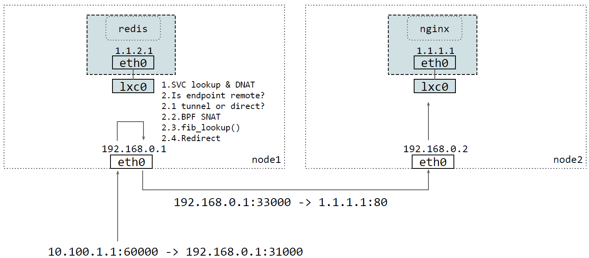
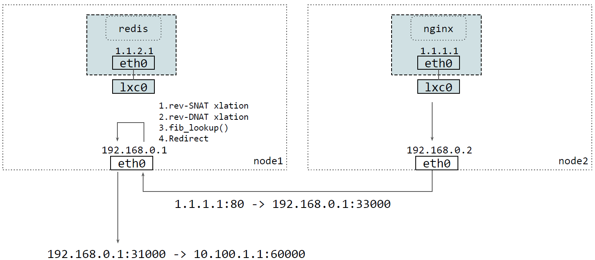
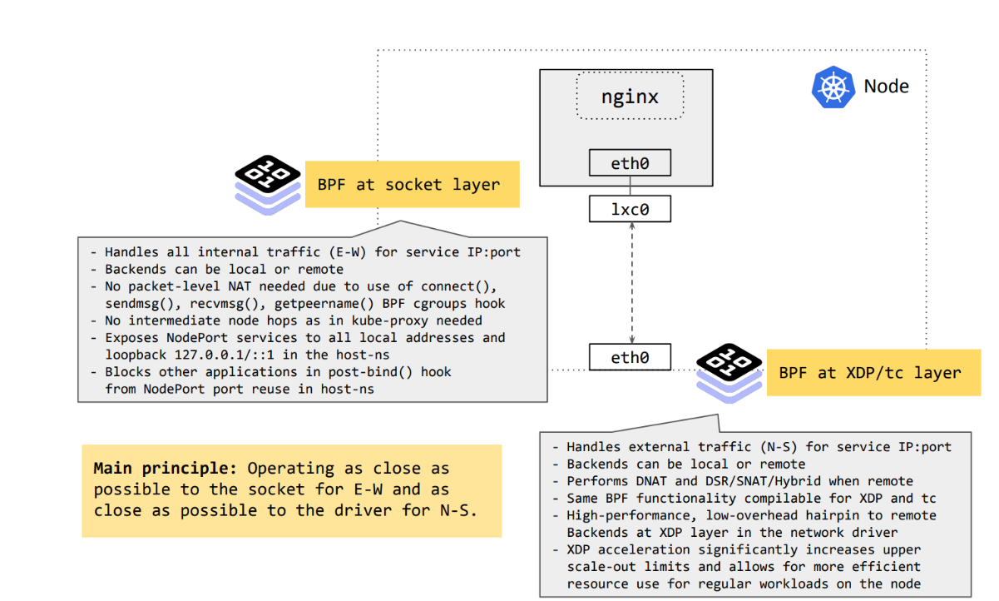

## 简介

### Kube Proxy 流量

Kube Proxy 的负责以下几个方面的流量路由:

1. ClusterIP: 集群内通过 ClusterIP 的访问
2. NodePort: 集群内外通过 NodePort 的访问
3. ExternalIP: 集群外通过 external IP 的访问
4. LoadBalancer: 集群外通过 LoadBalancer 的访问

### DSR

默认情况下，Cilium 的 eBPF NodePort 实现以 SNAT 模式运行。也就是说，当节点外部流量到达时，如果节点确定负载平衡器、NodePort 或具有外部 IP 的服务的后端位于远程节点，那么节点就会通过执行 SNAT 将请求重定向到代表自己的远程后端。这不需要额外更改 MTU。代价是，来自后端的回复需要额外跳回节点，在那里执行反向 SNAT 转换，然后再将数据包直接返回给外部客户端。



出向流量：



该设置可通过 `loadBalancer.mode` Helm 选项更改为 `dsr`，以便让 Cilium 的 eBPF NodePort 实现在 DSR 模式下运行。在这种模式下，后端直接回复外部客户端，而不需要额外的跳转，也就是说，后端通过使用服务 IP/port 作为源来回复。DSR 目前要求 Cilium 以本地路由模式部署，也就是说，它不能在任何一种隧道模式下工作。

DSR 模式流量如下：


DSR 模式的另一个优点是保留了客户端的源 IP，因此可以在后端节点对其进行策略匹配。而在 SNAT 模式下则无法做到这一点。鉴于一个特定的后端可被多个服务使用，后端需要知道它们需要回复的服务 IP / 端口。

请注意，由于 Cilium 特定的 IP 选项可能会被底层网络结构丢弃，因此 DSR 模式在某些公共云提供商环境中可能无法使用。如果后端位于与处理给定 NodePort 请求的节点相距较远的节点上，在出现服务连接问题时，首先要检查 NodePort 请求是否实际到达了包含后端的节点。如果不是，则建议切换回默认 SNAT 模式作为一种解决方法。

此外，在某些实施源 / 目标 IP 地址检查的公共云提供商环境中（如 AWS），必须禁用检查才能使用 DSR 模式。

### XDP 加速

Cilium 内置了对 NodePort、LoadBalancer 服务和具有外部 IP  的服务的加速支持，以便在后端位于远程节点时，将到达的请求从该节点直接推回。该功能在 Cilium 1.8 版的 XDP（eXpress Data Path）层中引入，eBPF 直接在网络驱动程序中运行，而不是在更高层中运行。

在这种情况下，网络数据包不需要一直推送到上层网络堆栈，而是在 XDP 的帮助下，Cilium 能够直接从**网络驱动层**处理这些请求。鉴于单个节点的转发能力大幅提高，这有助于减少延迟和扩展服务。从 Cilium 1.8 版开始，XDP 层的 kube-proxy 将被替换。

该模式设置 `loadBalancer.acceleration` 允许通过 native 选项启用加速。禁用选项是默认选项，用于禁用加速。大多数支持 10G 或更高速率的驱动程序在最新内核上也支持 native XDP。对于基于云的部署，这些驱动程序中的大多数都有支持本地 XDP 的 SR-IOV 变体。

负载平衡器加速设置支持 DSR、SNAT 和混合模式.



可以看出，Cilium 在 eBPF 中的 kube-proxy 替代方案在高层上由两个主要部分组成：套接字层的 eBPF 和驱动层的 eBPF。

- 东西向流量，即所有 Cilium 管理节点之间的服务流量，仅在内核的套接字层处理，在此之前不会为数据包元数据分配内存。在这一点上执行，可使 Cilium 消除服务转换的每包成本。
- 南北流量，即从外部源到 Cilium  管理节点的所有入站服务流量，都在尽可能靠近驱动层的地方进行处理，在单个接口上进行入口和出口操作。这样就能非常快速地处理转发，甚至可以在堆栈上层进行任何昂贵的操作之前，将流量丢弃或反射回入站接口。处理南北流量的后一个组件则通过 XDP 进行加速。

Cilium 的服务 XDP 加速目前支持直接路由模式，与我们的 tc eBPF 实现共享相同的核心代码。在 XDP 服务转换后，提供了三种将流量重定向到远程后端的选项：DSR、SNAT 和 Hybrid。

## 配置

替换 KubeProxy，并且 Kubernetes NodePort 实现在 DSR (Direct Server Return) 模式下运行

```bash
kubeProxyReplacement: "true"
kubeProxyReplacementHealthzBindAddr: "0.0.0.0:1025"
loadBalancer:
  mode: dsr
  acceleration: best-effort
nodePort:
  enabled: true
  range: "30000,60000"
```

查看替换后的状态

```bash
# k exec -it -n kube-system cilium-kmx7n -- cilium status | grep -i proxy 
KubeProxyReplacement:    True   [nm-bond    172.31.24.199 fd85:ee78:d8a6:8607::24:199 fe80::184:8e89:83fd:7ccc (Direct Routing)]
Proxy Status:            OK, ip 10.3.0.179, 0 redirects active on ports 10000-20000, Envoy: external
```

查看详情

```bash
 k exec -it -n kube-system cilium-kmx7n -- cilium status --verbose

# ...
KubeProxyReplacement Details:
  Status:                True
  Socket LB:             Enabled
  Socket LB Tracing:     Enabled
  Socket LB Coverage:    Full
  Devices:               nm-bond    172.31.24.199 fd85:ee78:d8a6:8607::24:199 fe80::184:8e89:83fd:7ccc (Direct Routing)
  Mode:                  DSR
    DSR Dispatch Mode:   IP Option/Extension
  Backend Selection:     Random
  Session Affinity:      Enabled
  NAT46/64 Support:      Disabled
  XDP Acceleration:      Best-Effort
  Services:
  - ClusterIP:      Enabled
  - NodePort:       Enabled (Range: 30000-60000) 
  - LoadBalancer:   Enabled 
  - externalIPs:    Enabled 
  - HostPort:       Enabled
  Annotations:
  - service.cilium.io/node
  - service.cilium.io/node-selector
  - service.cilium.io/proxy-delegation
  - service.cilium.io/src-ranges-policy
  - service.cilium.io/type
#...
```

测试 NodePort

```bash
cat << EOF | kubectl apply -f -
apiVersion: apps/v1
kind: Deployment
metadata:
  name: my-nginx
  namespace: default
spec:
  selector:
    matchLabels:
      run: my-nginx
  replicas: 1
  template:
    metadata:
      labels:
        run: my-nginx
    spec:
      containers:
        - name: my-nginx
          image: harbor.alpha-quant.tech/3rd_party/docker.io/openresty/openresty:1.27.1.2-3-bullseye-fat
          ports:
            - containerPort: 80
EOF
```

创建一个 NodePort 服务

```bash
kubectl expose deployment -n default my-nginx --type=NodePort --port=80
```

查看 ServiceList

```bash
# kubectl -n kube-system exec ds/cilium -- cilium service list

ID   Frontend                                 Service Type    Backend                                              
# ...                         
52   0.0.0.0:35283/TCP                        NodePort        1 => 10.3.0.150:80/TCP (active)                   

```

