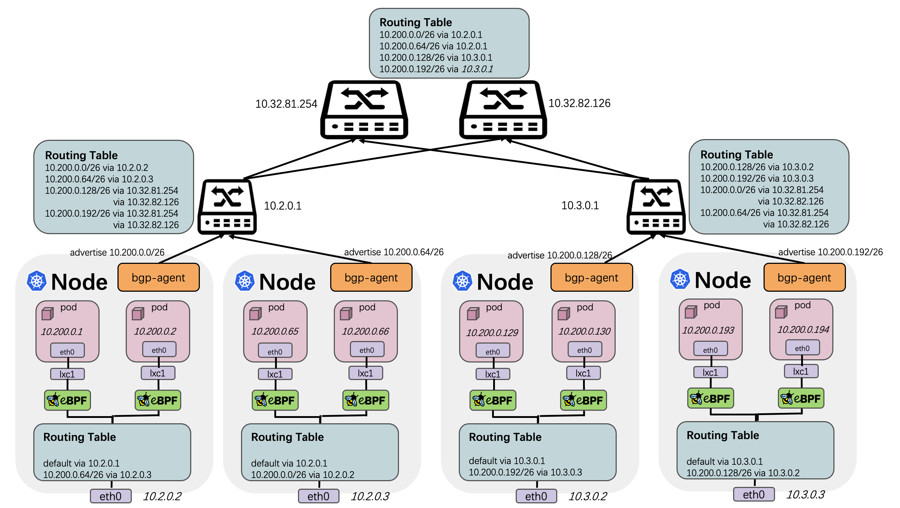
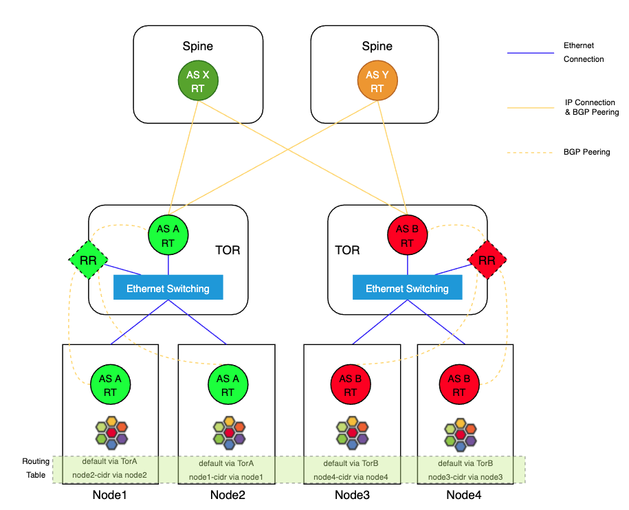
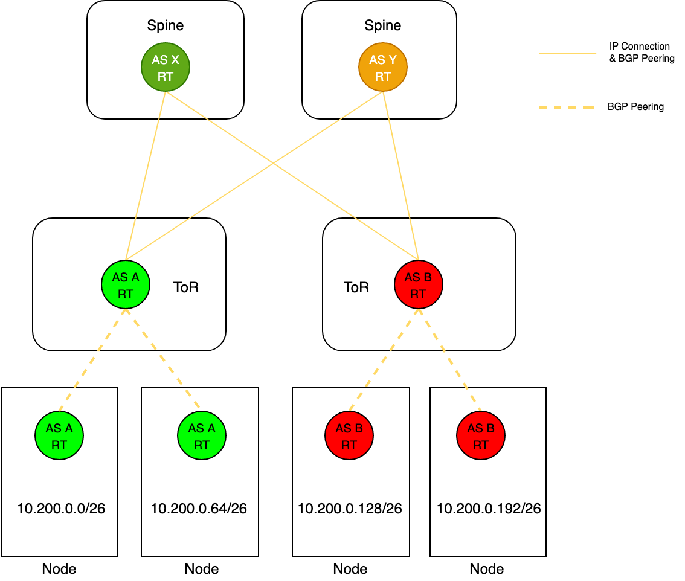
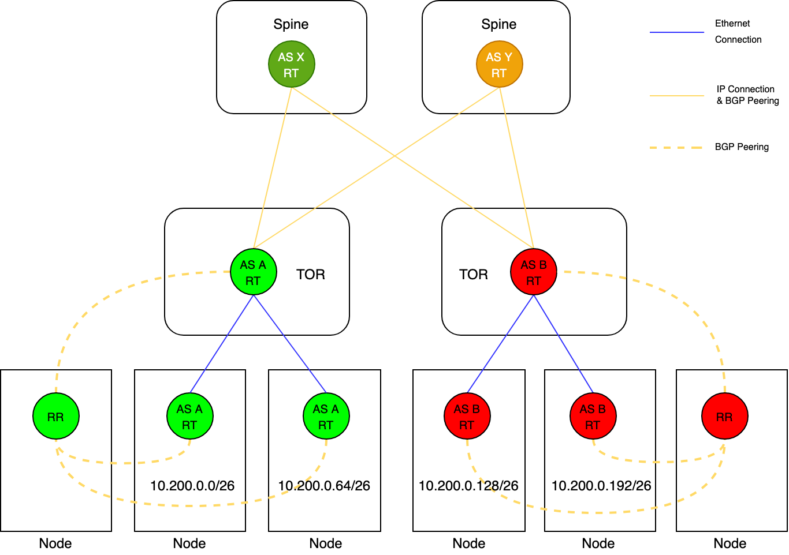

## 方案概述

特别是对网络性能损耗的容忍程度决定了 Underlay 网络方案势在必行。为什么选择 BGP 协议呢？ 相较于 OSPF、RIP 这些内部网关协议，BGP 着眼于控制路由的传播以及选择最佳路径。BGP 最大的优势在于具有较强的可扩展性，能够满足大规模集群横向扩展的需求。另一方面，BGP 足够简单稳定，并且业内也有着基于 BGP 落地生产环境的成功案例。

根据集群规模大小的不同，BGP 路由模式有着不同的方案。当集群规模较小时，可以使用 Full Mesh 互联模式，它要求同一个 AS  内的所有 BGP Speaker 全连接，并且所有外部路由信息必须重新分发到同一个 AS 的其他路由器。随着集群规模扩大，Full Mesh  模式效率将急剧降低，Route Reflection 模式是一种成熟的替代方案。RR 方案下允许一个 BGP Speaker （也即是 Route Reflector）向其他 BGP Peer 广播学习到的路由信息，大大减少了 BGP Peer 连接数量。

基于 GoBGP 实现 Cilium 的 Underlay 方案，该方案基于 GoBGP 提供的良好的编程接口实现了自己的 BGP Agent，具备很好的可扩展性。其特点如下：

- 支持大规模集群的扩展
- 支持 BGP 邻居发现
- 支持网络可视化
- 支持 VIP 和 PodCIDR 路由宣告
- 支持 ECMP 等高级路由协议
- 实现 Cilium native-routing 功能
- 支持 L3 层网络通信

在不改变 IDC 机房内部网络拓扑的情况下，接入层交换机和核心层交换机建立 BGP 连接，借助于机房内部已有的路由策略实现。针对 Node  所处的物理位置分配 PodCIDR，每个节点将 PodCIDR 通过 BGP 协议宣告给接入层交换机，实现全网通信的能力。

1. 每个接入层交换机与其管理的 Node 二层联通，共同构成一个 AS。每个节点上跑 BGP 服务，用于宣告本节点路由信息。
2. 核心层交换机和接入层交换机之间的每个路由器单独占用一个 AS，物理直连，跑 BGP 协议。核心层交换机可以感知到全网的路由信息，接入层交换机可以感知与自己直连的 Node 上的路由信息。
3. 每个 Node 上只有一条默认路由，直接指向接入层交换机。同一个接入层交换机下的 Node 通信下一跳指向对端。

> TOR（Top of Rack）指的是在每个服务器机柜上部署1～2台交换机，服务器直接接入到本机柜的交换机上，实现服务器与交换机在机柜内的互联。

## 邻居发现

在 BGP  实现的集群网络中，经常存在节点新增和删除的情形，如果采用静态配置对等体的方式，需要频繁的操作交换机进行对等体增删的操作，维护工作量很大，不利于集群的横向扩展。为了避免手动对交换机进行操作，支持基于配置接入层交换机和软件层面实现的路由反射器这两种模式来动态发现 BGP 邻居。

（1）通过接入层交换机实现动态邻居发现

接入层交换机充当边界路由器，并开启 Dynamic Neighbors 功能，路由器具体开启 Dynamic Neighbors 配置参考官方文档。Node上的 BGP 服务主动与接入层交换机建立 iBGP 连接，并宣告本地路由，接入层交换机将学习到的路由宣告给整个数据机房内部。

（2）通过 RR 实现动态邻居发现

物理交换机或者 Node 节点充当反射路由器 RR，反射路由器与接入层交换机建立 iBGP 连接，Node 节点上的 BGP  服务与反射路由器建立连接。Node上的BGP服务将本地路由宣告给 RR，RR 反射到接入层交换机，接入层交换机接着宣告给整个数据机房内部。

## 下一跳

每个 Node 上跑 BGP 服务，将本节点的上的 PodCIDR 宣告给接入层交换机，每个接入层交换机可以感知到直连的所有 Node  上的 PodCIDR。接入层交换机下的 Node  之间相互学习路由下发到本地，流量经过接入层交换机二层转发。跨接入层交换机的节点之间通信下一跳指向接入层交换机，同一个接入层交换机下的节点之间通信下一跳指向对端节点。下图展示了同一个接入层交换机下以及跨接入层交换机下节点的路由学习情况，可以直观的根据路由表判定下一跳地址。

- 同一个接入层交换机下通信链路：10.2.0.2 节点与 10.2.0.3 节点处在同一个接入层交换机下，具备二层连通，报文经过封装后不经过三层转发直接被送到对端。
- 不同接入层交换机之间通信链路：10.2.0.2 节点与 10.3.0.3 节点处在不同的接入层交换机下，报文需要经过接入层交换机和核心交换机路由后才能到达对端。

## 优雅重启

BGP 是基于 TCP 实现的路由协议，TCP 连接异常断开后，开启 Graceful Restart 功能的交换机不会删除 RIB 和  FIB，仍然按照原有的转发表项转发报文，并启动 RIB 路由老化定时器。BGP Peer 需要两端同时开启 Graceful Restart  功能才能生效，Graceful Restart可以有效防止 BGP 链路震荡，提升底层网络的可用性。

## IPAM

在 Kubernetes 常见配置中，会通过 kube-controller-manager 的 `allocate-node-cidrs` 和 `configure-cloud-routes` 等参数来为节点分配 PodCIDR 并配置路由。然而，社区的这种方案限制了节点只能有一段 PodCIDR，并且不能动态扩充。这种一个节点一个 PodCIDR 的策略太简单，导致 IP 资源利用率太低，某些节点规格小可能用不完，某些节点规格大却不够。
