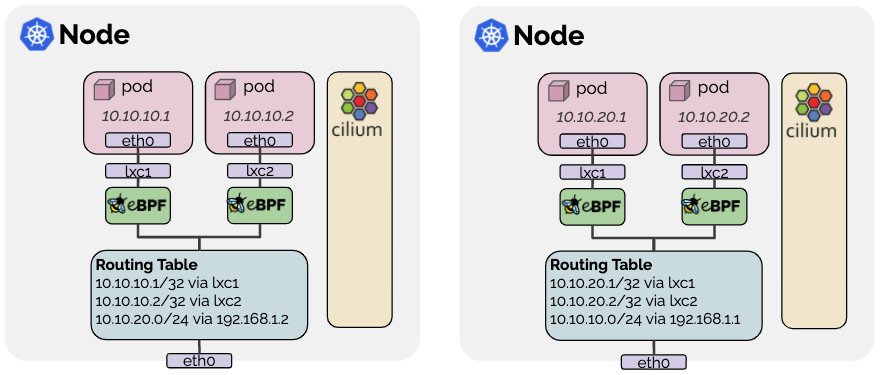

## 本地路由

Native-Routing

Cilium 还提供本地路由网络模式选项，使用每台主机上的常规路由表将流量路由到 pod（或外部）IP 地址。



在本地路由模式下，Cilium 会将所有未寻址到其他本地端点的数据包委托给 Linux 内核的路由子系统。这意味着，数据包的路由将如同本地进程发出数据包一样。因此，连接集群节点的网络必须能够路由 PodCIDR。

配置本地路由时，Cilium 会自动在 Linux 内核中启用 IP 转发。

## 配置

未启用之前，也就是通过 VXLan 封装时，会有一个对应的 VXLan 网卡 `cilium_vxlan` 示例如下:

```bash
136: cilium_vxlan: <BROADCAST,MULTICAST,UP,LOWER_UP> mtu 1500 qdisc noqueue state UNKNOWN group default
    link/ether 8a:eb:44:ad:6e:7e brd ff:ff:ff:ff:ff:ff
    inet6 fe80::88eb:44ff:fead:6e7e/64 scope link
       valid_lft forever preferred_lft forever
```

Helm 中启用如下配置

```yaml
routingMode: "native"
autoDirectNodeRoutes: true
ipv4NativeRoutingCIDR: "172.31.24.0/24"
ipv6NativeRoutingCIDR: "fd85:ee78:d8a6:8607::24:0/128"
```

应用后，查看配置

```bash
# cilium config view | grep native
ipv4-native-routing-cidr                          172.31.24.0/24
ipv6-native-routing-cidr                          fd85:ee78:d8a6:8607::24:0/128
routing-mode                                      native
```

通过 `--datapath-mode='veth'` 可以判断已经成功启用本地路由

```bash
# k logs -f cilium-gkszw |grep datapath-mode
time=2025-12-16T03:28:25.815629631Z level=info msg="  --datapath-mode='veth'"
```

