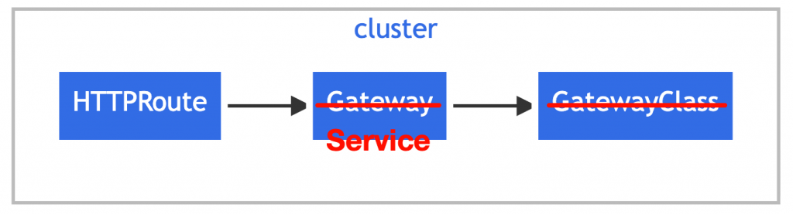

<https://gateway-api.sigs.k8s.io/mesh/gamma/>

在 Kubernetes 的世界里，通常把流量分成两大类：

- North-South Traffic（南北向） ：从外部进入 Cluster 的流量，例如使用者通过 Load Balancer 访问 Web Service
- East-West Traffic（东西向） ：Cluster 内部 Service 之间互相调用的流量，例如 service-a 调用 service-b

GAMMA 的关键改变：parentRef 指向 Service

在 GAMMA 模型中关键突破点就是： HTTPRoute 不再只能挂在 Gateway 上，而是可以直接挂在 Service 上：

## 参考资料

- <https://ithelp.ithome.com.tw/m/articles/10394744>