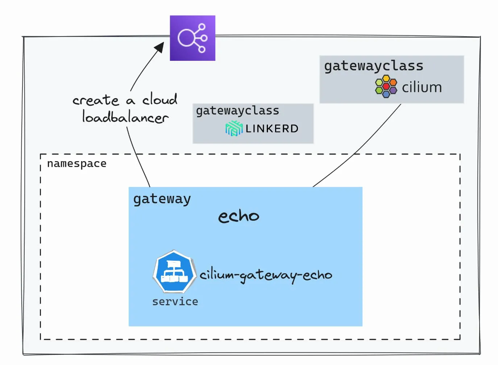
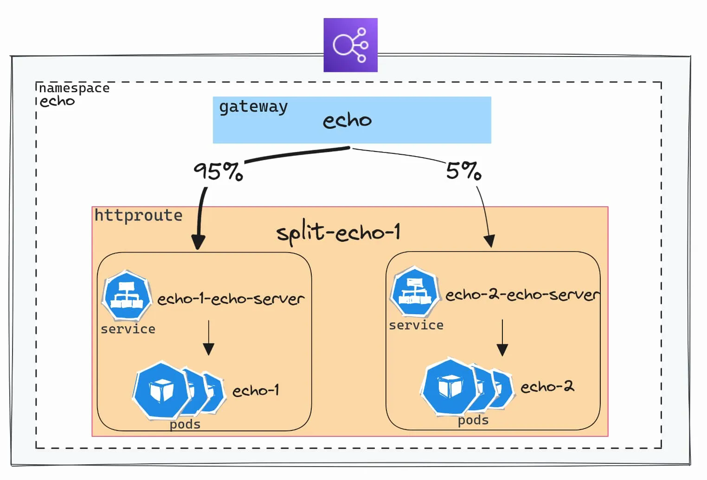

## Gateway API

官方文档：<https://gateway-api.kubernetes.ac.cn/guides/>

### Ingress 的局限

有许多Ingress 控制器选项，每个都有其特定性和特殊功能，有时会使它们的使用变得复杂。

此外，Kubernetes 中传统的 `Ingress` API 具有非常有限的参数。一些解决方案甚至创建了自己的CRDs（Kubernetes 自定义资源），而其他解决方案则使用 `annotations` 来克服这些限制。

Gateway API 是一种标准，允许声明高级网络功能，而无需对底层控制器进行特定扩展。而且，由于所有控制器都使用相同的 API，因此可以在不改变配置的情况下从一个解决方案切换到另一个解决方案（Kubernetes 清单描述了如何路由传入流量）。

### 角色分层


`GAPI` 提供了一种清晰的权限共享模型，用于管理流量路由基础设施（由集群管理员管理）和应用程序（由开发人员管理）之间的关系。

多个自定义资源的可用性允许使用 Kubernetes 的 RBAC 配置以声明性方式分配权限

下面的配置授予 `developers` 组的成员在 echo 命名空间内管理 `HTTPRoutes` 的能力，同时仅提供对 `Gateways` 的读取权限

```yaml
---
apiVersion: rbac.authorization.k8s.io/v1
kind: Role
metadata:
  namespace: echo
  name: gapi-developer
rules:
  - apiGroups: ["gateway.networking.k8s.io"]
    resources: ["httproutes"]
    verbs: ["*"]
  - apiGroups: ["gateway.networking.k8s.io"]
    resources: ["gateways"]
    verbs: ["get", "list"]
---
apiVersion: rbac.authorization.k8s.io/v1
kind: RoleBinding
metadata:
  name: gapi-developer
  namespace: echo
subjects:
  - kind: Group
    name: "developers"
    apiGroup: rbac.authorization.k8s.io
roleRef:
  kind: Role
  name: gapi-developer
  apiGroup: rbac.authorization.k8s.io

```


## 入口点：GatewayClass 和 Gateway



在 Kubernetes 集群上，可以配置多个 `GatewayClasses`，从而能够使用不同的实现。例如，可以通过在 `Gateway` 配置中引用 GatewayClass 来使用 `Linkerd`。

`Gateway` 是允许触发在云提供商中创建负载均衡组件的资源。

```yaml
apiVersion: gateway.networking.k8s.io/v1
kind: Gateway
metadata:
  name: echo-gateway
  namespace: echo
spec:
  gatewayClassName: cilium
  listeners:
    - protocol: HTTP
      port: 80
      name: echo-1-echo-server
      allowedRoutes:
        namespaces:
          from: Same

```

## 路由规则：HTTPRoute

### 基本规则

`HTTPRoute` 允许通过引用 Gateway 并定义所需的路由参数来配置到服务的路由。

```yaml
apiVersion: gateway.networking.k8s.io/v1
kind: HTTPRoute
metadata:
  name: echo-1
  namespace: echo
spec:
  parentRefs:
    - name: echo
      namespace: echo
  rules:
    - matches:
        - path:
            type: PathPrefix
            value: /
      backendRefs:
        - name: echo-1-echo-server
          port: 80

```

`parentRefs` 指示使用哪个 `Gateway`，然后在 `rules` 部分定义了路由规则。所有请求都会转发到 `echo-1-echo-server` 服务。


路由规则还可以基于 `path`。

```yaml
spec:
  hostnames:
    - foo.bar.com
  rules:
    - matches:
        - path:
            type: PathPrefix
            value: /login

```

或者基于 HTTP 标头

```yaml
spec:
  rules:
    - matches:
        headers:
          - name: "version"
            value: "2"

```

### 配置 TLS 证书

有多种方法可以使用 GAPI 配置 TLS。在这里，将使用最常见的情况：HTTPS 协议在 Gateway 上终止 TLS。

```yaml
apiVersion: gateway.networking.k8s.io/v1
kind: Gateway
metadata:
  name: echo
  namespace: echo
  annotations:
    cert-manager.io/cluster-issuer: letsencrypt-prod
spec:
  gatewayClassName: cilium
  listeners:
    - name: http
      hostname: "echo.${domain_name}"
      port: 443
      protocol: HTTPS
      allowedRoutes:
        namespaces:
          from: Same
      tls:
        mode: Terminate
        certificateRefs:
          - name: echo-tls

```

引用一个包含名称为 `echo-tls` 的证书的密钥。

为了使路由正常工作，还需要将 `HTTPRoute` 附加到正确的 `Gateway` 并指定域名。

```yaml
apiVersion: gateway.networking.k8s.io/v1beta1
kind: HTTPRoute
metadata:
  name: echo-1
  namespace: echo
spec:
  parentRefs:
    - name: echo
      namespace: echo
  hostnames:
    - "echo.${domain_name}"

```

GAPI 还允许配置端到端的 TLS，一直到容器。这是通过配置 `Gateway` 为 `Passthrough` 模式并使用 `TLSRoute` 资源来完成的。证书也必须由执行 TLS 终止的 pod 携带。

### 在多个命名空间中共享 Gateway


使用 `GAPI`，可以在 `命名空间` 之间路由流量。这得益于每个功能的不同资源：一个 `Gateway` 允许配置基础设施，以及 `*Routes`。这些路由可以附加到位于另一个命名空间中的 Gateway。因此，不同的团队/项目可以共享相同的基础设施组件。

但是，这需要指定哪个路由允许引用该 Gateway。在这里，假设有一个专门用于内部工具的 Gateway，名为 `platform`。通过使用 `allowedRoutes` 参数，明确指定了哪些命名空间允许附加到此 Gateway。

```yaml
allowedRoutes:
  namespaces:
    from: Selector
    selector:
      matchExpressions:
        - key: kubernetes.io/metadata.name
          operator: In
          values:
            - observability
            - flux-system
tls:
  mode: Terminate
  certificateRefs:
    - name: platform-tls

```

在命名空间 `observability` 和 `flux-system` 中配置的 `HTTPRoutes` 附加到此唯一的 `Gateway`。

```yaml
spec:
  parentRefs:
    - name: platform
      namespace: infrastructure

```

### 流量分流



由服务网格常常提供的一个功能是在有新版本可用时（A/B 测试或金丝雀部署）对部分流量测试应用程序的能力。`GAPI`通过使用权重来实现这一点，使其变得非常简单。

以下是一个将 5% 的流量转发到服务 `echo-2-echo-server` 的示例：

```yaml
hostnames:
  - "split-echo.${domain_name}"
rules:
  - matches:
      - path:
          type: PathPrefix
          value: /
    backendRefs:
      - name: echo-1-echo-server
        port: 80
        weight: 95
      - name: echo-2-echo-server
        port: 80
        weight: 5

```

### 修改标头

还可以更改 HTTP **标头**：添加、修改或删除它们。这些修改可以通过在 `HTTPRoute` 清单中使用 filters 应用于请求标头或响应标头。

例如，将在请求中添加一个标头。

```yaml
apiVersion: gateway.networking.k8s.io/v1
kind: HTTPRoute
metadata:
  name: echo-1
  namespace: echo
spec:
  rules:
    - matches:
        - path:
            type: PathPrefix
            value: /req-header-add
      filters:
        - type: RequestHeaderModifier
          requestHeaderModifier:
            add:
              - name: foo
                value: bar
      backendRefs:
        - name: echo-1-echo-server
          port: 80

```

