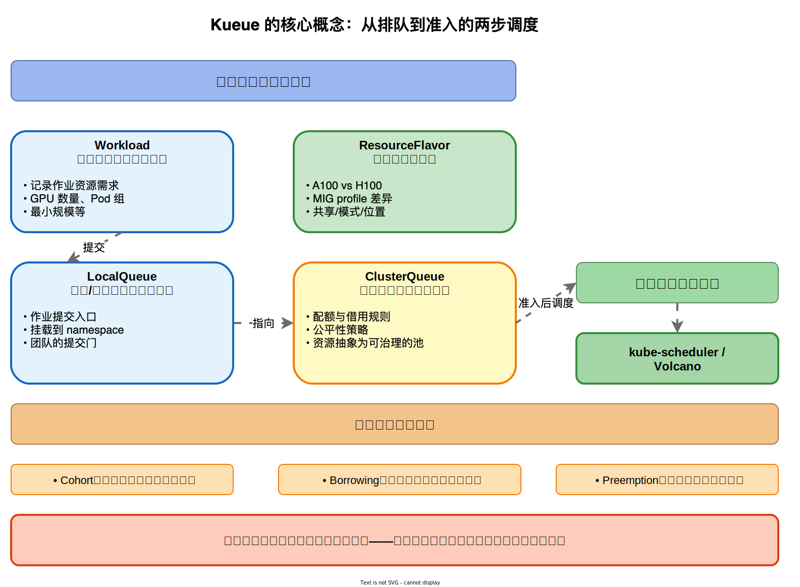
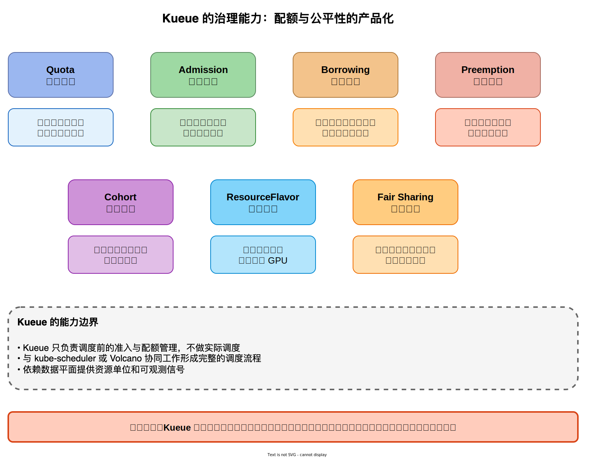

## Kueue

### 简介

配额、准入与资源治理的控制面

常见的治理需求包括：

- 谁能用？（团队/项目/环境的授权边界）
- 何时能用？（排队、公平、抢占、SLA）
- 能用多少？（配额、借用、上限、突发）
- 用完怎么归还与统计？（资源承诺、计量、对账）

如果缺乏 “秩序与契约”，平台会反复出现以下混乱现象：

- 某团队临时加任务导致集群资源被挤爆，其他团队即使有业务优先级也无法及时调度。
- 资源被 “先到先得” 长期占用，高价值或紧急作业只能等待。
- 表面上各团队未超配额，实际 GPU 却被长期占用，平台方难以解释资源紧张的原因。

Kueue 的核心价值在于将 “调度之前的治理” 产品化：在资源真正分配到节点和设备之前，先完成资源的准入（admission）*与*承诺（reservation / assignment），让所有人对 “可用资源” 和 “排队规则” 形成共同预期。

### 排队和配额

Kueue 的核心思想是：将调度请求拆分为两步 —— 先排队与准入，再进行实际调度。

以下是 Kueue 的主要对象及其角色：

(1) LocalQueue：团队 / 命名空间的入口队列

- 用户作业提交到某个 namespace，挂载在对应的 LocalQueue 下。
- 可理解为 “团队的提交入口”。

(2) ClusterQueue：全局资源池与配额承诺

- 定义配额、借用与公平性规则。
- 把集群资源（如 GPU/CPU/内存/自定义资源）抽象为可治理的池，并分配份额给不同租户。
- 常见模式是多个 LocalQueue 指向同一个 ClusterQueue，实现 “入口不同但共享全局规则”。

(3) Workload：等待准入的资源申请单

- 用户提交的 Job / RayJob / PyTorchJob 等作业对象会被映射为可治理的 Workload。
- Workload 记录作业的资源需求（如 GPU 数量、Pod 组、最小规模等），便于比较、排队和决策。

(4) ResourceFlavor：资源的 “口味” 建模

在 GPU 场景下，“1 张 GPU” 并不等价，可能有如下差异：

- A100 与 H100
- MIG 1g.10gb 与 7g.80gb
- 是否允许共享、是否开启特定模式
- 是否位于特定可用区/机架/网络域

ResourceFlavor 的作用是将资源差异显式化，使准入与配额可以针对不同 “口味” 的资源分别管理，而不是将所有 GPU 混为一谈。

### Cohort / Borrowing / Preemption

在实际平台中，单纯 "硬配额" 会导致资源浪费，单纯 "先到先得" 又会带来混乱。Kueue 通常结合以下三种能力：

- 公平性（Cohort / 共享规则）：多个队列间按规则共享或竞争资源。
- 借用（Borrowing）：队列未用完配额时，其他队列可借用以提升利用率。
- 抢占（Preemption）：高优先级作业需要资源时，可回收低优先级作业已承诺资源，保障关键业务。

下图展示 Kueue 的两步调度流程和核心概念。

- 第一步（排队与准入）：Workload 提交到 LocalQueue（团队 / 命名空间的入口队列），LocalQueue 指向 ClusterQueue（全局资源池与配额承诺），ResourceFlavor 对不同类型的资源（如 A100 vs H100、MIG profile 差异）进行建模。
- 第二步（实际调度）：准入后的作业由 kube-scheduler 或 Volcano 进行实际调度。底部展示公平与弹性三件套（Cohort 队列共享、Borrowing 配额借用、Preemption 抢占机制）。Kueue 的核心价值在于将调度之前的治理产品化 —— 先完成资源的准入与承诺，再进行实际调度。

### Kueue 解决哪些平台问题

Kueue 关注的不是 “某个作业如何跑得最快”，而是 “所有作业如何有秩序地运行”。以下是典型治理场景：

(1) 多团队配额：将 “应该能用多少” 写进系统

- 团队 A：保障 20 张 GPU
- 团队 B：保障 10 张 GPU
- 平台预留：5 张 GPU 用于紧急事件或在线推理

(2) 配额显式化后，平台可以回答：

- “为什么我现在排队？”—— 因为当前申请超出可用份额。
- “我什么时候能拿到？”—— 队列有明确顺序与策略，体验可预测。
- “平台是否偏心？”—— 可用审计和指标证明资源承诺流向。

(3) 准入（Admission）：将 “能不能跑” 前置到控制面

在原生 Kubernetes 中，作业失败往往发生较晚：Pod 创建后长时间 pending，才发现资源不足或条件不满足。Kueue 的准入机制类似 “入场券”：

- 先判断是否有足够配额 / 可承诺资源。
- 只有获得准入许可，作业才进入实际调度阶段。

这样，用户能明确了解 Pending 原因，平台也能将治理逻辑集中在控制面，减少调度失败和人工干预。

(4) 借用与回收：平衡利用率与秩序

理想的 GPU 平台既要高利用率，也要强秩序。借用机制提升利用率，抢占 / 回收机制保障秩序：

- 平时可借用闲置配额，减少资源空转。
- 紧急时高优先级业务可回收资源，兑现保障。

这让平台从 “静态分田地” 升级为 “动态经济系统”，既避免长期浪费，也防止关键时刻失控。

(5) 优先级与可预测体验：制度化冲突管理

GPU 平台治理的难点在于冲突管理。Kueue 通过优先级、策略和准入规则，将冲突管理制度化：

- 在线推理（强时延 SLO）与离线训练（吞吐优先）
- 生产事故修复与常规实验
- 关键客户项目与内部探索

这些都能通过系统规则落地，避免平台治理沦为 "谁嗓门大谁赢"。

下图展示 Kueue 的 7 大核心治理能力。

- Quota（配额管理）提供集群级配额定义和资源上限；
- Admission（准入控制）基于配额进行准入和等待队列管理；
- Borrowing（配额借用）允许跨队列借用闲置配额以提升利用率；
- Preemption（抢占机制）基于优先级抢占保证高优作业；
- Cohort（队列共享）支持多队列共享资源池和公平性策略；
- ResourceFlavor（资源建模）区分资源类型支持异构 GPU；
- Fair Sharing（公平分享）提供多租户资源公平分配。

图中特别强调了 Kueue 的能力边界：它只负责调度前的准入与配额管理，不做实际调度，需要与 kube-scheduler 或 Volcano 协同工作形成完整的调度流程，并依赖数据平面提供资源单位和可观测信号。

## Kueue 在系统中的位置

### 对比数据平面

决定 “谁先拿到切分后的资源”

在平台架构中，数据平面负责设备发现、切分/虚拟化（如 MIG、共享方案）、隔离、可观测与计量；控制面则关注队列、配额、优先级、公平性、准入与治理。

Kueue 属于控制面组件。它不负责将一张 GPU 切分为 MIG，也不直接限制容器的 SM 或显存，这些属于数据平面和驱动栈的范畴。Kueue 关注的是：在有限的可用资源下，这次机会应该分配给谁？

因此，Kueue 与 MIG / HAMi 等数据平面方案是互补关系：

- 可以用 MIG 提供强隔离的离散资源单位。
- 用 HAMi 提供可声明的共享单位。
- 再用 Kueue 实现多团队间资源的可控、可预测、可审计流转。

### 对比 Volcano

Volcano 擅长批处理语义、作业级调度、gang scheduling 等，补齐原生 Kubernetes 在 AI 训练 / 分布式作业表达上的不足。

二者的关系可以总结为：

- Volcano：负责 “怎么排座位” 的调度（作业级策略、批处理、并行组、调度算法）。
- Kueue：负责 “谁能进场、能占多少座位” 的门禁与秩序（准入、配额、借用、抢占、治理）。

常见组合方式：

- 用 Kueue 负责准入与资源承诺（控制面治理）。
- 用 Volcano 或 kube-scheduler 负责已准入 Pod 的实际调度（调度执行）。

这体现了 "先治理，再调度" 的解耦路径。

- Kueue：核心理念是两步调度（先准入、再调度），沿用原生 K8s API 与生态；优势包括与 K8s 原生深度集成、支持 Job/Set/ReplicaSet 等原生资源、配额管理更精细、云厂商路线一致；局限是不支持复杂的 Gang Scheduling、需要配合其他调度器、批处理语义不如 Volcano 丰富；适用于云原生环境和多租户平台。
- Volcano：核心理念是一站式批处理调度，提供完整的队列、Gang、抢占语义；优势包括完整的批处理调度语义、支持复杂的 Gang Scheduling、Backfill 和拓扑亲和性等高级特性、AI 训练场景验证充分；局限是与原生 K8s 调度器是替代关系、API 自定义学习成本高、云厂商集成度不如 Kueue；适用于 AI 训练集群和批处理平台。底部选型建议：重视 K8s 原生集成选择 Kueue，需要完整 Gang Scheduling 选择 Volcano，也可以组合使用形成完整体系。