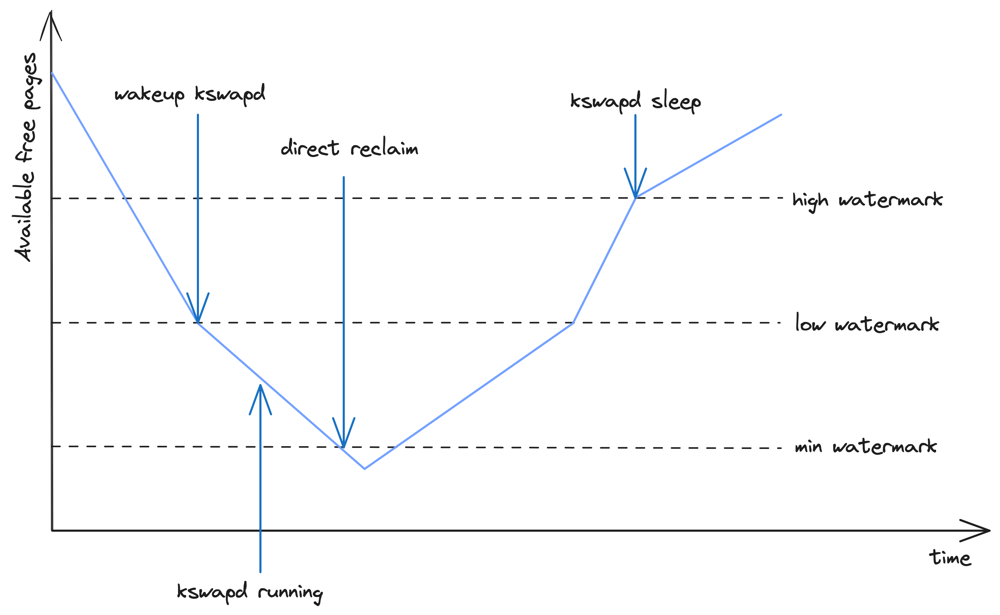
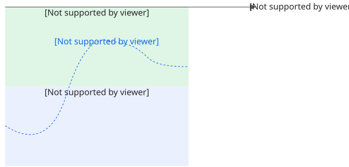
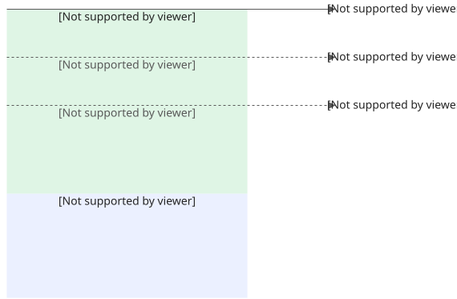

## Linux 内存管理机制

由于访问内存的速度比访问磁盘快很多，Linux 使用内存的策略比较贪婪，采取尽量分配，当内存水位较高时才触发回收的策略。

### 内存分配

内核的内存分配方式主要包含 2 种：

- 快速内存分配：首先尝试进行快速分配，判断分配完成后整机的空闲水位是否会低于 Low Watermark，如果低于的话先进行一次快速内存回收，然后再判断是否可以分配。如果还不满足，则进入慢速路径。
- 慢速内存分配：慢速路径中会首先唤醒 Kswapd 进行异步内存回收，然后尝试进行一次快速内存分配。如果分配失败，则会尝试对内存页进行 Compact 操作。如果还无法分配，则尝试进行全局直接内存回收，该操作会将所有的 Zone 都扫描一遍，比较耗时。如果还不成功，则会触发整机 OOM 释放一些内存，再尝试进行快速内存分配。

### 内存回收

内存回收根据针对的目标不同，可以分为针对 Memcg 的和针对 Zone 的。内核原生的内存回收方式包含以下几种：

- Memcg 直接内存回收：如果一个 Cgroup 的 Memory Usage 达到阈值，则会触发 Memcg 级别的同步内存回收来释放一些内存。如果还不成功，则会触发 Cgroup 级别的 OOM。
- 全局快速内存回收：上文在介绍快速内存分配时提到了快速内存回收，其之所以快速，是因为只要求回收这次分配所需的页数量即可。
- 全局异步内存回收：当整机的空闲内存降到 Low Watermark 时，会唤醒 Kswapd 在后台异步地回收内存，回收到 High Watermark 为止。
- 全局直接内存回收：如果整机的空闲内存降到 Min Watermark，则会触发全局直接内存回收。因为该过程是同步的，发生在进程内存分配的上下文，对业务的性能影响较大。



## K8s 内存管理机制

### Memory Limit

Kubelet 依据 Pod 中各个 Container 声明的 Memory Limit 设置 Cgroup 接口 `memory.limit_in_bytes`，约束了 Pod 和 Container 的内存用量上限。当 Pod 或 Container 的内存用量达到该限制时，将触发直接内存回收甚至 OOM。

### 驱逐

当节点的内存不足时，K8s 将选择部分 Pod 进行驱逐，并为节点打上 Taint `node.kubernetes.io/memory-pressure`，避免将 Pod 再调度到该节点。

内存驱逐的触发条件条件为整机的 Working Set 达到阈值，即：

```bash
memory.available := node.status.capacity[memory] - node.stats.memory.workingSet
```

其中 `memory.available` 为用户配置的阈值。

在对待驱逐的 Pod 进行排序时，首先判断 Pod 的内存使用量是否超过其 Request，如果超过则优先被驱逐；其次比较 Pod 的 Priority，优先级低的 Pod 先被驱逐；最后比较 Pod 的内存使用量超过其 Request 的差值，超出越多则越先被驱逐。

### OOM

如果全局直接内存回收仍然满足不了节点上的进程对内存的需求，将触发整机的 OOM。Kubelet 在启动容器时，会根据其所属 Pod 的 QoS 级别与其对内存的申请量，为其配置 `/proc/<pid>/oom_score_adj`，从而影响其被 OOM Kill 的顺序：

- 对于 Critical Pod 或 Guaranteed Pod 中的容器，将其 `oom_score_adj` 设置为 -997
- 对于 BestEffort Pod 中的容器，将其 `oom_score_adj` 设置为 1000
- 对于 Burstable Pod 中的容器，根据以下公式计算其 `oom_score_adj` 
  - `min{max[1000 - (1000 * memoryRequest) / memoryCapacity, 1000 + guaranteedOOMScoreAdj], 999}`

## 容器内存 QoS

在 Kubernetes 集群，为了确保工作负载 Pod 能够高效、安全地运行，Kubernetes 在资源使用层面引入了资源请求 Request 和资源限制 Limit 模型，容器内存情况如下图所示。

- 内存 Request（requests.memory）：作用于调度阶段，以确保为 Pod 找到一个具有足够资源的合适节点。
- 内存 Limit（requests.memory）：在单个节点层面进行约束，限制 Pod 内存使用总量，对应 cgroup 文件参数 memory.limit_in_bytes，表示内存使用上限。



容器在使用内存时，其服务质量会受自身用量以及节点用量两个方面的影响。

- 自身内存限制：当 Pod 自身的内存使用（含 Page Cache）接近声明的 Limit 值时，会触发内存子系统（Memcg）级别的直接内存回收，阻塞进程执行。如果此时的内存申请速度超过回收速度，容器会因触发 OOM 而被异常终止。
- 节点内存限制：容器的 Limit 参数可以高于 Request。当多个容器部署在同一节点上时，可能会导致容器内存 Limit 之和超出节点物理总量。当整机内存用量较高时，同样会触发内存资源回收，影响应用性能，甚至在资源不足时，应用会因整机 OOM 而被异常终止。

## cgroup 参数

基于 cgroup v2

- memory.limit_in_bytes：内存使用上限。
- memory.high：内存限流阈值，内核会尽量回收内存，避免内存超过该值。
- memory.wmark_high：内存后台异步回收阈值（`wmarkRatio`），异步回收当前可以回收的内存，以确保当前内存使用量处于安全水位。
- memory.min：内存使用锁定阈值
- `memory.low`：软性内存保护（Soft Protection）



参数对比

| 参数             | 级别                     | 作用机制                                                     |
| ---------------- | ------------------------ | ------------------------------------------------------------ |
| `memory.min` | 硬保护 (Hard Protection) | 绝对防线。即使系统要 OOM 杀进程，也绝对不会回收此线以下的内存。 |
| `memory.low` | 软保护 (Soft Protection) | 弹性防线。系统会尽量不回收此线以下的内存，除非真的没地方可以回收了。 |
| `memory.max` | 硬限制 (Hard Limit)      | 天花板。使用量达到此值时会触发内存回收，回收失败则直接触发 OOM Killer 杀死进程。 |

### Memcg 事件

#### `memory.events` 

`memory.events` 当容器或系统服务频繁发生性能抖动时，可以通过查看 `high` 或 `max` 指标是否持续增长，来判断是否遭遇了容器内存上限瓶颈。

- `low`：内存使用量低于 `memory.low` 阈值，但由于整机或父组的高内存压力，依然触发了内存回收的次数。
- `high`：内存使用量超过 `memory.high` 限制，进程被施加减速（节流）并强制进行直接内存回收的次数。
- `max`：内存使用量试图超过 `memory.max` 上限的次数。如果此时内存回收失败，进程将面临 OOM。
- `oom`：内存使用量达到终极限制并进入 OOM（Out of Memory）状态的次数。
- `oom_kill`：控制组（cgroup）中的进程或容器因内存溢出被系统 OOM Killer 杀死的累计次数。

#### 故障场景

容器环境下的 4 种典型故障场景

（1）场景 1：`oom_kill` > 0（容器被杀或重启）

- 现象：Kubernetes 显示容器状态为 `OOMKilled`（Exit Code 137），或者容器内的某个 Java/Go/Node.js 进程突然消失。
- 原因：容器的工作集内存（Working Set）达到了 `memory.max`（K8s 的 `limits.memory`）。系统无法释放更多内存，只能强制杀死进程。
- 解决建议：
  - 临时方案：调大容器的 Memory Limit。
  - 根治方案：如果是 Java 应用，检查 `-Xmx` 是否设置得太接近容器限制，通常需要为堆外内存留出 20%~30% 的余量。

（2）场景 2：`high` 计数器持续暴涨（容器性能严重下滑 / 响应变慢）

- 现象：容器没有重启，但服务 RT（响应时间）明显变长，CPU 使用率突然飙高。
- 原因：内存达到了 `memory.high` 限制。cgroup 开始对容器内的进程进行强制直接回收（Direct Reclamation），并对进程的 CPU 执行时间进行节流（Throttling）。
- 解决建议：这说明容器内存已经非常紧张，处于 OOM 的边缘。应立即视为准 OOM 事件进行扩容或代码排查。

（3）场景 3：`max`增加但 `oom_kill`没有增加（短暂的内存尖峰）

- 现象：`max`计数器加了，但没有触发 OOM。
- 原因：内存瞬间触及了最大限制，但内核通过紧急回收 Page Cache（文件缓存）成功释放了空间，从而逃过一劫。
- max 每递增 1 = 触发了一次 memcg 直接回收，衡量回收频率。

  - 0  没有回收压力
  - `< 10/s`  偶发,正常
  - `100~1000/s`  持续在回收边缘挣扎
  - `> 1000/s`  濒临 OOM
- 解决建议：应用正在频繁触发内核垃圾回收，会消耗大量 CPU。建议检查应用是否有批量处理大文件的操作。

（4）场景 4：`low` 计数器在增长（受到邻居容器的影响）

- 现象：容器自身的内存没满，但 `low` 计数器在涨。
- 原因：宿主机整体内存不足。虽然你设置了保护线（`memory.low`），但由于整机压力太大，内核不得不打破保护，强行回收该容器的内存。

### `memory.stat`

|           字段            |                    含义                     |
| :-----------------------: | :-----------------------------------------: |
|         `pgscan`          |              扫描的页数(成本)               |
|         `pgsteal`         |            实际回收的页数(收益)             |
| `workingset_refault_file` | 被回收后又被重新读回的页 = thrashing 的定义 |
| `workingset_restore_file` | refault 且判定为仍在工作集内 → 回收判断失误 |
|       `pgmajfault`        |          主缺页,每次都要等磁盘 IO           |

```bash
回收效率  = Δpgsteal / Δpgscan
thrash率  = Δworkingset_refault_file / Δpgsteal
```

计算脚本

```bash
#!/usr/bin/env bash

set -u

CGROUP="/sys/fs/cgroup/kubepods.slice/kubepods-pod864f4f70_ef9b_489f_8093_458b1414cb56.slice/cri-containerd-a40d683775020ebb027dbf5b397eac7314c2f3fac0ef7da2b22f3814e3b0263e.scope"

INTERVAL="${1:-5}"
STAT_FILE="${CGROUP}/memory.stat"

if [[ ! -r "$STAT_FILE" ]]; then
    echo "无法读取：$STAT_FILE" >&2
    exit 1
fi

get_stat() {
    local key="$1"

    awk -v key="$key" '
        $1 == key {
            print $2
            found = 1
            exit
        }
        END {
            if (!found) print 0
        }
    ' "$STAT_FILE"
}

printf "%-19s %12s %12s %12s %12s %12s %s\n" \
    "采样时间" \
    "d_pgscan" \
    "d_pgsteal" \
    "d_refault" \
    "回收效率" \
    "thrash率" \
    "说明"

prev_pgscan=$(get_stat pgscan)
prev_pgsteal=$(get_stat pgsteal)
prev_refault=$(get_stat workingset_refault_file)

while true; do
    sleep "$INTERVAL"

    curr_pgscan=$(get_stat pgscan)
    curr_pgsteal=$(get_stat pgsteal)
    curr_refault=$(get_stat workingset_refault_file)

    d_pgscan=$((curr_pgscan - prev_pgscan))
    d_pgsteal=$((curr_pgsteal - prev_pgsteal))
    d_refault=$((curr_refault - prev_refault))

    # 处理计数器重置或 cgroup 被重新创建
    if (( d_pgscan < 0 || d_pgsteal < 0 || d_refault < 0 )); then
        echo "$(date '+%F %T') counter reset detected, reinitializing..." >&2

        prev_pgscan=$curr_pgscan
        prev_pgsteal=$curr_pgsteal
        prev_refault=$curr_refault
        continue
    fi

    # 回收效率：Δpgsteal / Δpgscan
    if (( d_pgscan > 0 )); then
        reclaim_efficiency=$(awk -v steal="$d_pgsteal" -v scan="$d_pgscan" \
            'BEGIN { printf "%.4f", steal / scan }')
    else
        reclaim_efficiency="N/A"
    fi

    # thrash 率：Δworkingset_refault_file / Δpgsteal
    if (( d_pgsteal > 0 )); then
        thrash_rate=$(awk -v refault="$d_refault" -v steal="$d_pgsteal" \
            'BEGIN { printf "%.4f", refault / steal }')
    else
        thrash_rate="N/A"
    fi

    if (( d_pgscan == 0 && d_pgsteal == 0 && d_refault == 0 )); then
        remark="无内存回收活动"
    elif (( d_pgsteal == 0 && d_pgscan > 0 )); then
        remark="扫描但没有回收成功"
    elif [[ "$thrash_rate" != "N/A" ]] && \
        awk -v v="$thrash_rate" 'BEGIN { exit !(v >= 1) }'; then
        remark="疑似明显抖动"
    else
        remark=""
    fi

    printf "%-19s %12d %12d %12d %12s %12s %s\n" \
        "$(date '+%F %T')" \
        "$d_pgscan" \
        "$d_pgsteal" \
        "$d_refault" \
        "$reclaim_efficiency" \
        "$thrash_rate" \
        "$remark"

    prev_pgscan=$curr_pgscan
    prev_pgsteal=$curr_pgsteal
    prev_refault=$curr_refault
done

```


###  per-cgroup PSI

```bash
/sys/fs/cgroup/<容器对应路径>/memory.pressure
```

## 监控指标

```plain
#### PSI
container_pressure_memory_stalled_seconds_total
container_pressure_memory_waiting_seconds_total
container_pressure_io_stalled_seconds_total
container_pressure_io_waiting_seconds_total

#### cAdvisor
# 容器内存使用达到限制的次数
container_memory_failcnt
```

