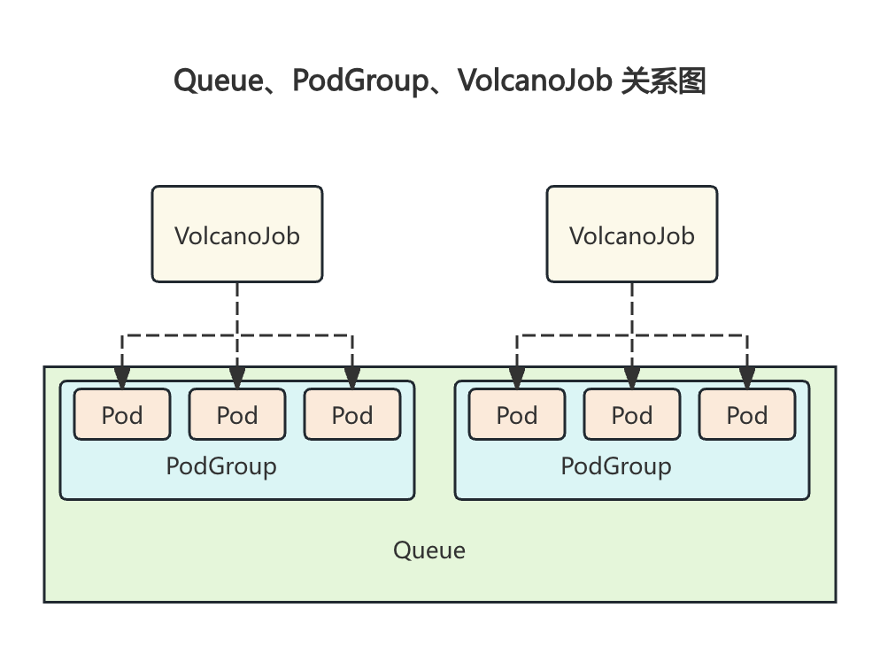

## 核心对象

Queue 里面有多个 PodGroup，PodGroup 包含多个 Pod，其中的 Pod 由 VolcanoJob 生成。

一个 VolcanoJob 通常关联一个 PodGroup（自动或手动创建），该 Job 创建的 Pod 也会属于该 PodGroup，Volcano 以 PodGroup 为单位进行统一调度，并从关联的 Queue 中分配资源。



对象的作用与定位：

- Queue

用于支持多租户场景下的资源分配与任务调度。通过队列，用户可以实现多租资源分配、任务优先级控制、资源抢占与回收等功能，显著提升集群的资源利用率和任务调度效率。

- PodGroup

一组强关联的 Pod 集合，这主要解决了 Kubernetes 原生调度器中单个 Pod 调度的限制。通过将相关的 Pod 组织成 PodGroup，Volcano 能够更有效地处理那些需要多个 Pod 协同工作的批处理工作负载任务。

类似于 K8s 中的 Pod，对 kube-scheduler 来说 Pod 是最小调度单元，对 Volcano 来说 PodGroup 是最小调度单元，Volcano 的调度器会以 PodGroup 为单位进行调度，但最终创建的仍是单个 Pod。

- VolcanoJob

Volcano 自定义的 Job 资源类型，它扩展了 Kubernetes 的 Job 资源。VolcanoJob 不仅包括了 Kubernetes Job 的所有特性，还加入了对批处理作业的额外支持，使得 Volcano 能够更好地适应高性能和大规模计算任务的需求，更加适用于机器学习、大数据、科学计算等高性能计算场景。

和 K8s 中原生的 Workload(deploy、sts、job 等) 作用一样

## Queue

### 简介和示例

Queue 是 Volcano 的核心概念之一，用于支持多租户场景下的资源分配与任务调度。通过队列，用户可以实现多租资源分配、任务优先级控制、资源抢占与回收等功能，显著提升集群的资源利用率和任务调度效率。

> 即：Queue 是容纳一组 PodGroup 的队列，也是该组 PodGroup 获取集群资源的划分依据。

volcano 启动后，会默认创建名为 default 的 queue，weight 为 1。后续下发的 job，若未指定 queue，默认属于default queue。

- 对于非关键或临时性任务，可以放心使用 `default` queue；
- 对于重要业务，务必创建专属 Queue 并设置合适的 `weight`、`priority` 和 `reclaimable`等配置。

示例 Queue 的 完整 yaml 如下：

```yaml
apiVersion: scheduling.volcano.sh/v1beta1
kind: Queue
metadata:
  name: test
spec:
  capability:
    cpu: "8"
    memory: 16Gi
  # deserved 字段仅用于 capacity
  deserved:
    cpu: "4"
    memory: 8Gi
  guarantee:
    resource:
      cpu: "2"
      memory: 4Gi
  priority: 100
  reclaimable: true
  # weight 字段仅用于 proportion
  weight: 1
```

### 关键字段

- guarantee
  - 可选：表示该 queue 为自己队列中的所有 PodGroup 预留的资源，其他队列无法使用该部分资源。
  - 若需配置 guarantee 值，则需要小于等于 deserved 值的配置
- deserved
  - 可选：用于指定该 queue 的应得资源总量
  - 对于 capacity 插件可以直接配置 deserved 直观指定
  - 对于 proportion 插件，会根据 weight 自动计算 deserved
- weight
  - 可选：表示该 queue 在集群资源划分中所占的相对比重，该 queue 应得资源总量为 `(weight/total_weight) * total_resource`。
  - 该字段只有在 proportion 插件开启时可按需配置，若不设置 weight，则默认设置为1
  - 其中， total_weight 表示所有的 queue 的 weight 总和，total_resource 表示集群的资源总量。weight 是一个软约束，取值范围为[1, 2^31-1]
  - 假设有两个 queue，weight 分别为 2 和 1，那么各自可以使用集群 2/3 和 1/3 的资源。
- capability
  - 可选：表示该 queue 内所有 podgroup 使用资源量之和的上限，它是一个硬约束。
  - 若不设置该字段，则队列的 capability 会设置为 realCapability（集群的资源总量减去其他队列的总 guarantee值）
  - 一般建议设置 capability 来指定资源上限，以保证集群稳定。
- reclaimable
  - 可选：表示该 queue 在资源使用量超过该 queue 所应得的资源份额时，是否允许其他 queue 回收该 queue 使用超额的资源，默认值为 true。
  - 对于使用 weight 设置资源的 queue 来说，随着 queue 越来越多，total_weight 也越大，当前 queue 分到的资源就会越少，该字段可以控制已经占用的资源是否可以被回收。
- priority
  - 可选：表示该 queue 的优先级，在资源分配和资源抢占/回收时，更高优先级的队列将会优先分配/抢占/回收资源
- parent
  - 可选：用来指定 queue 的父队列，若未指定 parent，则默认会作为 root queue 的子队列
  - Volcano 新增的层级队列功能。

Queue 的字段主要是用于资源限制，包括预留资源量、应得资源量、上限资源量以及是否允许资源回收等核心配置：

- `guarantee`：硬下限，是绝对约束，Queue 为自己队列中所有 PodGroup 预留的资源，其他 Queue 无法占用这部分资源。
- `deserved`/`weight`：软性限制，根据开启不同插件，通过 `deserved`（弹性基准线） 或 `weight`（动态比例） 实现，二者互斥（选其一）；
- `capability`: 硬上限,该 Queue 内所有 PodGroup 使用资源量之和的上限。
- `reclaimable`：是否允许回收超额资源(> deserved 部分)（默认 true，允许回收超额部分）。

### 资源状态

Queue 包括以下状态

- **Open**：可用状态，可接收新的 PodGroup
- **Closed**：不可用状态，不可接收新的 PodGroup
- **Closing**：正在转化为不可用状态，不可接收新的 PodGroup
- **Unknown**：当前处于不可知状态，可能是网络或其他原因导致 Queue 的状态暂时无法感知

即：Queue 只有在 Open 状态时可以接收新的 podgroup。

### 用法 & 最佳实践


## PodGroup

## VolcanoJob