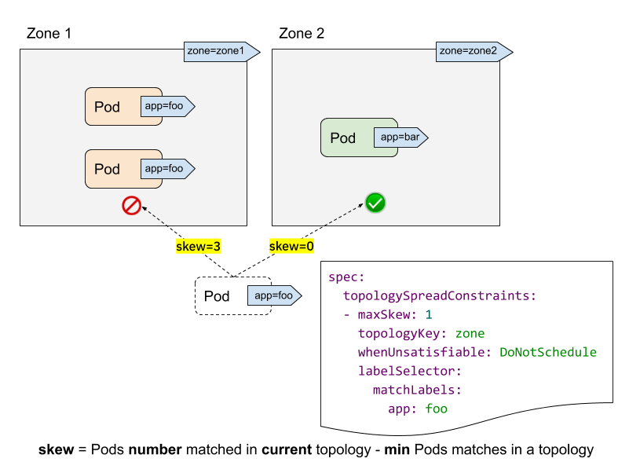

## 简介

`PodTopologySpread（Pod 拓扑分布约束）` 特性的提出正是为了对 Pod 的调度分布提供更精细的控制，以提高服务可用性以及资源利用率，`PodTopologySpread` 由 `EvenPodsSpread` 特性门所控制，在 v1.16 版本第一次发布，并在 v1.18 版本进入 beta 阶段默认启用。

在 Pod 的 Spec 规范中新增了一个 `topologySpreadConstraints` 字段即可配置拓扑分布约束，如下所示：

```yaml
spec:
  topologySpreadConstraints:
    - maxSkew: <integer>
      topologyKey: <string>
      whenUnsatisfiable: <string>
      labelSelector: <object>

```

由于这个新增的字段是在 Pod spec 层面添加，因此更高层级的控制 (Deployment、DaemonSet、StatefulSet) 也能使用 `PodTopologySpread` 功能。



各个字段的含义和作用：

- `labelSelector`: 用来查找匹配的 Pod，能够计算出每个拓扑域中匹配该 label selector 的 Pod 数量，在上图中，假如 label selector 是 `app:foo`，那么 zone1 的匹配个数为 2， zone2 的匹配个数为 0。
- `topologyKey`: 是 Node label 的 key，如果两个 Node 的 label 同时具有该 key 并且值相同，就说它们在同一个拓扑域。在上图中，指定 `topologyKey` 为 zone， 则具有 `zone=zone1` 标签的 Node 被分在一个拓扑域，具有 `zone=zone2` 标签的 Node 被分在另一个拓扑域。
- `maxSkew`: 这个属性理解起来不是很直接，它描述了 Pod 在不同拓扑域中不均匀分布的最大程度（指定拓扑类型中任意两个拓扑域中匹配的 Pod 之间的最大允许差值），它必须大于零。每个拓扑域都有一个 skew 值，计算的公式是: `skew[i] = 拓扑域[i]中匹配的 Pod 个数 - min{其他拓扑域中匹配的 Pod 个数}`。在上图中，新建一个带有 `app=foo` 标签的 Pod：
  - 如果该 Pod 被调度到 zone1，那么 zone1 中 Node 的 skew 值变为 3，zone2 中 Node 的 skew 值变为 0 (zone1 有 3 个匹配的 Pod，zone2 有 0 个匹配的 Pod )
  - 如果该 Pod 被调度到 zone2，那么 zone1 中 Node 的 skew 值变为 2，zone2 中 Node 的 skew 值变为 1(zone2 有 1 个匹配的 Pod，拥有全局最小匹配 Pod 数的拓扑域正是 zone2 自己 )，则它满足`maxSkew: 1` 的约束（差值为 1）
- `whenUnsatisfiable`: 描述了如果 Pod 不满足分布约束条件该采取何种策略：
  - `DoNotSchedule` (默认) 告诉调度器不要调度该 Pod，因此也可以叫作硬策略；
  - `ScheduleAnyway` 告诉调度器根据每个 Node 的 skew 值打分排序后仍然调度，因此也可以叫作软策略。

## 集群默认约束

除了为单个 Pod 设置拓扑分布约束，也可以为集群设置默认的拓扑分布约束，默认拓扑分布约束在且仅在以下条件满足时才会应用到 Pod 上：

- Pod 没有在其  `.spec.topologySpreadConstraints` 设置任何约束；
- Pod 隶属于某个服务、副本控制器、ReplicaSet 或 StatefulSet。

可以在  [调度方案（Schedulingg Profile）](https://kubernetes.io/zh/docs/reference/scheduling/config/#profiles)中将默认约束作为  `PodTopologySpread` 插件参数的一部分来进行设置。 约束的设置采用和前面 Pod 中的规范一致，只是  `labelSelector` 必须为空。配置的示例可能看起来像下面这个样子：

```yaml
apiVersion: kubescheduler.config.k8s.io/v1beta1
kind: KubeSchedulerConfiguration

profiles:
  - pluginConfig:
      - name: PodTopologySpread
        args:
          defaultConstraints:
            - maxSkew: 1
              topologyKey: topology.kubernetes.io/zone
              whenUnsatisfiable: ScheduleAnyway
          defaultingType: List

```

