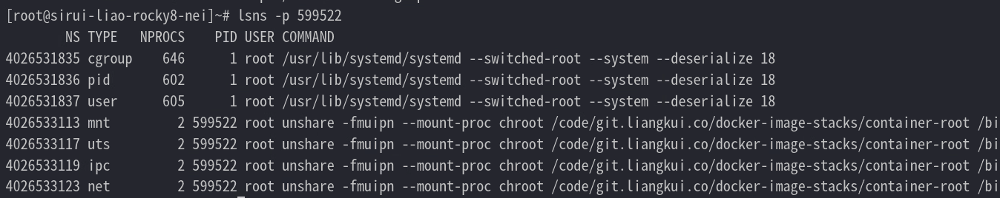
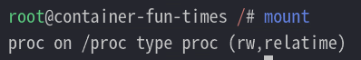
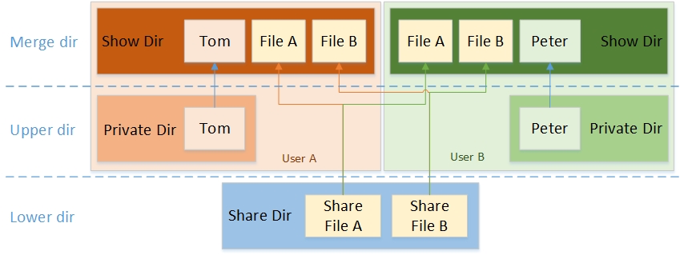
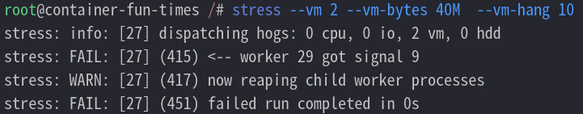
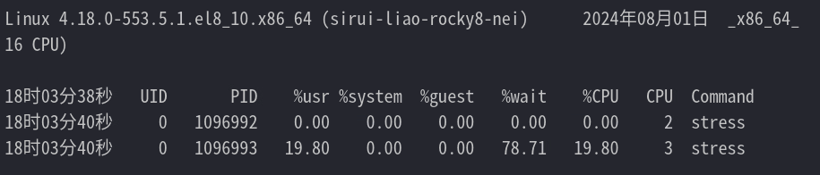
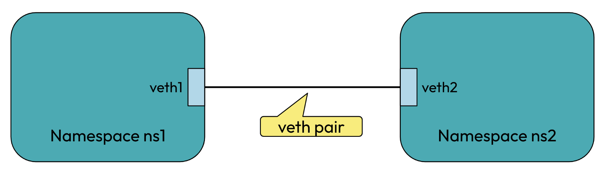
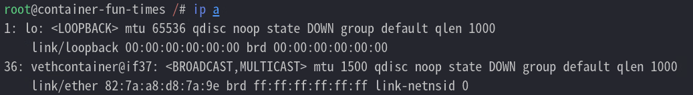

## 前置

（1）df 命令

Linux df（disk free）命令用于显示目前在 Linux 系统上的系统磁盘使用情况

（2）mount 命令

mount 命令用于加载文件系统到指定的加载点

挂载的实质是为了磁盘添加入口

```bash
mkdir -p ./mount_mount
mount ./dd_test1 ./mount_mount

df -h | grep mount_mount
```

（3）unshare

unshare 主要的能力是使用与父进程不共享的名称空间运行程序

例如，隔离 UTS

```bash
unshare -u /bin/bash
hostname testunshare1
hostname
```

（4）chroot

chroot，即 change root directory (更改 root 目录)。在 linux 系统中，系统默认的目录结构都是以 /，即以根 (root) 开始的。而在使用 chroot 之后，系统的目录结构将以指定的位置作为 / 位置

（5）lsns

查看进程的 namespace

（6）nsenter

在一个已有的 namespace 下运行命令

## 制作运行环境

使用如下的 Dockerfile 进行构建

```dockerfile
# syntax=harbor.alpha-quant.com.cn/3rd_party/docker.io/docker/dockerfile:1.5.2

ARG THIRDPARTY_REPO=harbor.alpha-quant.com.cn/3rd_party

ARG ROCKY_VER=9.4.20240509

FROM --platform=$TARGETPLATFORM ${THIRDPARTY_REPO}/docker.io/rockylinux/rockylinux:${ROCKY_VER} as base

SHELL ["/bin/bash", "-c"]

# update - pacakge and locale
RUN --mount=type=cache,target=/var/cache,id=build-cache \
    --mount=type=cache,target=/tmp,id=build-tmp \
    \
    echo "update all base at 2023-03-28" \
    \
    && cp -rpf /etc/yum.repos.d /etc/yum.repos.d.bak \
    && sed -e 's|^mirrorlist=|#mirrorlist=|g' \
    -e 's|^#baseurl=http://dl.rockylinux.org/$contentdir/|baseurl=http://nexus.alpha-quant.com.cn/repository/rockylinux/|g' \
    -i.bak /etc/yum.repos.d/*.repo \
    \
    && dnf makecache --refresh \
    && dnf install -y \
    epel-release \
    dnf-utils \
    \
    && sed -e 's|^metalink=|#metalink=|g' \
    -e 's|^#baseurl=https://download.example/pub/epel/|baseurl=http://nexus.alpha-quant.com.cn/repository/epel/|g' \
    -i.bak /etc/yum.repos.d/epel*.repo \
    && dnf makecache --refresh \
    \
    && dnf config-manager --setopt=timeout=500 --save \
    && dnf config-manager --setopt=minrate=1 --save \
    \
    && dnf install -y stress sysstat tar fish iproute \
    \
    && dnf clean all \
    \
    && true
```

构建镜像

```
docker buildx build \
    --progress=plain \
    --pull \
    --push \
    --progress=plain \
    -t harbor.alpha-quant.com.cn/docker-image-stacks/container-test:v1 \
    -f ./Dockerfile \
    .
```

拉取一个文件系统包

```bash
docker pull harbor.alpha-quant.com.cn/docker-image-stacks/container-test:v1

docker create --name container-root harbor.alpha-quant.com.cn/docker-image-stacks/container-test:v1

docker export container-root -o container-root-v1.tar
```

准备容器运行环境

```bash
mkdir ./container-root && cd container-root

tar xf ../container-root-v1.tar -C .
```

## 不同的根目录

在容器里面的进程和容器外面的并无两样，但是会受到一些由 Linux 内核所规范的限制，比如说：不同的 PID namespace、不同的根目录、内存限制、capability 限制、部分系统调用被屏蔽等

容器镜像里面是一个打包好的文件系统，当收到一个容器镜像的时候，会通过`chroot`的原理去使用这个压缩包

例如：在执行`chroot /fake/root`后，当运行`/usr/bin/redis`的时候，实际上是在运行`/fake/root/usr/bin/redis`

```bash
chroot $PWD /bin/sh
```

可以用`chroot`去理解`pivot_root`，但其实两者实现的原理不一样

最大的区别就是，在 chroot 环境下运行的进程，还是有机会访问到原来的根目录；而使用`pivot_root`后，旧的文件系统就会被卸载(umount)；pivot_root 比 chroot 安全

查看网卡仍为原来的宿主机网卡

```
ip a
```

切换到 fish 可以看到当前的 shell 被切换为原本宿主机所不具备的 fish

```
fish
```

使用 chroot 后，系统读取的是新根下的目录和文件，这是一个与原系统根下文件不相关的目录结构。在这个新的环境中，可以用来测试软件的静态编译以及一些与系统不相关的独立开发

通过代码理解 chroot 命令

尝试自己实现一个 chroot 程序，代码中涉及到两个函数，分别是 chroot() 函数和 chdir() 函数，其实真正的 chroot 命令也是通过调用它们实现的：

```c
#include <stdio.h>
#include <stdlib.h>
#include <unistd.h>

int main(int argc, char *argv[]) {
  if (argc < 2) {
    printf("Usage: chroot NEWROOT [COMMAND...] \n");
    return 1;
  }

  if (chroot(argv[1])) {
    perror("chroot");
    return 1;
  }

  if (chdir("/")) {
    perror("chdir");
    return 1;
  }

  if (argc == 2) {
    // hardcode /bin/sh for my busybox tools.
    argv[0] = (char *)"/bin/bash";

    argv[1] = (char *)"-i";
    argv[2] = NULL;
  } else {
    argv += 2;
  }

  execvp(argv[0], argv);
  printf("chroot: cannot run command `%s`\n", *argv);

  return 0;
}

```

编译一下：

```bash
gcc -Wall chroot.c -o chroot
```

回到顶层目录

```bash
./chroot ./container-root

# 尝试下直接进入 fish
./chroot ./container-root fish
```

## Namespace

容器就是一组特殊的进程，在容器外面也可以看到容器里面的进程，但是在容器内部只能看到容器里面的进程，这背后就是 namespace 在起作用

仍然使用系统的 chroot 进行切换

```bash
chroot ./container-root /bin/fish
```

获取现在自己的进程

```bash
ps -ef |grep fish |grep -v grep |grep -v helper
```

查看 namespace

```bash
lsns -p 598032

# 以下命令具有相同效果
ls -l /proc/598032/ns/
```

在默认情况下，都会使用 “host” 这个 namespace。所有不在容器内的进程，就是在使用 “host” 这个 namespace 下（进程会有 7 个 namespace）


重新执行添加一个隔离主机名 ns 的容器

```bash
unshare -fmuipn --mount-proc \
  chroot ./container-root /bin/bash -c "/bin/mount -t proc proc /proc && hostname container-fun-times && /bin/fish"
```

可以看到部分命名空间的变更



此时，这个 chroot 的目录已经看起来像是一个独立的机器了

隔离两个进程需要怎么办？

（1）首先容器进程与进程之间需要隔离，所以需要 PID 隔离

（2）首先容器 A 进程不能读取容器 B 进程通讯内容需要隔离信号量等，所以需要 IPC 隔离

（3）首先容器 A 进程不能读取容器 B 进程的文件，所以需要 Mount 隔离

（4）首先容器 A 进程不能读取容器 B 进程的 socket，所以需要网络隔离、主机隔离

查看 hostname

```bash
hostname
```


查看挂载信息

```
# 查看 mnt 命名空间
# /bin/mount -t proc proc /proc
mount
```



查看网卡

```
# 查看 net 命名空间
ip a
```


## OverlayFS

overlay file system 可以做到：将两个 file system merge 在一起，下层的文件系统只读，上层的文件系统可写

- 如果读取，找到上层就读上层的，否则的话就找到下层的读

- 如果写入，会写入到上层

这样，其实对于最终用户来说，可以认为只有一个 merge 之后的文件系统，用起来和普通文件系统没有什么区别

有了这个功能，Docker 运行的时候，从最下层的文件系统开始，merge 两层，得到新的 fs 然后再 merge 上一层，然后再 merge 最上一层，最后得到最终的 directory，然后用 chroot 改变进程的 root 目录，启动 container。




`mount -t overlay`命令有四个参数：

- lowerdir：只读层
- upperdir：在容器运行过程中，对文件的创建、修改、删除等修改操作都会记录在这个layer中，当容器运行结束，里面的内容也会被删除
- workdir：用于容器内部使用的空路径
- target：合并后的文件系统的挂载点

简单的测试一下

```bash
mv container-root lower

mkdir -p ./{merged,work,upper}
touch ./lower/{dog,bird}.txt && echo log-lower > ./lower/dog.txt
touch ./upper/{dog,cat}.txt && echo upper-lower > ./upper/dog.txt

mount -t overlay overlay -o lowerdir=./lower,upperdir=./upper,workdir=./work ./merged/
```

查看文件

```bash
> ls -al ./merged/*.txt
bird.txt  cat.txt  dog.txt

> cat ./merged/dog.txt 
log-upper
```

如上的结果表明：overlayfs 能组装文件，并且覆盖底层的


接下来尝试删除文件

```
chroot ./merged fish

rm -f bird.txt
```

退出当前 chroot 环境，可以看到原来的文件仍存在

```
ls -al lower/bird.txt
```

但是在 merged 合并层中这个文件已经不存在了，这说明，底层是制度层，不管增加删除，都不会被改变

了解了原理之后，你会发现，这种设计对于容器来说非常合适：

1. 如果 2 个 image 都是基于 Ubuntu，那么两个 Image 可以共用 Ubuntu 的 base image，只需要存储一份；
2. 如果 pull 新的 image，某一层如果已经存在，那么这一层之前的内容其实就不需要 pull 了；

延伸：容器镜像仓库

通过镜像仓库来分享不同的容器镜像，每个镜像都会有个 ID（例如 Ubuntu）和标签（例如 18.04 或 latest）。当从镜像仓库下载镜像的时候，会先对比本地已有的 layer，接着再下载我们所缺失的 layer

## CGroups

cgroups 是Linux内核提供的一种可以限制单个进程或者多个进程所使用资源的机制，可以对 cpu，内存等资源实现精细化的控制，目前越来越火的轻量级容器 Docker 就使用了 cgroups 提供的资源限制能力来完成cpu，内存等部分的资源控制。

另外，开发者也可以使用 cgroups 提供的精细化控制能力，限制某一个或者某一组进程的资源使用。比如在一个既部署了前端 web 服务，也部署了后端计算模块的八核服务器上，可以使用 cgroups 限制 web server 仅可以使用其中的六个核，把剩下的两个核留给后端计算模块

目前有下面这些资源子系统：

- Block IO（`blkio`)：限制块设备（磁盘、SSD、USB 等）的 IO 速率
- CPU Set(`cpuset`)：限制任务能运行在哪些 CPU 核上
- CPU Accounting(`cpuacct`)：生成 cgroup 中任务使用 CPU 的报告
- CPU (`CPU`)：限制调度器分配的 CPU 时间
- Devices (`devices`)：允许或者拒绝 cgroup 中任务对设备的访问
- Freezer (`freezer`)：挂起或者重启 cgroup 中的任务
- Memory (`memory`)：限制 cgroup 中任务使用内存的量，并生成任务当前内存的使用情况报告
- Network Classifier(`net_cls`)：为 cgroup 中的报文设置上特定的 classid 标志，这样 tc 等工具就能根据标记对网络进行配置
- Network Priority (`net_prio`)：对每个网络接口设置报文的优先级
- `perf_event`：识别任务的 cgroup 成员，可以用来做性能分析

控制内存、CPU 使用率

```bash
uuid="cgroup_$(shuf -i 1000-2000 -n 1)"
cgcreate -g "cpu,cpuacct,memory:$uuid"
cgset -r cpu.shares=512 "$uuid"
cgset -r cpu.cfs_quota_us=10000 "$uuid"
cgset -r cpu.cfs_period_us=50000 "$uuid"
cgset -r memory.limit_in_bytes=20971820 "$uuid"
cgexec -g "cpu,cpuacct,memory:$uuid" \
    unshare -fmuipn --mount-proc \
    chroot ./lower \
    /bin/bash -c "/bin/mount -t proc proc /proc && hostname container-fun-times && /usr/bin/fish"
```

该 cgroup 内存组的配置如上，改变上述配置文件即可管理该资源组。比如 tasks 管理哪些进程在该资源组中，memory_limit_in_bytes 限制了进程可使用的最大的内存大小

使用 stress 创建一个进程，不断的开辟 40M 的内存；并使用 pidstat 监视进程的内存使用情况

```bash
# 新开一个窗口开启监视（无需切换 ns）
pidstat -C stress -p ALL -r 2 1000

# 一个申请内存
stress --vm 2 --vm-bytes 40M  --vm-hang 10
```



刚刚设置的 CPU 参数是使用了 CPU 带宽控制组；带宽控制组定义了一个 周期，通常为 1/10 秒（即 100000 微秒）。还定义了一个 配额，表示允许进程在设置的周期长度内所能使用的 CPU 时间数，两个文件配合起来设置 CPU 的使用上限

```bash
# 限制使用 1 个 CPU 的 20%（每 50ms 能使用 10ms 的 CPU 时间，即使用一个 CPU 核心的 20%）
$ echo 10000 > cpu.cfs_quota_us /* quota = 10ms */
$ echo 50000 > cpu.cfs_period_us /* period = 50ms */
```

用 stress 创建一个进程，打满 cpu 使用；并使用 pidstat 监视进程的 cpu 使用情况

```bash
# 新开一个窗口开启监视（无需切换 ns）
pidstat -C stress -p ALL -u 2 1000

# 压测 CPU
stress -c 1
```



## 网络实现

veth-pair 就是一对的虚拟设备接口，和 tap/tun 设备不同的是，它都是成对出现的。一端连着协议栈，一端彼此相连着

正因为有这个特性，它常常充当着一个桥梁，连接着各种虚拟网络设备，典型的例子像“两个 namespace 之间的连接”，以此构建出非常复杂的虚拟网络结构



ip netns 命令用来管理 network namespace。它可以创建命名的 network namespace，然后通过名字来引用 network namespace

可以使用如下命令来创建一对 veth pair 出来，需要记住的是 veth pair 无法单独存在，删除其中一个，另一个也会自动消失

```bash
ip link add vethhost type veth peer name vethcontainer

# 查看
ip a
```


启动容器

```
unshare -fmuipn --mount-proc chroot ./lower /usr/bin/fish
```

查看已有网卡

```
ip a
```

只有回环网卡


把一端插入容器中

```
ip link set vethcontainer netns $(pidof fish)
```

再次查看网卡



开始配置对端 ip

```bash
ip link set vethhost up
ip addr add 10.244.244.1/24 dev vethhost

ip netns attach container $(pidof fish)
ip netns exec container ip link set vethcontainer up
ip netns exec container ip addr add 10.244.244.2/24 dev vethcontainer
```

再次查看网卡，然后测试网络


## 参考资料

- <https://www.rondochen.com/how-containers-work/>
