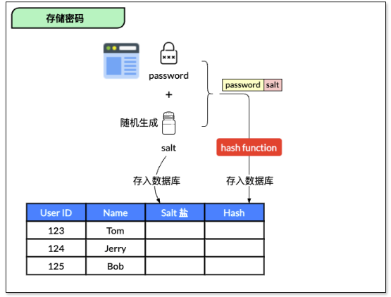

盐（Salt） 是一段随机生成的数据，用于与密码一起进行哈希计算，以确保即使用户的密码相同，存储在数据库中的哈希值也不同。

使用“盐”来增强哈希是密码存储中的重要安全措施，能够防止彩虹表攻击，并使暴力破解更加困难。通过为每个用户生成唯一的盐，可以有效防止攻击者使用预计算的彩虹表（即一张已经计算好常用密码和对应哈希值的表）来破解密码。

以 MD5 为示例，即以 MD5 作为明文的散列算法 H，加密后的密文为 q，明文为 p。彩虹表的作用就是在已知散列算法 H 和散列后的密文 q 的情况下，快速地得到明文 p。整个破解过程为：根据密文 q 所使用的散列算法 H，生成或者下载针对该算法的彩虹表，然后再基于彩虹表对密文进行破解，最终得到明文 p

如果不使用盐，多个用户的相同密码会生成相同的哈希值。这样，一旦攻击者拿到数据库，他可以轻松找到哪些用户的密码相同，甚至使用预先计算的哈希值表来快速破解常见的密码

以下是使用“盐”进行哈希计算的完整流程：

（1）生成随机盐

盐必须是随机生成的，且应该使用加密安全的伪随机数生成器（如 SecureRandom）来确保其难以预测。

盐值的长度应至少为 16 字节，以确保足够的随机性和安全性。

（2）将盐与密码结合

将生成的盐值与用户输入的密码进行拼接（一般是将盐值加在密码的前面或后面）。

（3）对盐化后的密码进行哈希处理

使用合适的哈希算法（如 bcrypt、Argon2、scrypt）对“盐化”后的密码进行哈希处理。

（4）将盐与哈希值一起存储

将生成的盐值与哈希值一起存储在数据库中。通常盐值可以公开存储，因为它并不需要加密。