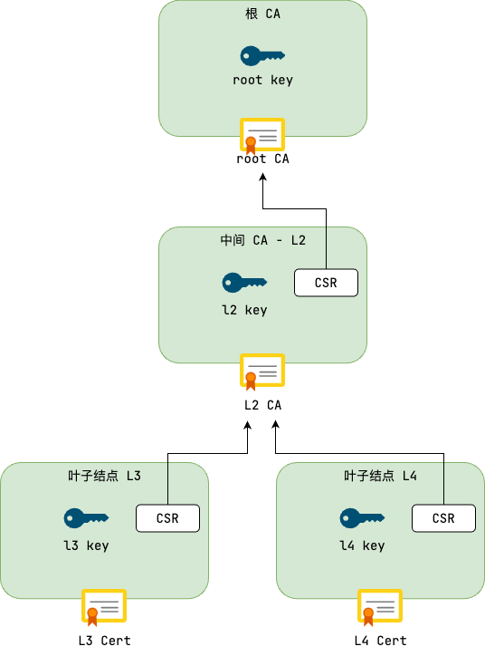

## CFSSL 简介

- GitHub 地址：<https://github.com/cloudflare/cfssl>
- 官方地址：<https://pkg.cfssl.org>

CFSSL（CloudFlare's PKI and TLS toolkit）由 CloudFlare 用 go 语言开发的一个开源工具，用于证书签名、验证和管理。生成自签证书的方式有多种，CFSSL 支持签发三种类型的证书：‌client 证书、‌server 证书以及集群成员之间的 peer 证书

cfssl 依赖三个工具包，分别是：cfssl、cfssljson、cfss-certinfo

- cfssl：cfssl 是工具集的核心，提供了证书生命周期管理的所有功能：
  - 证书生成：创建自签名证书、CA 证书和用户证书。
  - 证书签名：处理证书签名请求（CSR）并颁发证书。
  - 配置管理：使用 JSON 配置文件定义证书策略和使用场景。
  - CA 管理：创建和管理证书颁发机构（CA）层次结构。
  - OCSP / CRL：生成在线证书状态协议（OCSP）响应和证书撤销列表（CRL）。
- cfssljson：专门用于处理 cfssl 输出的 JSON 数据，主要功能包括：
  - 解析 JSON 输出：将 cfssl 生成的 JSON 格式证书、密钥和 CSR 转换为单独的文件。
  - 文件保存：自动创建并保存证书（.pem）、私钥（.key）和 CSR（.csr）文件。
- cfssl-certinfo：用于查看和验证证书的详细信息，功能包括：
  - 证书解析：显示证书的元数据（如有效期、颁发者、主题、公钥等）。
  - 证书链验证：检查证书的签名链是否有效。
  - 格式转换：将证书以人类可读的格式输出。

安装工具

```bash
curl -L -o /usr/local/bin/cfssl \
  https://github.com/cloudflare/cfssl/releases/download/v1.6.5/cfssl_1.6.5_linux_amd64
curl -L -o /usr/local/bin/cfssljson \
  https://github.com/cloudflare/cfssl/releases/download/v1.6.5/cfssljson_1.6.5_linux_amd64
curl -L -o /usr/local/bin/cfssl-certinfo \
  https://github.com/cloudflare/cfssl/releases/download/v1.6.5/cfssl-certinfo_1.6.5_linux_amd64

chmod +x /usr/local/bin/cfssl*
```

## `cfssl gencert` 命令详解

cfssl gencert 是 CloudFlare PKI 工具集中用于生成证书签名请求（CSR）和证书的核心命令。

- `-ca [path]`：指定用于签名的 CA 证书文件路径（PEM 格式）。

```bash
-ca=ca.pem
```

- `-ca-key [path]`：指定 CA 的私钥文件路径（PEM 格式）。

```bash
-ca-key=ca-key.pem
```

- `-config [path]`：指定证书签名配置文件（JSON 格式），定义证书的有效期、用途等策略。

```bash
-config=ca-config.json
```

- `-profile [name]`：指定使用配置文件中的哪个签名策略。对应 CA 配置文件中的 profiles 字段，其值可以为 server、client、peer、ca、kubernets 等

```bash
-profile=server
```

- `-hostname [list]`：指定证书的 Subject Alternative Name (SAN) 字段，包含域名和 IP 地址，多个值用逗号分隔

```bash
-hostname=example.com,www.example.com,192.168.1.1
```

- `-cn [name]`：指定证书的 Common Name (CN)

```bash
-cn="My Server"
```

- `-key-algo [algo]`：指定密钥算法，支持 rsa、ecdsa 等，默认 rsa

```bash
-key-algo=rsa
```

- `-key-size [bits]`：指定密钥长度（RSA 建议 2048+，ECDSA 建议 256+）

```bash
-key-size=2048
```

- `-initca`：生成自签名的根 CA 证书。

```bash
cfssl gencert -initca ca-csr.json
```

- `-self-signed`：生成自签名证书（非 CA 证书）

```bash
cfssl gencert -self-signed server.json
```

## 分层设计

分层设计：使用根 CA → 中间 CA → 终端证书的三级结构



参考配置

```json
{
    "signing": {
        "default": {
            "expiry": "87600h",
            "crl_url": "https://s3.laisky.com/public/laisky.crl"
        },
        "profiles": {
            "leaf": {
                "expiry": "87600h",
                "usages": [
                    "signing",
                    "key encipherment",
                    "server auth"
                ]
            },
            "intermediate": {
                "expiry": "87600h",
                "usages": [
                    "cert sign",
                    "crl sign"
                ],
                "ca_constraint": {
                    "is_ca": true
                }
            }
        }
    }
}
```

其中 `profiles` 可以包含多个配置：

- `intermediate`：表示中间 CA，用于签发下一级 CA 或叶子证书，一般不用于加密
- `leaf`：叶子证书，仅用于加密

## 实战：生成证书

### 创建根 CA 配置文件

参考配置文件

`ca-config.json`

```json
{
    "signing": {
        "default": {
            "expiry": "876000h"
        },
        "profiles": {
            "server": {
                "expiry": "876000h",
                "usages": [
                    "signing",
                    "key encipherment",
                    "server auth"
                ]
            },
            "client": {
                "expiry": "876000h",
                "usages": [
                    "signing",
                    "key encipherment",
                    "client auth"
                ]
            },
            "peer": {
                "expiry": "876000h",
                "usages": [
                    "signing",
                    "key encipherment",
                    "server auth",
                    "client auth"
                ]
            },
            "kubernetes": {
                "expiry": "876000h",
                "usages": [
                    "signing",
                    "key encipherment",
                    "server auth",
                    "client auth"
                ]
            },
            "ca": {
                "expiry": "876000h",
                "usages": [
                    "signing",
                    "key encipherment",
                    "server auth",
                    "client auth"
                ]
            }
        }
    }
}

```

配置文件字段说明：

usages：指定的证书用途

- signing：允许证书用于数字签名。数字签名可以确保数据在传输过程中不被篡改，并且可以验证数据的来源
- key encipherment：允许证书用于加密密钥。在 TLS 握手过程中，客户端和服务器会交换会话密钥，这个过程通常使用证书进行加密
- server auth：专门用于服务器身份验证。当客户端连接到服务器时，服务器会出示自己的证书，客户端会验证这个证书是否由信任的 CA 颁发，以及证书中的域名是否与自己要访问的域名一致
- client auth：专门用于客户端身份验证。在双向 TLS 中，服务器也会要求客户端提供证书，以验证客户端的身份

各端证书使用场景：

- server：HTTPS 网站、SMTP、IMAP、POP3 等邮件服务器、VPN 服务器、任何需要向客户端证明自己身份的服务
- client：企业内部应用，要求员工使用客户端证书登录、API 访问，使用客户端证书进行身份验证、安全邮件客户端，使用证书进行身份验证
- peer：区块链网络中的节点通信、分布式系统中节点间的安全通信、金融机构之间的安全数据交换
- kubernetes：Kubernetes 组件证书（如 API Server、etcd）
- ca：中间 CA 证书（需配合 `-ca` 参数使用）

### 创建根 CA  CSR 配置文件

`ca-csr.json`

```json
{
    "CN": "alpha-quant.tech",
    "hosts": [
        "*.alpha-quant.tech",
        "alpha-quant.tech"
    ],
    "key": {
        "algo": "rsa",
        "size": 4096
    },
    "names": [
        {
            "C": "CN",
            "ST": "Sichuan",
            "L": "Chengdu",
            "O": "AlphaQuant",
            "OU": "AlphaQuant Trust Services"
        }
    ],
    "ca": {
        "expiry": "876000h"
    }
}

```

默认值可以通过

```bash
# 生成 csr.json 模版
cfssl print-defaults csr > csr.json
```

根 CA 的通用名称，对于服务器证书，CN 通常是域名（如 `alpha-quant.tech`）；对于 CA 证书，CN 是 CA 的标识名称。

- `key`
  - `algo`：加密算法
  - `size`： 加密长度
- `names`
  - `C`：国家代码。CN 代表中国
  - `ST`：省份
  - `L`：城市或地区
  - `O`：组织名称（Organization），可以理解成公司名称
  - `OU`：组织单位（Organizational Unit），可以理解成公司部门
- `ca`
  - `expiry`：根 CA 证书的配置，指定有效期为 100 年

### 生成根 CA 证书和私钥

```bash
mkdir ca
cfssl gencert -initca ca-csr.json | cfssljson -bare ca/alpha-quant.tech.CA
```

命令解释

cfssl gencert：cfssl 工具的子命令，用于生成证书

- `-initca`：指定生成自签名的根 CA 证书
- `ca-csr.json`：证书签名请求（CSR）的配置文件路径，对应上面创建的 ca-csr.json

cfssljson：处理 cfssl 生成的 JSON 输出并转换为文件

- `-bare ca/alpha-quant.tech.CA`：指定输出文件名前缀为 `ca/alpha-quant.tech.CA`，会生成以下三个文件：

```bash
# tree .
.
├── ca
│   ├── alpha-quant.tech.CA.csr      # 证书签名请求（通常自签名 CA 不需要保留此文件）
│   ├── alpha-quant.tech.CA-key.pem  # 根 CA 的私钥（必须严格保密！）
│   └── alpha-quant.tech.CA.pem      # 根 CA 证书（自签名）
├── ca-config.json
└── ca-csr.json
```

### 生成中间 CA 证书和私钥

配置文件 `intermediate-csr.json`

```json
{
    "CN": "alpha-quant.tech",
    "key": {
        "algo": "rsa",
        "size": 4096
    },
    "names": [
        {
            "C": "CN",
            "ST": "Sichuan",
            "L": "Chengdu",
            "O": "AlphaQuant",
            "OU": "AlphaQuant Trust Services"
        }
    ]
}

```

生成中间 CA 证书和私钥

```bash
mkdir intermediate
cfssl gencert \
  -ca=ca/alpha-quant.tech.CA.pem \
  -ca-key=ca/alpha-quant.tech.CA-key.pem \
  -config=ca-config.json \
  -profile=ca \
  intermediate-csr.json | cfssljson -bare intermediate/alpha-quant.tech.CA.intermediate
```

查看文件

```bash
# tree .
.
├── ca
│   ├── alpha-quant.tech.CA.csr
│   ├── alpha-quant.tech.CA-key.pem
│   └── alpha-quant.tech.CA.pem
├── ca-config.json
├── ca-csr.json
├── intermediate
│   ├── alpha-quant.tech.CA.intermediate.csr
│   ├── alpha-quant.tech.CA.intermediate-key.pem  # 中间 CA 私钥（需保密）
│   └── alpha-quant.tech.CA.intermediate.pem      # 中间 CA 证书
└── intermediate-csr.json
```

### 生成服务器证书

`server-csr.json`

```json
{
    "CN": "*.alpha-quant.tech",
    "key": {
        "algo": "rsa",
        "size": 2048
    },
    "hosts": [
        "*.alpha-quant.tech",
        "alpha-quant.tech"
    ]
}

```

使用中间 CA 签署服务器证书

```bash
mkdir server
cfssl gencert \
  -ca=intermediate/alpha-quant.tech.CA.intermediate.pem \
  -ca-key=intermediate/alpha-quant.tech.CA.intermediate-key.pem \
  -config=ca-config.json \
  -profile=server \
  server-csr.json | cfssljson -bare server/alpha-quant.tech
```

### 生成客户端证书

参考配置 `client-csr.json`

```bash
{
    "CN": "client",
    "key": {
        "algo": "rsa",
        "size": 2048
    }
}

```

使用中间 CA 签署客户端证书

```bash
cfssl gencert \
  -ca=intermediate/alpha-quant.tech.CA.intermediate.pem \
  -ca-key=intermediate/alpha-quant.tech.CA.intermediate-key.pem \
  -config=ca-config.json \
  -profile=client \
  client-csr.json | cfssljson -bare client/client
```

### 生成 K8s 证书

生成 API Server 证书，配置客户端证书文件 `k8s-apiserver-csr.json`

```json
{
    "CN": "kubernetes-apiserver",
    "key": {
        "algo": "rsa",
        "size": 2048
    },
    "hosts": [
        # Kubernetes服务IP (Service Cluster IP Range)
        "10.0.0.30",
        "10.0.0.31",
        "10.0.0.32"
        # API Server IP
        "192.168.1.10",
        "kubernetes",
        "kubernetes.default",
        "kubernetes.default.svc",
        "kubernetes.default.svc.cluster",
        "kubernetes.default.svc.cluster.local",
        "localhost",
        "127.0.0.1"
    ]
}

```

使用中间 CA 签署客户端证书

```bash
cfssl gencert \
  -ca=intermediate/alpha-quant.tech.CA.intermediate.pem \
  -ca-key=intermediate/alpha-quant.tech.CA.intermediate-key.pem \
  -config=ca-config.json \
  -profile=kubernetes \
  k8s-apiserver-csr.json | cfssljson -bare api-server/api-server

```

## 通过 CRL 吊销证书

销证书一般有两种方式：

1. OCSP：提供一个服务端接口，实时请求
2. CRL 提供一个 CRL 文件，列举已吊销的证书。CRL 文件一般会以公网 URL 的形式提供，可以内嵌到证书文件中。在公网发布时，采用二进制的 DER 格式。
