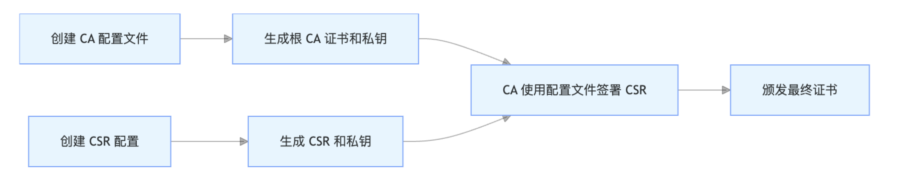

## 生成证书

推荐使用 cfssl 工具或者 openssl 工具来生成

## CA（证书颁发机构）

CA（Certificate Authority）是 PKI（公钥基础设施）体系的核心信任锚点

负责：

- 证书签名：验证申请者身份后，使用自己的私钥为其颁发数字证书。
- 信任分发：通过公开的根证书（Root CA），让客户端信任其签署的所有证书。
- 证书管理：包括证书颁发、更新、撤销和状态查询（OCSP / CRL）。

### 证书类型

CA 证书类型类型分为三类，分别是：

- 根 CA（Root CA）：

自签名证书，位于信任链顶端。

通常离线存储，极少直接签署终端用户证书。

- 中间 CA（Intermediate CA）：

由根 CA 签署，用于分担证书签署工作。

即使私钥泄露，影响范围也仅限于其签署的证书。

- 终端 CA：

直接签署服务器 / 客户端证书的 CA。

### 最佳实践

安全规范实践：

- 分层设计：使用根 CA → 中间 CA → 终端证书的三级结构。
- 私钥保护：根 CA 私钥必须离线存储（如 HSM 硬件安全模块）。
- 定期轮换：中间 CA 证书有效期通常为 3-5 年，需定期更新。

## CSR（证书签名请求）

CSR（Certificate Signing Request）是客户端向 CA 提交的申请文件，创建证书前需要先生成 CSR。

CSR 文件通常包含以下信息：

- 公钥：申请者生成的公钥。
- 身份信息：如域名、组织名称、国家代码等。
- 扩展字段：如 SAN（Subject Alternative Name）、密钥用途等。

生产 CSR 的注意事项：

- 私钥绝对保密：CSR 生成过程中产生的私钥需严格保密，不可泄露。
- 信息准确性：CSR 中的域名（CN / SAN）必须与服务器实际域名一致，否则 TLS 握手会失败。

## 工作流程

