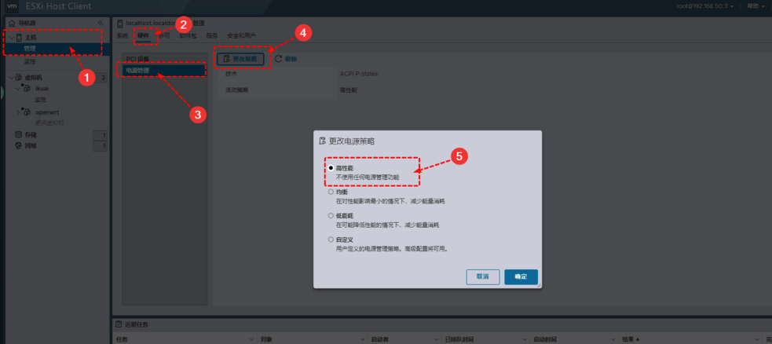

## 虚拟机管理软件

打造软路由的话 ESXi 和 PVE 用的比较多，ESXi 稳定性更好，PVE 硬件兼容性好些

- ESXi

是 VMWare vSphere Hypervisor 套件之下重要组件。是一款一款优秀的服务器级别的虚拟机；前身是 ESX，依赖 Linux 源码，后来抛弃 Linux 源码做成了 ESXi

整个产品商用气息浓重，界面清晰易用，但硬件兼容性较差（主要面向服务器），没什么扩展性，ESXi 不依赖于任何操作系统，直接安装在裸机上，它本身就可以看作一个操作系统，然后可以在它上面安装其他系统

- PVE

全称 Proxmox Virtual Environment，是基于 Debian 的 Linux 系统，虚拟机内核为 KVM

硬件兼容性优秀；界面功能不强，很多操作要靠命令行，但扩展能力几乎是无限的

## ESXi

### 开启直通网卡

选择【管理】-【硬件】-【PCI 设备】，查看可以直通的网卡，这里网卡的顺序就是按照我们物理接口的 etho、eth1、eth2、eth3 顺序来的

第一个网卡千万不要直通，也就是我们前面设置的 ESXi 管理口，不要设置直通，如果把管理口也做了直通，ESXI 重启后 WEB 管理界面就进入不去了

看到网卡直通状态变为活动后，就是直通开通成功了，这样后面我们安装路由虚拟机时，直接添加PCl设备就可以直通了

> 直通的好处：
>
> 直通是指虚拟化时将硬件管理权、使用权完全交给一个虚拟出的系统 (使用这个网卡的虚拟机)，不经过虚拟系统的虚拟封装，以直接以原生方式使用硬件，达到最高性能
>
> 直通的效率更好，因为直接直通给了虚拟机使用，硬件使用中产生的数据不会再经过 ESXI 进行二次处理，可以节约一部分系统性能，不直通的话虚拟机在运行中会占用更多的 cpu

### 设置网络

在网络内对虚拟机 VM Network 进行设置，选择【编辑设置】—— 安全内的混杂模式、mac 地址改变、伪传输都改为接受：

### 修改电源模式

一定要电源模式改为高性能，否则会路由器会自动限制性能，百度网盘，迅雷等软件下载速度会限制在 10MB/S

选择【管理】-【硬件】-【电源管理】-【更改策略】- 高性能：

