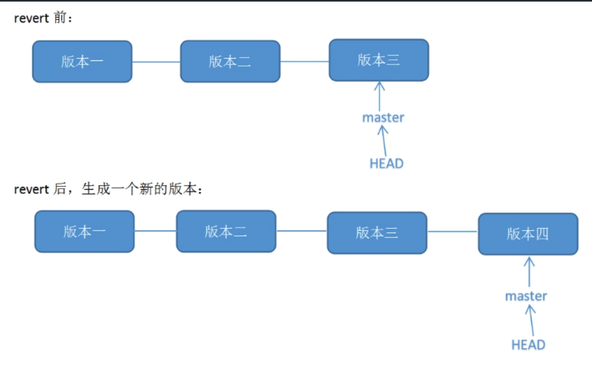

## 问题处理

### 中文显示乱码

- 现象

status 查看有改动但未提交的文件时总只显示数字串，显示不出中文文件名。如下：

```bash
 "Kubernetes/\345\237\272\347\241\200.md"                                                                                                 |  17 +++++++++++++++++
 "Kubernetes/\345\237\272\347\241\200/Pod\345\216\237\347\220\206.md"                                                                     |  11 +++++++++++
 "Kubernetes/\345\237\272\347\241\200/Pod\347\224\237\345\221\275\345\221\250\346\234\237.md"                                             |  11 +++++++++++
 "Kubernetes/\345\237\272\347\241\200/k8s\347\273\204\344\273\266.md"                                                                     |  32 ++++++++++++++++++++++++++++++++
```

- 原因

在默认设置下，中文文件名在工作区状态输出，中文名不能正确显示，而是显示为八进制的字符编码。

- 解决办法

将 git 配置文件 core.quotepath 项设置为 false。quotepath 表示引用路径

```bash
git config --global core.quotepath false
```

### 回退修改到与远端一致

回退修改

```bash
git fetch --all && git reset --hard origin/master
```

### 文件路径过长

文件路径过长

解决问题：

```text
.... Filename too long
```

修复方式：

```bash
git config core.longpaths true
```

### Windows 换行符问题

禁用 git 的自动换行功能：

```bash
git config --global core.autocrlf false

git config --global core.filemode false

git config --global core.safecrlf true
```

## 小技巧

### 获取所有的 Tag

```bash
> ls .git/refs/tags/
v0.1.0

> cat .git/refs/tags/v0.1.0 
77fa3647a5e1a74f0d6508dfc41800f976d012ae
```

### 万能推送

```bash
git push --set-upstream origin HEAD
# git push --set-upstream origin HEAD -f
```

### Revert 修改


对于已经把代码 push 到线上仓库，回退本地代码其实也想同时回退线上代码，回滚到某个指定的版本并且线上、线下代码保持一致

用下面的命令：

```bash
git revert <commit_id>
```

revert 之后你的本地代码会回滚到指定的历史版本，这时再 `git push` 可以把线上的代码更新。

注意：git revert 是用一次新的 commit 来回滚之前的 commit



git reset 是直接删除指定的 commit，看似达到的效果是一样的，其实完全不同。


区别：

- 如果你已经 push 到线上代码库，reset 删除指定 commit 以后，git push 可能导致一大堆冲突，但是 revert 并不会。
- 如果在日后现有分支和历史分支需要合并的时候，reset 恢复部分的代码依然会出现在历史分支里。但是 revert 方向提交的 commit 并不会出现在历史分支里。
- reset 是在正常的 commit 历史中，删除了指定的 commit，这时 HEAD 是向后移动了，而 revert 是在正常的 commit 历史中再 commit 一次，只不过是反向提交，他的 HEAD 是一直向前的。

### Git LFS 默认不拉取

偏大的二进制文件（100M+），不希望每次拉取项目的时候，把 lfs 的文件拉取下拉

```bash
git config --global filter.lfs.smudge "git-lfs smudge --skip -- %f"

git config --global filter.lfs.process "git-lfs filter-process --skip"
```

### Git  代理

全局代理设置

```bash
git config --global http.proxy socks5://127.0.0.1:8899
git config --global https.proxy socks5://127.0.0.1:8899
```

取消代理

```bash
git config --global --unset http.proxy
git config --global --unset https.proxy
```

只对 GitHub 进行代理

```bash
git config --global http.https://github.com.proxy socks5://127.0.0.1:8899
git config --global https.https://github.com.proxy socks5://127.0.0.1:8899
```

对 ssh 设置代理

```bash
Host github.com
    Hostname ssh.github.com
    Port 443
    User git
    ProxyCommand nc -v -x 127.0.0.1:8899 %h %p
```

如果是在 Windows 下

```bash
Host github.com
    Hostname ssh.github.com
    Port 443
    User git
    ProxyCommand connect -S 127.0.0.1:8899 %h %p
```

### Git 仓库 Mirror

```bash
cat > /tmp/gitconfig <<'EOF'
[url "https://gitlab-mirror.alpha-quant.tech/github.com/"]
    insteadOf = https://github.com/
    insteadOf = git@github.com:
    insteadOf = ssh://git@github.com/
EOF

GIT_CONFIG_GLOBAL=/tmp/gitconfig pnpm install

```

