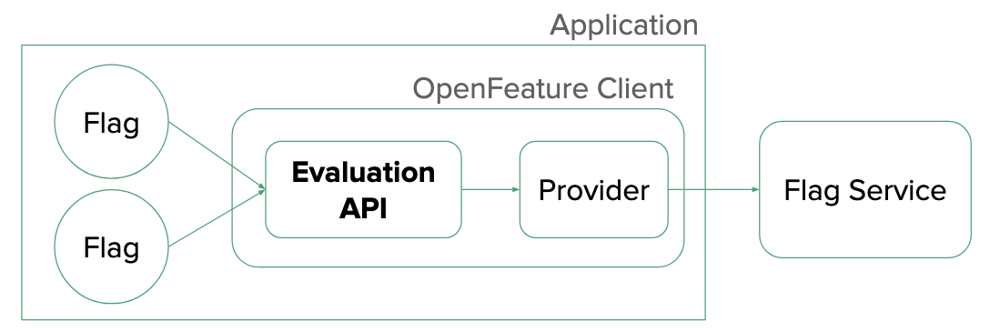

## OpenFeature 简介

为了上线新功能，通常会在代码中写：

```golang
if os.Getenv("ENABLE_NEW_FEATURE") == "true" {
    // 新逻辑
} else {
    // 旧逻辑
}

```

随着系统变得复杂，这种零散的、基于环境变量或配置文件的开关，迅速演变成了难以维护的“If-Else 地狱”。

为了解决这个问题，特性开关（Feature Flag）系统应运而生。它们允许我们在不重新部署代码的情况下，动态地开启或关闭功能

已有的方案：

- <https://github.com/Unleash/unleash>
- <https://github.com/splitio>
- <https://github.com/thomaspoignant/go-feature-flag>
- <https://github.com/FeatureProbe/FeatureProbe>
- <https://github.com/configcat>
- <https://github.com/open-feature>

OpenFeature 的优势：CNCF 的孵化项目；既能享受特性开关的便利，又不必被具体的供应商（Provider） 绑定，避免“供应商锁定”（Vendor Lock-in）。

OpenFeature 是一套开放的标准，旨在为特性开关提供一个供应商无关（Vendor-Agnostic）、社区驱动的 API。

## Feature Management 对比配置中心

配置中心解决的如何利用配置实现对线上快速变更，而 Feature Management 解决的是如何通过管理「功能」生命周期来实现对功能粒度的精准管控。

配置中心作为通用配置平台并不关注配置内容，也就意味着可以对配置做任何定义。以一个最简单功能开关场景为例，比如控制功能 A 开启或关闭，确实可以通过在配置中心上创建一个针对该场景的 K-V 配置当成开关来满足最基础的功能开关使用场景。但这对于 Feature Management 系统来说是最简单的场景，还要做到对功能粒度的渐进式发布、将功能定向投放给特定人群、A/B 实验及对 Feature 进行价值评估等等，而都是作为配置中心所不具备的。

用 Feature Management  系统替代配置中心是否可行？答案是肯定的。在创建「功能开关」时可以在开关返回值中放上原本在配置中心的配置内容，再利用提供的 SDK 来获取相应的配置返回值即可。

## 核心概念解析



在 OpenFeature 的规范（Specification）中，有几个关键角色：

- Evaluation API (评估 API)

这是开发者直接调用的接口，用于获取开关的值。它独立于任何具体的后端实现。

- Provider (供应商):

这是幕后的“翻译官”。它负责适配具体的特性开关系统（如 `go-feature-flag` 或 `Split`），将 OpenFeature 的标准调用转化为具体系统的实现。

- Client (客户端)

应用程序内的轻量级对象，通常绑定到特定的域（Domain）或作用域，用于执行 Flag 的评估。

- Evaluation Context (评估上下文)

这是传递给 Provider 的信息，比如用户的 ID、IP 地址、会员等级等。Provider 根据这些情报，结合后台配置的规则，动态决定返回 `true` 还是 `false`。

## 演进

### 环境变量

在项目初期，没有任何外部依赖。我们使用环境变量作为最简单的特性开关。这种方式无需引入额外的库，但缺乏灵活性，无法针对特定用户进行灰度发布。

```go
package main

import (
	"fmt"
	"os"
)

func main() {
	// 模拟当前请求的用户ID
	userID := "user-123"

	// 痛点：
	// 1. 全局生效：一旦开启，所有用户都会看到。
	// 2. 修改需要重启：必须修改环境变量并重启服务才能生效。
	// 3. 逻辑僵化：无法实现“只对 user-123 开启”这样的规则。

	// 从环境变量获取开关状态
	enablePromo := os.Getenv("ENABLE_HOLIDAY_PROMO") == "true"

	if enablePromo {
		fmt.Printf("User %s gets a discount!\n", userID)
	} else {
		fmt.Printf("User %s pays full price.\n", userID)
	}
}

```

运行方式：

```bash
# 开启功能
export ENABLE_HOLIDAY_PROMO=true
go run main.go
# 输出: User user-123 gets a discount!

# 关闭功能
export ENABLE_HOLIDAY_PROMO=false
go run main.go
# 输出: User user-123 pays full price.

```

### 引入 go-feature-flag

为了支持基于用户的灰度发布（比如只对特定用户开启），引入了专门的库 `go-feature-flag`。这是一个功能强大的 Go 开源库，支持本地文件、S3、K8s 等多种配置源。

使用本地文件作为规则源。准备规则文件

```yaml
holiday-promo:
  # 定义开关的两个状态：启用(true) 和 禁用(false)
  variations:
    enabled: true
    disabled: false

  # 默认情况下，对所有人禁用
  defaultRule:
    variation: disabled

  # 特殊规则：只对用户 "user-123" 启用
  targeting:
    - query: key eq "user-123"
      variation: enabled

```

对应代码

```go
package main

import (
	"fmt"
	"time"

	ffclient "github.com/thomaspoignant/go-feature-flag"
	"github.com/thomaspoignant/go-feature-flag/ffcontext"
	"github.com/thomaspoignant/go-feature-flag/retriever/fileretriever"
)

func main() {
	// 初始化 go-feature-flag SDK
	// 这里我们配置它从本地文件读取规则
	err := ffclient.Init(ffclient.Config{
		PollingInterval: 3 * time.Second,
		Retriever: &fileretriever.Retriever{
			Path: "flags.yaml",
		},
	})
	if err != nil {
		panic(err)
	}
	// 确保程序退出时关闭 SDK，清理资源
	defer ffclient.Close()

	// 模拟当前请求的用户ID
	userID := "user-123"

	// 创建评估上下文 (Evaluation Context)
	// 这包含了判断 Flag 所需的用户信息
	userCtx := ffcontext.NewEvaluationContext(userID)

	// 痛点：
	// 代码与 "go-feature-flag" 强绑定。
	// ffclient.BoolVariation 是特定库的 API。
	// 如果未来要迁移到 LaunchDarkly 或自研系统，必须修改这里所有的调用代码。
	hasDiscount, _ := ffclient.BoolVariation("holiday-promo", userCtx, false)

	if hasDiscount {
		fmt.Printf("User %s gets a discount!\n", userID)
	} else {
		fmt.Printf("User %s pays full price.\n", userID)
	}
}

```

运行方式

```bash
go mod tidy
go run main.go
# 输出: User user-123 gets a discount!

```

### OpenFeature 标准

依然使用 `go-feature-flag` 作为底层的Provider (供应商)，但在业务代码中，只使用 OpenFeature 的标准 API。

这意味着，业务逻辑不再知道底层是谁在提供服务。

仍使用刚刚的规则文件，对应代码

```go
package main

import (
	"context"
	"fmt"
	"time"

	// OpenFeature SDK
	"github.com/open-feature/go-sdk/openfeature"

	// GO Feature Flag In Process Provider
	gofeatureflaginprocess "github.com/open-feature/go-sdk-contrib/providers/go-feature-flag-in-process/pkg"

	// GO Feature Flag 配置
	ffclient "github.com/thomaspoignant/go-feature-flag"
	"github.com/thomaspoignant/go-feature-flag/retriever/fileretriever"
)

func main() {
	// ==========================================
	// A. 初始化层 (Infrastructure Layer)
	// ==========================================

	ctx := context.Background()

	// 1. 创建 GO Feature Flag In Process Provider
	options := gofeatureflaginprocess.ProviderOptions{
		GOFeatureFlagConfig: &ffclient.Config{
			PollingInterval: 3 * time.Second,
			Context:         ctx,
			Retriever: &fileretriever.Retriever{
				Path: "flags.yaml",
			},
		},
	}

	provider, err := gofeatureflaginprocess.NewProviderWithContext(ctx, options)
	if err != nil {
		panic(fmt.Errorf("failed to create provider: %v", err))
	}
	defer provider.Shutdown()

	// 2. 设置 OpenFeature Provider 并等待初始化完成
	err = openfeature.SetProviderAndWait(provider)
	if err != nil {
		panic(fmt.Errorf("failed to set provider: %v", err))
	}

	fmt.Println("✅ OpenFeature In-Process provider is ready!")

	// ==========================================
	// B. 业务逻辑层 (Business Logic Layer)
	// ==========================================

	// 1. 获取 OpenFeature 客户端
	client := openfeature.NewClient("app-backend")

	// 2. 准备评估上下文
	userID := "user-123"
	evalCtx := openfeature.NewEvaluationContext(
		userID,
		map[string]interface{}{
			"email": "test@example.com",
		},
	)

	// 3. 评估 Flag
	hasDiscount, err := client.BooleanValue(
		context.Background(),
		"holiday-promo", // Flag Key
		false,           // Default Value
		evalCtx,         // Context
	)

	if err != nil {
		fmt.Printf("Error evaluating flag: %v\n", err)
	}

	if hasDiscount {
		fmt.Printf("✅ User %s gets a discount!\n", userID)
	} else {
		fmt.Printf("❌ User %s pays full price.\n", userID)
	}

	// ==========================================
	// C. 测试其他用户
	// ==========================================

	fmt.Println("\n--- Testing another user ---")

	anotherUserCtx := openfeature.NewEvaluationContext(
		"user-456",
		map[string]interface{}{
			"email": "another@example.com",
		},
	)

	hasDiscountAnother, err := client.BooleanValue(
		context.Background(),
		"holiday-promo",
		false,
		anotherUserCtx,
	)

	if err != nil {
		fmt.Printf("Error evaluating flag: %v\n", err)
	}

	if hasDiscountAnother {
		fmt.Printf("✅ User user-456 gets a discount!\n")
	} else {
		fmt.Printf("❌ User user-456 pays full price.\n")
	}

	// ==========================================
	// D. 展示更复杂的评估上下文示例
	// ==========================================

	fmt.Println("\n--- Testing with detailed user context ---")

	detailedUserCtx := openfeature.NewEvaluationContext(
		"user-789",
		map[string]interface{}{
			"firstname": "john",
			"lastname":  "doe",
			"email":     "john.doe@example.com",
			"admin":     true,
			"anonymous": false,
		},
	)

	hasDiscountDetailed, err := client.BooleanValue(
		context.Background(),
		"holiday-promo",
		false,
		detailedUserCtx,
	)

	if err != nil {
		fmt.Printf("Error evaluating flag: %v\n", err)
	}

	if hasDiscountDetailed {
		fmt.Printf("✅ User user-789 gets a discount!\n")
	} else {
		fmt.Printf("❌ User user-789 pays full price.\n")
	}
}

```

关注点分离：

- 配置代码（A 部分）：负责选型。今天用 `go-feature-flag`，明天想换商业版 `LaunchDarkly`，只需要改这几行代码，引入新的 Provider 即可。
- 业务代码（B 部分）：负责使用。它只依赖 `openfeature` 的接口。无论底层怎么变，业务逻辑都稳如泰山。

### 使用 Relay Proxy Server

`OpenFeature` 官方更推荐使用 Relay Proxy Server 的部署方式

使用 Relay Proxy 方式的优势：

- 松耦合: 应用程序只依赖 OpenFeature SDK，不依赖 go-feature-flag 核心库
- 语言无关: Relay Proxy 提供 HTTP API，任何语言都可以使用
- 集中管理: 多个应用可以共享同一个 Relay Proxy
- 性能优化: Relay Proxy 做缓存和批量处理
- 生产就绪: 这是官方推荐的生产环境部署方式

对应代码

```go
// demo4/main.go

package main

import (
	"context"
	"fmt"
	"net/http"
	"time"

	// OpenFeature SDK
	"github.com/open-feature/go-sdk/openfeature"

	// GO Feature Flag Provider (连接 Relay Proxy)
	gofeatureflag "github.com/open-feature/go-sdk-contrib/providers/go-feature-flag/pkg"
)

func main() {
	// ==========================================
	// A. 初始化层 (Infrastructure Layer)
	// ==========================================

	ctx := context.Background()

	// 1. 创建 GO Feature Flag Provider (连接到 Relay Proxy)
	options := gofeatureflag.ProviderOptions{
		Endpoint: "http://localhost:1031", // Relay Proxy 地址
		HTTPClient: &http.Client{
			Timeout: 5 * time.Second, // 设置 HTTP 超时时间
		},
	}

	provider, err := gofeatureflag.NewProviderWithContext(ctx, options)
	if err != nil {
		panic(fmt.Errorf("failed to create provider: %v", err))
	}
	defer provider.Shutdown()

	// 2. 设置 OpenFeature Provider 并等待初始化完成
	err = openfeature.SetProviderAndWait(provider)
	if err != nil {
		panic(fmt.Errorf("failed to set provider: %v", err))
	}

	fmt.Println("✅ OpenFeature provider connected to Relay Proxy successfully!")

	// ==========================================
	// B. 业务逻辑层 (Business Logic Layer)
	// ==========================================

	// 1. 获取 OpenFeature 客户端
	client := openfeature.NewClient("app-backend")

	// 2. 准备评估上下文 - 用户 user-123
	userID := "user-123"
	evalCtx := openfeature.NewEvaluationContext(
		userID,
		map[string]interface{}{
			"email": "test@example.com",
		},
	)

	// 3. 评估 Flag
	hasDiscount, err := client.BooleanValue(
		context.Background(),
		"holiday-promo", // Flag Key
		false,           // Default Value
		evalCtx,         // Context
	)

	if err != nil {
		fmt.Printf("Error evaluating flag: %v\n", err)
	}

	if hasDiscount {
		fmt.Printf("✅ User %s gets a discount!\n", userID)
	} else {
		fmt.Printf("❌ User %s pays full price.\n", userID)
	}

	// ==========================================
	// C. 测试其他用户
	// ==========================================

	fmt.Println("\n--- Testing another user ---")

	anotherUserCtx := openfeature.NewEvaluationContext(
		"user-456",
		map[string]interface{}{
			"email": "another@example.com",
		},
	)

	hasDiscountAnother, err := client.BooleanValue(
		context.Background(),
		"holiday-promo",
		false,
		anotherUserCtx,
	)

	if err != nil {
		fmt.Printf("Error evaluating flag: %v\n", err)
	}

	if hasDiscountAnother {
		fmt.Printf("✅ User user-456 gets a discount!\n")
	} else {
		fmt.Printf("❌ User user-456 pays full price.\n")
	}

	// ==========================================
	// D. 展示更复杂的评估上下文示例
	// ==========================================

	fmt.Println("\n--- Testing with detailed user context ---")

	detailedUserCtx := openfeature.NewEvaluationContext(
		"user-789",
		map[string]interface{}{
			"firstname": "john",
			"lastname":  "doe",
			"email":     "john.doe@example.com",
			"admin":     true,
			"anonymous": false,
		},
	)

	hasDiscountDetailed, err := client.BooleanValue(
		context.Background(),
		"holiday-promo",
		false,
		detailedUserCtx,
	)

	if err != nil {
		fmt.Printf("Error evaluating flag: %v\n", err)
	}

	if hasDiscountDetailed {
		fmt.Printf("✅ User user-789 gets a discount!\n")
	} else {
		fmt.Printf("❌ User user-789 pays full price.\n")
	}
}

```

本地安装一个 relay proxy server

```bash
go install github.com/thomaspoignant/go-feature-flag/cmd/relayproxy@latest
```

接下来，创建一个 relay proxy 的配置：`relay-proxy-config.yaml`

```yaml
# HTTP 服务配置
listen: 1031

# 轮询间隔 (毫秒)
pollingInterval: 1000

# 如果检索器出错是否启动
startWithRetrieverError: false

# 配置文件检索器, 使用了我们特性开关配置文件flags.yaml
retriever:
  kind: file
  path: flags.yaml 

# 日志导出器（可选）
exporter:
  kind: log

```

运行 relay-proxy 的配置：

```bash
relayproxy --config=relay-proxy-config.yaml
```

之后，运行 main.go：main 连接到 relay-proxy server，并将评估上下文传递给 relay proxy server。后者结合后台配置的规则(`flags.yaml`)，动态决定返回 `true` 还是 `false`。
